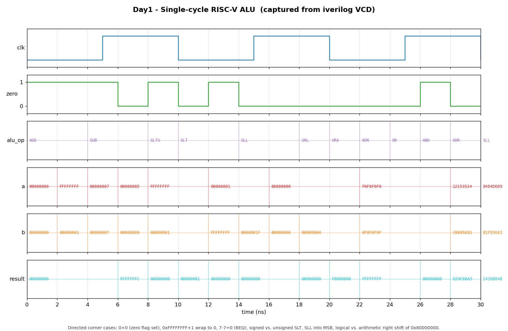

# Day 1 — Single-cycle RISC-V (RV32I) Integer ALU

## Overview

The Arithmetic Logic Unit is the computational heart of a processor datapath.
In a single-cycle RISC-V core it sits in the **execute** stage and computes,
in one combinational pass, everything from arithmetic (`ADD`/`SUB`) and logic
(`AND`/`OR`/`XOR`) to shifts (`SLL`/`SRL`/`SRA`) and comparisons
(`SLT`/`SLTU`). Its `zero` output feeds the branch-decision logic that resolves
`BEQ`/`BNE`.

This day implements a clean, parameterized, purely combinational ALU covering
the 10 integer operations the RV32I base ISA needs.

## Why it matters

Every instruction that does real work funnels through the ALU: R-type and
I-type arithmetic use it directly, loads/stores use it to compute effective
addresses (`base + offset`), and branches use it to subtract and inspect the
`zero` flag. Getting the ALU right — especially the subtle cases like
**arithmetic vs. logical right shift** and **signed vs. unsigned comparison** —
is foundational to a correct core. It is the natural Day 1 building block for a
computer-architecture series.

## Features

- 10 RV32I integer operations selected by a 4-bit `alu_op`.
- Parameterized data width (`WIDTH`, default 32); shift amount automatically
  sized to `log2(WIDTH)` bits per the ISA.
- Correct **signed** (`SLT`, `SRA`) and **unsigned** (`SLTU`, `SRL`) semantics.
- `zero` status flag for branch resolution.
- Purely combinational and stateless → trivially reset-safe.
- Lint-friendly: every output assigned on every path (default assignment plus a
  `default` case arm), `` `default_nettype none `` to catch implicit wires.

## Parameters

| Parameter | Default | Description |
|-----------|---------|-------------|
| `WIDTH`   | `32`    | Operand and result bit-width. Shift amount uses the low `log2(WIDTH)` bits of `b`. |

## Ports

| Port     | Dir | Width       | Description |
|----------|-----|-------------|-------------|
| `a`      | in  | `WIDTH`     | Operand A (typically `rs1`). |
| `b`      | in  | `WIDTH`     | Operand B (typically `rs2` or an immediate). |
| `alu_op` | in  | `4`         | Operation select (see encoding table). |
| `result` | out | `WIDTH`     | Combinational ALU result. |
| `zero`   | out | `1`         | High when `result == 0` (used by `BEQ`/`BNE`). |

### Operation encoding

| `alu_op` | Mnemonic | Operation |
|----------|----------|-----------|
| `0000` | `ADD`  | `a + b` |
| `0001` | `SUB`  | `a - b` |
| `0010` | `SLL`  | `a << b[4:0]` |
| `0011` | `SLT`  | signed `(a < b) ? 1 : 0` |
| `0100` | `SLTU` | unsigned `(a < b) ? 1 : 0` |
| `0101` | `XOR`  | `a ^ b` |
| `0110` | `SRL`  | `a >> b[4:0]` (logical) |
| `0111` | `SRA`  | `a >>> b[4:0]` (arithmetic) |
| `1000` | `OR`   | `a \| b` |
| `1001` | `AND`  | `a & b` |

## Datapath / block diagram

```
            a[WIDTH-1:0]                 b[WIDTH-1:0]
                 │                            │
                 │              b[log2(WIDTH)-1:0] = shamt
                 │                            │
                 ▼                            ▼
        ┌───────────────────────────────────────────────┐
        │                     ALU                         │
        │                                                 │
        │   +  -   <<  >>  >>>   &  |  ^   <(s)  <(u)      │
        │    \  \   \   \   /    /  /  /    /    /         │
        │     ────────────  MUX  ────────────             │
        │                    │                            │
        │              alu_op│(4)                          │
        └────────────────────┼────────────────────────────┘
                             │
                             ▼
                        result[WIDTH-1:0] ──► ( == 0 ) ──► zero
```

## Simulation timing



*Genuine simulator capture — not hand-modeled. The image is rendered by
`render_waveform.py` directly from `alu.vcd`, the VCD produced by running the
testbench under Icarus Verilog (`make icarus`). The window shows the first ~14
directed corner cases over 30 ns: `0+0` (asserting `zero`), `0xFFFFFFFF + 1`
wrapping to `0`, `7 - 7 = 0` (a `BEQ`-style compare), signed vs. unsigned
`SLT`, `1 << 31` shifting into the MSB, and the logical (`SRL`) vs. arithmetic
(`SRA`) right shift of `0x80000000` giving `0x08000000` vs. `0xF8000000`.*

## How it works

The design is one `always_comb` block. A default assignment (`result = '0`)
guarantees no inferred latches, and a `unique case` on `alu_op` selects the
operation. The three shift variants share a single `shamt` derived from the low
bits of `b`. The signed operations lean on SystemVerilog's `$signed`/`>>>` so
that `SRA` sign-extends and `SLT` compares in two's-complement, while `SRL`,
`SLTU`, and the bitwise ops stay unsigned. `zero` is a simple reduction:
`result == '0`.

Because there is no state, the block has no clock or reset and is safe to drop
into any pipeline stage.

## Running it

From this folder:

```bash
make            # Icarus Verilog: compile + run the self-checking TB
make waveform   # regenerate docs/alu_waveform.png from alu.vcd
make clean
```

Other simulators are wired up too: `make verilator`, `make vcs`, `make questa`.

**Verified:** run under **Icarus Verilog 13.0**, the testbench reports
`RESULT: *** PASS *** (2014 checks)`.

## What the testbench checks

`tb_alu.sv` is self-checking against an independent software **golden model**:

- **Golden reference** — `golden()` recomputes the expected `result` for every
  `(a, b, alu_op)` triple; the DUT output is compared exactly (`!==`, so `x`/`z`
  fail).
- **Zero flag** — validated separately against `expected == 0` on every vector.
- **Directed corner cases** — zero result, additive overflow wrap, equal-operand
  subtraction, signed/unsigned comparison boundaries (`-1` vs. `1`), shift by 0
  and by `WIDTH-1`, and logical vs. arithmetic right shift of a negative value.
- **Randomized fuzz** — 2000 vectors with random operands across all 10
  operations.
- **Timeout** — a watchdog `$finish`es and fails if the sim ever hangs.
- **VCD dump** — `alu.vcd` is written for waveform rendering.

Success prints exactly `RESULT: *** PASS ***`.
