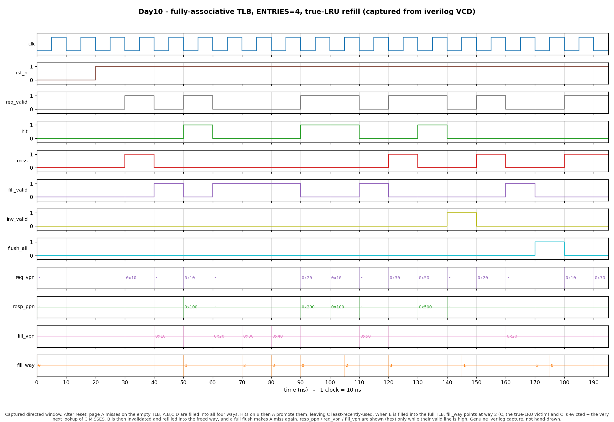

# Day 10 — Fully-Associative TLB with True-LRU Replacement

A parameterized **Translation Lookaside Buffer** — the tiny, fully-associative
cache of recent virtual→physical page translations that sits in front of every
memory access and keeps the page-table walker off the critical path. On a full
TLB, refills evict the **true least-recently-used** entry, chosen by a classic
reference (age) matrix.

---

## Overview

Under virtual memory, every address a program uses is a *virtual* address. The
hardware must translate the upper bits — the **virtual page number (VPN)** — into
a **physical page number (PPN)** before touching DRAM; the low **page-offset**
bits pass through untranslated. The mappings live in multi-level page tables in
memory, so a naive design would perform several dependent DRAM reads (a *page
walk*) on *every* load, store, and instruction fetch — catastrophic for
performance.

The fix is a small, fast cache of the most recent translations: the **TLB**.
It is checked in parallel with (or ahead of) the L1 access; a **hit** returns
the PPN in a single cycle, and only a **miss** pays for a page walk. Because
programs exhibit strong locality, even a handful of entries yields hit rates
well above 99%, which is why the TLB is one of the most performance-critical
structures in a modern core.

This design is a **fully-associative** TLB (a small CAM): the requested VPN is
compared against *every* entry in parallel, so any page may occupy any slot —
the placement freedom that gives a small TLB its high hit rate. Lookups are
combinational; fills, invalidations, and flushes are synchronous. When the TLB
is full, a refill replaces the **true LRU** entry. The block is fully
synthesizable, reset-safe, and lint-clean.

---

## The architectural concept & why it matters

Two ideas carry this design.

**1. Associativity as a CAM.** A *direct-mapped* structure (like Day 7's cache)
sends each address to exactly one slot — cheap, but two hot pages that map to
the same slot evict each other forever (conflict misses). A **fully-associative**
structure lets any entry hold any page, eliminating conflict misses entirely at
the cost of an N-way parallel tag compare. TLBs are small (often 8–64 entries),
so full associativity is affordable and standard. The parallel compare is
literally a content-addressable memory: "which entry, if any, holds this VPN?"

**2. True LRU via a reference matrix.** With full associativity, *any* entry can
be the eviction victim, so the replacement policy matters. The optimal-in-
practice choice is **least-recently-used**, but tracking exact recency needs
real state. This design uses the textbook **reference (age) matrix**: an N×N bit
array where

```
use_mtx[i][j] = 1  means  "way i was used more recently than way j"
```

On every access to way `k` (a fill, or a read that hits) the hardware sets
**row k to all ones** (k is now newer than everyone) and **column k to all
zeros** (everyone else is now older than k). The **LRU victim** is then simply
the way whose row is all zeros (ignoring its own diagonal bit) — the entry that
nobody is "more recent than." This is exact LRU, updated in one cycle, with only
N² flip-flops (N=4 → 16 bits). It scales poorly for large N, which is exactly
why big caches use pseudo-LRU — but for a small TLB, true LRU is both cheap and
instructive.

**Refill target priority.** A fill installs into the first applicable of:

1. an entry already holding the same VPN (**overwrite**, so mappings stay
   unique — e.g. a permission/PPN update),
2. the lowest-numbered **invalid** (free) way,
3. the **true-LRU** way (only reached when the TLB is full).

---

## Features

- Parameterized `VPN_W`, `PPN_W`, and `ENTRIES` (fully associative).
- **Combinational** single-cycle lookup: `hit` / `miss`, `resp_ppn`, `hit_way`.
- **True-LRU** replacement via an N×N reference-matrix (exact, single-cycle).
- Refill priority: overwrite-existing → free-slot → LRU-victim; the chosen way
  is exposed on `fill_way` every cycle for observability.
- Single-page invalidate (`inv_vpn`) and full flush (`flush_all`, an `sfence`).
- Active-low asynchronous reset clears all valid bits and the age matrix.
- Fully synthesizable, reset-safe, and lint-clean (compiles warning-free under
  `iverilog -g2012 -Wall`).
- Self-checking testbench with an **independent** reference model (its own CAM +
  its own true-LRU matrix), directed + 600 randomized ops, and VCD dump.

---

## Parameters

| Parameter | Default | Meaning |
|-----------|---------|---------|
| `VPN_W`   | `20`    | Virtual page number width (e.g. Sv32: 32-bit VA − 12-bit offset). |
| `PPN_W`   | `22`    | Physical page number width (e.g. Sv32: 34-bit PA − 12-bit offset). |
| `ENTRIES` | `4`     | Number of fully-associative TLB entries (`ENTRIES >= 1`). |
| `IDXW`    | `$clog2(ENTRIES)` (min 1) | Way-index width. Derived — do not override. |

## Ports

| Port | Dir | Width | Description |
|------|-----|-------|-------------|
| `clk`        | in  | 1       | Clock (rising edge). |
| `rst_n`      | in  | 1       | Active-low async reset; clears all valid bits + age matrix. |
| `req_valid`  | in  | 1       | A translation is being requested this cycle. |
| `req_vpn`    | in  | `VPN_W` | Virtual page number to translate. |
| `hit`        | out | 1       | `req_valid` and `req_vpn` is resident. |
| `miss`       | out | 1       | `req_valid` and `req_vpn` is absent. |
| `resp_ppn`   | out | `PPN_W` | Translated physical page number (valid on `hit`). |
| `hit_way`    | out | `IDXW`  | Index of the matching entry (valid on `hit`). |
| `fill_valid` | in  | 1       | Install a mapping this cycle (from the page-table walker). |
| `fill_vpn`   | in  | `VPN_W` | VPN to install. |
| `fill_ppn`   | in  | `PPN_W` | PPN to install. |
| `fill_way`   | out | `IDXW`  | Way a fill *would* use this cycle (overwrite / free / LRU victim). |
| `inv_valid`  | in  | 1       | Invalidate the single entry matching `inv_vpn`. |
| `inv_vpn`    | in  | `VPN_W` | VPN to invalidate. |
| `flush_all`  | in  | 1       | Invalidate every entry (full `sfence.vma`). |

> **Address assembly.** Only the VPN is translated. The full physical address is
> `{resp_ppn, page_offset}`, where `page_offset` is the low `VA_WIDTH − VPN_W`
> bits of the virtual address, wired straight through around this block. That
> passthrough is trivial and is kept outside the translation core.

---

## Block / datapath diagram

```
   virtual address = { req_vpn (VPN_W) | page_offset }
                           │                    │
                           ▼                    │ (offset bypasses the TLB)
        ┌──────────────────────────────────┐   │
        │      fully-associative CAM        │   │
        │  ┌────────────────────────────┐   │   │
 req_vpn│  │ way0: valid tag(VPN) ppn   │──►│   │
   ───► │  │ way1: valid tag(VPN) ppn   │──►│ parallel compare  ─► hit / miss
        │  │ way2: valid tag(VPN) ppn   │──►│                   ─► hit_way
        │  │ way3: valid tag(VPN) ppn   │──►│                   ─► resp_ppn ─┐
        │  └────────────────────────────┘   │                              │
        └───────────────┬──────────────────┘                               ▼
                        │                          physical address = { ppn | offset }
     ┌──────────────────┴───────────────────┐
     │  refill / replacement engine          │   fill_vpn, fill_ppn
     │   target = dup_way                     │◄── fill_valid
     │          : first_invalid_way           │
     │          : LRU_way  ───────────────────┼──► fill_way (victim)
     │                                        │
     │  reference (age) matrix  use_mtx[N][N] │
     │   touch(k): row k = 1 , col k = 0      │◄── touched by a fill, or a read hit
     │   LRU  = way whose row (¬diag) == 0     │
     └────────────────────────────────────────┘
     inv_vpn/inv_valid → clear one valid bit ; flush_all → clear all valid bits + matrix
```

---

## How it works (cycle by cycle)

1. **Lookup (combinational).** `req_vpn` is compared against all valid entries
   in parallel. On a match, `hit=1`, `resp_ppn` = that entry's PPN, and
   `hit_way` = its index; otherwise `miss=1`.
2. **Victim/target selection (combinational).** In parallel, the refill engine
   computes where a fill *would* land: overwrite an entry with the same VPN,
   else the lowest free way, else the true-LRU way. This is driven out on
   `fill_way` every cycle.
3. **LRU update (sequential).** On the clock edge, if this cycle was a fill or a
   read hit, the touched way is promoted to most-recently-used in the reference
   matrix (row→1, column→0). A fill takes precedence over a concurrent read hit.
4. **Fill (sequential).** On `fill_valid`, the selected way's valid/tag/PPN are
   written.
5. **Invalidate / flush (sequential).** `inv_valid` clears the one entry
   matching `inv_vpn`; `flush_all` clears every valid bit and resets the age
   matrix (and wins over a fill/invalidate in the same cycle).

Because invalid ways are always preferred over the LRU victim, a page is only
ever evicted when the TLB is genuinely full — and then it is provably the
least-recently-used one.

---

## Simulation timing



*Captured directed window from a real **iverilog** run (`make icarus` dumps
`tlb.vcd`; `render_waveform.py` parses that VCD with matplotlib — this is a
genuine simulator capture, **not** a hand-drawn diagram). After reset, page
`A` (`0x10`) misses on the empty TLB; `A,B,C,D` are filled into all four ways
(`fill_way` = 0,1,2,3). Hits on `B` then `A` (`resp_ppn` = `0x200`, `0x100`)
promote them, leaving `C` least-recently-used — so when `E` (`0x50`) is filled
into the now-full TLB, `fill_way` points at **way 2 (C, the true-LRU victim)**
and `C` is evicted. The very next lookup of `C` (`0x30`) **misses**, proving the
LRU entry was the one dropped. `B` is then invalidated and refilled into the
freed way, and a full `flush_all` makes `A` miss again. Buses are shown (hex)
only while their valid line is high.*

---

## Running it

Icarus Verilog is the default and needs nothing else:

```bash
make            # iverilog + vvp: compile & run the self-checking TB
make waveform   # regenerate docs/tlb_waveform.png from the VCD
make clean
```

Other simulators (if installed):

```bash
make verilator
make vcs
make questa
```

A passing run prints:

```
RESULT: *** PASS *** (3800 checks, 0 mismatches)
```

> Verified with Icarus Verilog (`iverilog -g2012 -Wall`): **PASS**, 3800 checks,
> 0 mismatches, no warnings. The waveform PNG is rendered from the VCD produced
> by that run.

---

## What the testbench checks

The testbench (`tb_tlb.sv`) contains an **independent reference model** that
re-implements the TLB spec from scratch — its own `valid`/`tag`/`ppn` arrays and
its own N×N true-LRU reference matrix — reading *only* the DUT's declared ports.
Every cycle it predicts and compares:

- **`hit` / `miss`** against its own associative lookup.
- **`resp_ppn`** equals the mapped PPN on every hit.
- **`hit_way`** equals the matching entry's index on a hit.
- **`fill_way`** equals the model's victim/target choice — this is what verifies
  the **true-LRU replacement policy**, since the victim is exposed and checked
  every cycle (including the moment of eviction).
- **Invariants:** `hit` and `miss` are mutually exclusive, and `hit | miss`
  equals `req_valid`.

Stimulus is **directed** (reset → cold miss → fill-to-full → recency-reordering
hits → a true-LRU eviction with a follow-up miss on the evicted page →
single-page invalidate + refill → full flush) followed by **600 randomized**
operations from a deterministic xorshift32 stream, drawn from a small VPN pool
(to force conflicts and evictions) plus occasional wide-range pages. A global
timeout guards against a hang. Only if *every* check passes does the TB print
`RESULT: *** PASS ***`.
