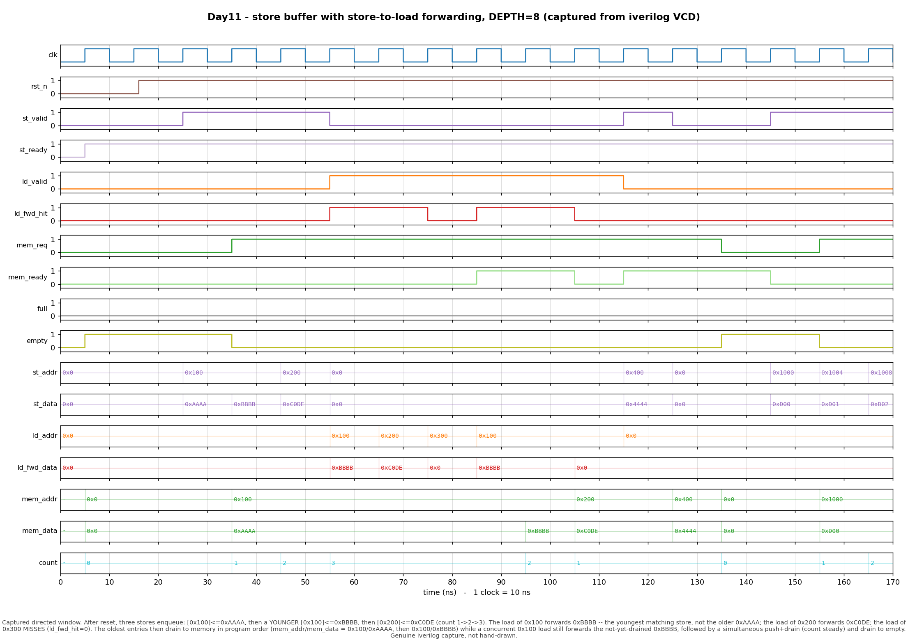

# Day 11 — Store Buffer with Store-to-Load Forwarding

A parameterized **store buffer**: the small in-order FIFO that sits between a
CPU's store port and memory/cache. It lets stores *retire* from the pipeline
before their data has actually reached memory, and it feeds younger loads the
correct, most-recent value directly — **store-to-load forwarding**.

---

## Overview

When a store executes, writing its data all the way out to the cache can take
several cycles. If the pipeline had to stall until each store completed,
throughput would collapse. Real cores instead push the store's `{address,
data}` into a **store buffer** and let the instruction retire immediately; the
buffer drains to memory later, in the background.

That decoupling creates a hazard: a **younger load to an address that an older,
still-pending store wrote** must *not* read the stale value in memory — it has
to see the buffered store's data. The store buffer resolves this itself by
**forwarding**: on every load it checks its pending entries and, on a match,
returns the buffered data instead of letting the load go to memory. If several
pending stores target the same address, the **youngest** (most recently
enqueued) one wins, because a later store supersedes an earlier one.

This design is a clean circular-FIFO store buffer with three concurrent
interfaces — enqueue (push), load lookup (combinational forward), and in-order
drain (pop) — plus occupancy status. It is single-clock, synchronous-reset,
fully synthesizable, and lint-friendly.

---

## The architectural concept & why it matters

The store buffer is one of the load pillars of modern memory systems:

- **Store retirement decoupling** — stores leave the pipeline in one cycle; the
  buffer absorbs write latency so the pipeline never stalls on a slow write.
- **Memory ordering** — because stores drain **in program order**, the buffer is
  the structure that enforces store→store ordering and, together with load
  forwarding, gives a program the illusion that its own later loads always see
  its own earlier stores (a *self-consistency* / store-to-load ordering
  guarantee that every ISA requires).
- **Store-to-load forwarding** — the single most important load-latency
  optimization in a memory pipeline: a dependent load gets its value in the same
  cycle from the buffer instead of paying a full cache round-trip.

Store buffers (and their out-of-order cousins, the *store queue* + *load queue*
of a Load/Store Unit) appear in essentially every pipelined CPU, from small
in-order embedded cores to large out-of-order superscalars. This day models the
in-order core of that idea so the forwarding and ordering semantics are visible
in isolation.

**Scope / simplifications (honest):** forwarding matches the **full address**
(word granularity) — byte-granular partial-overlap forwarding and the "must
stall on a partial hit" case are deliberately out of scope. Stores drain
strictly in order (no store coalescing, no speculative/mispredicted store
squashing). These are the natural Day-N+1 extensions.

---

## Features

- Parameterized `ADDR_W`, `DATA_W`, and `DEPTH` (DEPTH must be a power of two).
- Circular-FIFO storage with `head` pointer + occupancy `count`; `full`/`empty`
  and a live `count` output.
- **Store enqueue** port with `st_valid`/`st_ready` backpressure handshake
  (`st_ready` drops when full).
- **Combinational load-lookup** port: same-cycle `ld_fwd_hit` + `ld_fwd_data`.
- **Youngest-match forwarding**: among all pending stores to `ld_addr`, the most
  recently enqueued value is returned.
- **In-order drain** port to memory with `mem_req`/`mem_ready` handshake;
  presents the oldest entry.
- Handles a **simultaneous push + drain** in one cycle (occupancy holds steady).
- Synchronous active-low reset; reset-safe; no variable bit-selects of packed
  vectors (the forwarding search is a fixed-bound loop with integer relative-age
  arithmetic).

---

## Parameters

| Parameter | Default | Meaning |
|-----------|---------|---------|
| `ADDR_W`  | 32      | Address width (bits). |
| `DATA_W`  | 32      | Data width (bits). |
| `DEPTH`   | 8       | Number of buffer entries. **Must be a power of two** (for the mod-DEPTH pointer wrap and relative-age arithmetic). |

## Ports

| Port | Dir | Width | Description |
|------|-----|-------|-------------|
| `clk`         | in  | 1        | Clock. |
| `rst_n`       | in  | 1        | Active-low **synchronous** reset. |
| `st_valid`    | in  | 1        | CPU offers a store this cycle. |
| `st_ready`    | out | 1        | Buffer can accept a store (i.e. `!full`). |
| `st_addr`     | in  | `ADDR_W` | Store address to enqueue. |
| `st_data`     | in  | `DATA_W` | Store data to enqueue. |
| `ld_valid`    | in  | 1        | A load is querying the buffer this cycle. |
| `ld_addr`     | in  | `ADDR_W` | Load address to look up. |
| `ld_fwd_hit`  | out | 1        | A pending store forwards to this load (combinational). |
| `ld_fwd_data` | out | `DATA_W` | Value of the **youngest** matching store (valid when `ld_fwd_hit`). |
| `mem_req`     | out | 1        | Oldest entry wants to be written to memory (`!empty`). |
| `mem_ready`   | in  | 1        | Memory/cache accepts the drain write this cycle. |
| `mem_addr`    | out | `ADDR_W` | Address of the oldest entry (drain). |
| `mem_data`    | out | `DATA_W` | Data of the oldest entry (drain). |
| `full`        | out | 1        | Buffer is full. |
| `empty`       | out | 1        | Buffer is empty. |
| `count`       | out | `$clog2(DEPTH)+1` | Live occupancy, 0..`DEPTH`. |

A store is accepted when `st_valid & st_ready`. A drain occurs when
`mem_req & mem_ready`. Both may happen in the same cycle.

---

## Block / datapath diagram

```
                         STORE BUFFER  (circular FIFO, DEPTH entries)

   enqueue (push)                                              drain (pop, in order)
   ------------------                                          ---------------------
   st_valid  ------->+----------+                              +---------+
   st_ready  <-------| st_ready |                    mem_req ->|  head   |--> mem_req
   st_addr   ------->|  =!full  |     +--------------------+   | pointer |    mem_addr
   st_data   ------->+----------+     | slot: vld|addr|data|   |  read   |--> mem_data
        |                             +--------------------+   +----+----+
        |  write at tail = head+count |  0 : 1 | 0x100 |AAAA|<---- head (oldest)
        +---------------------------->|  1 : 1 | 0x100 |BBBB|        |
                                      |  2 : 1 | 0x200 |C0DE|<-- tail (next free)
                                      |  3 : 0 |  ...  | .. |        pop advances head
                                      | ...                |
                                      | D-1: 0 |  ...  | .. |
                                      +---------+----------+
                                                |
   load lookup (combinational)                  |  youngest-match search
   ------------------                           v
   ld_valid  ------->+-------------------------------------------------+
   ld_addr   ------->| for each valid slot i:                          |
                     |   match = vld[i] & (addr[i]==ld_addr)           |--> ld_fwd_hit
                     |   age   = (i - head) mod DEPTH   // youngest=max |--> ld_fwd_data
                     |   keep the match with the LARGEST age           |    (youngest store)
                     +-------------------------------------------------+

   status:  full = (count==DEPTH)   empty = (count==0)   count = occupancy
```

- **Tail** (next free slot) is derived as `head + count` (mod `DEPTH`) — no
  separate tail register is stored.
- The **drain port** always presents the head entry; the pop only *commits*
  (clears the slot, advances `head`) when `mem_ready` is asserted.
- The **forwarding search** walks all physical slots with a fixed-bound loop and
  keeps the matching entry with the largest relative age `(i - head) mod DEPTH`,
  i.e. the youngest / most recently enqueued store to that address.

---

## Simulation timing



*Genuine capture from a real Icarus Verilog (`iverilog`) run — not a hand-drawn
diagram.* `make icarus` runs the self-checking testbench, which dumps
`store_buffer.vcd`; `render_waveform.py` parses that VCD and plots the first
170 ns directed window. Every store, load lookup, forward result, drain, and
status value shown is read straight from the VCD.

Reading the window left to right:

1. **Reset**, then three stores enqueue — `[0x100]<=0xAAAA`, then a **younger**
   `[0x100]<=0xBBBB`, then `[0x200]<=0xC0DE` — and `count` climbs `1 → 2 → 3`.
2. **Load `0x100`** ⇒ `ld_fwd_hit=1`, `ld_fwd_data=0xBBBB` — the **youngest**
   matching store, *not* the older `0xAAAA`. This is the whole point.
3. **Load `0x200`** ⇒ forwards `0xC0DE`.
4. **Load `0x300`** ⇒ `ld_fwd_hit=0` — a **miss**; the load must go to memory.
5. **Drains** to memory in **program order**: `mem_addr/mem_data` present
   `0x100/0xAAAA` then `0x100/0xBBBB` (oldest first) as `mem_ready` is asserted,
   while a concurrent `0x100` load *still* correctly forwards the not-yet-drained
   `0xBBBB`. `count` falls back down.
6. A **simultaneous push + drain** (`store 0x400` while draining `0x200`) leaves
   `count` steady, then the buffer drains to **empty**.

---

## How it works

**State.** Per-slot `vld`/`addr`/`data` arrays, a `head` pointer to the oldest
entry, and a `count` occupancy register. `empty = (count==0)`,
`full = (count==DEPTH)`, and `st_ready = !full`.

**Enqueue.** When `st_valid & st_ready`, the store is written into the tail slot
`head + count` (natural mod-`DEPTH` wrap) and that slot's valid bit is set.

**Drain.** `mem_req = !empty` and the head entry's `addr`/`data` are driven on
`mem_addr`/`mem_data` continuously. When `mem_req & mem_ready`, the head slot is
invalidated and `head` advances.

**Occupancy.** A 2-bit `{do_push, do_pop}` case updates `count`: `+1` on a push
only, `−1` on a drain only, unchanged when both (or neither) fire — so a
simultaneous push+drain keeps occupancy constant while both pointers move.

**Forwarding.** A combinational loop over every physical slot computes, for each
occupied slot whose address matches `ld_addr`, its relative age
`(i - head) mod DEPTH`. The head slot has age 0 (oldest); the tail-most occupied
slot has the largest age (youngest). The search keeps the match with the largest
age, so `ld_fwd_data` is always the most recently enqueued store to that
address. No match ⇒ `ld_fwd_hit = 0`.

**Reset.** Synchronous, active-low: clears all valid bits, `head`, and `count`.

---

## Run it

```bash
cd Day11
make            # Icarus Verilog (default): iverilog + vvp
make verilator  # Verilator
make vcs        # Synopsys VCS
make questa     # Siemens Questa / ModelSim
make waveform   # regenerate docs/store_buffer_waveform.png from the VCD
make clean
```

A passing run prints:

```
RESULT: *** PASS *** (all checks held; 2000 random ops)
```

*(Verified with Icarus Verilog; the other three targets are provided for
portability and were not run in this environment.)*

---

## What the testbench checks

`tb_store_buffer.sv` is **self-checking** against an independent golden
reference — two parallel queues (`addr`, `data`) that mirror the FIFO exactly:
`push_back` on an accepted store, `pop_front` on an accepted drain.

Every driven cycle it verifies, against that reference:

- **Occupancy / status** — `count`, `full`, and `empty` match the reference
  size on every cycle.
- **Forwarding** — for each load query, `ld_fwd_hit` matches whether any pending
  store targets `ld_addr`, and when it hits, `ld_fwd_data` equals the
  **youngest** matching store (reference scanned back-to-front).
- **Drain data** — whenever a drain is accepted, `mem_addr`/`mem_data` equal the
  reference's **front** (oldest) entry, confirming in-order drain.

**Stimulus.** A **directed** phase exercises the headline behaviours
(enqueue, youngest-of-two forwarding, forward-while-draining, load miss,
simultaneous push+drain, fill-to-full backpressure, drain-to-empty), followed by
a **randomized** phase of 2000 cycles mixing stores, loads, and drains over a
small 8-address space so forwards, misses, `full`, and `empty` all occur
frequently. A watchdog `$fatal` guards against a hang, and the run dumps
`store_buffer.vcd`.
