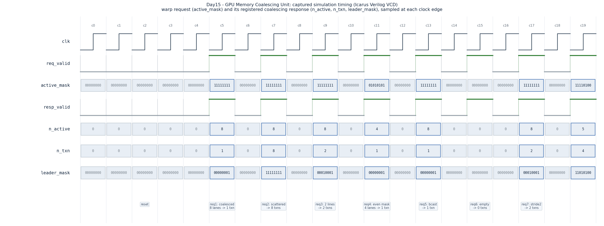

# Day 15 — GPU Memory Coalescing Unit

A synthesizable **memory coalescing unit**: the front-end of a GPU load/store
pipeline that takes one warp's per-lane addresses and collapses them into the
minimum number of aligned memory transactions.

## Overview

On a GPU, a single memory instruction is executed by a whole **warp** — 32 lanes
on real NVIDIA hardware (8 here, parameterizable). Every active lane produces its
own byte address. If the memory system issued one transaction per lane, a warp
would generate up to 32 separate DRAM/L2 accesses and waste most of the delivered
cache-line bandwidth.

Instead the hardware **coalesces**: it groups the lanes whose addresses fall in
the same aligned cache-line-sized **segment** and issues exactly **one
transaction per unique segment**. The number of transactions a warp generates is
the single biggest lever on GPU memory throughput — it is why "coalesced" vs.
"scattered" access patterns dominate CUDA performance tuning. A fully coalesced
warp (consecutive lanes → consecutive words) touches one line and runs at peak
bandwidth; a fully scattered warp (one lane per line) runs up to N× slower.

This unit implements that grouping. Given an active-lane mask and one byte
address per lane, it produces in a single registered cycle:

- **`leader_mask`** — exactly one "leader" lane per unique segment (the
  lowest-indexed active lane in that segment), so the result is deterministic and
  order-independent.
- **`n_txn`** — the number of coalesced memory transactions the warp generates.
- **`n_active`** — how many lanes participated (popcount of the mask).
- **`txn_base[i]`** / **`txn_lanes[i]`** — for each leader lane `i`, the aligned
  segment base address of its transaction and the mask of lanes it serves (its
  coalesced set).

## Why it matters

The ratio `n_active / n_txn` is exactly the *coalescing efficiency* a GPU
profiler reports as "global load/store transactions per request". Understanding
how addresses map to segments — and how a bad stride or misalignment silently
multiplies transaction count — is core GPU-microarchitecture knowledge and a
staple of memory-subsystem interview questions.

## Features

- Parameterizable warp width (`NLANES`), address width (`ADDR_WIDTH`), and
  coalescing granularity (`LINE_BYTES`, the segment size).
- Deterministic lowest-lane leader election — no priority ambiguity.
- Single-cycle registered `req_valid → resp_valid` handshake.
- Handles every corner case: full coalesce, full scatter, partial masks,
  broadcast (all lanes same address), and an empty warp (0 transactions).
- Reset-safe, lint-friendly RTL; per-lane buses use unpacked outer dimensions to
  avoid variable part-selects on packed multi-dimensional vectors.

## Parameters

| Parameter    | Default | Description                                             |
|--------------|---------|---------------------------------------------------------|
| `NLANES`     | 8       | Lanes per warp (size of the coalescing group)           |
| `ADDR_WIDTH` | 32      | Byte-address width per lane                              |
| `LINE_BYTES` | 32      | Coalescing segment size in bytes (power of two)         |

Derived: `OFFB = log2(LINE_BYTES)` in-line offset bits, `SEGW = ADDR_WIDTH-OFFB`
segment-id width, `CNTW = log2(NLANES+1)` count width.

## Ports

| Port          | Dir | Width / type                | Description                                        |
|---------------|-----|-----------------------------|----------------------------------------------------|
| `clk`         | in  | 1                           | Clock                                              |
| `rst_n`       | in  | 1                           | Active-low synchronous-style async reset           |
| `req_valid`   | in  | 1                           | Warp memory request valid this cycle               |
| `active_mask` | in  | `NLANES`                    | Per-lane participation mask (1 = lane accesses)    |
| `lane_addr`   | in  | `ADDR_WIDTH × NLANES`       | Per-lane byte address (unpacked array)             |
| `resp_valid`  | out | 1                           | Registered response valid (1 cycle after request)  |
| `leader_mask` | out | `NLANES`                    | 1 = lane leads a transaction                        |
| `n_txn`       | out | `CNTW`                      | Number of coalesced transactions                    |
| `n_active`    | out | `CNTW`                      | Number of participating lanes                       |
| `txn_base`    | out | `ADDR_WIDTH × NLANES`       | Aligned segment base for each leader lane           |
| `txn_lanes`   | out | `NLANES × NLANES`           | Lanes served by leader lane `i`'s transaction       |

## Block / datapath diagram

```
                 active_mask[NLANES]      lane_addr[NLANES][ADDR_WIDTH]
                        |                          |
                        |                 +--------+--------+
                        |                 | seg[i] = addr[i] >> OFFB   (drop
                        |                 |          in-line offset bits)
                        |                 +--------+--------+
                        |                          |
                        v                          v
          +----------------------------------------------------------+
          |   COMBINATIONAL GROUPING  (for each active lane i)       |
          |                                                          |
          |   members[i][j] = active[j] && seg[j]==seg[i]            |
          |   leader[i]     = active[i] &&                           |
          |                   (no active j<i with seg[j]==seg[i])    |
          |                                                          |
          |   n_active = popcount(active_mask)                       |
          |   n_txn    = popcount(leader)                            |
          |   base[i]  = {seg[i], {OFFB{1'b0}}}   (aligned)          |
          +----------------------------------------------------------+
                        |
                        v   (registered on req_valid)
          +----------------------------------------------------------+
          |  resp_valid, leader_mask, n_txn, n_active,               |
          |  txn_base[NLANES], txn_lanes[NLANES]                     |
          +----------------------------------------------------------+
```

Leader election is a strict "lowest-indexed active lane in the segment" rule, so
every segment has exactly one leader and `sum(txn_lanes over leaders)` reproduces
`active_mask` with no double-counting.

## Simulation timing



*Captured timing diagram, rendered from the Icarus Verilog VCD
(`mem_coalescing_unit.vcd`) produced by `make` — a **real simulator trace**, not
a hand-drawn diagram. After reset, seven directed warp requests are driven; the
diagram is sampled at each clock edge, so a request's `active_mask` and its
registered coalescing response appear in the same column:*

- **req1 — coalesced:** 8 lanes, consecutive words in one 32 B line → `n_txn=1`,
  `leader_mask=00000001` (only lane 0 leads).
- **req2 — scattered:** stride = line size, each lane its own segment →
  `n_txn=8`, `leader_mask=11111111` (every lane leads).
- **req3 — two lines:** lanes 0–3 in line A, 4–7 in line B → `n_txn=2`,
  `leader_mask=00010001` (lanes 0 and 4).
- **req4 — masked (even lanes):** only 4 lanes active, all in one line →
  `n_active=4`, `n_txn=1`.
- **req5 — broadcast:** every lane hits the same address → `n_txn=1`.
- **req6 — empty warp:** no active lanes → `n_active=0`, `n_txn=0`.
- **req7 — stride-2 words:** lanes {0–3} and {4–7} split across two lines →
  `n_txn=2`. (Column c19 shows the first randomized-stress request.)

## How it works

1. **Segment extraction.** Each lane's byte address is shifted right by
   `OFFB = log2(LINE_BYTES)` bits, dropping the in-line offset and leaving the
   segment id `seg[i]`. Two lanes coalesce iff their `seg` values are equal.
2. **Membership + leader election (combinational).** For every active lane `i`,
   the design scans all lanes `j`: any active `j` in the same segment is added to
   `members[i]`; if such a `j` has a *lower* index, `i` is demoted from leader.
   The surviving leaders are the unique segments, one representative each.
3. **Counts.** `n_active` and `n_txn` are simple popcounts of `active_mask` and
   `leader_mask`.
4. **Register + handshake.** On `req_valid`, all results are latched and
   `resp_valid` is asserted the next cycle; idle cycles drive the response low.

The grouping is O(N²) comparisons — fine for a warp-sized N and exactly how real
coalescers are structured (an all-pairs address compare across the lanes).

## What the testbench checks

`tb_mem_coalescing_unit.sv` is **self-checking** against an independent behavioral
golden model that recomputes, for the same request, the unique segments, each
segment's leader lane, the per-transaction membership masks, the aligned bases,
and the active/transaction counts. It:

- mirrors the DUT's 1-cycle request register so the expected request is aligned
  in time with the registered response, then compares **`n_active`, `n_txn`,
  `leader_mask`, and per-leader `txn_base` / `txn_lanes`** field-by-field;
- runs **7 directed corner cases** (coalesced / scattered / two-segment /
  masked / broadcast / empty / stride-2);
- runs **400 randomized** requests over a deliberately narrow address range so
  collisions and partial coalescing occur frequently;
- includes a simulation timeout and prints `RESULT: *** PASS ***` only if every
  one of the **407 checks** matches the golden model.

Result of the committed run (Icarus Verilog):

```
RESULT: *** PASS *** (407 checks, 0 mismatches)
```

## Run instructions

```bash
make            # Icarus Verilog (iverilog + vvp) — default
make verilator  # Verilator
make vcs        # Synopsys VCS
make questa     # Siemens Questa / ModelSim
make waveform   # regenerate docs/mem_coalescing_unit_waveform.png from the VCD
make clean
```

The waveform PNG is produced by `render_waveform.py`, which parses the captured
`mem_coalescing_unit.vcd` and draws the timing diagram with matplotlib.
