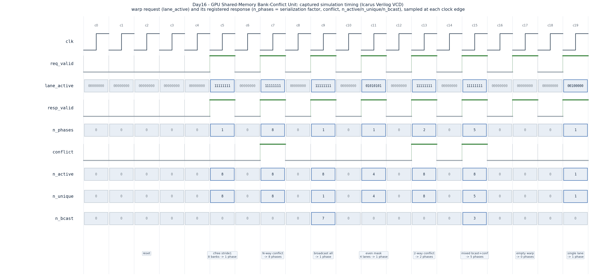

# Day 16 — GPU Shared-Memory Bank-Conflict Detector & Access Serializer

A synthesizable RTL model of the arbitration logic that decides how many cycles
a warp's **shared-memory** (CUDA `__shared__` / OpenCL `local`) access takes.
Given one byte address per lane, it maps each lane to a physical memory bank,
detects **bank conflicts** and **broadcasts**, and reports the **serialization
factor** — the number of phases the access replays over. This is the hardware
behind the single most important shared-memory performance rule in GPU
programming: *avoid bank conflicts*.

---

## Overview

GPU on-chip shared memory is not a monolithic RAM — it is physically built from
`NBANKS` independent, equally-wide banks (32 in every modern NVIDIA SM). A
successive 4-byte word maps to a successive bank, wrapping around:

```
bank(addr) = (addr / BYTES) mod NBANKS
```

Each bank can service exactly **one distinct word per cycle**. So when a warp
issues a shared-memory instruction, the outcome depends on how the lanes' banks
collide:

| Case | Condition | Cost |
|------|-----------|------|
| **Parallel** | lanes hit *different* banks | 1 phase (free) |
| **Broadcast** | lanes hit the *same bank, same word* | 1 phase (free — one multicast) |
| **Conflict** | lanes hit the *same bank, different words* | serialized: one phase per distinct word |

The access replays until every requested word has been delivered, so the whole
warp takes

```
n_phases = max over banks of ( # distinct words requested in that bank )
```

`n_phases == 1` is the ideal (conflict-free). `n_phases == NLANES` is a full
`NLANES`-way bank conflict — every active lane wants a different word in one
bank, and the access is fully serialized. This unit computes `n_phases` and a
complete per-lane schedule combinationally in a single cycle.

### Why it matters

Bank-conflict avoidance is *the* canonical shared-memory optimization: padding a
tile to `[N][N+1]`, choosing a swizzled layout, or transposing through shared
memory all exist to keep this exact number at 1. The same conflict/broadcast
arbitration lives in real register-file operand collectors and LSU coalescers.
Modeling it in RTL — leader election, per-bank distinct-word counting, and
broadcast detection, all with fixed O(NLANES²) compare logic and no variable bit
selects — is a compact tour of the datapath tricks GPU hardware actually uses.

---

## Features

- Parameterized `NLANES`, `NBANKS`, `ADDR_W`, and per-bank word size `BYTES`.
- Per-lane **bank mapping** `(addr/BYTES) mod NBANKS`.
- **Word-leader election**: the lowest-index active lane requesting a given word
  owns that word's bank slot; later requesters of the same word are broadcast
  followers (no penalty).
- **Serialization factor** `n_phases` = worst-case distinct words in any bank.
- **Per-lane phase schedule** `lane_phase[i]` (1…`n_phases`, `0` if idle): the
  replay phase in which lane `i` is serviced. Same-word lanes share a phase.
- Warp popcounts: `n_active`, `n_unique` (distinct words = memory transactions),
  `n_bcast` (lanes served for free by broadcast), and a `conflict` flag.
- Reset-safe, registered single-cycle handshake (`req_valid` → `resp_valid`).
- Lint-friendly: all cross-lane work is elaboration-unrolled; no variable
  bit-selects, no queues.

---

## Parameters

| Parameter | Default | Meaning |
|-----------|---------|---------|
| `NLANES` | 8 | Lanes in the (sub)warp presenting addresses |
| `NBANKS` | 8 | Physical shared-memory banks (use a power of two) |
| `ADDR_W` | 32 | Byte-address width |
| `BYTES`  | 4 | Bytes per bank word (access granularity) |
| `BANK_W`, `PH_W`, `CNT_W` | derived | Bank-index / phase / count widths — do not override |

> The default `NLANES = NBANKS = 8` keeps the waveform readable; real NVIDIA
> shared memory is 32-wide. Set `NLANES = NBANKS = 32` for a full warp. `NBANKS`
> should be a power of two so `mod NBANKS` is the low address bits (as in real
> hardware).

## Ports

| Port | Dir | Width | Description |
|------|-----|-------|-------------|
| `clk`, `rst_n` | in | 1 | Clock, active-low async reset |
| `req_valid` | in | 1 | A warp shared-memory access is presented this cycle |
| `lane_active` | in | `NLANES` | Per-lane enable (predicate / active mask) |
| `lane_addr[i]` | in | `ADDR_W` | Per-lane byte address |
| `resp_valid` | out | 1 | Registered: response valid (1 cycle after request) |
| `n_phases` | out | `PH_W` | Serialization factor (0…`NLANES`) |
| `conflict` | out | 1 | `n_phases > 1` |
| `n_active` | out | `CNT_W` | `popcount(lane_active)` |
| `n_unique` | out | `CNT_W` | Distinct words requested (= memory transactions) |
| `n_bcast` | out | `CNT_W` | Active lanes served by broadcast (`n_active − n_unique`) |
| `lane_phase[i]` | out | `PH_W` | Replay phase of lane `i` (1…`n_phases`, 0 if idle) |
| `lane_bank[i]` | out | `BANK_W` | Bank lane `i` maps to |
| `lane_leader` | out | `NLANES` | 1 = lane is the word leader (owns its bank slot) |

---

## Block / datapath diagram

```
                lane_addr[0..N-1]          lane_active[0..N-1]
                      │                          │
              ┌───────▼───────┐                  │
              │  word = addr  │                  │
              │     >> log2(BYTES)               │
              └───────┬───────┘                  │
              ┌───────▼───────┐                  │
              │ bank = word   │  ── lane_bank ─► │
              │   mod NBANKS  │                  │
              └───────┬───────┘                  │
   O(N²) all-pairs    │                          │
   word compare  ┌────▼───────────────┐          │
                 │  WORD-LEADER ELECT  │◄─────────┤  leader = lowest active
                 │ leader[i]=1 iff no  │          │  lane presenting this word
                 │ earlier active lane │── lane_leader ─►
                 │ has same word       │
                 └────┬────────────────┘
                      │  leaders = distinct (bank,word) slots
             ┌────────▼─────────────┐
             │  PER-BANK RANKING     │  phase[i] = # same-bank leaders
             │  phase[i] =           │            up to lane i's leader
             │   Σ leaders j≤L(i)    │── lane_phase[i] ─►
             │     with bank[j]=bank[i]
             └────────┬─────────────┘
             ┌────────▼─────────────┐
             │  REDUCE / POPCOUNTS   │─► n_phases = max phase
             │                       │─► n_active, n_unique, n_bcast, conflict
             └────────┬─────────────┘
                      │  (registered on req_valid)
                      ▼
              resp_valid + all outputs
```

---

## Simulation timing



*Captured from the Icarus Verilog run (`smem_bank_conflict_unit.vcd`) — this is
a real simulator trace, **not** a hand-drawn diagram. Each directed warp request
(`lane_active`) and its registered response land in the same sampled column:*

- **c5 `cfree stride1`** — 8 lanes stride to 8 different banks → `n_phases=1`,
  `n_unique=8`, no conflict (ideal).
- **c7 `N-way conflict`** — all 8 lanes in one bank, 8 different words →
  `n_phases=8`, `conflict=1` (worst case, fully serialized).
- **c9 `broadcast all`** — all 8 lanes read the *same* address → `n_phases=1`,
  `n_unique=1`, `n_bcast=7` (one multicast serves everyone free).
- **c11 `even mask`** — only 4 lanes active, distinct banks → `n_active=4`,
  `n_phases=1`.
- **c13 `2-way conflict`** — 4 banks each hit by 2 lanes wanting different words
  → `n_phases=2`, `conflict=1`.
- **c15 `mixed bcast+conf`** — bank 0 holds 5 distinct words (four lanes
  broadcast the first) → `n_phases=5`, `n_unique=5`, `n_bcast=3`.
- **c17 `empty warp`** — no active lanes → `n_phases=0`.
- **c19 `single lane`** — one active lane → `n_phases=1`, `n_active=1`.

---

## How it works

1. **Map** — each lane's byte address becomes a word index (`addr >> log2(BYTES)`)
   and a bank (`word mod NBANKS`).
2. **Word-leader election** — lane `i` is a *leader* iff no lower-indexed active
   lane requests the same word. Because identical words always map to the same
   bank, the set of leaders is exactly the set of distinct `(bank, word)` slots
   the warp needs — i.e. the memory transactions.
3. **Per-bank ranking** — for each active lane, find its word leader `L`, then
   count how many leaders up to and including `L` share its bank. That count is
   the lane's **phase**. Followers of the same word scan the identical leader
   prefix, so they inherit the leader's phase for free (broadcast).
4. **Reduce** — `n_phases` is the maximum phase over all lanes (the deepest
   bank's distinct-word count); `n_unique` counts leaders; `n_bcast =
   n_active − n_unique`; `conflict = (n_phases > 1)`.
5. **Register** — on `req_valid`, all results are latched and presented next
   cycle with `resp_valid`.

All cross-lane steps are elaboration-unrolled `O(NLANES²)` compares — the same
"all-pairs compare then rank" structure used by real GPU coalescers and operand
collectors — with no variable bit-selects.

---

## Run

```bash
make            # Icarus Verilog (default): iverilog + vvp
make verilator  # Verilator
make vcs        # Synopsys VCS
make questa     # Siemens Questa / ModelSim
make waveform   # regenerate docs/smem_bank_conflict_unit_waveform.png from the VCD
make clean
```

Expected tail of the Icarus run:

```
checks=2008 errors=0
RESULT: *** PASS ***
```

*(Verified with Icarus Verilog on this machine: 8 directed cases + 2000
randomized warps, 2008 checks, 0 errors.)*

---

## What the testbench checks

`tb_smem_bank_conflict_unit.sv` is fully self-checking against an **independent
golden model** that uses a *different* algorithm than the DUT: for every bank it
builds, in first-appearance order, the list of distinct words requested in that
bank (a fixed `NBANKS × NLANES` buffer, no queues). A lane's expected phase is
`1 +` its position in its bank's list; `n_phases` is the longest list; `n_unique`
is the total number of distinct words; broadcast lanes are the active lanes that
are not the first requester of their word.

- **Directed corner cases**: conflict-free stride, full `NLANES`-way conflict,
  full broadcast, partial (even-lane) mask, true 2-way conflict, mixed
  broadcast+conflict, empty warp, single active lane.
- **Randomized campaign**: 2000 warps with random active masks and a narrow,
  byte-aligned address span (so conflicts and broadcasts occur frequently).
- Every response field is compared every cycle: `resp_valid`, `n_phases`,
  `conflict`, `n_active`, `n_unique`, `n_bcast`, `lane_leader`, and per-lane
  `lane_phase[i]` and `lane_bank[i]`.
- A cycle **watchdog** aborts on hang. The bench prints
  `RESULT: *** PASS ***` only if `errors == 0`.
