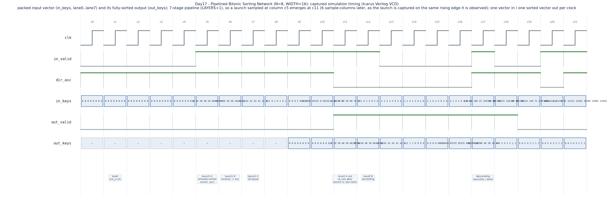

# Day 17 — Pipelined Bitonic Sorting Network

A fully-pipelined hardware **sorting network** that sorts a vector of `N`
unsigned `WIDTH`-bit keys per launch, accepting one vector and emitting one
fully-sorted vector **every clock cycle** after a fixed pipeline latency.

## Overview

Sorting is a fundamental primitive, but a *sequential* sort (compare, branch,
loop) is a poor fit for throughput hardware: its runtime is data-dependent and
its control flow diverges. A **sorting network** replaces this with a *fixed*
schedule of compare-exchange (CAE) operations whose structure never depends on
the data. Every input takes exactly the same path, so the network can be
deeply pipelined for constant, predictable latency and full one-vector-per-cycle
throughput.

The **bitonic** sorting network (Batcher, 1968) is the canonical such network.
It sorts `N = 2^L` keys with `L·(L+1)/2` layers of `N/2` compare-exchange
elements each — `O(N·log²N)` comparators arranged in `O(log²N)` depth.

### Why this matters for computer architecture

* **GPU sort primitive.** Bitonic sort is *the* data-parallel sort on GPUs and
  vector machines. Its schedule is oblivious (no data-dependent branching), so
  it maps perfectly onto SIMT lanes / SIMD units — every thread executes the
  same compare-exchange pattern, avoiding warp divergence. It is the classic
  building block behind GPU radix/merge-sort passes, `top-k` selection, and
  bitonic-based reductions.
* **Low-latency sort/rank in HFT.** High-frequency-trading datapaths need to
  rank or keep the best few entries of a stream at wire speed: maintaining the
  top bids/asks of an order book, ranking venue quotes, or selecting the best
  signals every tick. A pipelined bitonic network delivers a *deterministic*,
  data-independent sort latency — exactly the property a latency-sensitive
  trading pipeline is built around — with a fresh sorted vector every cycle.
* **Comparator-network / oblivious-algorithm design.** The module is a compact
  worked example of turning an oblivious algorithm into a spatially-unrolled,
  fully-pipelined datapath with a purely structural (constant) control schedule.

## The architectural concept: bitonic sort

A **bitonic sequence** is one that monotonically increases and then decreases
(or a rotation thereof). The key insight: a *bitonic* sequence of length `n`
can be sorted in `log₂n` compare-exchange layers. Bitonic sort builds a fully
sorted sequence by recursively producing and then merging bitonic sequences.

Flattened into a network, the schedule is two nested loops over powers of two:

```
for s = 1 .. L:                 # major stage, block size K = 2^s
    for t = 0 .. s-1:           # sub-step, compare distance J = 2^(s-1-t)
        for each lane i:        # N/2 compare-exchanges, in parallel
            partner = i XOR J
            ascending = ((i & K) == 0)
            compare-exchange(i, partner) into ascending/descending order
```

Each `(s, t)` pair is one **layer** of `N/2` parallel CAEs. There are
`L·(L+1)/2` layers total. This module instantiates one **pipeline register**
after each layer, so the network streams: latency is fixed at `LAYERS + 1`
register stages and throughput is one vector per cycle regardless of the data.

The mesh is built to sort **ascending**. A per-launch `dir_asc` control
(pipelined alongside the data) selects the ascending result directly, or a
**descending** result by *reversing the lane order* at the output — a monotone
vector read backwards is still monotone in the opposite order, so no extra
comparators are needed.

## Features

* Parameterized in `N` (power of two, ≥ 2) and key `WIDTH`.
* Fully pipelined — one input vector per cycle, one sorted vector per cycle.
* Fixed, data-independent latency of `LAYERS + 1 = L·(L+1)/2 + 1` cycles.
* Per-launch ascending / descending direction, pipelined with the data.
* Purely structural schedule: no variable bit-selects, no data-dependent
  branching — lint- and synthesis-friendly.
* Reset-safe: only the `valid`/`dir` pipeline is reset; data lanes are flushed
  naturally by the valid pipeline.
* Keys treated as **unsigned** magnitudes (prices, volumes, ranks, …).
* Elaboration-time assertions reject non-power-of-two `N` and zero `WIDTH`.

## Parameters

| Parameter | Default | Description |
|-----------|---------|-------------|
| `N`       | `8`     | Keys per vector; must be a power of two, ≥ 2. |
| `WIDTH`   | `16`    | Key width in bits (unsigned). |

Derived: `L = log2(N)` major stages; `LAYERS = L·(L+1)/2` compare-exchange
layers; pipeline latency `= LAYERS + 1` cycles. For `N = 8`: `L = 3`,
`LAYERS = 6`, latency `= 7`.

## Ports

| Port        | Dir | Width       | Description |
|-------------|-----|-------------|-------------|
| `clk`       | in  | 1           | Clock. |
| `rst_n`     | in  | 1           | Active-low synchronous-use / async-assert reset for the valid pipeline. |
| `in_valid`  | in  | 1           | Launch a new vector this cycle. |
| `dir_asc`   | in  | 1           | `1` = sort ascending, `0` = sort descending (sampled per launch). |
| `in_keys`   | in  | `N*WIDTH`   | Packed input vector; lane `i` = `in_keys[i*WIDTH +: WIDTH]`. |
| `out_valid` | out | 1           | Sorted vector valid this cycle (launch delayed by the pipeline latency). |
| `out_keys`  | out | `N*WIDTH`   | Packed sorted vector; lane `i` = `out_keys[i*WIDTH +: WIDTH]`. |

## Block / datapath diagram

Compare-exchange element (CAE) — the whole network is built from these:

```
        in_a ─┐        ┌───────► min(in_a,in_b)   (ascending: low lane)
              ├──►[CMP]─┤
        in_b ─┘        └───────► max(in_a,in_b)   (ascending: high lane)
       (descending swaps min/max)
```

Bitonic network for `N = 8` (L = 3, 6 pipelined layers). Each column is one
registered layer; each `x`/`|` pair is a compare-exchange between two lanes.
Compare distance `J` and ascending/descending sense follow the schedule above:

```
 lane   stage1      stage2            stage3
        (K=2)     (K=4)             (K=8)
        L0        L1    L2          L3    L4    L5
  0 ────x───────  x──── x────────   x──── x──── x────►  sorted[0] (min)
        |         |     |           |     |     |
  1 ────x───────  |  x  x────────   |  x  |  x  x────►  sorted[1]
                  |  |              |  |  |  |
  2 ────x───────  x  |  x────────   |  |  x  x  x────►  sorted[2]
        |            |  |           |  |     |  |
  3 ────x───────  x──x  x────────   |  |  x──x  x────►  sorted[3]
                                    |  |
  4 ────x───────  x──── x────────   x──x  x──── x────►  sorted[4]
        |         |     |              |  |     |
  5 ────x───────  |  x  x────────   x──x  |  x  x────►  sorted[5]
                  |  |                    |  |
  6 ────x───────  x  |  x────────   x──── x  |  x────►  sorted[6]
        |            |  |           |        |  |
  7 ────x───────  x──x  x────────   x──────  x──x  x──►  sorted[7] (max)
       reg       reg    reg         reg   reg   reg
   (the ASCII pairing is schematic; the RTL wires lanes exactly per
    partner = i XOR J and ascending = (i & K)==0)
```

Pipeline (one register per layer, valid/dir carried alongside):

```
in_keys ─►[stage0 reg]─►[L0]─►[L1]─►[L2]─►[L3]─►[L4]─►[L5]─► reverse? ─► out_keys
in_valid ─► vpipe[0] ─► vpipe[1] ─► ... ─────────────► vpipe[LAYERS] ─► out_valid
dir_asc  ─► dpipe[0] ─► ...        ─────────────────► dpipe[LAYERS] ─┘ (selects reverse)
```

## Simulation timing



*Captured timing diagram, rendered directly from the Icarus Verilog VCD
(`bitonic_sorter.vcd`) produced by the self-checking testbench — this is a
**real captured trace**, not a hand-drawn diagram.* The trace shows reset
followed by the first directed launches: an already-sorted vector (launch A),
a reverse-sorted vector (launch B), and an all-equal vector (launch C). The
7-stage pipeline (`LAYERS + 1`) means a launch sampled at column `c5` emerges
at `c11` — 6 sample-columns later, because at these rising-edge samples the
launch input is captured on the very edge at which it is observed. From then on
`out_valid` stays asserted every cycle a launch was applied, and each
`out_keys` column is the correctly sorted permutation of the corresponding
`in_keys`, demonstrating one-vector-in / one-sorted-vector-out per clock.

## How it works

1. **Input registration (stage 0).** On `in_valid`, the packed `in_keys` are
   unpacked into `N` lane registers `pipe[0][*]`; `in_valid`/`dir_asc` are
   captured into `vpipe[0]`/`dpipe[0]`.
2. **Compare-exchange mesh.** For each layer `G` (enumerated by `(s, t)` via a
   nested `generate`), every lane computes its new value from its current value
   and its partner `lane ^ J`. A lane keeps the *smaller* of the pair when
   `is_low ? ascending : !ascending`, else the *larger*, where
   `is_low = (lane & J)==0` and `ascending = (lane & K)==0`. The result is
   registered into `pipe[G+1][*]`. `valid`/`dir` shift down `vpipe`/`dpipe` in
   lockstep.
3. **Output select.** After the last layer the vector is fully sorted
   ascending. `out_keys` reads the lanes straight through when the pipelined
   `dir_asc` is set, or in reversed lane order when it is clear (descending),
   and `out_valid` follows `vpipe[LAYERS]`.

Because the CAE schedule is fixed at elaboration, there are no data-dependent
paths: the same permutation network runs every cycle and the latency is
constant.

## Run instructions

```bash
make            # Icarus Verilog: compile + run the self-checking TB
make waveform   # regenerate docs/bitonic_sorter_waveform.png from the VCD
make verilator  # or run under Verilator
make vcs        # or Synopsys VCS
make questa     # or Siemens Questa/ModelSim
make clean
```

A passing run prints `RESULT: *** PASS ***`.

## What the testbench checks

`tb_bitonic_sorter.sv` is **self-checking against an independent golden model**
(a software insertion sort of the unsigned keys, reversed for descending).
Because the DUT is fully pipelined and in-order, each launched vector's expected
result is pushed into a **FIFO scoreboard** at launch time and popped/compared
whenever `out_valid` asserts. It exercises:

* **Directed corner cases:** already-sorted, reverse-sorted, all-equal,
  alternating hi/lo, single spike, and full-range extremes (`0` / `0xFFFF`),
  in both ascending and descending directions.
* **Valid gating / bubbles:** idle cycles (`in_valid = 0`) interleaved between
  launches to prove the valid pipeline gates results correctly and no phantom
  outputs appear.
* **Randomized stream:** hundreds of random vectors with a random direction
  each, sustained back-to-back to stress the pipeline at full throughput.

Every result must match the golden model *and* the number of checked results
must equal the number of launched vectors (proving nothing was dropped or
duplicated). A global timeout guards against a wedged pipeline. In the recorded
run, **310 vectors were launched and checked with 0 errors** under Icarus
Verilog.
