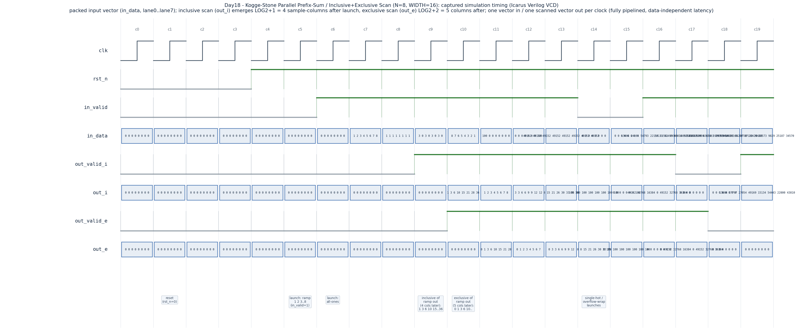

# Day 18 — Kogge-Stone Parallel Prefix-Sum (Inclusive / Exclusive Scan) Unit

A fully-pipelined hardware **prefix-sum (scan)** network that consumes a vector
of `N` unsigned `WIDTH`-bit elements per launch and emits its running totals
**every clock cycle** after a fixed pipeline latency. Both **inclusive** and
**exclusive** scan variants are provided from the same parameterized module.

## Overview

Given an input vector `[x0, x1, … x(N-1)]`, the **scan** operation produces its
prefix reductions:

```
inclusive :  y[i] = x0 + x1 + … + xi          (y[i] includes x[i])
exclusive :  y[i] = x0 + x1 + … + x(i-1)      (y[0] = 0)
```

A naïve scan is inherently *sequential* — each output depends on the one before
it — which is the worst possible shape for throughput hardware. The
**Kogge-Stone** parallel-prefix formulation breaks that dependency chain into
`log₂N` balanced stages, so the whole vector is scanned in logarithmic depth
instead of linear. Registering each stage turns it into a systolic pipeline
that accepts a fresh vector every cycle at a fixed, data-independent latency.

### Why this matters for computer architecture

* **The fundamental GPU parallel primitive.** Scan is *the* building block of
  data-parallel computing — NVIDIA's CUB `DeviceScan` and warp-level
  `__shfl`-based scans are hardware/PTX realizations of exactly this network.
  Scan powers **stream compaction** (turn a predicate mask into compact output
  indices), **radix-sort** digit histogram offsets, **sparse-matrix** row
  pointers, run-length encoding, and parallel allocation. The Kogge-Stone
  schedule is *oblivious* — no data-dependent branching — so it maps cleanly
  onto SIMT lanes without warp divergence.
* **Low-latency aggregation in HFT.** High-frequency-trading datapaths need
  running totals at wire speed: **cumulative order-book depth** across price
  levels, cumulative traded volume, prefix VWAP terms, or a moving accumulation
  over a lane of ticks. A pipelined prefix network delivers a *deterministic*,
  data-independent scan latency with a fresh scanned vector every cycle —
  exactly the property a latency-sensitive trading pipeline is built around.
* **Parallel-prefix as a design pattern.** The same Kogge-Stone recurrence is
  how fast adders compute carries (carry-lookahead / prefix adders) — this
  module is a compact, general worked example of turning a sequential
  recurrence into a spatially-unrolled, fully-pipelined, purely-structural
  datapath.

## The architectural concept: Kogge-Stone parallel prefix

The Kogge-Stone network computes an inclusive scan in `log₂N` stages. At
**stage `d`** (for `d = 0 … log₂N − 1`) every lane adds in the partial result
from the lane `2^d` positions to its left; lanes with no such neighbour pass
through unchanged:

```
stage d :  a[i] = a[i] + a[i - 2^d]   if i >= 2^d
                = a[i]                 otherwise
```

After all `log₂N` stages, `a[i]` holds `x0 + … + xi` — the inclusive scan.
The shift distance `2^d` is a **compile-time constant per stage**, so there are
**no variable bit-selects** anywhere and the network is purely structural. The
exclusive scan is the inclusive scan shifted right by one lane (with `0` fed
into lane 0), costing one extra pipeline stage.

Worked example for `N = 8`, input `x = [1,2,3,4,5,6,7,8]`:

```
input        :  1   2   3   4   5   6   7   8
stage d=0    :  1   3   5   7   9  11  13  15     (i += i-1)
stage d=1    :  1   3   6  10  14  18  22  26     (i += i-2)
stage d=2    :  1   3   6  10  15  21  28  36     (i += i-4)  = inclusive scan
exclusive    :  0   1   3   6  10  15  21  28     (inclusive shifted right)
```

The inclusive result `1 3 6 10 15 21 28 36` is the sequence of triangular
numbers — visible as the directed ramp launch in the captured waveform below.

### Datapath / block diagram (Kogge-Stone, N = 8)

Each `⊕` is a `WIDTH`-bit adder; every row of nodes is followed by a pipeline
register. `·` means "pass through unchanged".

```
 lane:   0     1     2     3     4     5     6     7
        x0    x1    x2    x3    x4    x5    x6    x7
         |     |     |     |     |     |     |     |
 d=0     ·   0⊕1   1⊕2   2⊕3   3⊕4   4⊕5   5⊕6   6⊕7     (offset 1)
         |     |     |     |     |     |     |     |
        [reg] [reg] [reg] [reg] [reg] [reg] [reg] [reg]
         |     |     |     |     |     |     |     |
 d=1     ·     ·   0⊕2   1⊕3   2⊕4   3⊕5   4⊕6   5⊕7     (offset 2)
         |     |     |     |     |     |     |     |
        [reg] [reg] [reg] [reg] [reg] [reg] [reg] [reg]
         |     |     |     |     |     |     |     |
 d=2     ·     ·     ·     ·   0⊕4   1⊕5   2⊕6   3⊕7     (offset 4)
         |     |     |     |     |     |     |     |
        [reg] [reg] [reg] [reg] [reg] [reg] [reg] [reg]
         |     |     |     |     |     |     |     |
       y0    y1    y2    y3    y4    y5    y6    y7      = inclusive scan
       (indices left of ⊕ are the source lanes of the previous stage)
```

## Features

* Parameterized element count `LANES` (any power of two) and bit-width `WIDTH`.
* Selectable **inclusive** or **exclusive** scan via the `EXCLUSIVE` parameter.
* `log₂(LANES)`-depth Kogge-Stone network, one **pipeline register per stage**
  → **one vector in / one scanned vector out per clock**, fixed latency.
* Purely structural: all shift distances are elaboration-time constants — **no
  variable bit-selects, no data-dependent control** — lint / synthesis clean.
* Synchronous active-low reset; unsigned wrap-around (`mod 2^WIDTH`) accumulate.
* Self-checking testbench with directed corner cases + randomized streaming,
  checked against an independent golden model through a matched delay line.

## Parameters

| Parameter   | Default | Description |
|-------------|---------|-------------|
| `LANES`     | `8`     | Number of parallel vector elements `N` (must be a power of two). |
| `WIDTH`     | `16`    | Bit-width of each element; accumulation wraps `mod 2^WIDTH`. |
| `EXCLUSIVE` | `0`     | `0` = inclusive scan, `1` = exclusive scan. |

Derived: `LOG2 = log₂(LANES)`; pipeline `LATENCY = LOG2 + 1` (inclusive) or
`LOG2 + 2` (exclusive).

## Ports

| Port        | Dir | Width           | Description |
|-------------|-----|-----------------|-------------|
| `clk`       | in  | 1               | Clock. |
| `rst_n`     | in  | 1               | Synchronous, active-low reset. |
| `in_valid`  | in  | 1               | Assert with a new input vector on `in_data`. |
| `in_data`   | in  | `LANES*WIDTH`   | Packed input; lane `i` = bits `[i*WIDTH +: WIDTH]`. |
| `out_valid` | out | 1               | High when `out_data` carries a completed scan. |
| `out_data`  | out | `LANES*WIDTH`   | Packed scan result; same lane packing as `in_data`. |

The interface is purely streaming with **no back-pressure** — a scan network
never stalls, so a valid vector presented on cycle *t* produces its result on
cycle *t + LATENCY*. Consumers must keep up.

## Simulation timing



*Captured timing from the Icarus Verilog run (parsed from `prefix_scan.vcd` and
rendered with matplotlib — a **real simulator trace**, not a hand-drawn
diagram).* The trace shows the synchronous reset release, then directed launches
streamed one per cycle: the **unit-ramp** vector `1 2 3 4 5 6 7 8` and the
**all-ones** vector, followed by alternating, descending, single-hot and
overflow-wrap vectors. The ramp's **inclusive** scan `1 3 6 10 15 21 28 36`
(triangular numbers) appears on `out_i` exactly `LOG2+1 = 4` sample-columns
after the launch, and its **exclusive** scan `0 1 3 6 10 15 21 28` appears on
`out_e` one column later (`LOG2+2 = 5`), confirming the fixed, data-independent
pipeline latency and one-vector-per-cycle throughput.

## How it works

1. **Stage 0 — capture.** The incoming vector and its `in_valid` are registered,
   defining lane 0 of the pipeline.
2. **Stages 1 … LOG2 — combine.** A `generate` loop unrolls the Kogge-Stone
   recurrence: at stage `s` the constant offset is `2^(s-1)`; lane `i` computes
   `a[i] + a[i-offset]` when `i >= offset`, else passes `a[i]` through. Each
   stage is registered, so `valid` shifts alongside the data.
3. **Optional exclusive conversion.** When `EXCLUSIVE = 1`, one extra stage
   shifts the inclusive result right by one lane and injects `0` into lane 0.
4. **Output.** The final stage is unpacked back onto `out_data` with
   `out_valid`.

Because control is a fixed schedule of constant offsets, the module is fully
combinational-per-stage and deeply pipelined — no FSM, no counters, no stalls.

## Running it

```bash
make            # Icarus Verilog: elaborate, run the self-checking TB
make waveform   # regenerate docs/prefix_scan_waveform.png from the VCD
make clean      # remove build artifacts
```

Other simulators: `make verilator`, `make vcs`, `make questa`.

Expected tail of a passing run:

```
prefix_scan: 416 outputs checked, 0 mismatches
RESULT: *** PASS ***
```

## What the testbench checks

`tb_prefix_scan.sv` drives **one shared stimulus stream into two DUT instances
at once** — an inclusive scan and an exclusive scan — and self-checks each
against an independent golden model:

* **Golden reference model.** A `scan()` function recomputes the expected
  inclusive/exclusive result combinationally from every input vector, using the
  same `mod 2^WIDTH` wrap-around as the RTL.
* **Latency-matched comparison.** Because each DUT is a fixed-latency pipeline,
  the golden result is pushed through a TB delay line of matching depth
  (`LOG2+1` for inclusive, `LOG2+2` for exclusive) and compared against the DUT
  output on every cycle `out_valid` is asserted — both the value **and** the
  valid alignment are checked.
* **Directed corner cases** (one vector per cycle): all-zeros, unit ramp
  (triangular-number scan), all-ones, alternating, descending, single-hot at
  the first and last lanes, and a saturating `0xC000` vector that forces the
  running sum to **overflow / wrap**. A deliberate `in_valid` gap verifies that
  no spurious outputs are produced.
* **Randomized streaming.** 200 back-to-back random vectors exercise the
  pipeline at full one-vector-per-cycle throughput.
* A global **timeout** guards against a hang, and the run prints
  `RESULT: *** PASS ***` only if every compared output matched
  (`416` checks = 208 inclusive + 208 exclusive).
