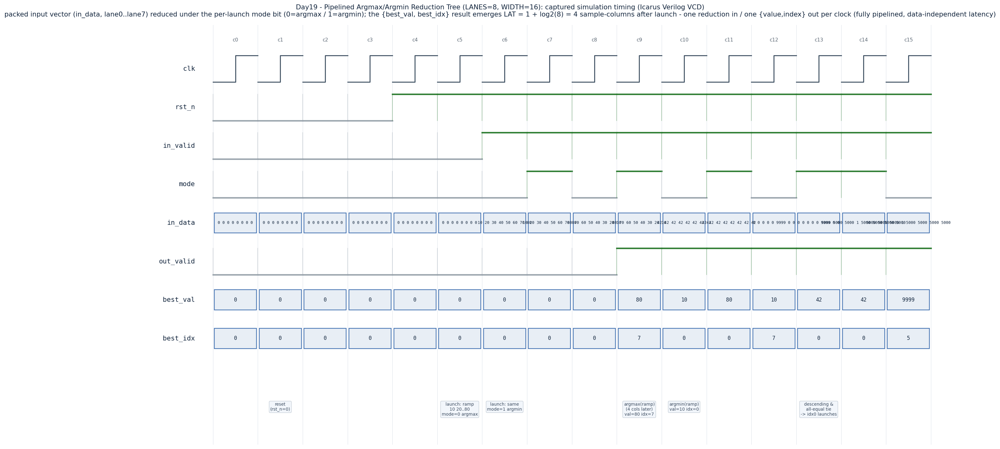

# Day 19 — Pipelined Argmax / Argmin Reduction Tree (Top-of-Book / Best Bid–Ask Selector)

A fully-pipelined binary **reduction tree** that collapses a packed vector of
`LANES` unsigned values down to the single extreme element, returning **both
its value and its originating lane index** — an *arg-reduce*, the value+index
variant of a warp reduction. A per-launch `mode` bit selects **argmax** (the
maximum) or **argmin** (the minimum), and ties are resolved deterministically
toward the lowest lane index.

---

## Overview

A plain reduction answers *"what is the maximum?"*. An **arg-reduction** also
answers *"and which element was it?"* — it carries the index alongside the
value the whole way down the tree. That index is the whole point in most real
uses: you rarely want just the best price, you want to know **which order /
which lane / which level** produced it so you can act on it.

This is the exact primitive behind:

- **GPU warp reductions** — CUDA `__shfl_down_sync` / `__reduce_max_sync`
  reduction ladders, and CUB `DeviceReduce::ArgMax` / `ArgMin`
  (`cub::KeyValuePair<int,T>`). A warp reduces 32 lanes to one `{value,index}`
  in `log₂32 = 5` shuffle steps; this module is the spatial, registered form of
  that same `log₂N`-deep tree.
- **HFT / market-data fast paths** — given a vector of resting price levels,
  **argmax = best bid** (highest price *and which level it sits on*) and
  **argmin = best ask** (lowest price *and which level*). Top-of-book
  extraction is the single most latency-critical reduction on a trading fast
  path, and doing it in fixed, data-independent latency (no data-dependent
  branching, no variable-latency search) is exactly what a hardware book
  builder needs.

### Why it matters (the architectural concept)

A reduction is one of the two canonical data-parallel primitives (the other,
scan, is [Day 18](../Day18/)). Both are `O(N)`-work / `O(log N)`-depth trees;
the difference is that a reduction keeps only the root while a scan keeps every
prefix. Building the reduction as a **balanced, registered tree** turns a
naïve `O(N)` linear compare chain (whose critical path grows with `N`) into a
`log₂N`-deep pipeline that:

- accepts a **new vector every cycle** (throughput = 1 reduction/clock), and
- returns each result at a **fixed latency** `LAT = log₂N + 1`, independent of
  the data.

Fixed latency + full throughput is the property that makes it usable inside a
deterministic pipeline (a GPU datapath, or an FPGA order-book engine) where
variable-latency structures would stall everything downstream.

---

## Features

- Parameterized `LANES` (power of two, ≥ 2) and `WIDTH` (unsigned value bits).
- Single `mode` input per launch: **0 = argmax**, **1 = argmin**.
- Returns **both** `best_val` and `best_idx` (the winning lane).
- **Lowest-index tie-break** (first-extreme), matching CUB's rule — realised
  with a *single* value comparison per node (see *How it works*).
- Fully pipelined: **1 vector in / 1 `{value,index}` out per clock**, fixed
  latency `LAT = log₂(LANES) + 1`, no stalls, no bubbles.
- `mode` and `valid` are pipelined **with** the data, so back-to-back launches
  may freely interleave argmax and argmin.
- Purely structural constant-index tree wiring — **no variable bit-selects, no
  data-dependent control flow** → lint- and synthesis-friendly.
- Reset-safe (active-low `rst_n` clears every pipeline register).

---

## Parameters

| Parameter | Default | Description |
|-----------|---------|-------------|
| `LANES`   | `8`     | Number of input lanes reduced per launch. Must be a power of two ≥ 2 (elaboration-checked). |
| `WIDTH`   | `16`    | Bit-width of each unsigned value. |

Derived: `LOG2 = clog2(LANES)` tree levels, `IDXW = LOG2` index bits,
latency `LAT = LOG2 + 1`.

## Ports

| Port        | Dir | Width           | Description |
|-------------|-----|-----------------|-------------|
| `clk`       | in  | 1               | Clock. |
| `rst_n`     | in  | 1               | Active-low reset; clears all pipeline stages. |
| `in_valid`  | in  | 1               | Launch a reduction this cycle. |
| `mode`      | in  | 1               | `0` = argmax, `1` = argmin (captured per launch). |
| `in_data`   | in  | `LANES*WIDTH`   | Packed input vector; lane 0 = least-significant slice. |
| `out_valid` | out | 1               | Result valid (asserts `LAT` cycles after `in_valid`). |
| `best_val`  | out | `WIDTH`         | The extreme value. |
| `best_idx`  | out | `clog2(LANES)`  | Lane index of the extreme value. |

---

## Datapath / block diagram

An `N = 8`, `LAT = 4` tree. Each `▽` is a registered compare-select (CMPSEL)
node; each horizontal band is one pipeline stage.

```
 in_data (packed)          mode ─┐   in_valid ─┐
   │  lane0..lane7                │            │
   ▼                              ▼            ▼
 ┌───────────────── stage 0 : capture 8 leaves as {value, index} ─────────────┐
 │  {v0,0} {v1,1} {v2,2} {v3,3} {v4,4} {v5,5} {v6,6} {v7,7}   md0   vld0       │
 └───┬────────┬────────┬────────┬────────┬────────┬────────┬────────┬─────────┘
     │   pair 0/1       │   pair 2/3      │   pair 4/5      │   pair 6/7
     ▽────────▽         ▽────────▽        ▽────────▽        ▽────────▽   level 0  (CMPSEL)
 ┌───────────────── stage 1 : 4 survivors ────────────────────────── md1 vld1 ─┐
 │      {w0}            {w1}            {w2}            {w3}                     │
 └──────┬───────────────┬────────────────┬───────────────┬────────────────────┘
        ▽───────────────▽                ▽───────────────▽             level 1
 ┌───────────────── stage 2 : 2 survivors ────────────────────────── md2 vld2 ─┐
 │              {x0}                            {x1}                            │
 └───────────────────────┬─────────────────────────────────────────┬──────────┘
                         ▽─────────────────────────────────────────▽          level 2
 ┌───────────────── stage 3 : 1 survivor = root ─────────────────── md3 vld3 ──┐
 │                              {best_val, best_idx}                           │
 └────────────────────────────────┬───────────────────────────────────────────┘
                                   ▼
                       out_valid / best_val / best_idx

 CMPSEL(a,b) under mode:  argmax → keep a if a.val >= b.val  (else b)
                          argmin → keep a if a.val <= b.val  (else b)
   where 'a' is always the lower-index child ⇒ '>=' / '<=' also breaks ties
   toward the lower index in ONE comparison.
```

---

## How it works

1. **Leaf capture (stage 0).** On a launch, the `LANES` slices of `in_data` are
   registered as `{value, index}` pairs, with `index = lane number`. `mode` and
   `in_valid` are latched alongside them.

2. **`log₂N` reduce levels.** Each level is a row of registered CMPSEL nodes
   that pairs up adjacent survivors and forwards the winner. Level `lv` turns
   `N ≫ lv` survivors into `N ≫ (lv+1)`. After `LOG2` levels a single survivor
   remains — the root — which drives the outputs.

3. **Tie-break for free.** Leaves enter in lane order, and *every* tie keeps
   the lower-indexed child, so by induction the **left child of any node always
   holds the smaller index**. That invariant lets a single value comparison do
   both jobs: `a.val >= b.val` (argmax) / `a.val <= b.val` (argmin) keeps the
   left (lower-index) element on a tie automatically — no second comparison on
   the index is needed. The result is the deterministic *first-extreme* that
   CUB's `ArgMax`/`ArgMin` also return.

4. **Pipelined mode & valid.** Because `mode` and `valid` ride down the tree
   with the data, the block is genuinely streaming: launch an argmax this cycle
   and an argmin the next, and both come out `LAT` cycles later with no
   interaction.

The whole tree is built from constant-index generate wiring — there are no
variable part-selects and no data-dependent branches, so it lints cleanly and
maps to a regular, static comparator tree in synthesis.

---

## Simulation timing



*Captured Icarus Verilog VCD (not a hand-drawn diagram).* After reset the
testbench launches the ascending ramp `10 20 … 80` twice back-to-back — first
`mode=0` (argmax), then `mode=1` (argmin). Exactly `LAT = 1 + log₂8 = 4`
sample-columns later the results appear at the root: `argmax → best_val=80,
best_idx=7` and, one column after, `argmin → best_val=10, best_idx=0`. The
following columns show the descending ramp (argmax → lane 0, argmin → lane 7)
and the all-equal vector whose tie resolves to lane 0 for both modes —
demonstrating one reduction in / one `{value,index}` out per clock at fixed,
data-independent latency.

---

## Running it

Default target uses **Icarus Verilog**:

```bash
make            # iverilog + vvp, runs the self-checking TB
```

Other simulators:

```bash
make verilator  # Verilator
make vcs        # Synopsys VCS
make questa     # Siemens Questa / ModelSim
```

Regenerate the waveform image from the captured VCD:

```bash
make waveform   # parses argmax_reduce.vcd -> docs/argmax_reduce_waveform.png
```

Clean:

```bash
make clean
```

A passing run prints:

```
argmax_reduce: 314 outputs checked, 0 mismatches
RESULT: *** PASS ***
```

---

## What the testbench checks

`tb_argmax_reduce.sv` is **self-checking** against an independent golden model:

- A combinational reference `arg_reduce()` computes the first-extreme
  `{value, index}` (strict compare so the **lowest** index wins on a tie),
  entirely separately from the DUT's tree structure.
- Because the tree is a fixed-latency pipeline, each launch's golden result is
  pushed through a **TB delay line of matching depth** `LAT`, and the aligned
  entry is compared against the DUT root whenever `out_valid` is asserted —
  value **and** index must match (`!==`, so X's fail).
- **Directed corner cases**, streamed one per cycle and interleaving both
  modes: ascending / descending ramps, all-equal (tie → lane 0), a single peak,
  a single trough amid a plateau, a **duplicated maximum** and a **duplicated
  minimum** (tie-break), and full-scale `0xFFFF` vs. `0x0000` extremes.
- An `in_valid` **gap** to confirm no spurious `out_valid`.
- **300 randomized** `{vector, mode}` launches back-to-back.
- A global **timeout** guard, and it dumps `argmax_reduce.vcd`.

It prints `RESULT: *** PASS ***` only if every compared output matched and at
least one check ran.
