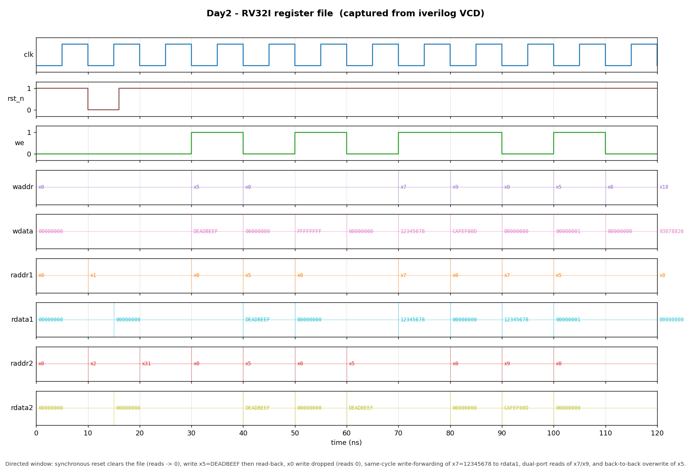

# Day 2 — RV32I Register File (2R / 1W)

## Overview

The register file holds a processor's **architectural state**: the 32
general-purpose registers (`x0`–`x31`) that RISC-V instructions read and write.
It sits between the decode and execute stages of a datapath, exposing **two
combinational read ports** (for `rs1` and `rs2`) and **one synchronous write
port** (driven by the write-back stage to retire a result into `rd`).

This day implements a clean, parameterized register file with the two details
that make it a *RISC-V* register file rather than a generic RAM: `x0` is
hardwired to zero, and same-cycle **internal write-forwarding** resolves the
write-back → decode read-after-write hazard.

## Why it matters

Almost every instruction reads one or two source registers and most write a
destination, so the register file is on the critical path of a core. Two
architectural subtleties are easy to get wrong and both are modeled here:

- **`x0` is the zero register.** Reads of `x0` must return 0 and writes to it
  must be discarded. The ISA relies on this — `addi x0, x0, 0` is the canonical
  NOP, and `beq x0, x0, target` is an unconditional branch.
- **Read-during-write.** In a pipelined core the write-back (WB) stage writes a
  register in the *same* cycle the instruction-decode (ID) stage may be reading
  it. Real cores write in the first half of the cycle and read in the second, so
  the fresh value is visible. Modeling that as combinational reads with
  **write-forwarding** (a read port whose address equals the write address this
  cycle sees `wdata`) eliminates a WB→ID RAW hazard without an external
  forwarding path. It is the natural Day 2 companion to the Day 1 ALU — the ALU
  computes, the register file supplies its operands and stores its result.

## Features

- **2 read / 1 write** ports: dual combinational reads, single synchronous
  write, matching a standard RV single-issue datapath.
- **`x0` hardwired to zero**: writes to register 0 are dropped; reads of
  register 0 always return 0.
- **Internal write-forwarding** (`WRITE_FIRST`, default on): a read port that
  targets the register being written this cycle sees the new `wdata`, so the WB
  stage and a same-cycle ID read never disagree. A forwarded write to `x0` is
  still forced to 0.
- **Synchronous active-low reset** clears all registers → reset-safe.
- **Parameterized** width and depth (`DATA_W`, `ADDR_W`).
- Lint-friendly: `` `default_nettype none ``, fully-driven outputs, no inferred
  latches.

## Parameters

| Parameter     | Default | Description |
|---------------|---------|-------------|
| `DATA_W`      | `32`    | Register (and read/write data) width. |
| `ADDR_W`      | `5`     | Address width; the file holds `2**ADDR_W` registers (32 for RV32I). |
| `WRITE_FIRST` | `1`     | When 1, a read port addressing the register written this cycle is forwarded `wdata` (write-first). When 0, reads return the old stored value (read-first). |

## Ports

| Port     | Dir | Width    | Description |
|----------|-----|----------|-------------|
| `clk`    | in  | `1`      | Clock; writes commit on the rising edge. |
| `rst_n`  | in  | `1`      | Active-low **synchronous** reset; clears all registers to 0. |
| `we`     | in  | `1`      | Write enable for the write port. |
| `waddr`  | in  | `ADDR_W` | Destination register index (`rd`). |
| `wdata`  | in  | `DATA_W` | Data written to `waddr` when `we` is high. |
| `raddr1` | in  | `ADDR_W` | Read-port-1 register index (`rs1`). |
| `rdata1` | out | `DATA_W` | Combinational read-port-1 data. |
| `raddr2` | in  | `ADDR_W` | Read-port-2 register index (`rs2`). |
| `rdata2` | out | `DATA_W` | Combinational read-port-2 data. |

## Datapath / block diagram

```
        we ─┐  waddr[4:0] ─┐   wdata[31:0] ─┐
            │              │                │
            ▼              ▼                ▼
        ┌───────────────────────────────────────────────────┐
        │              write decode / enable                 │
        │            (drop if waddr == x0)                    │
        └───────────────────────┬─────────────────────────────┘
                                │ (posedge clk)
                                ▼
             regs[1] regs[2] ........... regs[31]     regs[0] ≡ 0
                │        │                   │
      raddr1 ─►[ read mux ]────┐    raddr2 ─►[ read mux ]────┐
                               │                             │
              waddr==raddr1 &  │            waddr==raddr2 &   │
              we (forward) ────┤            we (forward) ─────┤
                               ▼                             ▼
                   (raddr1==x0? 0 :)              (raddr2==x0? 0 :)
                               │                             │
                               ▼                             ▼
                         rdata1[31:0]                  rdata2[31:0]
```

## Simulation timing



*Genuine simulator capture — not hand-modeled. The image is rendered by
`render_waveform.py` directly from `regfile.vcd`, the VCD produced by running
the testbench under Icarus Verilog (`make icarus`). The window (0–120 ns) shows,
in order: a **synchronous reset** (`rst_n` low, both read ports go to 0); a
write of `x5 = DEADBEEF` followed by a **read-back** on both ports; an attempted
write to `x0` with `FFFFFFFF` that is **dropped** (`rdata2` for `x5` stays
`DEADBEEF`, `x0` reads 0); **internal write-forwarding** where `x7` is written
`12345678` while `raddr1 = x7` in the same cycle and `rdata1` immediately shows
`12345678`; a **dual-port read** of `x7`/`x9` returning `12345678`/`CAFEF00D`;
and a back-to-back **overwrite** of `x5` to `00000001` (again forwarded). The
tail transitions into the randomized fuzz phase.*

## How it works

Writes are a single `always_ff @(posedge clk)` block: on reset it loops over the
array clearing every register; otherwise it writes `regs[waddr] <= wdata` only
when `we` is high **and** `waddr != x0`, so `x0` can never be modified.

Reads are two combinational muxes. Each read output is: `0` if the address is
`x0`; else `wdata` if write-forwarding applies (`WRITE_FIRST && we && waddr ==
raddr && waddr != x0`); else the stored `regs[raddr]`. The golden model in the
testbench reproduces exactly this precedence, so forwarding, the `x0` pin, and
ordinary reads are all checked.

## Running it

From this folder:

```bash
make            # Icarus Verilog: compile + run the self-checking TB
make waveform   # regenerate docs/regfile_waveform.png from regfile.vcd
make clean
```

Other simulators are wired up too: `make verilator`, `make vcs`, `make questa`.

**Verified:** run under **Icarus Verilog 13.0**, the testbench reports
`RESULT: *** PASS *** (4010 checks)`.

## What the testbench checks

`tb_regfile.sv` is self-checking against an independent software **golden
model** (`gold[]`) that mirrors the DUT cycle-by-cycle:

- **Read model** — `read_model()` predicts each read port using the same
  precedence as the RTL (`x0` → 0, then forwarding, then stored value); both
  read ports are compared exactly (`!==`, so `x`/`z` fail) *before* each rising
  edge.
- **Synchronous reset** — a reset cycle clears the model and the DUT together;
  post-reset reads must be 0.
- **`x0` hardwire** — a directed write of `FFFFFFFF` to `x0` must not change its
  read value (0), and other registers are unaffected.
- **Write-forwarding** — directed same-cycle read of the register being written
  must return the new `wdata`.
- **Dual-port reads** — the two ports are read independently, including reading
  the same register on both ports.
- **Randomized fuzz** — 4000 cycles with random write-enable, write/read
  addresses (including `x0`), and random data.
- **Timeout** — a watchdog `$finish`es and fails if the sim ever hangs.
- **VCD dump** — `regfile.vcd` is written for waveform rendering.

Success prints exactly `RESULT: *** PASS ***`.
