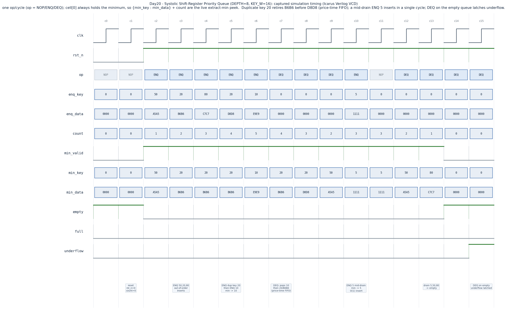

# Day 20 — Systolic Shift-Register Priority Queue (hardware min-heap)

A single-cycle, **O(1) enqueue and extract-min** hardware priority queue built
as a *systolic shift register*: `DEPTH` register cells hold `{key, data}`, kept
packed at the low indices and sorted ascending by key, so **cell[0] is always
the current minimum**. Every cell decides — in parallel, from purely local
neighbour information — whether to keep its own value, accept a newly inserted
element, or shift in its left neighbour. One operation is accepted **every
clock** at a fixed, data-independent single-cycle latency.

This is the ultra-low-latency substrate behind two things HFT and accelerator
teams care about:

- **HFT limit order book / matching engine** — insert a new order and read the
  best price in the *same* cycle, with equal prices retiring in arrival order
  (price-time priority). No sort, no traversal, deterministic latency.
- **Streaming Top-K selection** — a min-queue of size `K` naturally maintains
  the `K` smallest (or largest) elements of an unbounded stream; this is the
  hardware form of GPU `torch.topk` / CUB `DeviceSelect` and of the priority
  scheduling found in GPU hardware task/warp schedulers.

## Why this matters (the architectural concept)

A software heap gives `O(log n)` insert/extract but its latency is *variable*
(it depends on how far an element sifts) and it needs many dependent memory
accesses — poison for a pipelined, fixed-latency datapath. The **shift-register
priority queue** trades area for time: it spends `DEPTH` comparators and
registers so that *all* cells resolve their next value in one combinational
step. The result is the property FPGA/ASIC low-latency designers want —
**constant, single-cycle, data-independent** enqueue and extract-min — which is
exactly why this structure shows up in packet schedulers, real-time event
queues, network QoS shapers, and order-book front-ends.

The ordering rule is a **min-queue** (smaller key = higher priority). A new
element is placed only where `enq_key < key[i]`, i.e. *after* any existing equal
keys, so entries with the same priority leave in the order they arrived —
**price-time (FIFO-at-price) priority** for a limit order book.

## Features

- Single-cycle **ENQUEUE** (sorted insert) and **EXTRACT-MIN** (peek is free,
  pop is a one-cycle left shift) — one op/cycle, fixed latency, `O(1)`.
- Continuous **peek**: `min_key` / `min_data` / `min_valid` always expose the
  current minimum with no extra command.
- **Price-time / FIFO** ordering among equal keys (stable insert).
- Sticky **overflow** (ENQ while full drops the new element) and **underflow**
  (DEQ while empty is ignored) flags — neither ever corrupts the queue.
- Parameterized `DEPTH`, `KEY_W`, `DATA_W`.
- Fully synthesizable, reset-safe, latch-free, **no variable bit-selects**
  (all cell indexing is constant genvar/loop indexing → clean lint & mapping).

## Parameters

| Parameter | Default | Meaning |
|-----------|---------|---------|
| `DEPTH`   | 8       | Number of queue entries (register cells / heap capacity). |
| `KEY_W`   | 16      | Priority/key width (unsigned; **smaller key = higher priority**). |
| `DATA_W`  | 16      | Payload width carried alongside each key. |

## Ports

| Port | Dir | Width | Description |
|------|-----|-------|-------------|
| `clk`        | in  | 1                    | Clock. |
| `rst_n`      | in  | 1                    | Active-low reset (clears the queue and error flags). |
| `op`         | in  | 2                    | `00` NOP · `01` ENQ · `10` DEQ · `11` reserved→NOP. |
| `enq_key`    | in  | `KEY_W`              | Key inserted on ENQ. |
| `enq_data`   | in  | `DATA_W`             | Payload inserted on ENQ. |
| `min_key`    | out | `KEY_W`              | Peek: smallest key currently held. |
| `min_data`   | out | `DATA_W`            | Peek: payload paired with `min_key`. |
| `min_valid`  | out | 1                    | Queue is non-empty. |
| `count`      | out | `$clog2(DEPTH+1)`    | Number of valid entries. |
| `full`       | out | 1                    | `count == DEPTH`. |
| `empty`      | out | 1                    | `count == 0`. |
| `overflow`   | out | 1                    | Sticky: an ENQ was attempted while full. |
| `underflow`  | out | 1                    | Sticky: a DEQ was attempted while empty. |

## Datapath / block diagram

```
                 enq_key / enq_data (broadcast to every cell)
        ┌───────────┬───────────┬───────────┬─── ... ───┐
        ▼           ▼           ▼           ▼           ▼
   ┌─────────┐ ┌─────────┐ ┌─────────┐ ┌─────────┐   ┌─────────┐
   │ cell 0  │ │ cell 1  │ │ cell 2  │ │ cell 3  │...│ cell N-1│
   │ key,data│◄│ key,data│◄│ key,data│◄│ key,data│   │ key,data│   ENQ: shift-right
   │  = MIN  │ │         │ │         │ │         │   │         │   from left neighbour
   └────┬────┘ └────┬────┘ └────┬────┘ └────┬────┘   └────┬────┘
        │  cond[i] = (!valid[i]) || (enq_key < key[i])   monotone 0..0 1..1
        │  ENQ each cell:  !cond[i]        -> keep own
        │                  cond[i]&!cond[i-1] -> take new element  (insertion pt p)
        │                  cond[i-1]        -> shift in left neighbour
        ▼                  DEQ: every cell <- right neighbour (pop cell 0)
   min_key / min_data ── continuous peek of the current minimum
```

Per-cell decision (the whole engine is just this, replicated `DEPTH` times):

```
ENQUEUE(enq):                          EXTRACT-MIN:
  cond[i] = !valid[i] || enq<key[i]      out = {key[0], data[0]}   // the minimum
  if      (!cond[i])      keep own       for i: cell[i] <- cell[i+1]  // shift left
  else if (!cond[i-1])    take enq       count--
  else                    take left
  count++
```

`cond` is monotone `0…0 1…1` because the queue is always packed and sorted, so
its single rising edge marks the insertion point `p`: cells `< p` keep their
value, cell `p` takes the new element, cells `> p` shift one place right.

## Simulation timing



*Captured from the Icarus Verilog run (`priority_queue.vcd`), not a hand-drawn
diagram.* One operation per cycle. **c2–c6** enqueue `50, 20, 80, 20, 10`
out-of-order; `min_key`/`min_data` track the live minimum and `count` rises to
5. Note the **duplicate key 20**: at **c7** the DEQ pops the minimum `10`, then
**c8** pops `20 / B6B6` *before* **c9** pops `20 / D8D8` — the two equal-priority
entries retire in arrival order (**price-time FIFO**). At **c10** an `ENQ 5`
inserts mid-drain and becomes the new minimum in a single cycle. The final DEQs
drain `5, 50, 80` to empty (**c14**), and the DEQ-on-empty at **c15** latches
`underflow`.

## How it works

1. **Packed + sorted invariant.** Valid entries always occupy indices
   `0 … count-1` in ascending key order, so `count` is the single source of
   truth for occupancy and `valid[i] = (i < count)` needs no separate register.
   `cell[0]` is therefore the minimum by construction — extract-min is trivial.
2. **Parallel sorted insert.** On ENQ the new key is broadcast to all cells,
   each computing `cond[i] = !valid[i] || (enq_key < key[i])`. Because the array
   is packed and sorted, `cond` is monotone; its rising edge is the insertion
   point. Cells below it hold, the point takes the new element, cells above it
   shift right — all in one combinational cone.
3. **Extract-min = left shift.** On DEQ, `cell[0]` (already the minimum) is
   discarded and every cell copies its right neighbour, closing the gap.
4. **Backpressure & safety.** ENQ only fires when `!full` and DEQ only when
   `!empty`; a rejected op leaves the queue untouched and sets the sticky
   `overflow` / `underflow` flag. ENQ and DEQ can never both fire in the same
   cycle (mutually exclusive `op` encoding).
5. **Latency.** Every accepted op updates the visible state on the next clock —
   fixed single-cycle latency, fully pipelined at one op per cycle, independent
   of the data.

## Run it

```bash
make            # Icarus Verilog: compile + run the self-checking testbench
make waveform   # regenerate docs/priority_queue_waveform.png from the VCD
make clean
```

Other simulators: `make verilator`, `make vcs`, `make questa`.

Expected: the run prints **`RESULT: *** PASS ***`**. On this machine it was run
with Icarus Verilog and passed (directed + full/overflow + 4000 randomized ops).

## What the testbench checks

`tb_priority_queue.sv` runs an **independent behavioural golden model** — a
sorted, low-packed array using the *same* "insert only where `enq_key < key[i]`"
rule (so equal keys keep arrival order) — in lock-step with the DUT. After every
clock it compares the peek outputs (`min_key`, `min_data`, `min_valid`), the
occupancy status (`count`, `full`, `empty`) and the sticky error flags
(`overflow`, `underflow`).

- **Directed trace** (the region shown in the waveform): out-of-order inserts, a
  duplicate-key **price-time FIFO** check, a sorted extract-min drain, a
  mid-stream smaller insert, and an underflow.
- **Full / overflow** directed check: fill to `DEPTH`, assert `full`, then
  ENQ-while-full must set `overflow` and drop the element; drain and assert
  `empty`. The insert-free drain also independently verifies extract-min returns
  a **non-decreasing** key stream.
- **Randomized soak**: 4000 weighted NOP/ENQ/DEQ ops with a small key range to
  force frequent ties, all cross-checked against the golden model every cycle.

A watchdog `$fatal` guards against a hang, and the run dumps `priority_queue.vcd`
for waveform rendering.
