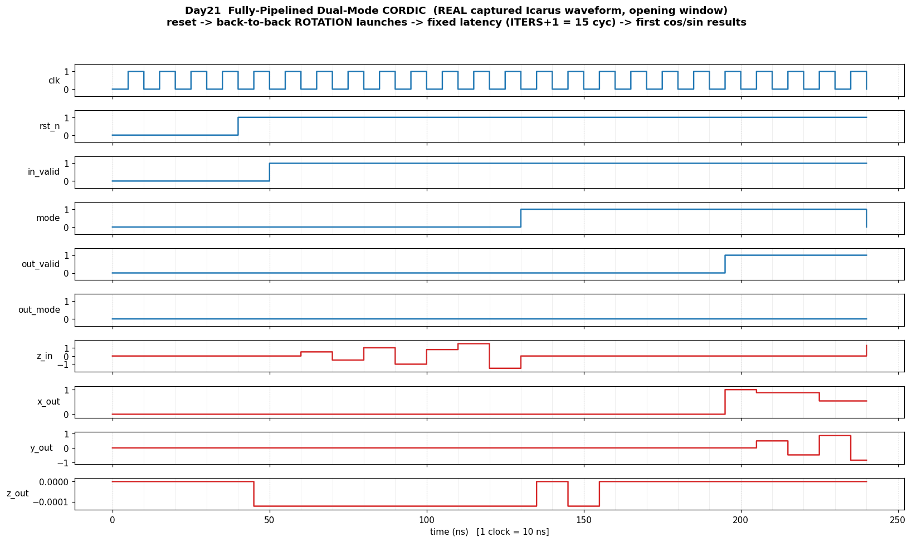

# Day 21 — Fully-Pipelined Dual-Mode CORDIC Engine (circular: cos/sin + magnitude/atan2)

A synthesizable **CORDIC** (COordinate Rotation DIgital Computer) datapath that
evaluates trigonometric functions using **nothing but shifts, adds/subtracts, and
a small `atan` ROM** — no multipliers, no dividers, no lookup of the function
itself. It runs in two modes over the circular coordinate system:

| Mode | Drives | Feed | Produces |
|------|--------|------|----------|
| **ROTATION** (`mode=0`) | `z → 0` | `x0 = K (≈0.6073)`, `y0 = 0`, `z0 = θ` | `x_out = cos θ`, `y_out = sin θ` |
| **VECTORING** (`mode=1`) | `y → 0` | `x0, y0` (x0 > 0), `z0 = 0` | `x_out = K·√(x0²+y0²)`, `z_out = atan2(y0, x0)` |

Each of the `ITERS` rotation micro-steps is mapped to **one registered pipeline
stage**, so the engine swallows a new operand *every cycle* and emits one result
*every cycle* at a **fixed, data-independent latency of `ITERS + 1` cycles**.

## Why this matters (architecture / GPU / HFT / FPGA)

- **GPU Special Function Unit (SFU).** Every GPU has a hardware SFU that
  evaluates `sin`/`cos`/`exp`/`log`/`rsqrt` for the `__sinf`/`MUFU.SIN` class of
  instructions. CORDIC is the classic shift-add way to build one — no wide
  multiplier array, tiny area, and the same engine covers rotation *and*
  rectangular→polar (magnitude/phase) conversion.
- **HFT / ultra-low-latency.** The latency is **constant and known at compile
  time** (no data-dependent iteration count, no Newton-style convergence loop),
  which is exactly the property a matching engine or signal pipeline needs to
  hit a deterministic tick-to-trade budget. Magnitude/phase (vectoring) is the
  primitive behind polar signal features, and CORDIC in the hyperbolic mode is
  the standard hardware route to `exp`/`ln` for options-pricing math.
- **FPGA-native.** CORDIC is *the* textbook FPGA ultra-low-latency building
  block: every stage is a constant shift plus an add/sub, it maps straight onto
  LUTs + a single carry chain per stage, it needs **zero DSP blocks**, and it
  pipelines to a very high `fmax`. Fully unrolled + registered (as here) it is a
  one-result-per-cycle streaming core.

## Features

- Dual-mode circular CORDIC (rotation → cos/sin, vectoring → magnitude/atan2)
  selected per-launch by `mode`, with `mode`/`valid` pipelined alongside the
  data so back-to-back launches may freely mix modes.
- Fully pipelined: **1 result / cycle** throughput, fixed **`ITERS + 1`** latency.
- **Purely structural**: every per-stage shift is by the *compile-time-constant*
  stage index → **no variable bit-selects**, no data-dependent control flow.
  The only data-dependent decision is the per-stage add-vs-subtract direction.
- Parameterized width `W`, fractional bits `FRAC`, iteration/stage count `ITERS`,
  and internal `GUARD` bits so the running vector (which grows by the CORDIC gain
  `1/K ≈ 1.6468`) never overflows in the documented domain.
- Reset-safe (`negedge rst_n` async reset on every pipeline register), lint-clean.

## Parameters

| Parameter | Default | Meaning |
|-----------|---------|---------|
| `W`      | 16 | External `x/y/z` width, signed **Q(W-1-FRAC).FRAC** |
| `ITERS`  | 14 | Number of CORDIC rotation stages = pipeline depth |
| `FRAC`   | 13 | Fractional bits (scale `2^FRAC = 8192`; range `[-4.0, +4.0)`) |
| `GUARD`  | 4  | Extra internal integer guard bits (overflow margin) |

## Ports

| Port | Dir | Width | Description |
|------|-----|-------|-------------|
| `clk`       | in  | 1 | Clock |
| `rst_n`     | in  | 1 | Async active-low reset |
| `in_valid`  | in  | 1 | Launch a new operand this cycle |
| `mode`      | in  | 1 | `0` = ROTATION, `1` = VECTORING |
| `x_in`      | in  | `W` | Input x (signed Q2.13) |
| `y_in`      | in  | `W` | Input y (signed Q2.13) |
| `z_in`      | in  | `W` | Input z / angle in radians (signed Q2.13) |
| `out_valid` | out | 1 | Result valid (`ITERS+1` cycles after `in_valid`) |
| `out_mode`  | out | 1 | Mode that produced the current result (pipelined) |
| `x_out`     | out | `W` | ROTATION: `cos θ`; VECTORING: `K·√(x0²+y0²)` |
| `y_out`     | out | `W` | ROTATION: `sin θ`; VECTORING: `≈ 0` |
| `z_out`     | out | `W` | ROTATION: `≈ 0`;  VECTORING: `atan2(y0, x0)` |

### Fixed-point / domain notes

- Format is signed **Q2.13**: integer value `v` represents `v / 8192`. So `1.0`
  is `8192`, `π/4 ≈ 0.7854` is `6434`, `cos θ ∈ [-1, 1]` reads back as
  `x_out / 8192`.
- ROTATION seed is `x0 = K ≈ 0.6073` (`= 4975` in Q2.13). The CORDIC pseudo-
  rotations grow the vector by the gain `A = ∏ √(1+2⁻²ⁱ) = 1/K ≈ 1.6468`;
  pre-scaling the seed by `K` cancels that gain so `x_out`/`y_out` come out as
  true `cos`/`sin`.
- **Convergence domain**: circular rotation converges for `|θ| ≤ Σ atan(2⁻ⁱ) ≈
  1.7433 rad (≈ 99.9°)`. Vectoring requires `x0 > 0` (right half-plane). Full
  ±π coverage would add an octant/quadrant pre-rotation stage; that is left out
  to keep the core minimal.

## Datapath / block diagram

```
                       stage 0            stage i  (i = 0 .. ITERS-1)         stage ITERS
   x_in ─┐          ┌───────────┐        ┌──────────────────────────┐        ┌───────────┐
   y_in ─┤ sign-ext │  x/y/z[0] │  ...   │  xshift = x[i] >>> i      │  ...   │ x/y/z[I]  │─→ x_out (cos / mag)
   z_in ─┘          │  (regs)   │        │  yshift = y[i] >>> i      │        │  (regs)   │─→ y_out (sin / ~0)
 in_valid ─────────►│  v/m[0]   │        │  d = ROT? sign(z):-sign(y)│        │  v/m[I]   │─→ z_out (~0 / atan2)
   mode  ───────────┘           │        │  x[i+1] = x ∓ yshift      │        └───────────┘─→ out_valid/out_mode
                                 │        │  y[i+1] = y ± xshift      │
                                 └───────►│  z[i+1] = z ∓ atan(2⁻ⁱ)   │─────────► ...
                                          └──────────────────────────┘
   Every stage: 3 adders + 2 constant shifts + 1 atan-ROM constant.  d picks ∓/±.
   Latency = ITERS+1 registered stages.  Throughput = 1 launch/cycle.
```

## How it works

One CORDIC micro-step at iteration `i` is the classic pseudo-rotation

```
x[i+1] = x[i] − d·(y[i] >>> i)
y[i+1] = y[i] + d·(x[i] >>> i)
z[i+1] = z[i] − d·atan(2⁻ⁱ)
```

with direction `d = ±1`. In **ROTATION** mode `d = sign(z[i])` (rotate to drive
the residual angle `z` to zero, so the accumulated rotation equals `z0`); in
**VECTORING** mode `d = −sign(y[i])` (rotate to flatten `y` onto the x-axis, so
`z` accumulates the input's phase and `x` accumulates its scaled magnitude). The
shift amount `i` is a per-stage constant, and `atan(2⁻ⁱ)` comes from a 14-entry
ROM — so a stage is just three adders and a mux, and the whole engine unrolls
into a straight, high-`fmax` pipeline.

## Simulation timing



*Real waveform captured from the Icarus Verilog run (`cordic_pipelined.vcd`,
opening window, 1 clock = 10 ns).* After `rst_n` de-asserts, `in_valid` goes
high and `z_in` sweeps the directed rotation angles (`0, ±0.5, ±1.0, π/4, ±1.5`
rad in Q2.13). `out_valid` rises exactly **15 cycles (`ITERS+1`)** after the
first launch, and `x_out`/`y_out` then stream out `cos θ`/`sin θ` (≈1.0 for the
`θ=0` launch, then tracking the swept angle) while `z_out` is driven to the
near-zero residual — confirming the fixed pipeline latency and 1-result/cycle
throughput. *(This is a captured simulator waveform decoded from the VCD, not a
hand-drawn diagram.)*

## What the testbench checks

`tb_cordic_pipelined.sv` is self-checking and applies **two independent checks to
every result**:

1. **Bit-exact vs. a golden model** — an in-testbench model re-runs the identical
   fixed-point CORDIC recurrence one-shot; the DUT output must match *exactly*.
   An in-order FIFO scoreboard makes the check latency-agnostic (each valid-in
   produces exactly one valid-out, in program order), so it also verifies the
   pipeline ordering, the `valid`/`mode` shift registers, and the reset behavior.
2. **Math accuracy vs. real `$cos`/`$sin`** — for every cos/sin rotation op the
   decoded `x_out`/`y_out` are compared against IEEE `$cos`/`$sin(θ)` within a
   `0.010` tolerance (observed error ≈ `1e-3`), proving the engine computes the
   *actual* trigonometric function rather than merely agreeing with its own model.

Stimulus is directed corners (angles `0…±1.5` rad, axis/quadrant vectors) plus
**3000 randomized ops** mixing modes, with ~80 % launch duty to exercise both
full-throughput back-to-back streaming and pipeline bubbles. A `$time` watchdog
aborts any hang. On success the testbench prints:

```
RESULT: *** PASS ***
```

### Result of the committed run (Icarus Verilog 13.0)

```
launched=2416  checked=2416  errors=0  (scoreboard left=0)
RESULT: *** PASS ***
```

## Run it

```bash
make            # Icarus Verilog: iverilog + vvp (default)
make verilator  # Verilator
make vcs        # Synopsys VCS
make questa     # Siemens Questa / ModelSim
make waveform   # regenerate docs/cordic_pipelined_waveform.png from the VCD
make clean
```
