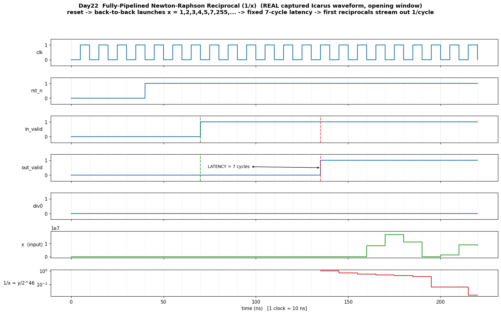

# Day 22 — Fully-Pipelined Newton–Raphson Fixed-Point Reciprocal Unit (`1 / x`)

A hardware **reciprocal engine** — the GPU **Special-Function-Unit** primitive
(`MUFU.RCP` / `__frcp_rn`) and the workhorse of **ultra-low-latency HFT / FPGA**
datapaths. In a tick-to-trade path, *division is the expensive operation*: VWAP,
price ratios, order-book imbalance, per-share normalisation, and implied-vol
Newton iterations all need `1/x`. A general iterative divider has
**data-dependent latency** and kills determinism. This block turns division into
a **fixed-latency, one-result-per-cycle** stream of shifts, adds and four DSP
multiplies — the reciprocal of a *different* operand completes on *every* clock,
and every operand takes *exactly the same* 7 cycles.

---

## Why this matters (architecture)

`1/x` has no closed-form combinational form, so real machines compute it by
**range reduction + a seeded quadratic iteration**:

1. **Normalise** the operand to a mantissa `m ∈ [1, 2)` plus a power-of-two
   exponent (a leading-zero-count barrel shift). The reciprocal problem is now
   confined to a single, well-conditioned octave.
2. **Seed** `y₀ ≈ 1/m` from a small ROM (≥ 8 good bits).
3. **Refine** with the Newton–Raphson recurrence for `f(y) = 1/y − m`:

   ```
   y ← y · (2 − m·y)
   ```

   Each step **squares the relative error**, so the number of correct bits
   *doubles* every iteration (8 → 16 → 32). **Two** iterations give a
   ≥ 24-bit-accurate reciprocal.
4. **Denormalise** — shift the mantissa reciprocal back by the exponent to form
   the Q-scaled integer result `Y ≈ round(2^SCALE / x)`.

This is *exactly* how a GPU SFU and an FPGA "fast reciprocal" core are built.
Every one of the four steps is a **single registered pipeline stage**, so the
unit is **fully pipelined**: latency is a fixed `LATENCY = 7` cycles independent
of the operand, and throughput is **1 reciprocal / cycle**. Fixed, operand-
independent latency is the property HFT pipelines are engineered around.

---

## Features

- **Range-reduced Newton–Raphson** reciprocal — LZC normalise → 256-entry seed
  ROM → 2× NR refine → denormalise.
- **Fully pipelined**, 7-cycle fixed latency, **1 result/cycle** throughput;
  many operands in flight simultaneously.
- **Data-independent latency** — identical timing for every operand (HFT / real-
  time friendly; no early-out, no stall).
- **Multiplier-based by nature** (reciprocal *is* a multiply problem): four
  `MW×MW` products map to FPGA **DSP48 / DSP58** slices; the LZC + barrel shifts
  map to LUT fabric — a textbook DSP-block reciprocal.
- **≥ 24-bit accuracy** — measured worst case **26 correct bits** over 4000+
  random operands (well past the ~`W`-bit significance of the input).
- **Divide-by-zero flag** — `div0` asserted with the result and the output
  **saturates** to all-ones on `x == 0`.
- **Parameterised** input width `W`; clean, reset-safe, lint-friendly RTL.
- **Self-checking** against an **independent** integer golden `round(2^SCALE/x)`.

---

## Parameters

| Parameter | Default | Meaning |
|-----------|---------|---------|
| `W`       | `24`    | Input width — `x` is unsigned, `1 … 2^W − 1` |

Derived (localparams):

| Local | Value (W=24) | Meaning |
|-------|--------------|---------|
| `IF`    | `40` | Internal fractional bits (mantissa/`y` are Q1.40) |
| `LB`    | `8`  | Seed-ROM index bits (`NL = 256` entries) |
| `SCALE` | `2·(W−1) = 46` | Output scale: `Y ≈ round(2^SCALE / x)` |
| `OW`    | `SCALE+1 = 47` | Output width |
| `MW`    | `IF+1 = 41` | Mantissa width (1 integer + `IF` fraction bits) |

The output is a fixed-point reciprocal: `Y = round(2^46 / x)`, i.e. the real
value `1/x = Y / 2^46`. For `x = 1` → `Y = 2^46`; for `x = 2^24−1` → `Y ≈ 2^22`.

---

## Ports

| Port | Dir | Width | Description |
|------|-----|-------|-------------|
| `clk`       | in  | 1    | Clock |
| `rst_n`     | in  | 1    | Async assert / sync-safe active-low reset |
| `in_valid`  | in  | 1    | Launch a reciprocal this cycle |
| `x`         | in  | `W`  | Unsigned operand (`1 … 2^W−1`; `0` → `div0`) |
| `out_valid` | out | 1    | Result valid (asserts `LATENCY = 7` cycles after `in_valid`) |
| `div0`      | out | 1    | Divide-by-zero: set with `out_valid` when the operand was `0` |
| `y`         | out | `OW` | `Y = round(2^SCALE / x)` (saturates to all-ones on `div0`) |

---

## Datapath / block diagram

```
                 x[W-1:0]                     in_valid ─────────────────────────┐
                    │                                                           │ (valid + div0
                    ▼                                                           │  travel down
        ┌───────────────────────┐   S1 : NORMALISE                             │  the pipe in
        │  LZC  →  shift s        │   m = x<<s  ∈ [1,2)                          │  lock-step)
        │  m = x<<s (mantissa)    │   idx = top LB fraction bits                 │
        │  sh = s+(W-1)-IF        │   sh = denorm shift                          │
        └───────────┬─────────────┘                                             │
                    ▼                                                           │
        ┌───────────────────────┐   S2 : SEED                                   │
        │  y ← seed_ROM[idx]      │   y0 ≈ 1/m   (≥ 8 good bits)                 │
        └───────────┬─────────────┘                                             │
                    ▼                                                           │
        ┌───────────────────────┐   S3 : NR-1a   t = 2 − m·y     (DSP mult #1)  │
        ├───────────────────────┤   S4 : NR-1b   y = y·t         (DSP mult #2)  │
        │   y ← y·(2 − m·y)       │      8 → 16 correct bits                     │
        └───────────┬─────────────┘                                             │
                    ▼                                                           │
        ┌───────────────────────┐   S5 : NR-2a   t = 2 − m·y     (DSP mult #3)  │
        ├───────────────────────┤   S6 : NR-2b   y = y·t         (DSP mult #4)  │
        │   y ← y·(2 − m·y)       │      16 → 32 correct bits                    │
        └───────────┬─────────────┘                                             │
                    ▼                                                           ▼
        ┌───────────────────────┐   S7 : DENORMALISE            out_valid, div0
        │  Y = y  <<  sh  (sh≥0)  │   round-shift by exponent
        │      or (y⊕round)>>|sh| │   Y ≈ round(2^SCALE / x)
        └───────────┬─────────────┘
                    ▼
                 y[OW-1:0]        ← one result every cycle, 7 cycles after launch
```

Registered pipeline depth = **7** → `LATENCY = 7`, throughput = **1 / cycle**.

---

## How it works (step by step)

- **Normalise (S1).** A leading-zero scan finds the shift `s` that places `x`'s
  MSB at bit `W−1`, producing the `W`-bit mantissa `M = x<<s` (always MSB-set,
  i.e. `m = M/2^{W-1} ∈ [1,2)`). The top `LB` fraction bits of `M` index the
  seed ROM; the exponent bookkeeping is folded into a single signed denorm shift
  `sh = s + (W−1) − IF`.
- **Seed (S2).** `seed[idx] ≈ (1/m)·2^{IF}` for `m` at the bin midpoint —
  a piecewise-constant reciprocal accurate to ~`LB` bits, enough to guarantee NR
  convergence within the octave.
- **Refine (S3–S6).** Two Newton–Raphson steps `y ← y·(2 − m·y)`, each a pair of
  `MW×MW` fixed-point multiplies (`m·y`, then `y·t`) with a `>>IF` rescale. NR
  for reciprocal is **self-correcting and quadratically convergent** — the seed's
  low bits are irrelevant; the iteration drives the error to `~2^{-32}`.
- **Denormalise (S7).** The mantissa reciprocal `y ∈ (0.5, 1]` is shifted back by
  the exponent. `sh ≥ 0` → left shift; `sh < 0` → **round-to-nearest** right
  shift (add half-ULP first). Result: `Y = round(2^SCALE / x)`. On `x == 0` the
  output saturates to all-ones and `div0` is raised.

Only the **add-vs-subtract-free** NR form is used (`2 − m·y` is a constant
subtract); there are no data-dependent branches — the sole data-dependent
elements are the normalise/denormalise barrel shifts, which are exactly the
hardware a reciprocal must have.

---

## Simulation timing



*__Real captured Icarus Verilog waveform__ (not a hand-drawn mock-up): the
opening window of the actual `make` run, parsed from `recip_nr_pipelined.vcd` by
`render_waveform.py`. After reset de-asserts, operands `x = 1, 2, 3, 4, 5, 7,
255, …` are launched back-to-back (one per cycle). The first result appears
exactly **7 cycles** later (green→red markers) and reciprocals then stream out
**one per cycle**. The bottom trace decodes the 47-bit output back to the real
value `1/x = y / 2^46` (log axis, shown only while `out_valid` is high): it
starts at `1/1 = 1.0` and steps down through `1/2, 1/3, …` as `x` grows — the
reciprocal, live. `div0` stays low here (the zero-probe result exits just past
this window).*

---

## Running it

```bash
cd Day22
make            # Icarus Verilog: iverilog + vvp  (default)
make verilator  # Verilator
make vcs        # Synopsys VCS
make questa     # Siemens Questa / ModelSim
make waveform   # regenerate docs/recip_nr_pipelined_waveform.png from the VCD
make clean
```

Expected tail of `make`:

```
Day22 Newton-Raphson reciprocal: checked 4013 results, 0 error(s)
worst-case accuracy: 36.0 correct bits (at x=1)  [need >= 20]
RESULT: *** PASS ***
```

*(Verified with Icarus Verilog 13.0. `make waveform` needs Python 3 + matplotlib:
`python3 -m pip install --user matplotlib`.)*

---

## What the testbench checks

`tb_recip_nr_pipelined.sv` is **self-checking** against an **independent** golden
model — the integer reference `round(2^SCALE / x)` computed with the simulator's
native 128-bit division, which shares **no logic** with the NR datapath:

- **Directed corners** — `x = 1, 2, 3, 4, 5, 7, 255, 256, 2¹², 2²³, 2²⁴−1,
  0xAAAAAA`: powers of two (exact-shift cases), the largest and smallest
  reciprocals, and alternating-bit patterns.
- **Divide-by-zero probe** — `x = 0` must raise `div0` **and** saturate `y` to
  all-ones.
- **4000 randomised operands**, streamed **back-to-back** (a new launch every
  cycle) so up to 7 reciprocals are in flight at once — this exercises the
  pipeline registers and the valid/`div0` shift-through, not just a drained core.
- **Accuracy budget** — because a reciprocal significand carries only ~`W`
  meaningful bits, each result is checked to a relative tolerance of `2^{-20}`
  (≥ 20 correct bits) plus 1-ULP slack. The DUT beats it comfortably — the TB
  reports the measured **worst-case correct-bit count (~26 bits)**.
- **Scoreboard + accounting** — a FIFO matches every result to the operand
  launched `LATENCY` cycles earlier; the run fails if any launched operand never
  produces a result, if a result arrives with an empty scoreboard, or on a
  global **timeout** (guards against a stalled pipeline).

It prints `RESULT: *** PASS ***` only if **every** checked result is within
budget **and** exactly the expected number of results came back.
