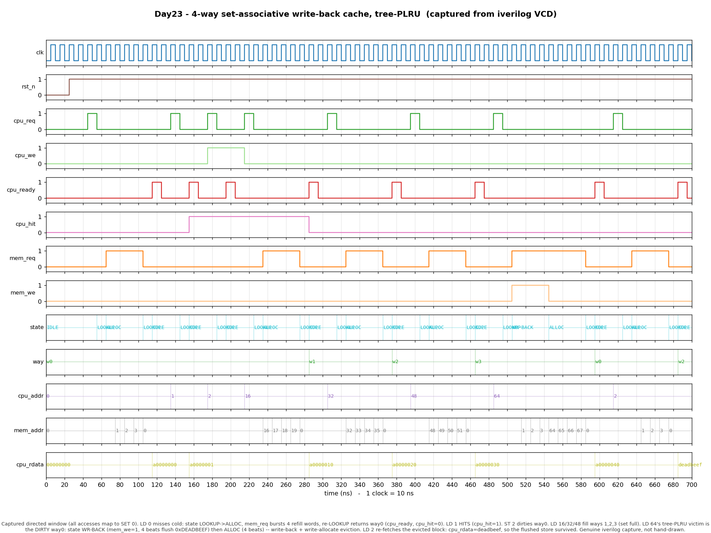

# Day 23 — N-Way Set-Associative Write-Back Cache with Tree-PLRU Replacement

A parameterized **N-way set-associative**, **write-back**, **write-allocate**
data cache whose replacement policy is a per-set **tree-based pseudo-LRU
(tree-PLRU)** — the associative memory-hierarchy block that Day 7's
direct-mapped cache grows into, using the replacement policy that real CPUs
actually ship.

---

## Overview

A cache exploits **locality** to hide main-memory latency. Day 7 built the
simplest cache: **direct-mapped**, where each address has exactly one home
line, so a "hot" pair of addresses that collide on the same line thrash each
other forever (conflict misses) with no way out.

**Set-associativity** fixes this. An address still maps to one **set**, but
that set holds `WAYS` lines, and the block may live in *any* of them. A lookup
compares the tag against **all ways in parallel** (an associative search). Now
up to `WAYS` colliding addresses coexist. The cost: on a miss to a full set the
hardware must **choose a victim** to evict — that choice is the **replacement
policy**, and it is the whole reason this design exists.

### Why tree-PLRU matters

True-LRU (Day 10's TLB) is optimal-ish but expensive: tracking the exact age
order of `WAYS` lines needs an `N×N` reference matrix (`O(WAYS²)` bits/set).
Real L1/L2 caches (Intel, ARM) instead use **tree-PLRU**: a balanced binary
tree of `WAYS-1` bits per set that approximates LRU at a fraction of the cost.
It is the canonical "good enough, cheap enough" hardware replacement policy, and
implementing it — victim descent and the touch/promote update — is a rite of
passage for memory-hierarchy RTL.

Combined with **write-back** (a store only marks a line dirty; the block is
flushed lazily on eviction) and **write-allocate** (a store miss fetches the
block first, then writes), this is the exact cache organization found in the
data path of nearly every modern core.

---

## Features

- **Parameterized geometry** — `WAYS`, `NUM_SETS`, `BLOCK_WORDS`, `WORD_BITS`,
  `ADDR_BITS` (each associativity/set count a power of two).
- **Associative lookup** — parallel tag compare across all ways of the set.
- **Tree-PLRU replacement** — `WAYS-1` node bits/set; one `log₂(WAYS)`-step tree
  walk does either *victim descent* or *touch/promote-to-MRU*.
- **Invalid-way-first fill** — cold misses fill an empty way before any valid
  way is evicted.
- **Write-back + write-allocate** — dirty-bit tracking, lazy eviction flush,
  store-miss block fetch.
- **Miss-handling FSM** — `IDLE → LOOKUP → {WRITEBACK} → ALLOCATE → LOOKUP`,
  one main-memory word per burst beat.
- **CPU ready handshake** and a **word-burst main-memory port** tolerant of a
  stalling memory (`mem_ready`).
- Synthesizable, reset-safe, lint-friendly; **no data-dependent variable
  bit-selects** on the PLRU tree (fixed-node walk).

---

## Parameters

| Parameter     | Default | Meaning                                   |
|---------------|---------|-------------------------------------------|
| `ADDR_BITS`   | 12      | CPU / main-memory **word** address width  |
| `WORD_BITS`   | 32      | Data word width                           |
| `BLOCK_WORDS` | 4       | Words per cache line (≥ 2, power of 2)     |
| `NUM_SETS`    | 4       | Number of sets (power of 2)               |
| `WAYS`        | 4       | Associativity (≥ 2, power of 2)           |

Derived: `OFFSET_BITS = log₂(BLOCK_WORDS)`, `INDEX_BITS = log₂(NUM_SETS)`,
`WAY_BITS = log₂(WAYS)`, `TAG_BITS = ADDR_BITS − INDEX_BITS − OFFSET_BITS`.

## Ports

| Port        | Dir | Width       | Description                                    |
|-------------|-----|-------------|------------------------------------------------|
| `clk`       | in  | 1           | Clock                                          |
| `rst_n`     | in  | 1           | Active-low synchronous-safe reset              |
| `cpu_req`   | in  | 1           | Pulse: start an access when the FSM is `IDLE`  |
| `cpu_we`    | in  | 1           | 1 = store, 0 = load                            |
| `cpu_addr`  | in  | `ADDR_BITS` | Word address                                   |
| `cpu_wdata` | in  | `WORD_BITS` | Store data                                     |
| `cpu_rdata` | out | `WORD_BITS` | Load data (valid with `cpu_ready`)             |
| `cpu_ready` | out | 1           | 1-cycle pulse: access complete                 |
| `cpu_hit`   | out | 1           | With `cpu_ready`: 1 = hit, 0 = miss-serviced   |
| `mem_req`   | out | 1           | Request a memory beat                          |
| `mem_we`    | out | 1           | 1 = write-back beat, 0 = refill beat           |
| `mem_addr`  | out | `ADDR_BITS` | Word address of this beat                      |
| `mem_wdata` | out | `WORD_BITS` | Write-back data (`mem_we=1`)                   |
| `mem_rdata` | in  | `WORD_BITS` | Refill data (`mem_we=0`)                       |
| `mem_ready` | in  | 1           | Beat accepted / refill data valid              |
| `dbg_state` | out | 2           | FSM state (0 IDLE, 1 LOOKUP, 2 WR-BACK, 3 ALLOC) |
| `dbg_way`   | out | 8           | Way hit or allocated on this access            |

---

## Address split

A word address is decoded as:

```
        MSB                                         LSB
       +--------------------+-----------+-------------+
       |        tag         |   index   |   offset    |
       +--------------------+-----------+-------------+
        TAG_BITS             INDEX_BITS   OFFSET_BITS

   offset = addr[OFFSET_BITS-1 : 0]              word within a block
   index  = addr[OFFSET_BITS +: INDEX_BITS]      which SET
   tag    = addr[OFFSET_BITS+INDEX_BITS +: TAG]  identity within the set
```

## Block / datapath diagram

```
                                cpu_addr
             +----------+----------+-------------------------+
             |   tag    |  index   |  offset                 |
             +----+-----+----+-----+-----+-------------------+
                  |          | select SET |
                  |          v            |
                  |   +--------------- SET[index] ---------------+
                  |   |  way0    way1    way2    way3            |
                  |   | [V|D|tag|data] ......... [V|D|tag|data]  |
                  |   +---+------+-------+-------+---------------+
                  |       |      |       |       |
                  v       v      v       v       v
              +---------- parallel TAG COMPARE (all ways) --------+
              |   hit = OR(valid[w] & tag[w]==tag)                |
              +----+------------------------------+---------------+
                   | hit                          | miss
                   v                              v
            read/write word              victim = invalid-way-first
            in hit way;                  else  tree-PLRU descent
            PLRU touch(hit_way)                 |
                   |                            v
                   |                 victim dirty? --yes--> WRITEBACK
                   |                     | no                 (flush block,
                   v                     v                     mem_we=1)
                cpu_ready            ALLOCATE  <----------------+
                cpu_hit=1          (refill block, mem_we=0)
                                        |
                                        v
                                  install tag, valid=1, dirty=0
                                  re-LOOKUP -> hit -> cpu_ready, cpu_hit=0


   tree-PLRU per set (WAYS=4, nodes n0 n1 n2):

                   n0                  VICTIM : walk n0->leaf,
                  /  \                          follow node bit (0=L,1=R)
                n1    n2               TOUCH w : walk toward w, set each
               / \    / \                        node on the path to point
             w0  w1  w2  w3                       AWAY from w  (=> MRU)
```

---

## How it works

### Lookup (associative, combinational)
For the selected `set = index`, all ways are tag-compared in parallel. A
`valid & tag-match` on any way is a **hit** and yields `hit_way`.

### Hit
The access completes on `hit_way`: a load drives `cpu_rdata`, a store writes the
word and sets `dirty`. The set's PLRU tree is **touched** toward `hit_way`
(promote to most-recently-used). `cpu_ready` pulses with `cpu_hit = 1`.

### Miss — victim selection
1. **Invalid-way-first**: if the set has an empty way, fill the lowest such way
   (a cold/compulsory miss — nothing is evicted).
2. **Tree-PLRU**: otherwise descend the tree from the root, following each
   node bit, to reach the pseudo-LRU leaf way.

### Miss — service (FSM)
- If the victim is **valid and dirty**, enter **`WRITEBACK`** and burst the
  victim's `BLOCK_WORDS` words to memory (`mem_we=1`) at the victim's block
  base address.
- Enter **`ALLOCATE`** and burst-**read** the requested block into the victim
  way (`mem_we=0`). On the last beat, install the new tag, set `valid=1`,
  clear `dirty`.
- Re-enter **`LOOKUP`**, which now hits and completes the original access
  (`cpu_hit = 0`, because this access took the miss path). Write-allocate falls
  out naturally: a store that missed writes its word on this final hitting
  lookup.

### tree-PLRU update
`plru_touch` walks root→leaf toward the accessed way and sets **every node on
that path to point away** from the way just used — cheaply keeping the tree's
victim pointer aimed at pseudo-least-recently-used lines. `plru_victim` walks
the same tree following the bits to read that pointer back out.

---

## Simulation timing



*Genuine waveform captured from a real **Icarus Verilog** run — the testbench
dumped `sa_cache.vcd` and `render_waveform.py` parsed that VCD with matplotlib.
This is **not** a hand-drawn diagram; every state, way, address, and data value
shown was read back out of the simulator's dump.*

The directed window (all accesses map to **set 0**) shows, in order:

- **reset**, then **LD 0** — a compulsory miss: `state` goes `LOOKUP → ALLOC`,
  `mem_req` bursts 4 refill words (`mem_addr` 0,1,2,3), and a re-`LOOKUP`
  returns way **w0** (`cpu_ready`, `cpu_hit = 0`).
- **LD 1** — a read **HIT** in the same block (`cpu_hit = 1`, no memory
  traffic), `cpu_rdata = a0000001`.
- **ST 2** — a store **HIT** that dirties way 0 (`cpu_we = 1`).
- **LD 16 / LD 32 / LD 48** — three more compulsory misses fill ways
  **w1, w2, w3**; the set is now full and the PLRU order is established.
- **LD 64** — a full-set miss whose tree-PLRU victim is the **dirty** way 0:
  `state` enters **`WR-BACK`** (`mem_we = 1`, 4 beats flushing `0xDEADBEEF`
  back to block base 0–3) then **`ALLOC`** (4 beats, 64–67) — a textbook
  write-back + write-allocate eviction.
- **LD 2** — re-fetches the just-evicted tag; `cpu_rdata = deadbeef`, proving
  the flushed store survived the round-trip through main memory.

---

## Run

```bash
make            # Icarus Verilog (default): iverilog + vvp
make verilator  # Verilator
make vcs        # Synopsys VCS
make questa     # Siemens Questa/ModelSim
make waveform   # regenerate docs/sa_cache_waveform.png from the VCD
make clean
```

A passing run prints:

```
RESULT: *** PASS ***
```

> Verified here with Icarus Verilog (`iverilog -g2012` + `vvp`): **4008 checks,
> 0 errors**. (Icarus prints a few `sorry: constant selects ... sensitive to
> all bits` / `unique case` notes — these are Icarus feature-support warnings,
> not design errors; the simulation runs and self-checks correctly.)

---

## What the testbench checks

`tb_sa_cache.sv` runs the DUT in lockstep against an **independent behavioral
reference model** — a second implementation of the same cache (associative
search, invalid-way-first + tree-PLRU victim, write-allocate + write-back to a
private backing memory). Both start from an identical main memory and see the
identical op stream, so on **every** access the testbench compares:

- **load data** — `cpu_rdata` vs the reference model's predicted read, and
- **hit/miss** — `cpu_hit` vs the reference model's predicted hit,

and additionally asserts a **continuous structural invariant**: after each
access, every way's `valid` / `tag` / `dirty` in the DUT must match the
reference model. Any divergence in placement, replacement victim, dirty
write-back, or write-allocate ordering trips immediately.

Stimulus:

- a **directed window** (the sequence drawn in the waveform above: cold fills,
  a hit, a dirtying store, a full-set dirty eviction with write-back, and a
  re-read proving the flushed store survived), and
- **4000 randomized** load/store ops over a compact address range that keeps
  every set and way under constant replacement pressure — repeatedly exercising
  PLRU victim selection, dirty write-backs, and refills.

A simulation **timeout** guards against a hung handshake, and the run dumps
`sa_cache.vcd` for waveform inspection.
