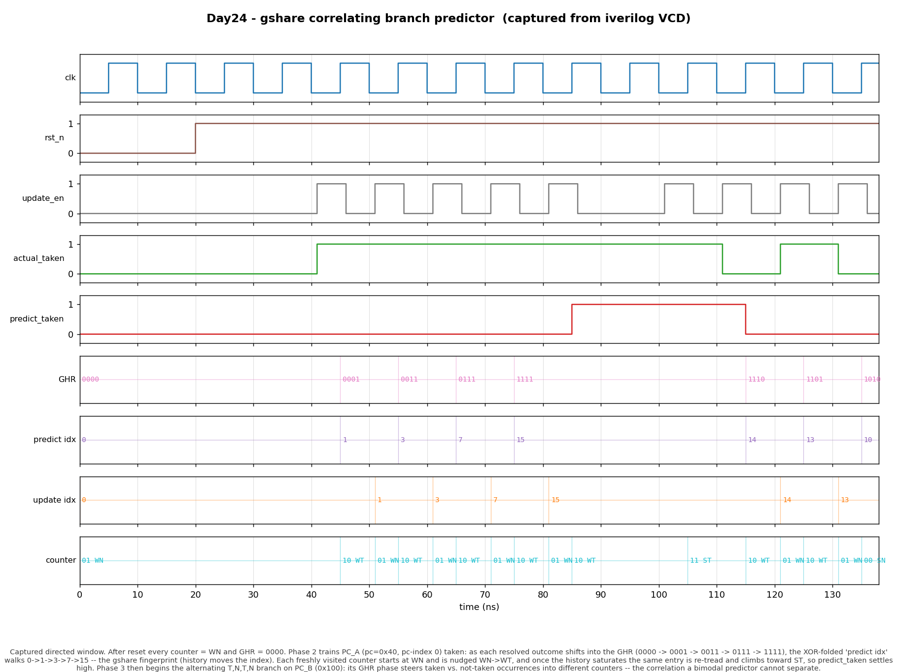

# Day 24 — gshare Correlating Branch Predictor

A dynamic branch predictor that XOR-folds a **Global History Register (GHR)**
with the branch PC to index a **Pattern History Table (PHT)** of 2-bit
saturating counters. This is the classic **gshare** scheme (McFarling, 1993) —
the design that showed a *single* PHT indexed by `PC ⊕ history` beats both a
plain per-PC bimodal table (Day 6) and a naive per-PC/global split, at almost
no extra hardware.

## Why it matters

A bimodal predictor (Day 6) indexes the PHT by PC alone, so it learns one
average behavior per static branch. That is helpless against **correlated**
branches — branches whose outcome depends on how *recent* branches went:

```c
if (x > 0)  a();          // branch 1
if (x > 0)  b();          // branch 2 — always agrees with branch 1
```

or the textbook alternating loop that goes `T, N, T, N, …`. A per-PC counter
just thrashes around 50 %.

gshare's insight: mix the **global history** — a shift register of the last
*k* branch outcomes — into the index. Two dynamic instances of the same static
branch that occur under *different* histories now land in *different* PHT
counters, so each learns its own answer. The XOR fold (rather than
concatenation) lets a small table cover the `PC × history` space densely
instead of wasting entries. The result is a large accuracy jump for a table the
same size as bimodal — which is why gshare became the baseline that tournament
and TAGE predictors are still measured against.

## Features

- Parameterized PHT size (`INDEX_BITS`), history length (`GHIST_BITS`), and
  cold-start state (`RESET_STATE`).
- Independent **predict** (fetch-stage, combinational) and **update**
  (resolve-stage, synchronous) ports.
- Correct history alignment via a `ghist_update` **snapshot** on the update
  port — the branch-history checkpoint a real pipeline carries alongside each
  in-flight branch, so the counter that gets trained is exactly the one that
  produced the prediction.
- Textbook 4-state saturating counter per PHT entry.
- Speculation-free GHR: the resolved outcome shifts in at retire, giving a
  deterministic, self-consistent history.
- Reset-safe, lint-clean, synthesizable RTL. Debug taps expose the GHR, both
  indices, and the pre-update counter for observation and verification.

## The gshare index

```
        pc_predict[INDEX_BITS+1:2]        Global History Register (GHR)
             (word-aligned PC bits)        ┌───┬───┬───┬───┐
                     │                      │b3 │b2 │b1 │b0 │  ← newest at b0
                     │                      └───┴───┴───┴───┘
                     ▼                              │
                 ┌───────┐                          │
                 │  XOR  │◄─────────────────────────┘
                 └───┬───┘
                     │  index
                     ▼
         ┌───────────────────────────┐
         │  PHT: 2**INDEX_BITS ×      │
         │       2-bit counters       │
         └───────────┬───────────────┘
                     │ pht[index][1]  (MSB)
                     ▼
                predict_taken
```

Each PHT entry is a 2-bit up/down saturating counter (`SN → WN → WT → ST`),
identical to Day 6; the MSB is the prediction. gshare changes only **how the
entry is selected**: `index = PC_bits ⊕ history` instead of `PC_bits`.

## Parameters

| Parameter     | Default  | Description                                                    |
|---------------|----------|----------------------------------------------------------------|
| `XLEN`        | `32`     | Program-counter width.                                          |
| `INDEX_BITS`  | `4`      | PHT holds `2**INDEX_BITS` counters (16 by default).            |
| `GHIST_BITS`  | `4`      | Global-history register width (last 4 outcomes by default).    |
| `RESET_STATE` | `2'b01`  | Cold-start counter value (weakly not-taken).                   |

The fold zero-extends or truncates the history to `INDEX_BITS` before the XOR,
so `GHIST_BITS` and `INDEX_BITS` may be sized independently.

## Ports

| Port                 | Dir | Width          | Description                                                        |
|----------------------|-----|----------------|--------------------------------------------------------------------|
| `clk`                | in  | 1              | Clock.                                                             |
| `rst_n`              | in  | 1              | Active-low async reset; loads every counter with `RESET_STATE`, clears GHR. |
| `pc_predict`         | in  | `XLEN`         | PC to predict for (fetch stage).                                  |
| `predict_taken`      | out | 1              | Combinational prediction (MSB of the folded-index counter).       |
| `update_en`          | in  | 1              | Assert to train a counter and advance the GHR this cycle.         |
| `pc_update`          | in  | `XLEN`         | PC of the branch being resolved.                                  |
| `ghist_update`       | in  | `GHIST_BITS`   | GHR snapshot captured when that branch was fetched.               |
| `actual_taken`       | in  | 1              | Resolved outcome used to train the counter and shift into the GHR.|
| `dbg_ghr`            | out | `GHIST_BITS`   | Current GHR (snapshot this at fetch, carry it to resolve).        |
| `dbg_predict_index`  | out | `INDEX_BITS`   | Folded index selected by `pc_predict`.                            |
| `dbg_update_index`   | out | `INDEX_BITS`   | Folded index selected by `pc_update` ⊕ `ghist_update`.           |
| `dbg_update_counter` | out | 2              | Counter value at the update index *before* the update.            |

## Block diagram

```
                          dbg_ghr (snapshot at fetch) ─────────────┐
                                                                   │ carried with
   pc_predict ─┐                                                   │ the in-flight
               ▼                                                   ▼ branch
        ┌────[⊕ ghr]────┐                                  ┌──[⊕ ghist_update]──┐
        │  predict idx  │                                  │    update idx      │
        └──────┬────────┘                                  └─────────┬──────────┘
               │                pattern history table                │
               ▼          ┌───────────────────────────────┐         ▼
        pht[pidx][1] ◄────┤ 2**INDEX_BITS × 2-bit counters ├───► pht[uidx] = cur
               │          └───────────────────────────────┘         │
               ▼                                                     ▼
         predict_taken                                        ┌─────────────┐
                                                              │ saturating  │◄─ actual_taken
                                                              │  next-state │
                                                              └──────┬──────┘
                                          update_en ──► pht[uidx] <= nxt   (posedge)
                                          update_en ──► ghr <= {ghr[k-2:0], actual_taken}
```

## Simulation timing



*Real waveform captured from an Icarus Verilog run* (`make icarus` dumps
`gshare_predictor.vcd`; `make waveform` parses that VCD and plots it — nothing
in this image is hand-drawn). The window shows reset followed by the directed
phases:

- After reset every counter is `WN` (`01`) and the **GHR is `0000`**, so
  `predict_taken` is low.
- **Phase 2 (gshare fingerprint).** `PC_A` (`0x40`, PC-index 0) is trained
  `taken`. As each resolved outcome shifts into the GHR
  (`0000 → 0001 → 0011 → 0111 → 1111`), the XOR-folded **`predict idx` walks
  `0 → 1 → 3 → 7 → 15`** — history physically moves the index, the property a
  bimodal table does not have. Each freshly visited counter starts at `WN` and
  is nudged `WN → WT`; once the history saturates, the same entry is re-tread
  and climbs toward `ST`, so `predict_taken` settles high.
- **Phase 3 (correlation).** The alternating `T, N, T, N` branch on `PC_B`
  (`0x100`) begins; its GHR phase steers the "next-is-taken" and
  "next-is-not-taken" occurrences into *different* counters, so both learn
  cleanly — the pattern a bimodal predictor cannot separate.

## How it works

1. **Predict (combinational).** `index = pc_predict[INDEX_BITS+1:2] ⊕ ghr`
   selects a PHT entry; its MSB is driven out as `predict_taken`. Zero-latency
   so it fits the fetch stage. The current GHR (`dbg_ghr`) is snapshotted and
   carried with the branch down the pipeline.
2. **Update (synchronous).** On `update_en`, the counter at
   `pc_update ⊕ ghist_update` moves one saturating step toward `actual_taken`,
   and the resolved outcome shifts into the GHR
   (`ghr ← {ghr[k-2:0], actual_taken}`) — both committed on the next rising
   edge. Training with the fetch-time `ghist_update` snapshot (not the current
   GHR) is what keeps the trained entry aligned with the one that was predicted.
3. **Reset.** Async `rst_n` reloads every counter with `RESET_STATE` and clears
   the GHR, giving a deterministic cold start.

## Run it

```bash
make            # Icarus Verilog (default)
make verilator  # Verilator
make vcs        # Synopsys VCS
make questa     # Siemens Questa/ModelSim
make waveform   # regenerate docs/gshare_predictor_waveform.png from the VCD
make clean
```

Expected output:

```
RESULT: *** PASS *** (all predictions matched golden model, 4000 random steps)
```

## What the testbench checks

`tb_gshare_predictor.sv` runs an **independent behavioral golden model** (a
plain array of 2-bit counters plus a global-history shift register, folded with
the same rule) in lockstep with the DUT and cross-checks:

- **Cold state** — every counter reads `WN` and the GHR is `0000`, so the first
  prediction is not-taken.
- **gshare fingerprint** — during PC_A's taken run, the predict index, GHR, and
  pre-update counter are checked at every step as the history fills and moves
  the folded index `0 → 1 → 3 → 7 → 15`.
- **History-stable prediction** — after warm-up, PC_A predicts taken.
- **Correlation** — a full alternating `T, N, T, N` period on a second branch;
  every prediction is compared against the golden model (which the random phase
  below independently validates).
- **Index & GHR agreement** — `dbg_predict_index`, `dbg_update_index`, and
  `dbg_ghr` are checked against the golden model on every branch.
- **Randomized stress** — 4000 random `(pc, outcome)` branches; the DUT and
  golden model must agree on prediction, both indices, the pre-update counter,
  and the GHR at every step (20 148 total assertions).

A global timeout watchdog fails the run if it ever hangs. `RESULT: *** PASS
***` prints only when every check passed.
