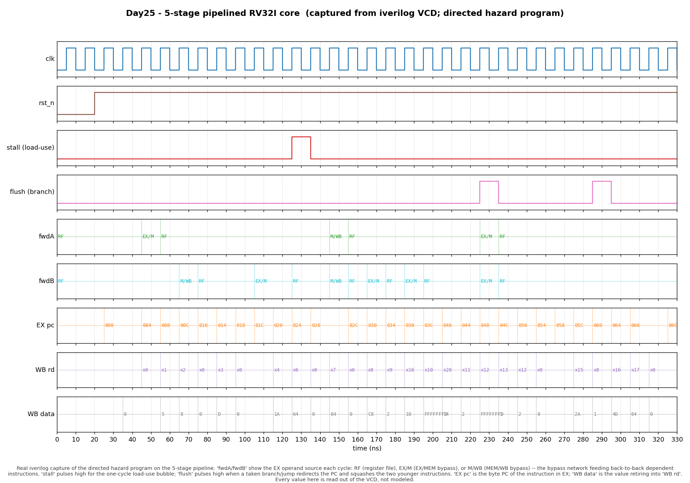

# Day 25 — Classic 5-Stage Pipelined RV32I Core (Forwarding + Hazard Stall + Branch Flush)

A synthesizable **5-stage pipelined RISC-V (RV32I) core** — the pipelined
sibling of the Day 5 single-cycle core. Same integer datapath, but sliced into
the canonical **IF / ID / EX / MEM / WB** stages so that (ideally) one
instruction retires every cycle. All the interesting computer architecture is
in what makes that *correct* when instructions in flight depend on one another:
a **data-forwarding (bypass) network**, a **load-use hazard-detection stall**,
and **EX-stage branch resolution with a control-hazard flush**.

Reuses the Day 1 `alu` module unchanged.

---

## Why this matters

Pipelining is the single most important idea in mainstream CPU
microarchitecture: overlap the execution of consecutive instructions so the
processor works on five at once. But overlap creates **hazards** — the reason a
naive pipeline computes the *wrong* answer:

- **Data hazards (RAW).** `add x2,x1,x0` immediately after `add x1,...` needs
  `x1` before the producer has written it back. Without help, the consumer
  would read a stale register.
- **Load-use hazard.** A load's data isn't ready until the end of MEM, one
  cycle too late for an immediately dependent instruction — the one case
  forwarding alone cannot fix.
- **Control hazards.** By the time a branch is resolved, the pipeline has
  already fetched instructions after it that may be wrong-path.

This design implements the textbook (Patterson & Hennessy) solutions to all
three and *proves* them correct: the pipelined machine is checked, cycle by
cycle, to reach the exact same architectural state as a dependency-free
sequential reference.

---

## The five stages

```
        IF            ID              EX               MEM            WB
   +----------+  +-----------+  +--------------+  +-----------+  +-----------+
   | PC       |  | decode    |  | forward mux  |  | data mem  |  | wb mux    |
   | imem read|->| regfile RD |->| ALU / branch |->| load/store|->| regfile WR|
   |          |  | imm gen    |  | resolve      |  |           |  |(write-1st)|
   +----------+  +-----------+  +--------------+  +-----------+  +-----------+
        |  IF/ID  |     |  ID/EX  |      |  EX/MEM  |     |  MEM/WB  |
        +---------+     +---------+      +----------+     +----------+
                                 ^   ^        |                |
             forwarding:  fwdA/fwdB  +--------+  EX/MEM bypass  |
                                     +---------------------------+  MEM/WB bypass
                        hazard: load in EX + use in ID  => 1-cycle stall (bubble)
                        control: taken branch/jump in EX => flush IF/ID & ID/EX
```

### Data forwarding (bypass)

The forwarding unit watches the two downstream pipeline registers and, for each
EX-stage source operand, selects where the freshest value lives:

| `fwd` select | Source | When |
|--------------|--------|------|
| `2'b00` (RF)   | register file read | no in-flight producer (or distance ≥ 3, handled by write-first RF) |
| `2'b10` (EX/M) | EX/MEM pipeline register | producer is 1 instruction ahead (distance-1 RAW) |
| `2'b01` (M/WB) | MEM/WB pipeline register | producer is 2 instructions ahead (distance-2 RAW) |

EX/MEM (younger) takes priority over MEM/WB (older) so the *most recent*
producer wins. The register file is **write-first** — WB writes in the first
half of the cycle, ID reads in the second — which transparently resolves the
distance-3 hazard with no explicit bypass wire. The same forwarded rs2 value is
what a store sends to memory, so store data is bypassed too.

### Load-use hazard stall

Forwarding can route a value backward in the pipeline but not backward in time.
A load produces its result at the **end of MEM**, which is exactly when a
distance-1 dependent instruction needs it in **EX** — one cycle too late. The
hazard-detection unit spots this in ID (`ID/EX` is a load whose `rd` is a source
of the instruction in ID) and inserts a single **bubble**: freeze the PC and
IF/ID, and squash ID/EX to a NOP. One cycle later the load has advanced to
MEM/WB and forwards normally.

### Control hazard flush

Branches and jumps are resolved in **EX** (using forwarded operands, so a branch
can compare a value produced by the immediately preceding instruction). On a
taken branch or any jump the two younger instructions already fetched (in IF/ID
and ID/EX) are flushed to bubbles and the PC is redirected — a 2-cycle branch
penalty. `JALR` targets `(rs1+imm) & ~1`; `JAL`/branches target `pc+imm`; the
link value `pc+4` is written to `rd` for jumps.

---

## Parameters

| Parameter | Default | Meaning |
|-----------|---------|---------|
| `IMEM_WORDS` | `256` | instruction ROM depth (32-bit words) |
| `DMEM_BYTES` | `4096` | data memory depth (bytes, byte-addressable) |

## Ports

| Port | Dir | Width | Meaning |
|------|-----|-------|---------|
| `clk` | in | 1 | clock |
| `rst_n` | in | 1 | active-low **synchronous** reset |
| `dbg_pc_if/id/ex/mem/wb` | out | 32 | PC resident in each stage (observation) |
| `dbg_stall` | out | 1 | load-use bubble inserted this cycle |
| `dbg_flush` | out | 1 | branch/jump redirect taken this cycle |
| `dbg_fwd_a` / `dbg_fwd_b` | out | 2 | EX operand forwarding select (see table) |
| `dbg_wb_we` | out | 1 | a result retires into the register file |
| `dbg_wb_rd` | out | 5 | destination register at WB |
| `dbg_wb_data` | out | 32 | value written back |

The internal `rom`, `xregs`, and `dmem` arrays are exposed for hierarchical
backdoor-load / final-state comparison from the testbench.

## Supported instructions

`LUI`, `AUIPC`, `JAL`, `JALR`, `BEQ/BNE/BLT/BGE/BLTU/BGEU`, the full OP / OP-IMM
integer ALU set (`ADD SUB SLL SLT SLTU XOR SRL SRA OR AND` and their `-I`
forms), and `LB/LH/LW/LBU/LHU` + `SB/SH/SW`. `x0` is hardwired to zero.

---

## Simulation timing



*Real Icarus Verilog capture (`make icarus` → `pipeline.vcd` → `make
waveform`) of the directed hazard program running on the pipeline — **not** a
hand-drawn diagram. Reading the traces: `EX pc` marches one instruction per
cycle (`000, 004, 008, …`); `fwdA`/`fwdB` show the EX operand source each cycle
(`RF` register file, `EX/M` EX/MEM bypass, `M/WB` MEM/WB bypass) — the bypass
network feeding back-to-back dependent instructions. `stall` pulses high once
(~125 ns) for the one-cycle **load-use bubble**; `flush` pulses high (~225 ns,
~285 ns) each time a taken branch/jump redirects the PC and squashes the two
younger instructions. `WB data` is the value retiring into `WB rd` — e.g.
`x2=8` (distance-1 forward of `x1+3`), `x4=1A`=26 (distance-3, via the
write-first register file), `x8=C8`=200 (result of the load-use pair), and
`x12=FFFFFFF9`=−7 (sign-extended `lh`). Every value shown is read straight out
of the VCD.*

---

## How it works (cycle walk-through of a load-use pair)

```
   sw   x6,0(x0)     # store 100 to mem[0]   (store data x6 is forwarded)
   lw   x7,0(x0)     # x7 = 100
   add  x8,x7,x7     # x8 = 200   <-- depends on the load one instruction back
```

| cycle | IF | ID | EX | MEM | WB | action |
|-------|----|----|----|-----|----|--------|
| n   | `add` | `lw` | `sw` | … | … | — |
| n+1 | `add` | `lw`→**stall** | *bubble* | `sw` | … | load-use detected: freeze IF/ID, squash ID/EX |
| n+2 | (next) | `add` | `lw` | *bubble* | `sw` | — |
| n+3 | … | (next) | `add` | `lw` | *bubble* | `add` in EX forwards `x7` from **MEM/WB** (`fwdA=fwdB=M/WB`) |

Without the stall, `add` would have reached EX while `lw` was still in MEM with
no data to forward. With it, the load lands in MEM/WB exactly in time.

---

## Run it

```bash
make            # Icarus: compile + simulate, prints the PASS line
make waveform   # regenerate docs/pipeline_waveform.png from pipeline.vcd
make clean
```

Other simulators: `make verilator`, `make vcs`, `make questa`.

Verified with Icarus Verilog (`iverilog -g2012`): **22 304 assertions, 0
mismatches — RESULT: \*\*\* PASS \*\*\***.

---

## What the testbench checks

The testbench is self-checking against an **independent sequential ISS** written
directly in `tb_pipeline_rv32i.sv`. That reference executes a program one
instruction at a time with **no pipeline** (hence no hazards) and produces the
golden final architectural state — all 32 registers and the data memory. The
same program is backdoor-loaded into the pipelined DUT, which is clocked until
it drains; its final register file and data memory are then compared against the
golden model. If forwarding, the load-use stall, or the branch flush were wrong,
the pipeline would diverge from the dependency-free reference and the mismatch
would be flagged.

Two stimulus sets:

1. **Directed hazard program** — deliberately hits every hazard class:
   distance-1 (EX/MEM) forward, distance-2 (MEM/WB) forward, distance-3
   (write-first register file), the load-use stall, store-data forwarding,
   byte/half memory ops, a taken branch (2-instruction flush) and a not-taken
   branch (fall-through), `JAL` link + `JALR` return, and forwarding *into the
   branch comparator*.
2. **Randomised straight-line programs** across 40 seeds — dense register reuse
   (a small register pool) to maximise back-to-back RAW dependencies, plus
   `sw`→`lw` and `lw`→use pairs to exercise the stall. Straight-line control
   flow guarantees termination and keeps the golden model trivially correct.

A global watchdog fails the run on a hang. The testbench prints the total
assertion count and `RESULT: *** PASS ***` only if every comparison holds.
