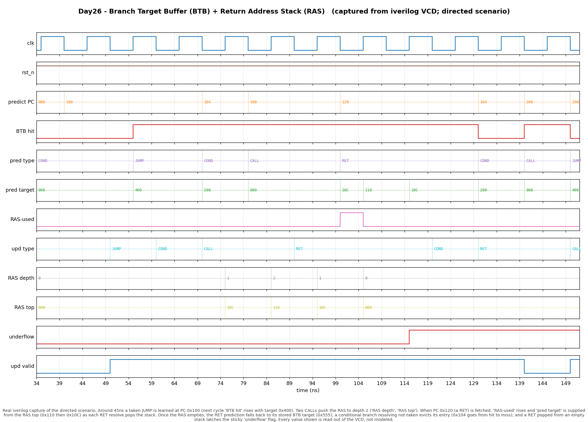

# Day 26 — Branch Target Buffer (BTB) + Return Address Stack (RAS)

A **fetch-stage target predictor**: the piece of the front end that answers
*"if this branch is taken, **where** does it jump?"* — in the same cycle the PC
is presented, before the instruction has even been decoded.

## Overview

A direction predictor (Day 6 bimodal, Day 24 gshare) tells the front end
*whether* a branch is taken. That alone is not enough to keep fetch running: to
redirect the PC speculatively you also need the **target**, and you need it
*now*, one or more cycles before decode extracts the branch offset and the ALU
computes `pc + imm`. Waiting that long would bubble the pipeline on every taken
branch.

The **Branch Target Buffer** solves this. It is a small, PC-indexed cache of
`{tag, target, type}` learned from branches as they resolve. On a fetch lookup
that hits, the BTB hands the front end a predicted target combinationally, so
the next fetch can be redirected the very next cycle.

**Returns** get special treatment. A subroutine like `printf` is called from
hundreds of sites, so its return address is different on every call — a single
cached BTB target is useless for it. Those are predicted instead by a **Return
Address Stack**: a small LIFO that a `call` pushes (link address `pc+4`) and a
`ret` pops. Because it mirrors the call/return nesting of real programs, the RAS
predicts return targets almost perfectly.

This is a classic **taken-cache BTB**: the mere *presence* of an entry for a PC
is the taken prediction (there is no separate direction bit here — in a real
front end you pair this with a Day 6 / Day 24 direction predictor). A
conditional branch that resolves **not-taken evicts** its entry, so the
predictor self-corrects.

### Why it matters

- **The front end can't wait for decode.** Target prediction at fetch is what
  lets a pipelined / superscalar machine sustain one taken branch per cycle
  instead of stalling. The BTB is in every high-performance core (it is the "B"
  half of the fetch predictor; the direction predictor is the other half).
- **Returns are the highest-accuracy prediction in the machine.** The RAS turns
  the otherwise-unpredictable `ret` into a near-100 %-accurate redirect by
  exploiting call/return LIFO discipline — a small structure with an outsized
  effect on branch MPKI.
- **Self-correction matters.** Evicting a not-taken conditional keeps the
  taken-cache honest without a separate hysteresis mechanism, which is exactly
  the kind of policy trade-off a microarchitect reasons about.

## Features

- Direct-mapped **BTB** (`BTB_SETS` entries): `valid`, `tag`, `target`, `type`,
  with parameterizable size / address width.
- Four branch **types** — conditional, unconditional jump, call, return —
  driving the RAS push/pop and the target source.
- **Return Address Stack** (`RAS_DEPTH` deep): call pushes `pc+4`, ret pops,
  with saturating **overflow** (deepest frames preserved) and **underflow**
  handling, both surfaced as sticky flags.
- Combinational **predict** port and synchronous **update** port that operate
  independently, so a predict for one PC and a resolve of another happen in the
  same cycle (as they do across a real pipeline's fetch and execute stages).
- **Self-correcting**: not-taken conditional branches evict their entry.
- Reset-safe, lint-clean RTL. No data-dependent bit-selects — every PC slice is
  a constant range; array indexing only.

## Parameters

| Parameter   | Default | Meaning                                             |
|-------------|---------|-----------------------------------------------------|
| `XLEN`      | 32      | Architectural address width                          |
| `BTB_SETS`  | 16      | Direct-mapped BTB entries (power of two)             |
| `RAS_DEPTH` | 8       | Return-address-stack depth (power of two)            |

Derived: `IDXW = clog2(BTB_SETS)` index bits, `TAGW = XLEN - IDXW - 2` tag bits
(the low 2 bits are the byte offset of a 4-byte instruction).

### Branch-type encoding

| `type` | Name   | Meaning                             | RAS effect     |
|--------|--------|-------------------------------------|----------------|
| `2'b00`| `COND` | Conditional branch (`beq`, `bne`, …)| none           |
| `2'b01`| `JUMP` | Unconditional direct jump (`j`)     | none           |
| `2'b10`| `CALL` | Call that links (`jal`/`jalr` rd=ra)| **push** `pc+4`|
| `2'b11`| `RET`  | Return (`jalr` ra)                  | **pop**        |

## Ports

| Signal        | Dir | Width  | Description                                       |
|---------------|-----|--------|---------------------------------------------------|
| `clk`         | in  | 1      | Clock                                             |
| `rst_n`       | in  | 1      | Async active-low reset                            |
| **Predict (combinational, fetch stage)** |||                          |
| `p_pc`        | in  | XLEN   | Fetch PC being looked up                          |
| `p_hit`       | out | 1      | BTB has a matching entry for `p_pc`               |
| `p_taken`     | out | 1      | Predicted taken (`== p_hit`, taken-cache)         |
| `p_type`      | out | 2      | Predicted branch type                             |
| `p_target`    | out | XLEN   | Predicted next PC when taken                      |
| `p_ras_used`  | out | 1      | Target came from the RAS (a return)               |
| **Update (synchronous, resolve stage)** |||                            |
| `u_valid`     | in  | 1      | A branch resolved this cycle                      |
| `u_pc`        | in  | XLEN   | Its PC                                            |
| `u_taken`     | in  | 1      | Did it actually go taken?                         |
| `u_type`      | in  | 2      | Its true type                                     |
| `u_target`    | in  | XLEN   | Its actual taken target                           |
| **Observability** |||                                                    |
| `ras_count`   | out | ⌈log₂(D+1)⌉ | Live RAS occupancy                          |
| `ras_top_o`   | out | XLEN   | Current RAS top (0 when empty)                    |
| `ovf_sticky`  | out | 1      | RAS overflow ever occurred                        |
| `unf_sticky`  | out | 1      | RAS underflow ever occurred                       |

## Block / datapath diagram

```
                         FETCH (combinational)                RESOLVE (clocked)
                                                                            
    p_pc ─┬─[IDXW+1:2]─ index ─┐                     u_pc ─┬─ index ─┐       
          └─[XLEN-1:IDXW+2] tag│                           └─ tag ───┤       
                               v                                     v       
                     ┌───────────────────────────────┐   update: on u_valid 
                     │      BTB  (direct-mapped)       │  ┌──────────────────┐
        index ──────>│  valid │ tag │ target │ type    │<─┤ if u_taken:      │
                     │   [0]  │ ... │  ...   │  ...     │  │   alloc entry    │
                     │   ...  │     │        │          │  │ elif COND & !tkn:│
                     │  [S-1] │     │        │          │  │   evict entry    │
                     └───┬─────────┬──────────┬─────────┘  └──────────────────┘
                hit = valid & tag==p_tag      │ type                          
                         │         │          │                               
                         │      target      == RET ? ───┐                     
                         │         │                    │  ┌─────────────────┐
                         │         │        ┌───────────▼──┤   RAS  (LIFO)    │
                         │         │        │  ras_top     │  push pc+4 (CALL)│
                         │         └─mux◄────┘  (if ne)    │  pop      (RET)  │
                         │            │                    │  sp,  ovf/unf    │
                         ▼            ▼                    └─────────────────┘
                      p_hit       p_target                                    
                      p_taken     p_ras_used                                  
```

The predict path is a single array read + tag compare + one mux (BTB target vs.
RAS top for returns). The update path allocates / evicts a BTB entry and
pushes / pops the RAS, all on the clock edge.

## How it works

**Predict (combinational).** `p_pc` is split into `index = p_pc[IDXW+1:2]` and
`tag = p_pc[XLEN-1:IDXW+2]`. `p_hit` asserts when the indexed entry is valid and
its tag matches. Because this is a taken-cache, `p_taken = p_hit`. The predicted
target is the stored `target`, **except** for a return with a non-empty RAS, in
which case it comes from the RAS top and `p_ras_used` asserts.

**Update (synchronous).** On a resolved branch (`u_valid`):
- If it went **taken**, its entry is (re)allocated: `valid=1`, tag, target, type
  written.
- If it is a **conditional** branch that went **not-taken** and currently
  occupies its set, the entry is **evicted** (`valid=0`) — the taken-cache
  self-correction.
- A **call** pushes its link address `u_pc+4` onto the RAS (dropping the push
  and latching `ovf_sticky` if the stack is full — the deepest, most likely-used
  frames are preserved). A **return** pops (ignoring the pop and latching
  `unf_sticky` if empty).

The two ports are independent: in a real machine, fetch is predicting PC *A*
while execute resolves an older branch *B* in the same cycle. The testbench
drives both every cycle.

### A note on the RAS timing (honest simplification)

Here the RAS is **architectural** — pushed/popped at *resolve* time — and the
predict port reads the current top. A production RAS is *speculative*: it
pushes/pops at *predict* time and is repaired on misprediction. The architectural
RAS keeps this self-contained daily block cleanly and fully self-checkable
against a software model while still demonstrating the core call/return LIFO
prediction mechanism. Wiring it into a speculative front end (with checkpoints)
is the natural extension — it pairs directly with the Day 25 pipeline.

## Simulation timing



*Real Icarus Verilog capture (not hand-modeled). The VCD produced by
`make icarus` is parsed by `render_waveform.py` and the directed scenario is
drawn.* Around 45 ns a taken **JUMP** is learned at PC `0x100`, and the next
cycle **BTB hit** rises with predicted **target** `0x400`. Two **CALL**s push
the **RAS depth** to 2 (**RAS top** walks `0x10C → 0x110`). When PC `0x120` (a
**RET**) is fetched, **RAS-used** pulses and **pred target** is supplied from
the RAS top; each **RET** resolve **pops** the stack (`0x110 → 0x10C → empty`).
Once the RAS empties, the return prediction falls back to its stored BTB target
(`0x555`); a conditional branch resolving not-taken **evicts** its entry (PC
`0x104` goes from hit back to miss); and a `ret` popped from an empty stack
latches the sticky **underflow** flag. Every value shown is read straight out of
the VCD.

## What the testbench checks

`tb_btb_ras.sv` keeps an **independent behavioural golden model** (plain arrays
+ a software RAS) in lock-step with the DUT. Each cycle it:

1. checks the combinational **predict** outputs (`hit`, `taken`, `type`,
   `target`, `ras_used`) against the golden model computed from the *pre-edge*
   state;
2. applies the **update** to both DUT (at the clock edge) and golden model;
3. checks the full **RAS** observable state (`ras_count`, `ras_top_o`,
   `ovf_sticky`, `unf_sticky`) after the edge.

Stimulus covers, in order:

- a **directed scenario** (drawn in the waveform) exercising cold miss, allocate,
  hit, call-push, return-predicted-from-RAS, RAS-empty target fallback,
  conditional-not-taken eviction, and RAS underflow;
- a **directed RAS-overflow** burst — nine calls into a depth-8 stack, checking
  the overflow flag and that deepest frames are preserved, then a full drain;
- **4000 randomised back-to-back ops** over an *aliasing* address pool (several
  PCs colliding in the same BTB set), so entries are continually allocated,
  evicted, and re-fetched under random types / taken outcomes / targets.

On success it prints `RESULT: *** PASS ***`. The full run reports **8060 checks,
0 errors**.

```
==================================================
Day26 BTB+RAS : 8060 checks, 0 errors
RESULT: *** PASS ***
==================================================
```

## Run it

```bash
make            # Icarus Verilog (default): iverilog + vvp, prints PASS/FAIL
make waveform   # regenerate docs/btb_ras_waveform.png from the captured VCD
make verilator  # or: make vcs / make questa
make clean
```

Verified with Icarus Verilog (`iverilog -g2012`). The Makefile also provides
Verilator, VCS, and Questa targets.
