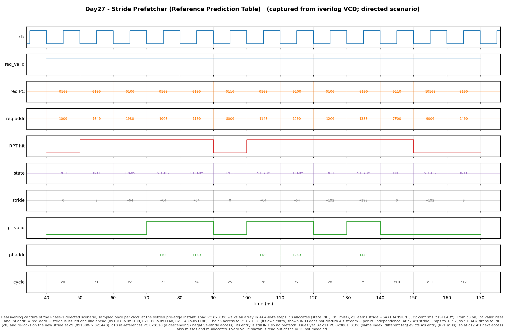

# Day 27 — Stride Prefetcher (Reference Prediction Table)

A **memory-hierarchy accelerator** that watches the stream of data-memory
addresses, learns the *constant stride* each load walks with, and fetches the
next line **before** the demand miss happens — hiding memory latency the caches
of Days 7 and 23 can only react to.

## Overview

The caches built earlier in this series are *reactive*: a line is brought in
only after a load misses and stalls. But a huge fraction of real memory traffic
is perfectly regular — `for (i=0;i<N;i++) sum += a[i];` touches
`a[0], a[1], a[2], …`, i.e. addresses separated by a **constant stride** (the
element size). If the hardware notices that pattern, it can issue the fetch for
`a[i+1]` while `a[i]` is still being consumed, so the line is already in the
cache by the time the CPU asks for it. That is **data prefetching**, and the
classic hardware scheme for it is the **stride prefetcher** built on a
**Reference Prediction Table (RPT)** — Chen & Baer, *"Effective Hardware-Based
Data Prefetching for High-Performance Processors"* (IEEE TC, 1995).

The RPT is a small, direct-mapped, **PC-indexed** table. It is indexed by the
*load's PC*, not by the data address, because a single static load instruction
(one PC) is what walks an array with a stable stride — different loads have
different strides, and indexing by PC keeps their histories separate. Each entry
remembers the **last data address** that load referenced and the **stride**
between its last two references, plus a small **confidence FSM** so the
prefetcher only fires once a stride has proven itself and doesn't chase noise.

On every observed access `{load-PC, data-address}` the prefetcher, in the same
cycle:

1. indexes the RPT by the PC and tag-checks the entry,
2. computes the freshly observed stride `addr − last_addr`,
3. compares it to the stored stride to drive the confidence FSM, and
4. if the entry is confident (STEADY) with a non-zero stride, emits a prefetch
   for `addr + LOOKAHEAD·stride`.

The table is then updated on the clock edge.

### Why it matters

- **Prefetching is the other half of the memory hierarchy.** Caches exploit
  locality *after* a miss; prefetchers hide the miss latency entirely. Stride
  prefetchers are present in essentially every modern CPU (Intel's L1/L2 stream
  & stride prefetchers, Arm's, etc.) because array / matrix / streaming code is
  everywhere.
- **PC-indexing is the key idea.** Correlating the address pattern with the
  *instruction* that generates it cleanly separates interleaved streams — two
  loops running at once each get their own learned stride.
- **Confidence gating buys accuracy.** A one-off irregular access must not spam
  useless prefetches (which waste bandwidth and can evict useful lines). The
  2-bit confidence FSM demands two consecutive stride confirmations before
  predicting and tolerates a single hiccup without immediately mispredicting.

## Features

- Direct-mapped, **PC-indexed** RPT (`2**IDX_WIDTH` entries), tag-checked.
- Per-entry state: `valid`, `tag`, `last_addr`, `stride`, 2-bit confidence.
- Classic **Chen–Baer 4-state confidence FSM**: `INIT → TRANSIENT → STEADY`,
  with `NO_PRED` for irregular streams.
- **Signed / modular strides** — ascending *and* descending walks (a negative
  stride is just a two's-complement value; add/compare work modulo `2**AW`).
- **Combinational predict** (this cycle's access) + **synchronous update**
  (next edge) — the natural "read this cycle, learn for next cycle" split.
- Prefetch **look-ahead distance** parameter (`LOOKAHEAD` strides).
- Direct-mapped **conflict eviction** (a colliding PC overwrites the entry).
- Reset-safe, lint-friendly, no data-dependent variable bit-selects (table
  access is an array index; the PC is sliced with constant part-selects).
- Self-checking testbench lock-stepped against an **independent** golden RPT
  over a directed scenario + 4000 randomised ops.

## Parameters

| Parameter    | Default | Meaning |
|--------------|---------|---------|
| `PC_WIDTH`   | 32      | Load-PC width (bits). |
| `ADDR_WIDTH` | 32      | Data-address / stride width (bits). |
| `IDX_WIDTH`  | 4       | log2 of the number of RPT entries (`SETS = 16`). |
| `PC_ALIGN`   | 2       | Low PC bits dropped before indexing (word-aligned instructions). |
| `LOOKAHEAD`  | 1       | Prefetch distance, in strides: `pf_addr = addr + LOOKAHEAD·stride`. |

Derived: `SETS = 2**IDX_WIDTH`, `TAG_WIDTH = PC_WIDTH − IDX_WIDTH − PC_ALIGN`.

## Confidence-state encoding

| Encoding | State       | Meaning |
|----------|-------------|---------|
| `2'd0`   | `INIT`      | Entry just allocated (or demoted); stride not yet trusted. |
| `2'd1`   | `TRANSIENT` | A stride was seen once; one more confirmation needed. |
| `2'd2`   | `STEADY`    | Stride confirmed twice — **prefetch is issued from here**. |
| `2'd3`   | `NO_PRED`   | Irregular stream; suppress prediction until it settles. |

FSM transitions each **hit**, driven by `match = (observed_stride == stored_stride)`:

| State       | `match` → | `¬match` → (and re-learn stride) |
|-------------|-----------|----------------------------------|
| `INIT`      | `STEADY`  | `TRANSIENT` |
| `TRANSIENT` | `STEADY`  | `NO_PRED`   |
| `STEADY`    | `STEADY`  | `INIT`      |
| `NO_PRED`   | `TRANSIENT` | `NO_PRED` |

`STEADY` demoting to `INIT` (not straight to `NO_PRED`) on a single miss is the
*hysteresis*: one irregular access loses a prefetch but not the learned stride's
credibility.

## Ports

| Port         | Dir | Width        | Description |
|--------------|-----|--------------|-------------|
| `clk`        | in  | 1            | Clock. |
| `rst_n`      | in  | 1            | Active-low synchronous-style reset (clears all entries). |
| `req_valid`  | in  | 1            | A memory reference is presented this cycle. |
| `req_pc`     | in  | `PC_WIDTH`   | PC of the load generating the reference. |
| `req_addr`   | in  | `ADDR_WIDTH` | Data address referenced. |
| `pf_valid`   | out | 1            | Issue a prefetch this cycle (combinational). |
| `pf_addr`    | out | `ADDR_WIDTH` | Predicted next address `req_addr + LOOKAHEAD·stride`. |
| `dbg_hit`    | out | 1            | RPT hit (valid & tag match) for this request. |
| `dbg_state`  | out | 2            | Current confidence state of the indexed entry (pre-update). |
| `dbg_stride` | out | `ADDR_WIDTH` | Current stored stride of the indexed entry (pre-update). |

The `dbg_*` outputs are observability taps; the testbench also recomputes them
independently and checks them, so they double as a state cross-check.

## Block / datapath diagram

```
                 req_pc                              req_addr
                   │                                    │
        ┌──────────┴──────────┐                         │
   tag  │  index = pc[..]     │  (constant part-selects)│
   =pc[hi]        │                                      │
                  ▼                                      │
        ┌───────────────────────── RPT (SETS entries) ──┴───────────┐
        │  valid │ tag │ last_addr │ stride │ state(2b)              │
        │   …    │  …  │    …      │   …    │   …    ← entry[index]  │
        └───────────────────────────────────────────────────────────┘
                  │ valid,tag        │ last_addr   │ stride   │ state
                  ▼                  ▼             │          │
        hit = valid & (tag==pc_tag)  │             │          │
                  │        obs_stride = addr - last_addr       │
                  │                  │             │           │
                  │        match = hit & (obs_stride == stride)│
                  │                  │             │           │
                  ├──────────────────┴───────┐     │           │
                  │            ┌──────────────▼─────▼───────────▼──┐
   PREDICT (comb) │            │  confidence FSM  next_state(...)  │  (edge:
   pf_valid = hit &            └──────────────┬────────────────────┘   update
     state==STEADY & stride!=0                │  last_addr<=addr        entry)
   pf_addr  = addr + LOOKAHEAD*stride         │  stride<=obs (on ¬match)
                  │                            ▼
                  ▼                     miss → allocate:
             prefetch req            valid=1,tag,last=addr,stride=0,state=INIT
```

## Simulation timing



*Real Icarus-Verilog capture (not hand-modeled).* `make icarus` runs the
testbench and dumps `stride_prefetcher.vcd`; `render_waveform.py` parses that
VCD and draws the Phase-1 directed scenario. Because each access is presented
for one clock (read combinationally, learned on the next edge), every non-clock
signal is sampled once per cycle at its settled pre-edge instant — the same
snapshot the self-check validates — so the diagram is a genuine per-cycle view
of the captured run, not a modeled drawing.

Reading the trace: load PC `0x0100` walks an array in `+64`-byte steps. **c0**
allocates the entry (RPT miss, `INIT`); **c1** learns stride `+64`
(`TRANSIENT`); **c2** confirms it (`STEADY`). From **c3** onward `pf_valid`
rises and `pf_addr = req_addr + stride` is issued one line ahead
(`0x10C0→0x1100`, `0x1100→0x1140`, `0x1140→0x1180`). The **c5** access to a
*different* PC (`0x0110`) has its own entry and does not disturb A's stream
(per-PC independence). At **c7** A's stride jumps to `+192`, so `STEADY` demotes
to `INIT` (**c8**) and re-locks on the new stride at **c9** (`0x1380→0x1440`).
**c11** shows a *conflict*: PC `0x0001_0100` maps to the same index with a
different tag and **evicts** A's entry (RPT miss), so at **c12** A's next access
also misses and re-allocates.

## How it works

**Look-up (combinational, this cycle).** The PC is split into a constant index
slice and a tag slice. `hit = valid[idx] && tag[idx]==req_tag`. The observed
stride is `req_addr − last_addr[idx]` (modular two's-complement, so descending
walks give a negative stride automatically). `match` is `hit && obs_stride ==
stride[idx]`.

**Prefetch decision.** `pf_valid` asserts only when the request hits, the entry
is `STEADY`, and the stored stride is non-zero (a zero stride means the load
keeps hitting the same address — nothing useful to prefetch). `pf_addr =
req_addr + LOOKAHEAD·stride`.

**Update (synchronous, next edge).** If the access **missed**, the entry is
(re)allocated for this PC: `valid=1`, `tag`, `last_addr=addr`, `stride=0`,
`state=INIT`. If it **hit**, `last_addr` advances to `addr`, the state moves per
the FSM table above, and on a stride **mismatch** the freshly observed stride is
latched as the new stored stride (so the predictor re-learns after a pattern
change). Reset clears every entry to `INIT`/invalid.

Because look-up is combinational off the current entry and the update lands on
the next edge, the predictor uses the **pre-update** state for this cycle's
decision and learns for the *next* reference — the standard "read now, train for
later" discipline that lets it live in a single fetch/access stage.

### Notes / honest simplifications

- **One prefetch per access, `LOOKAHEAD=1`.** Real prefetchers often issue a
  *degree* of several lines and a larger look-ahead distance to cover memory
  latency; that is a straightforward extension (emit `addr + k·stride` for
  `k = 1…DEGREE`). Kept to one here so the golden model stays a crisp spec.
- **No cache/MSHR interaction modeled.** The block emits a predicted address; it
  does not filter against what is already cached or in flight. In a full system
  you would drop the prefetch on a cache hit / outstanding-miss match. That is
  orthogonal plumbing, not part of the prediction algorithm shown.
- **Direct-mapped RPT.** Aliasing PCs evict each other (demonstrated at c11–c12).
  Set-associative RPTs exist but add the replacement machinery already covered
  on Day 23.

## What the testbench checks

`tb_stride_prefetcher.sv` builds an **independent** behavioural golden RPT from
plain unpacked arrays and the same specification (never peeking at DUT
internals). For every observed access it computes the expected `pf_valid`,
`pf_addr`, `dbg_hit`, `dbg_state`, and `dbg_stride` from the golden model
**before** the clock edge, compares them against the DUT's combinational
outputs, then advances both the golden model and (via the edge) the DUT.

- **Phase 1 — directed scenario** (the waveform window): allocate → learn →
  `STEADY` → prefetch, per-PC independence, a mid-stream stride change with
  `STEADY→INIT` re-lock, a negative stride, and a direct-mapped conflict
  eviction.
- **Phase 2 — 4000 randomised ops** over an 8-PC pool whose PCs span a small
  range (so indices alias and force conflicts / evictions). Each op is, with
  tuned probability, a continued strided walk (drives `INIT→STEADY`), a stride
  change (drives `STEADY→INIT` re-lock), or a random jump (irregular access).

Every check must hold; a timeout guards against a hang. On success the bench
prints `RESULT: *** PASS ***`. The captured run performs **4013 checks with 0
errors**.

## Run it

```bash
make            # Icarus Verilog: compile + run the self-checking testbench
make waveform   # regenerate docs/stride_prefetcher_waveform.png from the VCD
make clean
```

Other simulators: `make verilator`, `make vcs`, `make questa`.

Expected tail of the run:

```
---- Phase 1: directed scenario ----
---- Phase 2: 4000 randomised ops ----
Checks run : 4013
Errors     : 0
RESULT: *** PASS ***
```
