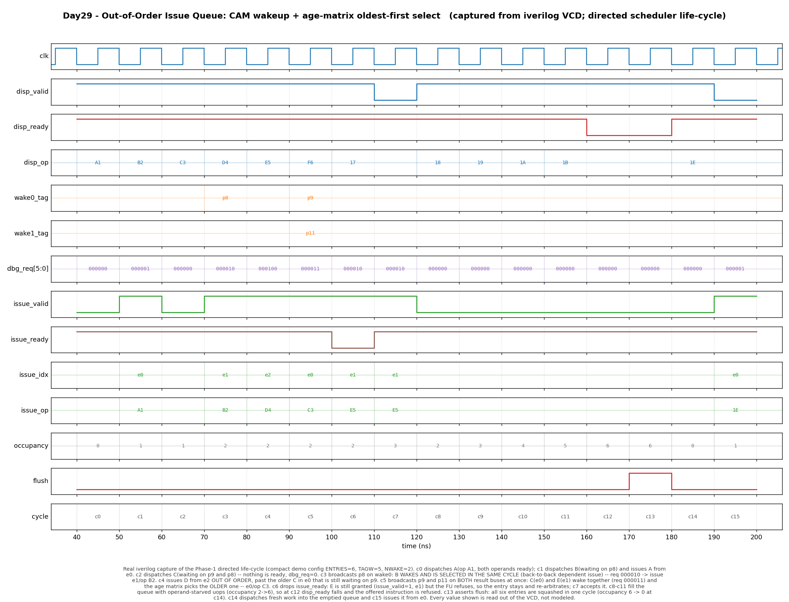

# Day 29 — Out-of-Order Issue Queue (Reservation Stations)

A synthesizable **out-of-order scheduler**: the structure that holds renamed
instructions until their operands actually exist, then launches one per cycle —
**oldest-ready-first**, regardless of program order.

This is the missing middle of the out-of-order trio already in this series:

| Stage | Day | What it provides |
|-------|-----|------------------|
| Rename | [Day 28](../Day28/) | removes false WAR/WAW dependences → only true RAW remains |
| **Schedule** | **Day 29 (this)** | **decides *when* each instruction runs, from its RAW readiness alone** |
| Retire | [Day 12](../Day12/) | puts results back in order → precise architectural state |

Renaming makes reordering *legal*; the reorder buffer makes it *safe*; the issue
queue is what actually makes it *happen*.

---

## Why the issue queue matters

An in-order pipeline (like the [Day 25](../Day25/) 5-stage core) stalls the whole
machine on the first instruction that isn't ready — a single L2 miss can idle
hundreds of instructions that had nothing to do with it. The issue queue breaks
that coupling. Dispatched instructions sit in a pool of reservation stations,
each waiting only on its own operands, and any of them may run the moment those
operands appear. Program order is *forgotten* for execution purposes and
reconstructed later by the ROB.

That turns instruction-level parallelism into a purely local, dataflow question,
and it raises exactly three hardware problems — which are the three mechanisms
this design implements.

### 1. Wakeup — "are my operands there yet?"

Every completing instruction broadcasts its destination **physical register tag**
on a result bus. Every waiting entry compares **both** of its source tags against
**all** broadcast tags, in parallel — a small **content-addressable memory**:
`ENTRIES × 2 × NWAKE` comparators. This is Tomasulo's "reservation stations snoop
the common data bus", modernised: tags are physical register numbers from the
rename stage rather than station identifiers.

Crucially the match is folded **combinationally** into the request vector, so a
consumer can issue in the *same cycle* its producer's tag is broadcast. That is
what makes a dependent chain

```
add p8 <- p1, p2      # broadcasts p8 in cycle T
add p9 <- p8, p8      # issues in cycle T, not T+1
```

run at one instruction per cycle. It is also why the **wakeup → select →
broadcast loop is the critical path of every real out-of-order core**: it must
close within a single cycle, which is precisely what limits how large a scheduler
can be built.

### 2. Select — "which ready instruction goes first?"

Several entries are usually ready at once, and picking arbitrarily is not good
enough: the ROB retires **in order**, so an old instruction left unselected
blocks every younger completed instruction behind it and can starve outright.
The scheduler must pick the **oldest** ready entry.

But queue *position* cannot encode age — entries are allocated and freed out of
order, so slot 0 is not "older" than slot 5. Age is tracked explicitly in an
**age matrix**:

```
age[i][j] = 1   <=>   entry i is OLDER than entry j
```

Allocation of entry `a` writes both directions in one shot, with no priority
chain and no shifting:

```
age[a]  <= 0            # a is younger than everybody
age[j]  <= age[j] | a   # everybody else is older than a   (one-hot OR)
```

Selection is then a single AND-OR level, fully parallel across all entries:

```
grant[i] = req[i] & ~|( req & older_column[i] )
```

*"entry i wins if it requests and no **other** requesting entry is older than
it."* Because the matrix encodes a strict total order over the live entries,
**exactly one** requester satisfies this — the grant is inherently one-hot, and
no entry can ever be starved. (The testbench asserts one-hotness every cycle.)

### 3. Allocate / free — "where does it live?"

Anywhere. Since age is tracked separately, a dispatching instruction just takes
the lowest free slot (`free & -free`), and an issuing entry frees its slot
immediately. `disp_ready` (= not full) is the backpressure signal to rename.

---

## Features

* **Parameterised** — `ENTRIES`, tag width `TAGW`, payload width `OPW`, and the
  number of result/wakeup buses `NWAKE`.
* **Associative wakeup** across all `NWAKE` result buses, applied to
  * resident entries (registered ready bits), **and**
  * the entry being **dispatched in the same cycle** — otherwise a tag broadcast
    while the instruction is still in flight to the queue would be missed
    *forever*, a classic scheduler deadlock.
* **Same-cycle wakeup → select bypass** → back-to-back dependent issue.
* **Age-matrix oldest-ready-first select**, O(1) and provably starvation-free.
* **Out-of-order issue**: a younger ready entry overtakes an older stalled one.
* **FU backpressure**: `issue_ready = 0` leaves the granted entry in place to
  re-arbitrate next cycle.
* **Single-cycle `flush`** for branch-mispredict / exception recovery.
* Reset-safe, lint-clean under `iverilog -g2012 -Wall`, and **no data-dependent
  variable bit-selects** — every index is a genvar or loop constant.

### Documented simplifications

* **Non-speculative wakeup** — no load-miss replay / squash-and-reissue. A real
  core speculatively wakes load consumers on a predicted hit and must be able to
  yank them back.
* One dispatch port and one issue port (a wide core has several of each, plus a
  per-function-unit split of the select logic).
* An entry freed in cycle *T* is re-allocatable from *T+1* (the free mask comes
  from the registered valid bits).

---

## Parameters

| Parameter | Default | Description |
|-----------|--------:|-------------|
| `ENTRIES` | 8 | number of reservation stations |
| `TAGW` | 6 | physical-register tag width (Day 28's `PLOG`) |
| `OPW` | 8 | opaque payload width (uop / immediate / ROB id) |
| `NWAKE` | 2 | number of result (wakeup broadcast) buses |
| `IDXW` | `$clog2(ENTRIES)` | derived — entry index width |
| `CNTW` | `$clog2(ENTRIES+1)` | derived — occupancy counter width |

## Ports

| Port | Dir | Width | Description |
|------|-----|------:|-------------|
| `clk` | in | 1 | clock |
| `rst_n` | in | 1 | active-low reset (queue empty, age matrix cleared) |
| `disp_valid` | in | 1 | an instruction is offered this cycle |
| `disp_ready` | out | 1 | queue not full — **backpressure to rename** |
| `disp_op` | in | `OPW` | payload carried with the instruction |
| `disp_pdst` | in | `TAGW` | destination physical tag |
| `disp_pdst_valid` | in | 1 | the instruction writes a register |
| `disp_psrc1` / `disp_psrc2` | in | `TAGW` | source physical tags |
| `disp_src1_ready` / `disp_src2_ready` | in | 1 | operand already available (or unused) |
| `wake_valid` | in | `NWAKE` | per-bus broadcast valid |
| `wake_tag` | in | `NWAKE*TAGW` | per-bus broadcast tag (flattened) |
| `issue_valid` | out | 1 | a ready instruction is selected this cycle |
| `issue_ready` | in | 1 | the function unit accepts it |
| `issue_op` | out | `OPW` | payload of the granted entry |
| `issue_pdst` | out | `TAGW` | destination tag of the granted entry |
| `issue_pdst_valid` | out | 1 | granted entry writes a register |
| `issue_idx` | out | `IDXW` | which entry was granted |
| `flush` | in | 1 | mispredict / exception — drop all entries |
| `dbg_count` | out | `CNTW` | occupancy (observability) |
| `dbg_valid` | out | `ENTRIES` | per-entry valid |
| `dbg_ready1` / `dbg_ready2` | out | `ENTRIES` | per-entry registered operand-ready bits |
| `dbg_req` | out | `ENTRIES` | per-entry request (includes this cycle's wakeup) |

`disp_ready`, `issue_valid`, `issue_idx` and the issue payload are
**combinational** functions of the current entry state *and this cycle's wakeup
broadcasts*; entry state, the ready bits and the age matrix update on the
following rising edge.

---

## Block / datapath diagram

```
   from RENAME (Day28)                          from the FUNCTION UNITS
   disp_op/pdst/psrc1/psrc2                     wake_valid[NWAKE], wake_tag[NWAKE]
   disp_src{1,2}_ready                                    │
          │  ▲ disp_ready (full)                          │  result-tag broadcast
          ▼  │                                            ▼
   ┌──────────────────┐                 ┌─────────────────────────────────────┐
   │ ALLOCATE         │                 │        WAKEUP  (CAM)                │
   │ free = ~valid    │                 │  ENTRIES x 2 x NWAKE comparators    │
   │ oh  = free&-free │                 │  hit1[i] = |(wake_valid & tag==src1)│
   └────────┬─────────┘                 └───────────────┬─────────────────────┘
            │ one-hot write                             │ same-cycle bypass
            ▼                                           ▼
   ┌──────────────────────────────────────────────────────────────────────────┐
   │                         ENTRIES reservation stations                     │
   │  e0 │ v │ op │ pdst │ src1 rdy1 │ src2 rdy2 │                            │
   │  e1 │ v │ op │ pdst │ src1 rdy1 │ src2 rdy2 │   req[i] = v & r1 & r2     │
   │  .. │                                       │   (r = rdy | CAM hit)      │
   │  eN │ v │ op │ pdst │ src1 rdy1 │ src2 rdy2 │                            │
   └───────────────────────────────┬──────────────────────────────────────────┘
                                   │ req[ENTRIES-1:0]
                                   ▼
   ┌──────────────────────────────────────────────────────────────────────────┐
   │              SELECT  —  age matrix (oldest ready first)                  │
   │                                                                          │
   │        age[i][j] = 1  <=>  entry i is OLDER than entry j                 │
   │                                                                          │
   │            j=0 1 2 3 4 5          on allocating entry a:                 │
   │       i=0 [ 0 1 1 1 1 1 ]           age[a] <= 0                          │
   │       i=1 [ 0 0 1 1 1 1 ]           age[j] <= age[j] | onehot(a)         │
   │       i=2 [ 0 0 0 1 1 1 ]                                                │
   │       ...                                                                │
   │        grant[i] = req[i] & ~|( req & age[:][i] )      <- one AND-OR level│
   │        (strict total order  ⇒  grant is inherently ONE-HOT, no starvation)│
   └───────────────────────────────┬──────────────────────────────────────────┘
                                   │ grant (one-hot)
                                   ▼
            issue_valid / issue_idx / issue_op / issue_pdst  ──►  FUNCTION UNIT
            entry freed when (issue_valid & issue_ready)          ──► and its
                                                                      result tag
   flush ──► clears all valid bits and the whole age matrix in 1 cycle  comes back
                                                                      as a wakeup
```

The wakeup CAM, the request vector and the select matrix form **one
combinational loop within a cycle** — that closed loop is the scheduler, and its
delay is what bounds the practical size of `ENTRIES` in a real core.

---

## Simulation timing



*Real Icarus-Verilog VCD capture (not a hand-drawn diagram) of the Phase-1
directed life-cycle, sampled once per clock at the settled pre-edge instant.
Compact demo config `ENTRIES=6, TAGW=5, NWAKE=2`.*

Reading the trace:

* **c0** dispatch **A** (`op A1`, both operands ready) into `e0`. The queue was
  empty, so `dbg_req = 000000` and nothing issues.
* **c1** dispatch **B** (waiting on `p8`); **A** is the only ready entry →
  `issue_idx = e0`, `issue_op = A1`.
* **c2** dispatch **C** (waiting on `p9` *and* `p8`) — nothing ready,
  `dbg_req = 000000`, no issue.
* **c3** `wake0` broadcasts **`p8`**: **B wakes and is selected in the same
  cycle** — `dbg_req` becomes `000010` and `e1`/`op B2` issues immediately.
  This is the back-to-back dependent-issue path. (The same broadcast also
  satisfies C's *second* operand; C still waits on `p9`.)
* **c4** **D** (`e2`) issues **out of order**, overtaking the older **C** in `e0`
  that is still waiting on `p9`.
* **c5** both result buses fire at once — `wake0 = p9`, `wake1 = p11`. **C**
  (`e0`) and **E** (`e1`) wake together (`dbg_req = 000011`) and the age matrix
  picks the **older** one: `e0`/`op C3`.
* **c6** the function unit refuses (`issue_ready = 0`). **E is still granted**
  (`issue_valid = 1`, `issue_idx = e1`) but nothing is consumed — the entry stays
  and re-arbitrates.
* **c7** the FU accepts again → **E** issues from `e1`.
* **c8 – c11** the queue fills with operand-starved uops; occupancy climbs
  `2 → 3 → 4 → 5 → 6`.
* **c12** queue **full** → `disp_ready` falls and the offered instruction is
  refused (`disp_valid` high, no allocation).
* **c13** **`flush`** — all six entries are squashed in a single cycle
  (occupancy `6 → 0`, visible at c14).
* **c14 / c15** fresh work is dispatched into the emptied queue and issues from
  `e0`.

---

## How it works (RTL notes)

* The CAM is fully structural: one comparator per *(entry source, result bus)*
  pair, generated with genvars into flat `match1` / `match2` vectors, then
  OR-reduced per entry. No functions reading module scope, no variable indexing.
* `r1_eff = rdy1 | hit1` is the **bypassed** ready bit. It feeds both the request
  vector (same-cycle issue) *and* the flop input (so the wakeup is remembered).
* The age matrix is updated with **one-hot ORs only** — `age[i] <= '0` on the
  entry's own allocation, `age[i] <= age[i] | alloc_oh` otherwise. There is no
  variable write index anywhere, and `age[i][i]` is therefore always 0 by
  construction.
* Stale age bits for a freed entry are harmless: every relation involving an
  entry is completely rewritten (row cleared, column set) the moment that entry
  is re-allocated.
* The allocator isolates the lowest free slot with `free & (~free + 1)` — the
  same trick as the [Day 9](../Day9/) round-robin arbiter, here used for
  placement rather than fairness (fairness is the age matrix's job).
* Everything is reset-safe (empty queue, cleared matrix) and lint-clean under
  `iverilog -g2012 -Wall`.

---

## What the testbench checks

`tb_issue_queue.sv` lock-steps the DUT against an **independent** behavioural
golden model that deliberately does **not** use an age matrix: it stamps every
allocated entry with a monotonically increasing **dispatch sequence number** and
selects the ready entry with the smallest one. So the RTL's O(1) matrix
arbitration is validated against a plain "minimum age" *definition* of
oldest-first — two genuinely different implementations of the same
specification.

Every cycle the testbench drives one dispatch attempt, both wakeup buses,
`issue_ready` and `flush`; samples the DUT's combinational outputs at the settled
pre-edge instant; and asserts **all** of `disp_ready`, `issue_valid`,
`issue_idx`, `issue_op`, `issue_pdst`, `issue_pdst_valid`, `dbg_count`,
`dbg_valid` and the full `dbg_req` vector against the golden prediction — plus a
**one-hot check on the internal grant vector** — before advancing both models
identically.

* **Phase 1 — directed life-cycle** (the waveform above): allocate, in-order
  issue, same-cycle wakeup→select, out-of-order issue past a stalled older entry,
  dual-bus simultaneous wakeup with oldest-first arbitration, FU backpressure,
  fill-to-full, full-queue dispatch refusal, and flush.
* **Phase 2 — randomised** 5000 cycles: random dispatch, random source tags drawn
  from a deliberately small 16-tag pool (so CAM hits are frequent rather than
  rare), random ready flags, random dual-bus wakeups, random FU backpressure and
  a rare (~1/300) flush — followed by a 40-cycle drain.

A global timeout guards against a hang. The run prints `RESULT: *** PASS ***`
only if every assertion held — **50 560 assertions, 0 errors** on the reference
Icarus run.

---

## Run instructions

```bash
make            # Icarus Verilog (default): iverilog + vvp
make verilator  # Verilator
make vcs        # Synopsys VCS
make questa     # Siemens Questa / ModelSim
make waveform   # regenerate docs/issue_queue_waveform.png from the VCD
make clean
```

Expected tail:

```
  Phase 1 complete : 160 checks, 0 errors
---------------------------------------------------------------------
Phase 2 : 5000 randomised cycles (random dispatch / dual wakeup /
          FU backpressure / occasional flush)
---------------------------------------------------------------------
Total cycles : 5056
Assertions   : 50560
Errors       : 0
RESULT: *** PASS ***
```

The waveform PNG is regenerated from the captured `issue_queue.vcd` by
`render_waveform.py` (a small VCD parser + matplotlib) — it is a genuine
simulator capture, not a hand-drawn figure.
