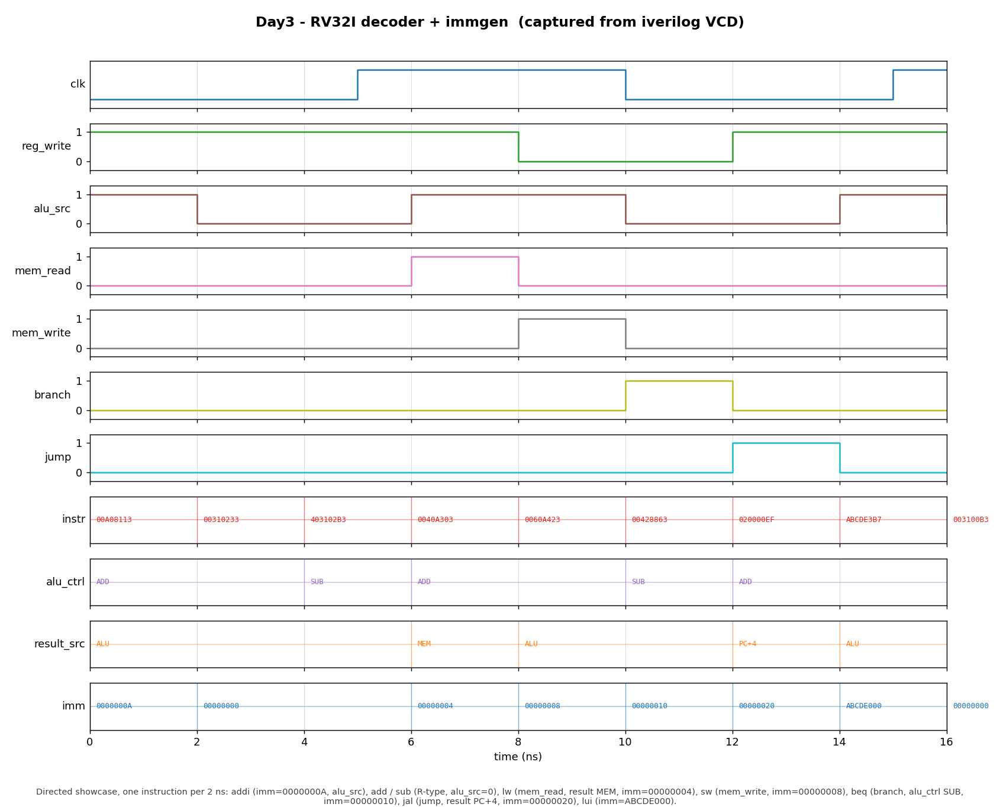

# Day 3 — RV32I Instruction Decoder + Immediate Generator

## Overview

The decoder is the **control brain** of a single-cycle RISC-V core. It sits in
the instruction-decode stage, takes the 32-bit instruction word fetched from
memory, and cracks it into the two things the datapath needs:

1. the **control lines** that steer every downstream block — whether to write a
   register, where the ALU's second operand comes from, whether the access is a
   load or a store, whether it is a branch or a jump, which write-back source
   feeds `rd`, and which ALU operation to perform; and
2. a **sign-extended immediate**, produced by a format-aware immediate generator
   that understands the RV32I I/S/B/U/J encodings.

This day implements both as one clean, purely combinational module whose
ALU-control encoding matches the **Day 1 ALU** and whose register indices feed
the **Day 2 register file**, so the three modules drop straight into the same
datapath.

## Why it matters

Every other block in the core is a slave to the decoder. The ALU only computes
the right thing because `alu_ctrl` told it to; the register file only retires a
result because `reg_write` was asserted; a load reaches the register file
because `result_src` selected memory. Two subtleties make a *RISC-V* decoder
more than a lookup table, and both are modeled here:

- **Immediate scrambling.** RISC-V deliberately shuffles the immediate bits
  across the instruction word so that the register specifiers (`rs1`, `rs2`,
  `rd`) always land in the same place. The price is that the immediate generator
  must re-assemble five different bit-orderings (I/S/B/U/J) and sign-extend from
  bit 31. Branch and jump immediates are even encoded with an implicit low zero
  bit (2-byte alignment).
- **Safe defaults.** A real fetch unit can present any 32-bit pattern. Anything
  the decoder does not recognize must decode to an inert NOP — no register
  write, no memory write, no control transfer — so a stray word can never
  corrupt architectural state. This is the natural Day 3 companion to the Day 1
  ALU and Day 2 register file: the ALU computes, the register file stores, and
  the decoder decides.

## Features

- **Full RV32I base decode**: R-type, OP-IMM, LOAD, STORE, BRANCH, JAL, JALR,
  LUI, AUIPC.
- **Format-aware immediate generator** for all five immediate formats (I, S, B,
  U, J), each correctly sign-extended; R-type produces no immediate.
- **ALU-control generation** keyed on `opcode`, `funct3`, and `instr[30]`
  (`funct7[5]`), matching the Day 1 ALU encoding. `instr[30]` selects `SUB` vs.
  `ADD` and `SRA` vs. `SRL`; there is deliberately no `SUBI`.
- **Branch comparison mapping**: `beq/bne → SUB` (resolved by the zero flag),
  `blt/bge → SLT`, `bltu/bgeu → SLTU`.
- **Safe NOP default** for illegal / unimplemented opcodes (`FENCE`, `SYSTEM`,
  bogus patterns) — all control strobes de-asserted.
- Purely combinational and stateless → trivially reset-safe.
- Lint-friendly: `` `default_nettype none ``, every output assigned on every
  path via up-front defaults, field slicing pushed into continuous assigns so
  the processes carry no part-selects.

## Ports

| Port         | Dir | Width | Description |
|--------------|-----|-------|-------------|
| `instr`      | in  | `32`  | Instruction word from the fetch stage. |
| `reg_write`  | out | `1`   | Write-enable for the destination register `rd`. |
| `alu_src`    | out | `1`   | ALU operand-B select: `1` = immediate, `0` = `rs2`. |
| `mem_read`   | out | `1`   | Data-memory load (LOAD). |
| `mem_write`  | out | `1`   | Data-memory store (STORE). |
| `branch`     | out | `1`   | Conditional branch (B-type). |
| `jump`       | out | `1`   | Unconditional jump (JAL / JALR). |
| `result_src` | out | `2`   | Write-back source select (see table). |
| `alu_ctrl`   | out | `4`   | ALU operation, in the Day 1 ALU encoding. |
| `imm_type`   | out | `3`   | Immediate format select (see table). |
| `imm`        | out | `32`  | Sign-extended immediate for the selected format. |

### `result_src` encoding

| `result_src` | Source written to `rd` | Used by |
|--------------|------------------------|---------|
| `00` | ALU result | R-type, OP-IMM, LUI, AUIPC |
| `01` | Data-memory read data | LOAD |
| `10` | `PC + 4` (return address) | JAL, JALR |

### `imm_type` encoding

| `imm_type` | Format | Immediate assembled | Instructions |
|------------|--------|---------------------|--------------|
| `0` | NONE | `32'h0` | R-type / illegal |
| `1` | I | `sext(instr[31:20])` | OP-IMM, LOAD, JALR |
| `2` | S | `sext(instr[31:25],instr[11:7])` | STORE |
| `3` | B | `sext(instr[31],instr[7],instr[30:25],instr[11:8],0)` | BRANCH |
| `4` | U | `{instr[31:12],12'h0}` | LUI, AUIPC |
| `5` | J | `sext(instr[31],instr[19:12],instr[20],instr[30:21],0)` | JAL |

### `alu_ctrl` encoding (mirrors Day 1)

`0000 ADD · 0001 SUB · 0010 SLL · 0011 SLT · 0100 SLTU · 0101 XOR · 0110 SRL ·
0111 SRA · 1000 OR · 1001 AND`

## Datapath / block diagram

```
                         instr[31:0]
                              │
        ┌─────────────────────┼──────────────────────────┐
        │  opcode=instr[6:0]  funct3=instr[14:12]  instr[30]
        │        │                  │                 │
        │        ▼                  ▼                 ▼
        │   ┌──────────────── main control ROM ───────────────┐
        │   │  reg_write  alu_src  mem_read  mem_write         │
        │   │  branch     jump     result_src[1:0]             │
        │   │  alu_ctrl[3:0] (opcode+funct3+bit30)             │
        │   │  imm_type[2:0]                                   │
        │   └──────────────────────┬───────────────────────────┘
        │                          │ imm_type
        │   ┌──────────────────────▼───────────────────────────┐
        │   │            immediate generator                    │
        │   │   I: sext[31:20]   S: sext[31:25]|[11:7]          │
        │   │   B: sext{...,0}   U: {[31:12],0}   J: sext{...,0}│
        │   └──────────────────────┬───────────────────────────┘
        └──────────────────────────┼──────────────► control lines
                                    ▼
                               imm[31:0]
```

## Simulation timing



*Genuine simulator capture — not hand-modeled. The image is rendered by
`render_waveform.py` directly from `decoder.vcd`, the VCD produced by running the
testbench under Icarus Verilog (`make icarus`). The window (0–16 ns) shows the
directed showcase, one instruction decoded every 2 ns:*

- **`addi x2,x1,10`** (`instr=00A08113`) — `reg_write`, `alu_src=1`, `alu_ctrl=ADD`,
  `result_src=ALU`, and the generated `imm=0000000A`.
- **`add x4,x2,x3`** (`00310233`) — R-type: `alu_src=0`, `imm=00000000`.
- **`sub x5,x2,x3`** (`403102B3`) — `alu_ctrl=SUB` (selected by `instr[30]`).
- **`lw x6,4(x1)`** (`0040A303`) — `mem_read`, `result_src=MEM`, `imm=00000004`.
- **`sw x6,8(x1)`** (`0060A423`) — `mem_write`, `reg_write=0`, `imm=00000008`.
- **`beq x5,x4,+16`** (`00428863`) — `branch`, `alu_ctrl=SUB`, `imm=00000010`.
- **`jal x1,+32`** (`020000EF`) — `jump`, `result_src=PC+4`, `imm=00000020`.
- **`lui x7,0xABCDE`** (`ABCDE3B7`) — `alu_src=1`, `result_src=ALU`, and the U-type
  `imm=ABCDE000` (immediate placed in the upper 20 bits).

Every value above is read back out of the VCD by the renderer — nothing is
hand-modeled.

## How it works

The design is two combinational blocks plus a handful of continuous assigns:

- **Main control** is one `always_comb` with up-front NOP defaults followed by a
  `case (opcode)`. Each recognized opcode overrides only the strobes it needs;
  the `default` arm leaves the NOP defaults intact, so illegal words are inert.
  `alu_ctrl` is produced by three small helper functions (`r_alu`, `i_alu`,
  `br_alu`) that map `funct3` (and `instr[30]` where it matters) onto the Day 1
  ALU codes.
- **The immediate generator** pre-computes the five format candidates as
  continuous assigns (`imm_i_c … imm_j_c`) — that is where all the bit shuffling
  and sign-extension lives — and a second `always_comb` simply muxes the right
  candidate onto `imm` using `imm_type`. Keeping the slicing in continuous
  assigns leaves both processes free of part-selects.

Because there is no state, the block has no clock or reset and is safe to drop
into the decode stage of any pipeline.

## Files

| File | Purpose |
|------|---------|
| `decoder.sv` | Synthesizable decoder + immediate generator (the DUT). |
| `tb_decoder.sv` | Self-checking testbench with an independent golden model. |
| `Makefile` | Build/run targets for Icarus, Verilator, VCS, Questa; `waveform`; `clean`. |
| `render_waveform.py` | Manual VCD parser → `docs/decoder_waveform.png`. |
| `docs/decoder_waveform.png` | Captured waveform of the directed showcase. |
| `.gitignore` | Ignores simulation build artifacts (`*.vcd`, `simv_*`, …). |

## Running it

From this folder:

```bash
make            # Icarus Verilog: compile + run the self-checking TB
make waveform   # regenerate docs/decoder_waveform.png from decoder.vcd
make clean
```

Other simulators are wired up too: `make verilator`, `make vcs`, `make questa`.

**Verified:** run under **Icarus Verilog 13.0**, the testbench reports
`RESULT: *** PASS *** (450 checks)`.

## What the testbench checks

`tb_decoder.sv` is self-checking against an independent software **golden model**
(`gold_ctrl` + `gold_imm`) that re-derives every output straight from the
instruction bits:

- **Golden control vector** — all eight control fields are packed into a 15-bit
  vector and compared exactly (`!==`, so `x`/`z` fail); `imm` is compared
  separately.
- **Field-assembled directed vectors** — helper functions (`enc_r/i/s/b/u/j`)
  build legal encodings covering **at least one instruction per opcode** and
  **every `funct3`** for the R-type, OP-IMM, LOAD, STORE, and BRANCH groups,
  including both `instr[30]` variants for `add/sub`, `srl/sra`, and `srli/srai`.
- **Immediate corners** — negative immediates (I/S/B/J) and the U-type
  upper-20-bit placement (`lui`/`auipc`), verifying sign-extension and field
  shuffling.
- **Illegal opcodes** — all-zero, all-one, a bogus opcode, and the
  unimplemented `FENCE`/`SYSTEM` opcodes must all decode to the NOP default.
- **Randomized fuzz** — 400 arbitrary 32-bit words; legal patterns decode
  normally, illegal ones fall through to the default, and every one is checked.
- **Timeout** — a watchdog `$finish`es and fails if the sim ever hangs.
- **VCD dump** — `decoder.vcd` is written for waveform rendering.

Success prints exactly `RESULT: *** PASS ***`.
