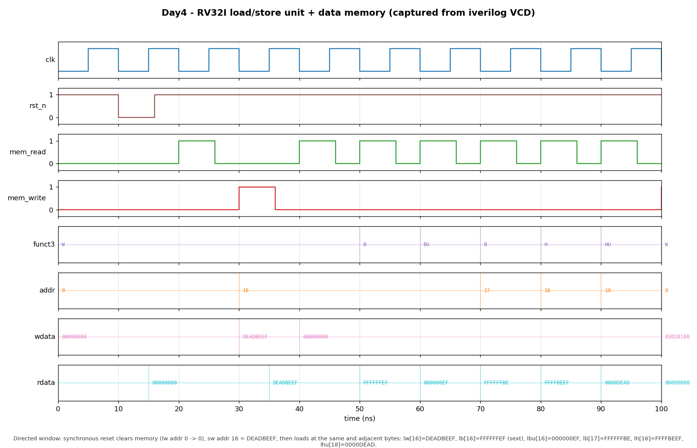

# Day 4 — RV32I Load/Store Unit + Data Memory

## Overview

The load/store unit (LSU) is the core's **gateway to data memory**. In a
single-cycle RISC-V datapath the ALU computes an effective address
(`rs1 + imm`) and hands it to the LSU, which reads or writes the addressed
bytes of a little-endian data memory. This day builds that whole subsystem —
the memory plus the lane logic — for the full RV32I load/store set:

```
loads : lb  lh  lw  lbu  lhu          stores: sb  sh  sw
```

The unit handles everything that makes sub-word memory access subtle: **address
decode** (word index + byte offset), **byte-lane / half selection**, **sign vs.
zero extension** of narrow loads, and **per-byte write enables** so a store
touches only the bytes it should.

## Why it matters

`lw`/`sw` are how programs reach the stack, the heap, and globals, and the
narrow variants (`lb`/`lh` and their unsigned forms) are how they touch
characters, flags, and packed structures. Three details are easy to get wrong,
and all three are modeled here:

- **Little-endian byte order.** The byte at the lowest address is the
  least-significant byte of a word. A load of byte *k* must pull the right lane
  out of the stored word; a store of a byte must land in the right lane and
  leave its three neighbors untouched.
- **Sign vs. zero extension.** `lb`/`lh` sign-extend the loaded value to 32 bits
  (so a stored `-1` byte reads back as `0xFFFFFFFF`), while `lbu`/`lhu`
  zero-extend. Getting the extension wrong silently corrupts signed data.
- **Per-byte write enables.** A `sb` must be a read-modify-write of a single
  lane within a 32-bit word — a naive full-word write would clobber the other
  three bytes. This LSU produces a 4-bit byte-enable mask and a lane-aligned
  store word, exactly as real byte-writable memories do.

It is the natural Day 4 building block: the Day 1 ALU computes the address, the
Day 3 decoder supplies `mem_read`/`mem_write`/`funct3`, and the Day 2 register
file sources the store data and sinks the load result.

## Misalignment policy

RV32I's simplest treatment expects naturally-aligned accesses. This unit does
**not fault**; instead it stays within the single 32-bit word at `addr[.. :2]`
and always produces a defined, testable result (it never crosses a word
boundary):

| Access | Offset handling |
|--------|-----------------|
| byte (`lb`/`lbu`/`sb`) | any `addr[1:0]` selects that byte lane |
| half (`lh`/`lhu`/`sh`) | `addr[1]` picks the half: `0`/`1` → low `[15:0]`, `2`/`3` → high `[31:16]`; `addr[0]` ignored |
| word (`lw`/`sw`) | whole word at `addr[.. :2]`; `addr[1:0]` ignored |

Both the RTL and the golden model implement this policy, and the directed tests
exercise the misaligned corners explicitly.

## Parameters

| Parameter | Default | Description |
|-----------|---------|-------------|
| `DATA_W`  | `32`    | Load/store data width. |
| `WORDS`   | `256`   | Memory depth in 32-bit words (1 KiB). Word index = `addr[$clog2(WORDS)+1:2]`; higher address bits wrap. |

## Ports

| Port        | Dir | Width | Description |
|-------------|-----|-------|-------------|
| `clk`       | in  | `1`   | Clock; stores and reset commit on the rising edge. |
| `rst_n`     | in  | `1`   | Active-low **synchronous** reset; clears all memory to 0. |
| `mem_read`  | in  | `1`   | Load enable (from the decoder). |
| `mem_write` | in  | `1`   | Store enable (from the decoder). |
| `funct3`    | in  | `3`   | Access size / signedness (`instr[14:12]`). |
| `addr`      | in  | `32`  | Byte address (ALU result). |
| `wdata`     | in  | `32`  | Store data (`rs2`). |
| `rdata`     | out | `32`  | Combinational load result, right-justified and extended. |

### `funct3` encoding

| `funct3` | Load | Store | Meaning |
|----------|------|-------|---------|
| `000` | `lb`  | `sb` | byte, signed load |
| `001` | `lh`  | `sh` | half, signed load |
| `010` | `lw`  | `sw` | word |
| `100` | `lbu` | —    | byte, zero-extended load |
| `101` | `lhu` | —    | half, zero-extended load |

## Datapath / block diagram

```
   addr[31:0] ─┬─► widx = addr[.. :2] ──────────────► word index
               └─► off  = addr[1:0]                   │
                          │                           ▼
                          │                  ┌──── mem[WORDS] ────┐
   LOAD path              │                  │  32-bit words,     │
   (combinational):       ▼                  │  4 byte lanes      │
        word = mem[widx] ◄───────────────────┘        ▲
             │                                         │ RMW under be[]
   byte lane / half select (off)                       │
             │                                         │
     sign / zero extend (funct3) ──► rdata     STORE path (posedge clk):
                                             be   = byte-enable mask (funct3,off)
                                             wlane = wdata shifted into lane(s)
                                             mem[widx][lane] <= wlane[lane]  if be
```

## Simulation timing



*Genuine simulator capture — not hand-modeled. The image is rendered by
`render_waveform.py` directly from `lsu.vcd`, the VCD produced by running the
testbench under Icarus Verilog (`make icarus`). The window (0–100 ns) shows a
**store followed by loads at the same and adjacent addresses**:*

- **synchronous reset** clears memory — the opening `lw` of address 0 returns
  `00000000`;
- **`sw [16] = DEADBEEF`** (`mem_write`, `wdata=DEADBEEF`);
- **`lw [16] → DEADBEEF`** — the word reads straight back;
- **`lb [16] → FFFFFFEF`** — low byte `0xEF` **sign-extended**;
- **`lbu [16] → 000000EF`** — same byte **zero-extended**;
- **`lb [17] → FFFFFFBE`** — the **adjacent** byte lane, sign-extended;
- **`lh [16] → FFFFBEEF`** — low half `0xBEEF` sign-extended;
- **`lhu [18] → 0000DEAD`** — the high half `0xDEAD` zero-extended.

Every address, store word, and load result above is read back out of the VCD by
the renderer — nothing is hand-modeled.

## How it works

- **Address decode** is two continuous assigns: `widx = addr[$clog2(WORDS)+1:2]`
  and `off = addr[1:0]`.
- **The load path** is combinational. `word = mem[widx]` is read out; a
  ternary chain selects the byte lane from `off` and `addr[1]` selects the half;
  an `always_comb` then muxes on `funct3` to sign-extend (`lb`/`lh`),
  zero-extend (`lbu`/`lhu`), or pass the full word (`lw`). The sign bits are
  pulled into their own continuous assigns so the extension mux carries no
  bit-selects.
- **The store path** computes, in an `always_comb`, a 4-bit byte-enable mask
  `be` and a lane-aligned store word `wlane` (`wdata` shifted into the target
  lane) from `funct3` and `off`. A single `always_ff @(posedge clk)` then does a
  **read-modify-write** of `mem[widx]`: it starts from the current word and
  overwrites only the lanes whose `be` bit is set, so untouched bytes keep their
  value. On reset it loops over the array clearing every word.

The golden model in the testbench stores memory as a flat little-endian **byte
array** — a deliberately different implementation — and reproduces exactly this
lane selection, extension, and misalignment policy.

## Files

| File | Purpose |
|------|---------|
| `lsu.sv` | Synthesizable load/store unit + byte-addressable data memory (the DUT). |
| `tb_lsu.sv` | Self-checking testbench with an independent byte-array golden model. |
| `Makefile` | Build/run targets for Icarus, Verilator, VCS, Questa; `waveform`; `clean`. |
| `render_waveform.py` | Manual VCD parser → `docs/lsu_waveform.png`. |
| `docs/lsu_waveform.png` | Captured waveform of the store-then-load showcase. |
| `.gitignore` | Ignores simulation build artifacts (`*.vcd`, `simv_*`, …). |

## Running it

From this folder:

```bash
make            # Icarus Verilog: compile + run the self-checking TB
make waveform   # regenerate docs/lsu_waveform.png from lsu.vcd
make clean
```

Other simulators are wired up too: `make verilator`, `make vcs`, `make questa`.

**Verified:** run under **Icarus Verilog 13.0**, the testbench reports
`RESULT: *** PASS *** (390 checks)`.

## What the testbench checks

`tb_lsu.sv` is self-checking against an independent software **golden model**
(`gmem[]`, a little-endian byte array) that mirrors the DUT cycle-by-cycle:

- **Golden read model** — `read_model()` predicts every load from the byte array
  using the same lane/half selection, sign/zero extension, and misalignment
  policy as the RTL; `rdata` is compared exactly (`!==`, so `x`/`z` fail).
- **Golden store model** — `apply_store_gold()` reproduces the per-byte store
  into the byte array; every subsequent load sees committed stores.
- **Synchronous reset** — a reset cycle clears both memory and model; the first
  load returns 0.
- **Store-then-load showcase** — a word store read back as word, bytes (signed
  and unsigned), an adjacent byte, and halves.
- **Every byte offset** — `lb`/`lbu` at offsets 0, 1, 2, 3 within a word.
- **Sign vs. zero extension corners** — bytes/halves with the high bit set
  (`0xCC…0xFF`), each checked signed and unsigned.
- **Misalignment policy** — `lh` at offsets 1 and 3, and `lw` at offsets 1/2/3,
  verifying the within-word (no boundary crossing) behavior; store side checked
  with `sb` at every offset and `sh` at aligned and policy-misaligned offsets.
- **Randomized fuzz** — 350 store+load pairs with random size, address, and
  data across the whole memory.
- **Timeout** — a watchdog `$finish`es and fails if the sim ever hangs.
- **VCD dump** — `lsu.vcd` is written for waveform rendering.

Success prints exactly `RESULT: *** PASS ***`.
