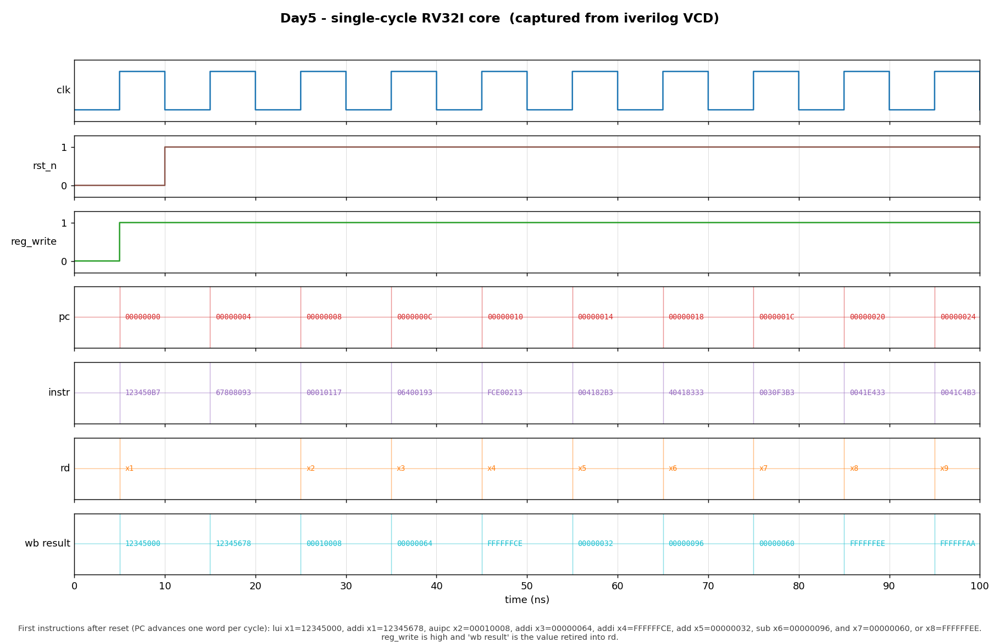

# Day 5 — Single-Cycle RV32I Core (integer subset)

## Overview

This is the capstone that ties Days 1–4 together into a **working processor**.
It integrates the instruction memory and program counter with the four blocks
built earlier — the **ALU** (Day 1), the **register file** (Day 2), the
**decoder + immediate generator** (Day 3), and the **load/store unit + data
memory** (Day 4) — and adds the branch/jump **next-PC** logic that turns a
datapath into a machine.

Every instruction completes in **one clock cycle**: within the cycle the core
fetches, decodes, reads registers, executes in the ALU, accesses data memory,
and computes a write-back value; on the rising edge the PC, register file, and
data memory all commit together.

Per the self-contained rule, `alu.sv`, `regfile.sv`, `decoder.sv`, and `lsu.sv`
are **copied** into this folder rather than referenced from Days 1–4.

**No descope:** the full integer core — including loads/stores and data memory —
simulates green under Icarus Verilog (`RESULT: *** PASS *** (104 checks)`).

## Supported instruction set (RV32I integer subset)

| Group | Instructions |
|-------|--------------|
| R-type | `add sub and or xor sll srl sra slt sltu` |
| I-type immediates | `addi slti sltiu xori ori andi slli srli srai` |
| Loads / Stores | `lb lh lw lbu lhu` / `sb sh sw` |
| Branches | `beq bne blt bge bltu bgeu` |
| Jumps | `jal jalr` |
| Upper immediates | `lui auipc` |

## Why it matters

A single-cycle core is the clearest way to see how the ISA becomes hardware.
Three integration questions have to be answered correctly, and each one is a
concrete design decision in this core:

- **Where does each operand come from?** The ALU's first operand is normally
  `rs1`, but `lui` needs `0` (so `0 + imm = imm`) and `auipc` needs the `PC`
  (`PC + imm`). The second operand is `rs2` or the immediate, per the decoder's
  `alu_src`. These are two small muxes in front of the ALU.
- **How are branches resolved without a second comparator?** The core **reuses
  the ALU**: the decoder maps `beq/bne` to `SUB` (the ALU's `zero` flag decides
  equality) and `blt/bge/bltu/bgeu` to `SLT/SLTU` (the result's LSB is the
  less-than bit). A tiny `funct3` mux turns those into "branch taken".
- **What is the next PC?** `PC+4` normally; `PC+imm` for `jal` and taken
  branches (a dedicated adder); `(rs1+imm) & ~1` for `jalr` (which reuses the
  ALU's `rs1+imm`).

A fourth, subtle point: the register file is instantiated **read-first**
(`WRITE_FIRST=0`). In a single-cycle core an instruction reads the *old* value
of its own destination register; the same-cycle write-forwarding that Day 2
uses for a pipeline would here create a combinational loop
(`rd_data → result → rd_data`).

## Core interface

| Port | Dir | Width | Description |
|------|-----|-------|-------------|
| `clk` | in | `1` | Clock; PC, register file, and data memory commit on the rising edge. |
| `rst_n` | in | `1` | Active-low synchronous reset; PC → `RESET_PC`, registers and memory → 0. |
| `dbg_pc` | out | `32` | PC of the instruction executing this cycle (observation tap). |
| `dbg_instr` | out | `32` | Fetched instruction word. |
| `dbg_reg_write` | out | `1` | Register write-enable this cycle. |
| `dbg_rd` | out | `5` | Destination register index. |
| `dbg_result` | out | `32` | Value retired into `rd`. |

The `dbg_*` outputs are pure observation taps for the testbench and waveform;
they carry no control function.

### Submodules

| Instance | Module | Source day |
|----------|--------|------------|
| `u_imem` | `imem`    | Day 5 (instruction ROM, preloaded program) |
| `u_dec`  | `decoder` | Day 3 |
| `u_rf`   | `regfile` (`WRITE_FIRST=0`) | Day 2 |
| `u_alu`  | `alu`     | Day 1 |
| `u_lsu`  | `lsu`     | Day 4 |

## Datapath / block diagram

```
        ┌────────────────────────────── +4 ──────────┐
        │                                             ▼
   ┌────┴────┐   pc    ┌──────┐ instr  ┌─────────┐  ┌──── next-PC mux ────┐
   │   PC    ├────────►│ imem ├───────►│ decoder │  │ pc+4 / pc+imm /      │
   └────▲────┘         └──────┘        └────┬────┘  │ (rs1+imm)&~1         │
        │                                   │ ctrl  └───▲────────▲─────────┘
        │  next_pc                          │           │ branch │ jal/jalr
        └───────────────────────────────────           │ taken  │
                                            ┌───────────┴───┐    │
     rs1_idx/rs2_idx ─► ┌─────────┐ rs1,rs2 │ branch cmp    │    │
                        │ regfile │────┬────►│ (zero / lsb)  │    │
      rd_wdata ◄────────┤ (RF=0)  │    │     └───────────────┘    │
            ▲           └─────────┘    │                          │
            │  ┌── a-mux ──┐           │  ┌────┐ result           │
            │  │0/pc/rs1   ├───► a ───►├─►│ALU ├──► alu_result ───┴─► addr/jalr
   result   │  └───────────┘           │  └────┘        │
   mux ◄────┤  ┌── b-mux ──┐  imm/rs2  │                ▼
  (ALU/MEM/ │  │ rs2 / imm ├───► b ───►┘          ┌──────────┐ rdata
   PC+4)    └──┴───────────┘                      │   lsu    ├──► load_data
                                        rs2 ─────►│ + dmem   │
                                                  └──────────┘
```

## The directed program & golden methodology

`imem.sv` is preloaded with a 52-instruction routine that exercises the whole
integer subset: build constants with `lui`/`auipc`/`addi`; run every R-type and
I-immediate op; round-trip word/half/byte values through data memory; compute
`1+2+3+4+5 = 15` in a `blt` loop; take all six branch forms (each skipping a
"poison" instruction that would corrupt state if the branch mis-resolved); and
call a subroutine with `jal`/`jalr`.

The **golden reference is independent of the DUT**: a small Python
assembler/ISS assembled the program and executed it to produce the expected PC
trace, the final register state, and the final data-memory contents. Those
golden values are embedded in `tb_core.sv`; the Verilog core never sees them.

## Simulation timing



*Genuine simulator capture — not hand-modeled. The image is rendered by
`render_waveform.py` directly from `core.vcd`, the VCD produced by running the
testbench under Icarus Verilog (`make icarus`). The window (0–100 ns) shows the
core coming out of reset and executing its first nine instructions, one per
cycle — the PC advancing one word each cycle, the fetched `instr`, and the value
retired into `rd`:*

| PC | instr | writes |
|----|-------|--------|
| `00` | `123450B7` `lui  x1` | `x1 = 12345000` |
| `04` | `67808093` `addi x1` | `x1 = 12345678` |
| `08` | `00010117` `auipc x2` | `x2 = 00010008` (PC + 0x10000) |
| `0C` | `06400193` `addi x3` | `x3 = 00000064` (100) |
| `10` | `FCE00213` `addi x4` | `x4 = FFFFFFCE` (-50) |
| `14` | `004182B3` `add  x5` | `x5 = 00000032` (50) |
| `18` | `40418333` `sub  x6` | `x6 = 00000096` (150) |
| `1C` | `0030F3B3` `and  x7` | `x7 = 00000060` |
| `20` | `0041E433` `or   x8` | `x8 = FFFFFFEE` |

Every PC, instruction, and write-back value above is read back out of the VCD by
the renderer — nothing is hand-modeled.

## How it works

- **Fetch:** `pc` indexes the `imem` ROM combinationally; `instr` is the fetched
  word.
- **Decode:** `decoder` produces the control lines and the immediate. The core
  also decodes the opcode directly for the LUI/AUIPC operand-A mux and the
  JAL/JALR next-PC selection (datapath glue).
- **Register read:** `rs1`/`rs2` are read combinationally (read-first).
- **Execute:** operand A = `0` (LUI) / `PC` (AUIPC) / `rs1`; operand B = `imm`
  (`alu_src=1`) or `rs2`; the ALU runs the decoded `alu_ctrl`.
- **Memory:** for loads/stores the ALU result is the byte address into the
  `lsu`; store data is `rs2`.
- **Write-back:** `result_src` selects ALU result / load data / `PC+4` into
  `rd_wdata`, written when `reg_write` is high (drops to `x0`).
- **Next-PC:** `jalr` → `(rs1+imm)&~1` (from the ALU); `jal` and taken branches
  → `PC+imm`; otherwise `PC+4`. Branch-taken is derived from `funct3` and the
  ALU's `zero`/LSB.

All state (`pc`, register file, data memory) updates on the rising edge, so the
whole thing is a clean single-cycle machine with no combinational loops.

## Files

| File | Purpose |
|------|---------|
| `core.sv` | Single-cycle core top level (datapath + control glue + next-PC). |
| `imem.sv` | Instruction ROM preloaded with the directed program. |
| `alu.sv` | Integer ALU (copied from Day 1). |
| `regfile.sv` | 32×32 register file (copied from Day 2; used read-first). |
| `decoder.sv` | Decoder + immediate generator (copied from Day 3). |
| `lsu.sv` | Load/store unit + data memory (copied from Day 4). |
| `tb_core.sv` | Self-checking testbench with the independent ISS golden values. |
| `Makefile` | Build/run targets for Icarus, Verilator, VCS, Questa; `waveform`; `clean`. |
| `render_waveform.py` | Manual VCD parser → `docs/core_waveform.png`. |
| `docs/core_waveform.png` | Captured waveform of the first instructions executing. |
| `.gitignore` | Ignores simulation build artifacts (`*.vcd`, `simv_*`, …). |

## Running it

From this folder:

```bash
make            # Icarus Verilog: compile + run the self-checking TB
make waveform   # regenerate docs/core_waveform.png from core.vcd
make clean
```

Other simulators are wired up too: `make verilator`, `make vcs`, `make questa`.

**Verified:** run under **Icarus Verilog 13.0**, the testbench reports
`RESULT: *** PASS *** (104 checks)`. (Icarus prints a benign
`sorry: Case unique/unique0 qualities are ignored` note for the copied Day 1
ALU's `unique case`; it does not affect the result.)

## What the testbench checks

`tb_core.sv` runs the preloaded program and checks it against the independent
ISS golden values:

- **Per-instruction PC progression** — the PC executing each cycle is sampled
  and compared to the golden trace (`!==`, so `x`/`z` fail), walking the
  arithmetic prologue, the five loop iterations, the six branch outcomes, and
  the `jal`/`jalr` call and return, then confirming the PC spins at the halt.
- **Final register file** — all 32 registers are compared to the golden state
  via a hierarchical reference into `u_rf`, with `x0` confirmed pinned to 0.
- **Final data memory** — the touched words (`sw`, `sh`, `sb`, and the loop
  result store) are compared via a hierarchical reference into `u_lsu`, and
  untouched words are confirmed 0.
- **Timeout** — a watchdog `$finish`es and fails if the sim ever hangs.
- **VCD dump** — `core.vcd` is written for waveform rendering.

Success prints exactly `RESULT: *** PASS ***`.
