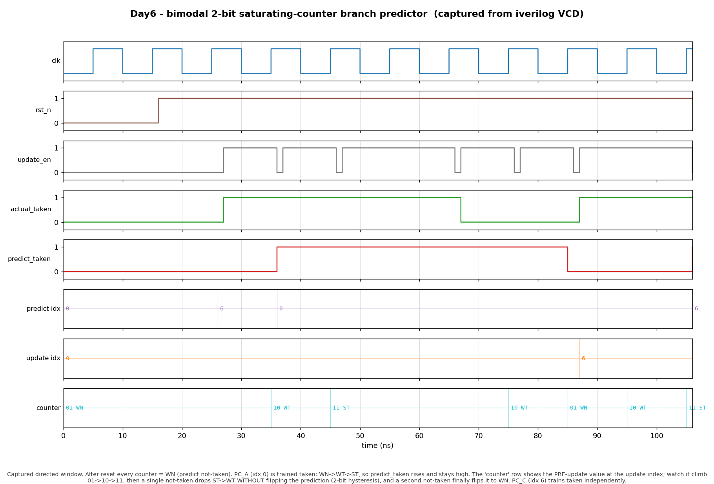

# Day 6 — Bimodal 2-bit Saturating-Counter Branch Predictor

A dynamic branch predictor built from a **Pattern History Table (PHT)** of
2-bit saturating counters, indexed by the branch's PC. This is the *bimodal*
predictor — the baseline every fancier scheme (gshare, tournament, TAGE) is
measured against, and the design that popularized the 2-bit counter.

## Why it matters

A modern pipeline fetches the next instruction long before a branch has
actually resolved. Guess wrong and the pipeline must be flushed, throwing away
several cycles of work. A predictor that is right ~90%+ of the time is the
difference between a pipeline that flows and one that stalls constantly.

The key insight this design captures is **hysteresis**. A naive 1-bit
predictor (remember only the last outcome) mispredicts a loop branch *twice*
per execution of the loop: once on the final not-taken exit, and again on the
first iteration of the next entry. A 2-bit saturating counter adds a "strength"
bit, so a single surprising outcome only *weakens* the prediction instead of
flipping it. A mostly-taken loop branch then mispredicts only on the one
iteration it exits — the classic result that made 2-bit counters standard.

## Features

- Parameterized PHT size (`INDEX_BITS`) and cold-start state (`RESET_STATE`).
- Independent **predict** (fetch-stage, combinational) and **update**
  (resolve-stage, synchronous) ports — the table can be queried for one PC
  while being trained by another, exactly as it sits in a pipeline.
- Textbook 4-state saturating FSM per counter.
- Reset-safe (all counters initialize to a known state), lint-clean,
  synthesizable RTL.
- Debug taps expose the selected indices and the pre-update counter value for
  observation and verification.

## The 2-bit saturating counter

Each PHT entry is a 2-bit up/down counter with saturation:

```
        taken            taken            taken
      ┌───────►        ┌───────►        ┌───────►
  ┌───────┐        ┌───────┐        ┌───────┐        ┌───────┐
  │  00   │        │  01   │        │  10   │        │  11   │
  │  SN   │        │  WN   │        │  WT   │        │  ST   │
  └───────┘        └───────┘        └───────┘        └───────┘
      ◄───────        ◄───────        ◄───────
      not-taken       not-taken        not-taken

  SN = Strongly Not-taken   WN = Weakly Not-taken
  WT = Weakly Taken         ST = Strongly Taken

  predict TAKEN  ⇔  counter MSB == 1   (states WT, ST)
```

`taken` outcomes push the counter toward `11` (saturating), `not-taken`
outcomes push it toward `00` (saturating). The MSB is the prediction.

## Parameters

| Parameter     | Default  | Description                                             |
|---------------|----------|---------------------------------------------------------|
| `XLEN`        | `32`     | Program-counter width.                                  |
| `INDEX_BITS`  | `4`      | PHT holds `2**INDEX_BITS` counters (16 by default).     |
| `RESET_STATE` | `2'b01`  | Cold-start counter value (weakly not-taken).            |

## Ports

| Port                 | Dir | Width          | Description                                        |
|----------------------|-----|----------------|----------------------------------------------------|
| `clk`                | in  | 1              | Clock.                                             |
| `rst_n`              | in  | 1              | Active-low async reset; loads every counter with `RESET_STATE`. |
| `pc_predict`         | in  | `XLEN`         | PC to predict for (fetch stage).                   |
| `predict_taken`      | out | 1              | Combinational prediction (MSB of indexed counter). |
| `update_en`          | in  | 1              | Assert to train a counter this cycle.              |
| `pc_update`          | in  | `XLEN`         | PC of the branch being resolved.                   |
| `actual_taken`       | in  | 1              | Resolved outcome used to train the counter.        |
| `dbg_predict_index`  | out | `INDEX_BITS`   | Index selected by `pc_predict`.                    |
| `dbg_update_index`   | out | `INDEX_BITS`   | Index selected by `pc_update`.                     |
| `dbg_update_counter` | out | 2              | Counter value at the update index *before* the update. |

The PHT is indexed by the word-aligned low PC bits
(`index = pc[INDEX_BITS+1:2]`), dropping the byte offset `pc[1:0]` because
RV32 instructions are word aligned.

## Block diagram

```
                       ┌──────────────────────────────────────────┐
   pc_predict ───►[idx]─┤                                          │
                       │        Pattern History Table (PHT)        │
                       │      2**INDEX_BITS × 2-bit counters       │
   pc_update  ───►[idx]─┤                                          │
                       └───────┬───────────────────────┬──────────┘
                               │ pht[pidx]              │ pht[uidx] = cur
                               │                        │
                               ▼                        ▼
                         predict_taken           ┌─────────────┐
                          (= cur[1])              │ saturating  │◄── actual_taken
                                                  │  next-state │
                                                  └──────┬──────┘
                                                         │ nxt
                                          update_en ───► write pht[uidx] on posedge
```

## Simulation timing



*Real waveform captured from an Icarus Verilog run* (`make icarus` dumps
`branch_predictor.vcd`; `make waveform` parses that VCD and plots it — nothing
in this image is hand-drawn). The window shows reset followed by the two
directed phases:

- After reset every counter is `WN` (`01`), so `predict_taken` is low.
- **PC_A** (index 0) is trained with `taken` outcomes. The `counter` row shows
  the pre-update value climbing `01 WN → 10 WT → 11 ST`; `predict_taken` rises
  as soon as the counter reaches `WT` and stays high.
- **Hysteresis:** a single `not-taken` outcome drops the counter `ST → WT`
  *without* flipping the prediction — the loop-exit case a 1-bit predictor
  would mispredict twice. A second `not-taken` finally flips it to `WN` and
  `predict_taken` falls.
- **Independence:** **PC_C** (index 6) is trained `taken` at its own index
  without disturbing PC_A, and the final prediction pulse confirms PC_C now
  predicts taken.

## How it works

1. **Predict (combinational).** `pc_predict` selects a PHT entry; the entry's
   MSB is driven out as `predict_taken`. Zero-latency so it fits the fetch
   stage.
2. **Update (synchronous).** When `update_en` is high, the counter at
   `pc_update`'s index moves one saturating step toward `actual_taken` on the
   next rising clock edge. The `always_comb` next-state block computes the
   `+1`/`-1`-with-saturation value; the `always_ff` block commits it.
3. **Reset.** An async-asserted `rst_n` reloads every counter with
   `RESET_STATE` (weakly not-taken), giving a deterministic cold start.

## Run it

```bash
make            # Icarus Verilog (default)
make verilator  # Verilator
make vcs        # Synopsys VCS
make questa     # Siemens Questa/ModelSim
make waveform   # regenerate docs/branch_predictor_waveform.png from the VCD
make clean
```

Expected output:

```
RESULT: *** PASS *** (all predictions matched golden model, 4000 random steps)
```

## What the testbench checks

`tb_branch_predictor.sv` runs an **independent behavioral golden model** (a
plain array of 2-bit counters updated with the same saturating rule) in
lockstep with the DUT and cross-checks:

- **Cold state** — every counter reads `WN`, so both PCs predict not-taken.
- **Directed FSM walk** — PC_A is driven up `WN → WT → ST` and pinned at `ST`
  under saturation; each prediction is compared to the golden model.
- **Hysteresis** — after a run of takens, one not-taken keeps the prediction
  `taken` (drops to `WT`), and a second not-taken flips it to `WN`.
- **Per-PC independence** — a second branch at a different index is trained the
  opposite way without perturbing the first.
- **Pre-update counter tap** — `dbg_update_counter` and `dbg_update_index` are
  checked against the golden model on every training step.
- **Randomized stress** — 4000 random `(pc, outcome)` pairs; the DUT and golden
  model must agree on every prediction.

A global timeout watchdog fails the run if it ever hangs. `RESULT: *** PASS
***` prints only when every check passed.
