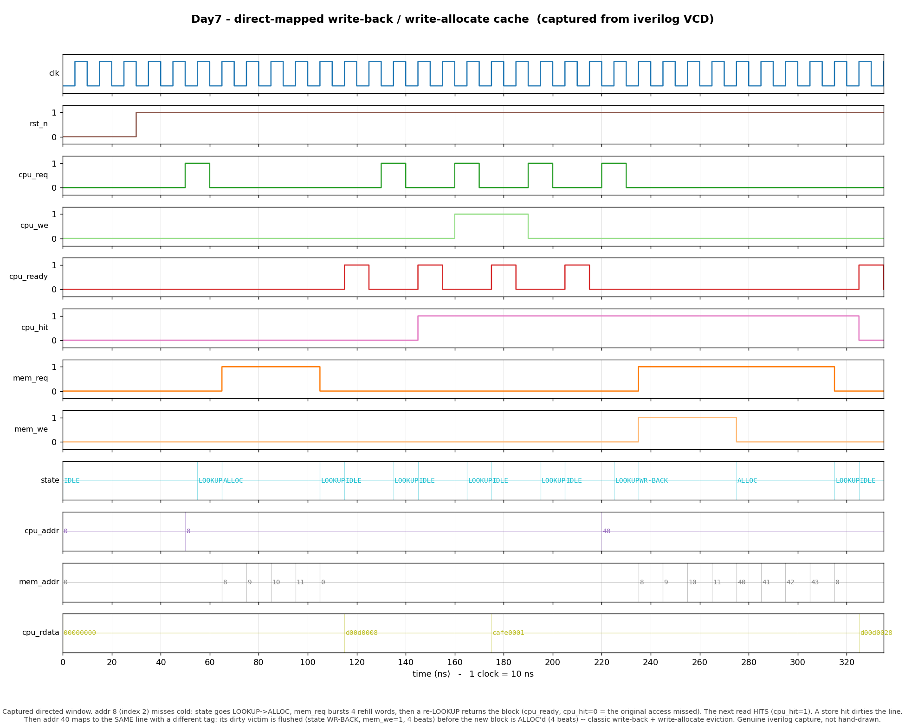

# Day 7 — Direct-Mapped Write-Back / Write-Allocate Data Cache

A synthesizable direct-mapped data cache with an explicit miss-handling FSM —
the canonical textbook cache that every memory-hierarchy chapter builds first.
It sits between a CPU (single word-wide request port with a ready handshake)
and a slower main memory (word-at-a-time burst port), and implements the two
classic write policies: **write-back** and **write-allocate**.

## The architectural concept, and why it matters

Main memory is ~100× slower than the core. A cache keeps recently used blocks
close, so most accesses complete in a cycle instead of stalling for a memory
round trip. The three questions every cache answers are *placement*, *policy on
a hit*, and *policy on a miss*:

- **Placement — direct-mapped.** Each address maps to exactly **one** line,
  chosen by its *index* bits. Placement is a single indexed lookup and one tag
  comparison — the cheapest, fastest organization, at the cost of *conflict
  misses* when two hot addresses map to the same line. It is the baseline that
  set-associative caches are measured against.

- **Hit policy — write-back.** A store that hits does **not** go to memory; it
  updates the cached word and sets a **dirty** bit. The block is flushed to
  memory lazily, only when it is evicted. This collapses many writes to the
  same line into a single memory write and is why real L1/L2 caches are
  write-back rather than write-through.

- **Miss policy — write-allocate.** A store that *misses* first **fetches** the
  block into the cache, then writes the word into it (rather than writing
  straight past the cache). Write-allocate pairs naturally with write-back and
  captures locality on write-heavy streams.

The interesting case — the one this project is built to show — is a **conflict
miss whose victim is dirty**: the cache must first *write the old block back* to
memory, *then* refill the new block, *then* complete the access. That
WRITEBACK → ALLOCATE → re-LOOKUP sequence is the heart of every cache
controller.

An address is split into three fields:

```
   |            tag            |  index  | offset |
    ADDR_BITS-1 ............             ....   1  0
    tag    = addr[ADDR_BITS-1 : OFFSET_BITS+INDEX_BITS]   identity check
    index  = addr[OFFSET_BITS +: INDEX_BITS]              which line
    offset = addr[OFFSET_BITS-1 : 0]                      word within the block
```

## Features

- Direct-mapped, parameterizable geometry (address width, word width, words per
  block, number of lines). Geometry (`OFFSET_BITS`, `INDEX_BITS`, `TAG_BITS`) is
  derived with `$clog2`.
- Write-back with a per-line **dirty** bit; write-allocate on store misses.
- Per-line **valid** and **tag** storage; cold state cleared on reset.
- Explicit 4-state miss-handling FSM (`IDLE → LOOKUP → {WRITEBACK} → ALLOCATE →
  LOOKUP`) that bursts one memory word per beat.
- Simple CPU **ready** handshake (single-cycle completion pulse) and a
  `cpu_hit` flag reporting whether the *original* access hit (not the internal
  post-refill re-lookup).
- Word-burst main-memory port (`mem_req/mem_we/mem_addr/mem_wdata/mem_rdata/
  mem_ready`) that works with a single-cycle-ready memory but tolerates a memory
  that stalls `mem_ready`.
- Reset-safe, lint-friendly synthesizable SystemVerilog; no simulation-only
  constructs in the design.

## Parameters

| Parameter     | Default | Meaning                                             |
|---------------|---------|-----------------------------------------------------|
| `ADDR_BITS`   | 12      | CPU / main-memory **word** address width            |
| `WORD_BITS`   | 32      | Data word width                                     |
| `BLOCK_WORDS` | 4       | Words per cache line (power of two, ≥ 2)            |
| `NUM_LINES`   | 8       | Number of cache lines (power of two)                |

Derived: `OFFSET_BITS = $clog2(BLOCK_WORDS)`, `INDEX_BITS = $clog2(NUM_LINES)`,
`TAG_BITS = ADDR_BITS − INDEX_BITS − OFFSET_BITS`. With the defaults: offset 2
bits, index 3 bits, tag 7 bits; line stride (addresses that collide on one line)
= `BLOCK_WORDS × NUM_LINES` = 32.

## Ports

| Port         | Dir | Width       | Description                                       |
|--------------|-----|-------------|---------------------------------------------------|
| `clk`        | in  | 1           | Clock                                             |
| `rst_n`      | in  | 1           | Active-low synchronous-fill / async-assert reset  |
| `cpu_req`    | in  | 1           | Pulse: start an access while in IDLE              |
| `cpu_we`     | in  | 1           | 1 = store, 0 = load                               |
| `cpu_addr`   | in  | `ADDR_BITS` | Word address                                      |
| `cpu_wdata`  | in  | `WORD_BITS` | Store data                                        |
| `cpu_rdata`  | out | `WORD_BITS` | Load data (valid with `cpu_ready`)                |
| `cpu_ready`  | out | 1           | 1-cycle pulse: access complete                    |
| `cpu_hit`    | out | 1           | Last completed access hit without a refill        |
| `mem_req`    | out | 1           | Memory request active                             |
| `mem_we`     | out | 1           | 1 = write-back beat, 0 = refill beat              |
| `mem_addr`   | out | `ADDR_BITS` | Word address of the current beat                  |
| `mem_wdata`  | out | `WORD_BITS` | Write-back data                                   |
| `mem_rdata`  | in  | `WORD_BITS` | Refill data                                       |
| `mem_ready`  | in  | 1           | Memory accepted / produced this beat              |
| `dbg_state`  | out | 2           | FSM state tap (0=IDLE 1=LOOKUP 2=WRITEBACK 3=ALLOCATE) |

## Block / datapath diagram

```
                 cpu_addr
        ┌───────────┴──────────────┐
        │ tag        index   offset │
        └──┬──────────┬────────┬────┘
           │          │        │
           │      ┌────▼─────┐  │      ┌──────────────────────────────┐
           │      │  index   │  │      │        miss-handling FSM       │
           │      │  select  │  │      │                                │
           │      └────┬─────┘  │      │  IDLE ──cpu_req──► LOOKUP       │
           │   ┌───────┼────────┼──┐   │            hit ─► IDLE (ready)  │
           │   │ valid[]│dirty[] │  │   │            miss:                │
           │   │ tag []  data[][]│  │   │      dirty ─► WRITEBACK ─┐      │
           │   └───┬────┬────┬───┘  │   │      clean ────────────► ALLOCATE
           │       │    │    │      │   │      ALLOCATE ─► LOOKUP (hit)   │
           ▼       ▼    │    ▼      │   └───────────────┬───────────────┘
        ┌────────────┐  │  ┌──────┐ │                   │ controls
        │ tag == ?   │  │  │ word │ │                   ▼
        │  &&  valid │  │  │ mux  │─┼──► cpu_rdata   ┌──────────────┐
        └─────┬──────┘  │  └──────┘ │                │ main-memory  │
              │ hit     │           │  mem_addr ────►│ burst port   │
              └─────────┴───────────┴─ mem_wdata ───►│ (write-back  │
                                       mem_rdata ◄───│  & refill)   │
                                                     └──────────────┘
```

## Simulation timing



*Genuine capture from a real Icarus Verilog run — `make icarus` dumps
`dm_cache.vcd` and `render_waveform.py` parses that VCD and draws it with
matplotlib. Nothing here is hand-modeled; every state, address, and data value
is read back out of the trace.*

The directed window (0–335 ns, 1 clock = 10 ns) reads as follows:

1. **Compulsory miss on addr 8** (index 2). `state` goes `LOOKUP → ALLOC`;
   `mem_req` rises and bursts the four refill words (`mem_addr` = 8, 9, 10, 11),
   the FSM re-enters `LOOKUP`, and `cpu_ready` pulses with **`cpu_hit = 0`** —
   the original access missed.
2. **Read hit** on addr 8 — completes in one lookup, `cpu_hit = 1`,
   `cpu_rdata = d00d0008`.
3. **Store hit** (`cpu_we = 1`) writes `cafe0001` and marks the line dirty; a
   read-back confirms the new value from the cache.
4. **Conflict miss on addr 40** — same line (index 2), different tag. The victim
   is dirty, so the FSM enters **`WR-BACK`** (`mem_we = 1`, flushing the old
   block back to `mem_addr` 8–11), *then* **`ALLOC`** (refilling `mem_addr`
   40–43), *then* re-`LOOKUP`. This is the full write-back + write-allocate
   eviction.

## How it works

- **Lookup / hit.** `hit = valid[index] && (tags[index] == tag)`. On a hit, a
  load muxes out `data[index][offset]`; a store writes that word and sets
  `dirty[index]`. `cpu_ready` pulses for one cycle.
- **Miss.** The FSM records that a refill was needed (`miss_seen`, so `cpu_hit`
  reflects the *original* outcome). If the resident line is `valid && dirty`, it
  goes to **WRITEBACK**; otherwise straight to **ALLOCATE**.
- **Writeback.** Bursts `BLOCK_WORDS` words from the resident line to the
  victim's old address `{tags[index], index, beat}`, one beat per `mem_ready`.
- **Allocate.** Bursts `BLOCK_WORDS` words in from `{tag, index, beat}`, filling
  the line, then sets `valid`, writes the new `tag`, clears `dirty`, and returns
  to **LOOKUP** — which now hits and completes the original access.
- The main-memory port uses a combinational address with a registered
  write, so it composes with a one-word-per-cycle memory model.

## Run

```bash
make            # Icarus Verilog (iverilog + vvp) — default
make verilator  # Verilator
make vcs        # Synopsys VCS
make questa     # Siemens Questa/ModelSim
make waveform   # regenerate docs/dm_cache_waveform.png from the VCD
make clean
```

Requires [Icarus Verilog](http://iverilog.icarus.com/) for the default target,
and Python 3 with `matplotlib` for `make waveform`.

## What the testbench checks

`tb_dm_cache.sv` is **self-checking** against a golden reference that captures
the whole point of a transparent cache: **the cache plus its backing main memory
must, as seen by the CPU, behave as one flat coherent memory.** The reference is
just an array `ref_mem[]` — every CPU store updates `ref_mem[addr]`, and every
CPU load must return `ref_mem[addr]`, no matter how many hits, misses,
evictions, or write-backs happened underneath. A wrong write-back or a bad
refill will surface as a later load mismatch.

- **Behavioral main memory** drives the `mem_*` port (combinational read,
  registered write). `main_mem` and `ref_mem` start identical and legitimately
  diverge only while a dirty line lives in the cache, re-converging on
  write-back — the CPU never observes that divergence because loads flow through
  the cache.
- **Directed stimulus** exercises every path: compulsory miss + allocate, a
  read hit, a store hit that dirties the line, a **conflict miss whose dirty
  victim forces a writeback**, and a re-read of an evicted address proving its
  dirtied data survived a full round trip out to main memory and back.
- **Randomized stimulus** — 2000 random loads/stores over a small, deliberately
  conflict-heavy 256-word window; every load is checked against `ref_mem`.
- A global **timeout watchdog** fails the run if it hangs; the design dumps
  `dm_cache.vcd`.

The bench prints per-access `[ ok ]` / `[FAIL]` lines with hit/miss annotation
and a summary, and emits **`RESULT: *** PASS ***`** only if every check passed.
On the reference Icarus run it reports `checks=979 hits=252 misses=1757
errors=0` and passes.
