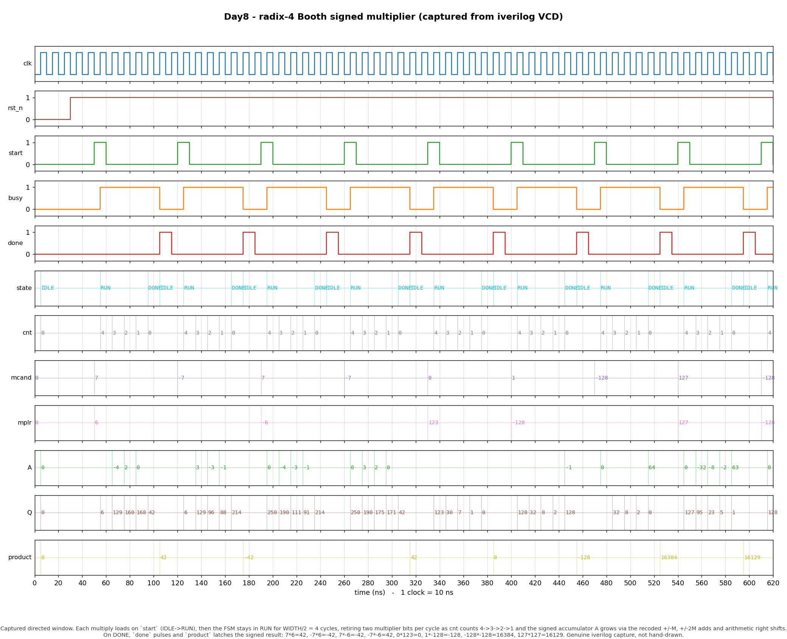

# Day 8 — Radix-4 (Modified) Booth Signed Sequential Multiplier

A parameterized, synthesizable **signed integer multiplier** built as a
classic **add/shift datapath with modified (radix-4) Booth recoding**, wrapped
in a small handshake FSM. It multiplies two `WIDTH`-bit signed operands into a
`2*WIDTH`-bit signed product in `WIDTH/2` iterations.

## Overview

Multiplication is one of the most latency- and area-sensitive operations in a
CPU's integer datapath. A naive shift-and-add multiplier processes **one**
multiplier bit per cycle and needs separate correction logic for signed
operands. **Booth's algorithm** fixes the sign problem for free by recoding runs
of 1s, and **modified (radix-4) Booth** goes further: it inspects the multiplier
**two bits at a time** (plus one bit of history) and retires **two bits per
cycle**, roughly halving the iteration count. This is exactly the encoding real
CPU integer multipliers and DSP MAC units use to shrink both latency and the
number of partial-product rows.

This day implements the **sequential** form: a single adder, a single
accumulator, and a right-shifting operand register that reuse the same hardware
every cycle — the smallest, most instructive expression of the idea before you
unroll it into a combinational Wallace/Dadda tree.

## The architectural concept — why radix-4 Booth matters

Consider the low three bits of the running multiplier window,
`{Q[1], Q[0], q_-1}`, where `q_-1` is the bit that was shifted out last time.
Radix-4 Booth maps that 3-bit pattern to a **single signed multiple** of the
multiplicand `M` to add into the accumulator, then shifts right by **two**:

| `Q[1] Q[0] q₋₁` | action | why |
|-----------------|--------|-----|
| `0 0 0`         | `+0`   | inside a run of 0s |
| `0 0 1`         | `+M`   | end of a run of 1s |
| `0 1 0`         | `+M`   | isolated 1 |
| `0 1 1`         | `+2M`  | end of a run of 1s |
| `1 0 0`         | `−2M`  | start of a run of 1s |
| `1 0 1`         | `−M`   | start of a run of 1s |
| `1 1 0`         | `−M`   | start of a run of 1s |
| `1 1 1`         | `+0`   | inside a run of 1s |

Two consequences fall straight out of this table:

1. **Signed operands need no special casing.** The `−M`/`−2M` entries make the
   most-significant Booth window subtract the multiplier's sign weight
   automatically, so two's-complement inputs multiply correctly with the *same*
   datapath — no sign-correction step.
2. **Half the iterations.** Because each step consumes two multiplier bits and
   arithmetic-shifts right by two, an `N`-bit multiply completes in `N/2`
   add/shift cycles instead of `N`.

The only cost is that the accumulator must be able to add `±2M`, so it carries
two extra guard bits.

## Features

- Parameterized operand width `WIDTH` (even), producing a `2*WIDTH` product.
- Textbook **A / Q / q₋₁** datapath: `(WIDTH+2)`-bit signed accumulator, a
  right-shifting multiplier register, and the Booth history bit.
- Single signed adder reused for `+M`, `+2M`, `−M`, `−2M`, and `+0`.
- **Arithmetic** (sign-preserving) right shift by two each iteration.
- 3-state handshake FSM (`IDLE → RUN → DONE`) with `start` / `busy` / `done`.
- Fully synchronous, active-low synchronous reset, reset-safe, lint-clean,
  `` `default_nettype none ``.

## Parameters

| Parameter | Default | Meaning | Constraint |
|-----------|---------|---------|------------|
| `WIDTH`   | `8`     | Signed operand width; product is `2*WIDTH` bits | must be **even** |

Derived internally: `IT = WIDTH/2` iterations, `AW = WIDTH+2` accumulator bits.

## Ports

| Port | Dir | Width | Description |
|------|-----|-------|-------------|
| `clk`          | in  | 1        | Clock (rising edge). |
| `rst_n`        | in  | 1        | Synchronous active-low reset. |
| `start`        | in  | 1        | Assert for one cycle (in `IDLE`) to latch operands and launch. |
| `multiplicand` | in  | `WIDTH`  | Signed multiplicand `M`. |
| `multiplier`   | in  | `WIDTH`  | Signed multiplier `Q`. |
| `product`      | out | `2*WIDTH`| Signed product; valid when `done` pulses. |
| `busy`         | out | 1        | High while iterating (`RUN`). |
| `done`         | out | 1        | One-cycle pulse: `product` is valid. |

## Datapath / block diagram

```
                 start
                   │  load
   multiplicand ─▶ M, 2M  (sign-extended, WIDTH+2 bits)
                   │
        ┌──────────┴─────────────────────────────────────┐
        │  radix-4 Booth step (combinational)             │
        │                                                 │
        │   {Q[1],Q[0],q₋₁} ─▶ recode ─▶ ±M / ±2M / 0     │
        │                          │                      │
        │                 ┌────────▼────────┐             │
        │        A ──────▶│   signed adder  │──▶ A_add    │
        │                 └────────┬────────┘             │
        │                          │                      │
        │        {A_add, Q, q₋₁} ──▶  >>> 2  (arith)      │
        │                          │                      │
        └──────────┬───────────────┴──────────┬───────────┘
                   ▼                           ▼
             A (accumulator)             Q (shifts right),  q₋₁
                   │                           │
                   └──────── {A, Q} ───────────┘
                                 │  after IT iterations
                                 ▼
                    product = {A, Q}[2*WIDTH-1:0]

   FSM:   IDLE ──start──▶ RUN ──(cnt: IT→1)──▶ DONE ──▶ IDLE
                          │  one add/shift per cycle │  done=1
```

## How it works (cycle by cycle)

1. **Load (`IDLE`, on `start`).** `A ← 0`, `Q ← multiplier`, `q₋₁ ← 0`,
   `M`/`2M` latch the sign-extended multiplicand, `cnt ← IT`, `busy ← 1`.
2. **Iterate (`RUN`, `IT` cycles).** Each cycle recodes `{Q[1],Q[0],q₋₁}`, adds
   the selected multiple into `A`, then arithmetic-shifts the whole
   `{A, Q, q₋₁}` vector right by two and decrements `cnt`. Two multiplier bits
   are retired per cycle.
3. **Finish (`DONE`).** After `IT` steps the `2*WIDTH`-bit product sits in the
   low bits of `{A, Q}`; it is latched into `product`, `done` pulses for one
   cycle, and the FSM returns to `IDLE`.

## Simulation timing



*Genuine capture from a real Icarus Verilog run — **not** a hand-drawn diagram.*
`make icarus` runs the self-checking testbench, which dumps `booth_mul.vcd`;
`render_waveform.py` parses that VCD and draws this window with matplotlib.
Every state, counter, and bus value shown is read straight out of the VCD.

The window is the eight directed multiplies the testbench issues first:
`7·6=42`, `−7·6=−42`, `7·−6=−42`, `−7·−6=42`, `0·123=0`, `1·−128=−128`,
`−128·−128=16384`, `127·127=16129`. On each `start`, the FSM enters `RUN` for
`WIDTH/2 = 4` cycles — watch `cnt` count `4→3→2→1` while the signed accumulator
`A` grows through the recoded `±M`/`±2M` adds and arithmetic shifts — and on
`DONE` the `done` pulse latches the correct signed `product`, including the sign
flips and the most-negative extremes.

## Running it

```bash
make            # Icarus Verilog (default): iverilog + vvp
make verilator  # Verilator
make vcs        # Synopsys VCS
make questa     # Siemens Questa / ModelSim
make waveform   # regenerate docs/booth_mul_waveform.png from booth_mul.vcd
make clean
```

Expected tail of a passing run:

```
checks run: 66044
RESULT: *** PASS ***
```

## What the testbench checks

`tb_booth_mul.sv` is **self-checking** against a golden reference — the plain
SystemVerilog signed product `a * b` — and compares every DUT result to it:

- **Directed corner cases** (also the rendered waveform window): all four
  sign combinations of `7·6`, multiply-by-zero, `1·−128`, and the extremes
  `−128·−128` and `127·127`.
- **Exhaustive signed sweep:** *all* `2^WIDTH × 2^WIDTH` operand pairs
  (65 536 for `WIDTH=8`) — full functional coverage of the recoding table for
  every operand, including the most-negative value.
- **Randomized burst:** 500 random signed pairs.
- **Timeout watchdog:** fails loudly if the FSM ever hangs without `done`.
- **VCD dump** (`booth_mul.vcd`) for waveform rendering.

It prints `RESULT: *** PASS ***` only if all 66 044 comparisons match. This run
was executed with Icarus Verilog and passed.
