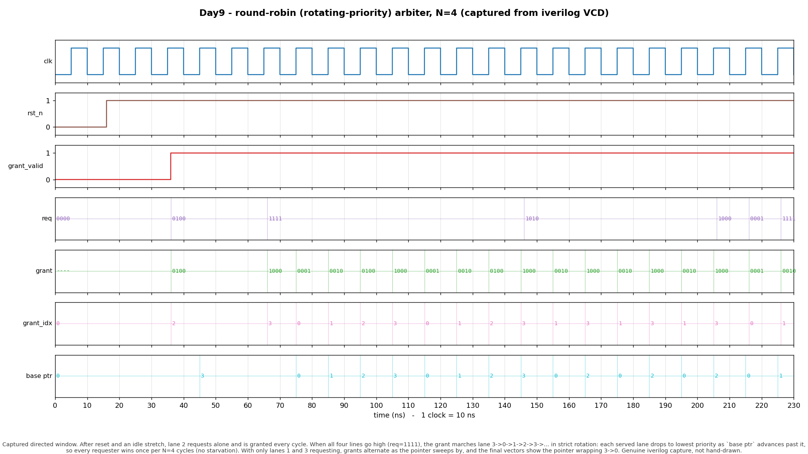

# Day 9 — Round-Robin (Rotating-Priority) Arbiter

A parameterized `N`-requester **round-robin arbiter**: the on-chip referee that
decides, cycle by cycle, which of several competing masters gets a single shared
resource — and does so *fairly*.

---

## Overview

Whenever more than one agent wants the same thing at the same time, hardware
needs an **arbiter**. Examples are everywhere in a computer:

- multiple cores (or a core + a DMA engine) contending for one memory port,
- several masters on a shared bus,
- load, store, and fetch units competing for one cache port,
- functional units competing for a single write-back / issue slot.

The simplest arbiter is **fixed priority**: lane 0 always wins over lane 1, etc.
That is cheap but *unfair* — a busy high-priority requester can **starve** the
others indefinitely. A **round-robin** arbiter fixes this: after a requester is
granted, it immediately drops to **lowest** priority, so priority *rotates*
around the ring. Under sustained contention every requester is served exactly
once per `N` cycles — a hard, provable **no-starvation** guarantee.

This design is single-cycle and combinational-grant with one small piece of
sequential state — the rotate pointer `base`. It is fully synthesizable,
reset-safe, and lint-clean (no variable bit-selects inside the combinational
process).

---

## The architectural concept & why it matters

Fairness is a *correctness* property in real systems, not a nicety. A bus
arbiter that starves a requester can deadlock a producer/consumer pair; an issue
arbiter that starves a functional unit destroys throughput guarantees. Round
robin is the canonical, cheap, and *provably fair* answer, which is why it shows
up in bus fabrics (AMBA, Wishbone), NoC routers, cache/memory controllers, and
instruction schedulers.

The core trick is **rotating priority**. Define each lane's priority *rank* as
its circular distance ahead of a pointer `base`:

```
rank(lane) = (lane - base) mod N     // 0 = highest priority
```

The arbiter grants the requesting lane with the smallest rank (i.e. the first
asserted request at or after `base`, wrapping past the top). After a grant, it
sets `base = granted_lane + 1 (mod N)`, so the just-served lane now has the
**largest** rank — lowest priority — next cycle. That single pointer update is
the whole fairness mechanism.

### Implementation without variable bit-selects

Rather than scan `req[base], req[base+1], …` with a variable index (awkward and
lint-noisy), the RTL computes the winner with fixed-width mask/shift ops:

```
lo_mask = (1 << base) - 1          // 1s on lanes below the pointer
hi      = req & ~lo_mask           // requests at/above the pointer
cand    = (hi != 0) ? hi : req     // wrap: if none above, use the whole vector
grant   = cand & (~cand + 1)       // isolate the LOWEST set bit -> one-hot
```

`cand & (-cand)` is the classic *isolate-lowest-set-bit* idiom, which is exactly
a priority pick from bit 0 upward. Masking off the lanes below `base` first, and
falling back to the full vector on wrap, turns that plain low-priority-first
encoder into a *rotating* one. A tiny one-hot→binary encoder produces
`grant_idx`.

---

## Features

- Parameterized number of requesters `N` (default 4); pointer width derived.
- One grant per cycle, **one-hot** `grant` output plus binary `grant_idx`.
- Provably fair: a continuously-asserted request is granted within `N` cycles.
- Purely combinational grant; single registered pointer as the only state.
- Active-low reset clears the pointer to lane 0.
- No variable bit-selects in `always_comb` (synthesis- and lint-friendly).
- Self-checking testbench with an independent reference model, directed +
  randomized stimulus, a live starvation monitor, a timeout, and VCD dump.

---

## Parameters

| Parameter | Default | Meaning |
|-----------|---------|---------|
| `N`       | `4`     | Number of requesters / grant lanes (`N >= 1`). |
| `IDXW`    | `$clog2(N)` (min 1) | Width of `grant_idx` / the `base` pointer. Derived — do not override. |

## Ports

| Port | Dir | Width | Description |
|------|-----|-------|-------------|
| `clk`         | in  | 1      | Clock (rising edge). |
| `rst_n`       | in  | 1      | Active-low asynchronous reset; clears `base` to 0. |
| `req`         | in  | `N`    | Request lines, one bit per requester (level, may change any cycle). |
| `grant`       | out | `N`    | One-hot grant. Exactly one bit set when any request is present; `0` when idle. |
| `grant_valid` | out | 1      | High iff `req != 0` (a grant is being issued this cycle). |
| `grant_idx`   | out | `IDXW` | Binary index of the granted lane (valid when `grant_valid`). |

---

## Block / datapath diagram

```
                 base (rotate pointer, IDXW bits, registered)
                   │
                   ▼
        ┌───────────────────────┐
 req ──►│ lo_mask = (1<<base)-1  │   mask off lanes below the pointer
   N    │ hi      = req & ~lo_mask│
        └───────────┬────────────┘
                    │ hi
                    ▼
             ┌──────────────┐
             │ cand = hi!=0 │  wrap: use whole req vector if
             │   ? hi : req │  nothing at/above the pointer
             └──────┬───────┘
                    │ cand
                    ▼
          ┌────────────────────┐
          │ grant = cand&(-cand)│  isolate lowest set bit  ─────► grant (one-hot, N)
          └─────────┬──────────┘
                    │
        ┌───────────┴───────────┐
        ▼                       ▼
 onehot2idx(grant) ─► grant_idx      grant_valid = |req
        │
        ▼   (on clk edge, if a grant occurred)
   base <= (grant_idx == N-1) ? 0 : grant_idx + 1     ← rotate past the winner
```

---

## How it works (cycle by cycle)

1. **Reset.** `base = 0`; lane 0 has highest priority.
2. **Grant (combinational).** Given `req` and `base`, mask off lanes below the
   pointer, isolate the lowest remaining set bit (wrapping to the full vector if
   necessary). That one-hot value is `grant`; its index is `grant_idx`.
3. **Rotate (sequential).** On the clock edge, if a grant occurred, advance
   `base` to `grant_idx + 1 (mod N)` so the served lane becomes lowest priority.
   If no request was present, `base` holds.
4. **Fairness.** Because the pointer always moves *past* the winner, a lane that
   keeps requesting climbs to highest priority within at most `N` cycles and is
   then guaranteed a grant — no starvation.

---

## Simulation timing



*Captured directed window from a real **iverilog** run (`make icarus` dumps
`rr_arbiter.vcd`; `render_waveform.py` parses that VCD with matplotlib — this is
a genuine simulator capture, **not** a hand-drawn diagram). After reset and an
idle stretch, lane 2 requests alone and is granted every cycle (`base` advances
to 3). When all four lines go high (`req=1111`), the grant marches
`1000 → 0001 → 0010 → 0100 → 1000 …` — lanes 3→0→1→2→3… in strict rotation —
while `base ptr` chases each winner, so every requester wins exactly once per
`N=4` cycles. With only lanes 1 and 3 requesting (`req=1010`) the grants
alternate as the pointer sweeps past, and the closing vectors show the pointer
wrapping 3→0.*

---

## Running it

Icarus Verilog is the default and needs nothing else:

```bash
make            # iverilog + vvp: compile & run the self-checking TB
make waveform   # regenerate docs/rr_arbiter_waveform.png from the VCD
make clean
```

Other simulators (if installed):

```bash
make verilator
make vcs
make questa
```

A passing run prints:

```
RESULT: *** PASS *** (422 checks, 0 mismatches)
```

> Verified with Icarus Verilog (`iverilog -g2012`): **PASS**, 422 checks, 0
> mismatches. The waveform PNG is rendered from the VCD produced by that run.

---

## What the testbench checks

The testbench (`tb_rr_arbiter.sv`) contains an **independent reference model**
that re-implements the rotating-priority rule from scratch and tracks its own
copy of the `base` pointer. Every cycle it compares against the DUT:

- **`grant_valid`** matches `req != 0`.
- **`grant`** matches the reference one-hot exactly.
- **`grant_idx`** matches the reference winner index.
- **One-hot invariant:** `grant` never has more than one bit set.
- **Legality:** `grant` is always a subset of `req` (never grants an
  unrequested lane).
- **No starvation:** a per-lane monitor asserts that any lane holding its
  request continuously is granted within `N` cycles.

Stimulus is **directed** (idle, a single persistent requester, full contention
showing the fair rotation, a two-requester alternation, and a pointer-wrap case)
followed by **400 randomized** request masks from a deterministic xorshift32
generator. A global timeout guards against a hang. Only if *every* check passes
does the TB print `RESULT: *** PASS ***`.
