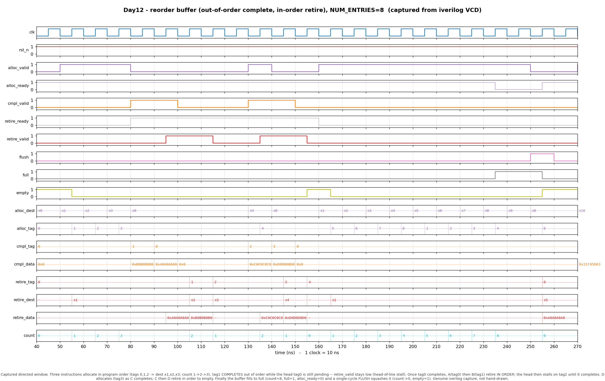

# Day 12 — Reorder Buffer (out-of-order complete, in-order retire)

A **Reorder Buffer (ROB)** — the structure at the heart of every out-of-order
processor that lets instructions *execute and complete in any order* while their
architectural results are *committed strictly in program order*.

## Overview

Modern cores issue instructions to many functional units that finish at
different times: a cache hit returns in a cycle, a divide takes dozens, a load
that misses takes hundreds. To keep the machine fast we must let these finish
**out of order**. But the architectural state (registers, memory, exceptions)
must appear to update in the *original program order* so the machine is
precise — a mispredicted branch or a faulting instruction has to leave behind
exactly the state a simple in-order machine would have produced.

The ROB reconciles the two. Every dispatched instruction reserves one ROB entry
**in program order** (allocate). Functional units later mark arbitrary entries
finished and drop their results in (**complete**, out of order). Only the
**head** entry is allowed to commit, and only once its *done* bit is set
(**retire**, in order). A younger instruction that finished early simply waits
in its slot until every older instruction ahead of it has retired.

This is the first project in the series to model **out-of-order execution**; it
builds naturally on the in-order pieces from Days 1–5 and the
[Store Buffer](../day11-store_buffer/) (Day 11), which similarly decouples completion from a
program-ordered drain.

## Why it matters

- **Precise state / recovery.** Because commit is in order, the head of the ROB
  is a clean checkpoint. On a branch mispredict or exception the whole window of
  speculative, not-yet-committed instructions is squashed in one shot
  (`flush`), and the architectural state is exactly right.
- **Register renaming anchor.** In a real machine the ROB entry index (the
  *tag*) names an instruction's result before it is written back, letting
  dependents wait on a tag rather than an architectural register — the basis of
  Tomasulo-style renaming.
- **Decoupling.** Execution latency is hidden: fast instructions pile up
  completed behind a slow one without stalling the units that produced them.

## Features

- Parameterized depth (`NUM_ENTRIES`, power of two), payload width, and
  destination-register width.
- Three fully decoupled ports — allocate (tail), complete (any live entry),
  retire (head) — each with its own valid/ready handshake.
- Circular head/tail pointers with an extra wrap bit, so **full** and **empty**
  are distinguished without wasting a slot.
- Single-cycle **flush** that squashes the entire in-flight window (mispredict /
  exception recovery).
- Reset-safe, lint-friendly, `default_nettype none`, synthesizable RTL. No
  variable bit-selects of vectors (only array indexing).
- A simulation-only assertion catches completions to unallocated tags.

## Parameters

| Parameter | Default | Meaning |
|-----------|---------|---------|
| `NUM_ENTRIES` | 8 | ROB depth (number of in-flight entries; power of two) |
| `DATA_WIDTH` | 32 | Width of the result payload stored per entry |
| `REG_ADDR_W` | 5 | Width of the destination architectural register id |

Derived: `TAG_W = $clog2(NUM_ENTRIES)` (entry-index / tag width),
`PTR_W = TAG_W + 1` (pointer width, including the wrap bit).

## Ports

| Port | Dir | Width | Description |
|------|-----|-------|-------------|
| `clk` | in | 1 | Clock |
| `rst_n` | in | 1 | Asynchronous active-low reset |
| `alloc_valid` | in | 1 | A newly dispatched instruction wants an entry |
| `alloc_ready` | out | 1 | Buffer has room (`= ~full`) |
| `alloc_dest` | in | `REG_ADDR_W` | Destination register id to record |
| `alloc_tag` | out | `TAG_W` | Tag (entry index) handed to the allocator |
| `cmpl_valid` | in | 1 | A functional unit is completing an entry |
| `cmpl_tag` | in | `TAG_W` | Tag of the completing entry (out of order) |
| `cmpl_data` | in | `DATA_WIDTH` | Result value written into that entry |
| `retire_ready` | in | 1 | Downstream (register write-back) can accept a commit |
| `retire_valid` | out | 1 | Head entry exists **and** is done |
| `retire_tag` | out | `TAG_W` | Tag of the committing (head) entry |
| `retire_dest` | out | `REG_ADDR_W` | Destination register of the head entry |
| `retire_data` | out | `DATA_WIDTH` | Result of the head entry |
| `flush` | in | 1 | Squash the entire buffer this cycle |
| `full` | out | 1 | No free entries |
| `empty` | out | 1 | No live entries |
| `count` | out | `TAG_W+1` | Number of live entries (0..`NUM_ENTRIES`) |

An allocate fires when `alloc_valid & alloc_ready`; a retire fires when
`retire_valid & retire_ready`. `flush` takes priority over all three in the same
cycle.

## Block / datapath diagram

```
                              REORDER BUFFER (circular queue of NUM_ENTRIES)

     allocate (in order)                                     retire (in order)
     alloc_valid ─┐                                          ┌─ retire_valid = ~empty & done[head]
     alloc_dest ──┤                                          │  retire_tag  = head index
                  ▼   tail_ptr                    head_ptr   ▼  retire_dest = dest[head]
        ┌───────────────────────────────────────────────────────┐
        │  idx:   0     1     2     3     4     5     6     7      │
        │ valid[ ] ─┬─────┬─────┬─────┬─────┬─────┬─────┬─────┐   │
        │ done [ ] ─┤  0  │  1  │  1  │  0  │  .  │  .  │  .  │   │
        │ dest [ ] ─┤ x1  │ x2  │ x3  │ x4  │     │     │     │   │
        │ data [ ] ─┴─────┴─────┴─────┴─────┴─────┴─────┴─────┘   │
        └───────────────────────────────────────────────────────┘
             ▲ head=0 (tag0 not done → STALL)      ▲ tail=4 (next alloc → tag4)
             │
             └── complete (OUT OF ORDER): cmpl_valid/cmpl_tag/cmpl_data
                 sets done[cmpl_tag]=1, data[cmpl_tag]=result for ANY live entry

   full  = (head_idx == tail_idx) & (head_wrap != tail_wrap)     count = tail_ptr - head_ptr
   empty = (head_ptr == tail_ptr)                                flush = clear all, head=tail=0
```

Retirement drains from the head; allocation appends at the tail; completion
pokes any live entry's *done* bit. The head only advances when its *done* bit is
set — that single rule is what turns arbitrary completion order back into
program-order commit.

## Simulation timing



*Captured directed window (t = 40–270 ns) from a real Icarus Verilog run —
`make icarus` dumps `reorder_buffer.vcd` and `render_waveform.py` parses it;
this is a genuine simulator capture, **not** a hand-drawn diagram.* Reading left
to right: three instructions allocate in program order (tags 0,1,2 → dest
x1,x2,x3; `count` climbs 1→2→3). Then **tag1 completes out of order** while the
head (tag0) is still pending — `retire_valid` stays low, the classic
head-of-line stall. Once tag0 completes, **A(tag0) then B(tag1) retire in
order**; the head then stalls on tag2 until it completes. D allocates (tag3) as
C completes, and C then D retire in order back to empty. Finally the buffer is
filled to **full** (`count` = 8, `full` = 1, `alloc_ready` = 0 so an over-
allocate is ignored) and a single-cycle **`flush`** squashes everything
(`count` → 0, `empty` = 1).

## How it works

- **Pointers.** `head_ptr` and `tail_ptr` are `TAG_W+1` bits. The low `TAG_W`
  bits index the entry arrays; the top bit is a wrap phase so a full buffer
  (same index, opposite phase) is distinct from an empty one (identical
  pointers). `count = tail_ptr - head_ptr` is exact in `0..NUM_ENTRIES`.
- **Allocate.** When `alloc_valid & ~full`, the tail slot records `alloc_dest`,
  clears its *done* bit, sets *valid*, and `tail_ptr` increments. The returned
  `alloc_tag` is the tail index — the instruction's handle for later completion.
- **Complete (out of order).** When `cmpl_valid`, `done[cmpl_tag]` is set and
  `data[cmpl_tag]` captures the result. Any live entry may complete in any
  order; this never touches the pointers.
- **Retire (in order).** `retire_valid = ~empty & done[head]`. When the sink is
  ready, the head entry is invalidated and `head_ptr` advances. Because only the
  head commits and only when *done*, commit order is exactly program order.
- **Flush.** Overrides everything: `head_ptr`/`tail_ptr` reset to 0 and all
  *valid*/*done* bits clear in a single cycle — precise recovery from a
  mispredict or exception.
- Same-cycle allocate + retire touch different indices (tail vs. head) and are
  independent; the retire update is ordered last in the RTL so a boundary
  collision resolves in favour of freeing the slot.

## Running it

```bash
make            # Icarus Verilog (default): iverilog + vvp
make verilator  # Verilator
make vcs        # Synopsys VCS
make questa     # Siemens Questa/ModelSim
make waveform   # regenerate docs/reorder_buffer_waveform.png from the VCD
make clean
```

Verified with **Icarus Verilog** (`iverilog -g2012`); the run prints:

```
RESULT: *** PASS *** (directed + 4000 random cycles matched the golden model)
```

## What the testbench checks

`tb_reorder_buffer.sv` is **self-checking against an independent golden model**
written as ordered SystemVerilog queues (`refq_*`) plus a predicted next-tag
counter — a deliberately different description from the DUT's circular-pointer
RTL. Every cycle, *before* the clock edge, it compares all combinational DUT
outputs against the model:

- `alloc_ready`, `full`, `empty`, `count`, and the handed-out `alloc_tag`;
- `retire_valid` (must equal "head exists **and** is done"), and when valid,
  `retire_tag` / `retire_dest` / `retire_data` against the model's head entry.

It then applies the *same* allocate/complete/retire/flush decisions to both DUT
and model. Coverage:

- **Directed scenario** — out-of-order completion, in-order retirement, the
  head-of-line stall (younger entry done while an older one is not), filling to
  full with backpressure, and a full-window squash.
- **Randomized scenario** — 4000 cycles of random allocate / complete (always to
  a *live, not-yet-done* entry) / retire / occasional flush, plus a final ordered
  drain to empty.

A watchdog `$fatal`s on hang, and a simulation-only assertion in the RTL flags
any completion aimed at an unallocated tag. `RESULT: *** PASS ***` prints only
if **zero** mismatches were seen across every directed and random cycle.
