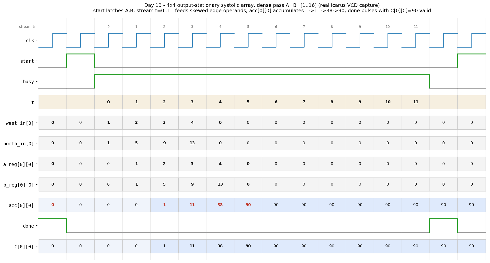

# Day 13 — Output-Stationary Systolic Array (Matrix-Multiply MAC Grid)

A **systolic array** — the spatial multiply-accumulate (MAC) fabric that a GPU
**Tensor Core** and a TPU **MXU** are built from. An `N × N` grid of tiny
processing elements (PEs) computes a full dense matrix product
`C = A × B` while data flows through the array in lock-step, using only
nearest-neighbour wiring and a handful of operands crossing the array edges each
cycle.

## Overview

Matrix multiply is the dominant kernel of deep learning, graphics, and
scientific compute, and it is embarrassingly rich in reuse: an `N × N × N`
multiply performs `N³` MACs but touches only `3N²` input/output elements. A
systolic array turns that reuse into hardware. Instead of one ALU reading a
register file `N³` times, we lay down `N²` PEs, keep each partial result
*stationary* in its own PE, and **stream** the operands past them so every value
fetched from the edge is reused across an entire row or column.

This design is **output-stationary**: PE`(i,j)` owns output element `C[i][j]`
and holds a running accumulator for it. Operand `A` streams **west → east**
along each row; operand `B` streams **north → south** down each column. The two
operand streams are fed in a **time-skewed (diagonal)** pattern so that `A[i][k]`
and `B[k][j]` land on PE`(i,j)` during the *same* cycle for every `k`; the PE
multiplies them and folds the product into its accumulator. After the array
drains, each PE holds one complete dot product and `C = A × B` is done.

It is a natural spatial-compute companion to the earlier arithmetic and
scheduling blocks in this series — e.g. the sequential [Booth multiplier](../day08-booth_multiplier/)
(Day 8), which computes a *single* product in time, where this array computes an
entire *matrix* of products in space.

## Why it matters

- **Tensor Cores / MXUs.** This west-east / north-south skewed dataflow *is* the
  textbook systolic MXU. Understanding operand skew, per-PE accumulation, and
  fill/drain latency is exactly the mental model behind GPU matrix-math units.
- **Bandwidth, not just FLOPs.** Keeping each partial sum stationary means the
  `O(N³)` accumulations run with only `O(N)` operand traffic per cycle at the
  edges — the reason these arrays scale to hundreds of PEs at high clock rates
  without a huge register-file port count.
- **Locality = frequency.** Every wire is PE-to-neighbour and every PE is an
  identical multiply-add-register tile, so the array is trivially pipelined and
  timing-closes at high frequency; growth is just replication.
- **Deterministic latency.** The result is guaranteed valid a fixed `3N` cycles
  after `start`, which makes it easy to schedule inside a larger accelerator.

## Features

- Parameterized array dimension `N` and signed operand / accumulator widths
  (`IN_W`, `ACC_W`); computes `(N×N) × (N×N)` signed two's-complement products.
- Internal **skew feeder** generates the diagonal operand schedule from latched
  operands — the caller just presents flat `A`, `B` and pulses `start`.
- `N × N` grid of identical MAC PEs with local A-east / B-south propagation and
  a per-PE accumulator (output-stationary).
- `start` / `busy` / `done` handshake; deterministic `3N`-cycle latency, with
  `done` a single-cycle pulse marking `c_out` valid.
- Reset-safe, lint-friendly, `default_nettype none`, synthesizable RTL. **No
  variable bit-selects of packed vectors** — the flat-port ↔ 2-D unpacking uses
  constant `genvar` offsets and the datapath uses array indexing only.

## Parameters

| Parameter | Default | Meaning |
|-----------|---------|---------|
| `N`       | 4  | Array dimension; computes an `N×N` by `N×N` product |
| `IN_W`    | 8  | Signed input element width (bits) |
| `ACC_W`   | 32 | Signed accumulator / output element width (bits) |

## Ports

| Port    | Dir | Width           | Meaning |
|---------|-----|-----------------|---------|
| `clk`   | in  | 1               | Clock |
| `rst_n` | in  | 1               | Active-low reset (clears array + control) |
| `start` | in  | 1               | Pulse to latch `A`, `B` and begin a pass |
| `a_in`  | in  | `N*N*IN_W`      | Row-major operand `A` (signed elements) |
| `b_in`  | in  | `N*N*IN_W`      | Row-major operand `B` (signed elements) |
| `busy`  | out | 1               | High while a pass is streaming |
| `done`  | out | 1               | 1-cycle pulse; `c_out` is valid |
| `c_out` | out | `N*N*ACC_W`     | Row-major result `C = A × B` (signed) |

Flat buses pack element `(i,j)` at bit offset `(i*N + j)*W +: W`, row-major.

## Datapath diagram

Output-stationary `4×4` grid. `A` rows enter from the west; `B` columns enter
from the north. Each operand is delayed one extra cycle per PE it crosses, and
the edge feed is skewed so matching `A[i][k]`/`B[k][j]` meet at PE`(i,j)`:

```
              B[*][0]   B[*][1]   B[*][2]   B[*][3]      (stream south, skewed)
                 |         |         |         |
                 v         v         v         v
   A[0][*] --> (0,0) --> (0,1) --> (0,2) --> (0,3)      each PE:
   (east)         \         \         \         \         a_out <= a_in
                   v         v         v         v        b_out <= b_in
   A[1][*] --> (1,0) --> (1,1) --> (1,2) --> (1,3)        acc   <= acc + a_in*b_in
                   \         \         \         \
                    v         v         v         v     C[i][j] accumulates in
   A[2][*] --> (2,0) --> (2,1) --> (2,2) --> (2,3)      PE(i,j); after 3N cycles
                    \         \         \         \      every acc holds a full
                     v         v         v         v     dot product.
   A[3][*] --> (3,0) --> (3,1) --> (3,2) --> (3,3)
```

Feed schedule (cycle `t`): the west edge of row `i` presents `A[i][t-i]` and the
north edge of column `j` presents `B[t-j][j]` (zero when out of range). The
value used by PE`(i,j)` on cycle `t` is `A[i][k]·B[k][j]` with `k = t-1-i-j`, so
the last term of the far-corner dot product is accumulated by cycle `3N-2`.

## Simulation timing



*Real waveform captured from the Icarus Verilog run (`systolic_array.vcd`,
rendered by `render_waveform.py`) — **not** a hand-drawn mock-up. This is the
dense directed case `A = B = [[1..4],[5..8],[9..12],[13..16]]`. After `start`
latches the operands, `busy` rises and the stream counter `t` walks `0 → 11`.
The west edge feeds row 0 with `A[0][*] = 1,2,3,4` and the north edge feeds
column 0 with `B[*][0] = 1,5,9,13`; these appear at `a_reg[0][0]` / `b_reg[0][0]`
one cycle later and PE(0,0) accumulates `acc[0][0]`:
`1 → 11 → 38 → 90` (= 1·1 + 2·5 + 3·9 + 4·13). When the array has fully drained,
`done` pulses for one cycle and `C[0][0] = 90` is valid on `c_out`.*

## How it works

1. **Latch & clear (`start`).** On a `start` pulse the flat `a_in`/`b_in` are
   captured into internal `A_mem`/`B_mem`, every PE accumulator and operand
   register is cleared, the stream counter `t` resets, and `busy` asserts.
2. **Skewed feed.** A combinational feeder drives the west input of each row and
   the north input of each column from `A_mem`/`B_mem` using the schedule above,
   emitting zero outside each operand's valid window.
3. **Stream & MAC.** Each cycle every PE (a) accumulates the product of the
   operands currently latched at it, then (b) passes its A operand east and its B
   operand south, while the edges pull in the next skewed operands. Zeros fed at
   the edges contribute harmless `×0` terms during fill/drain.
4. **Done.** After `3N` cycles the far-corner dot product's last term has been
   accumulated; `busy` drops, `done` pulses one cycle, and `c_out` holds
   `C = A × B`.

## Run it

```bash
make            # Icarus: compile + run the self-checking TB
make waveform   # regenerate docs/systolic_array_waveform.png from the VCD
make verilator  # or Verilator
make clean
```

Expected tail of the transcript:

```
  [seq*seq ] 4x4 product checked -   ok
  [signed  ] 4x4 product checked -   ok
  ...
Ran 29 matmul cases, 0 element mismatches.
RESULT: *** PASS ***
```

## What the testbench checks

`tb_systolic_array.sv` is **self-checking** against an independent golden model —
a plain triple-nested signed integer matrix multiply computed in the testbench.
For every pass it packs `A`/`B`, pulses `start`, waits for `done`, and compares
all `N²` result elements against the reference:

- **Directed:** `I × seq` and `seq × I` (identity passthrough both ways), a
  zero operand, a dense all-positive `seq × seq`, and a mixed-sign case that
  exercises signed two's-complement accumulation.
- **Randomized:** 24 passes of full-range random signed byte matrices.
- **Termination:** a global watchdog fails loudly if `done` never arrives.

The bench prints `RESULT: *** PASS ***` only when **all 29 passes** match the
golden model with zero element mismatches, and dumps `systolic_array.vcd` for
the waveform above.

> Toolchain note: results here were produced with **Icarus Verilog** (`iverilog`
> + `vvp`); the waveform PNG is rendered directly from that run's VCD.
