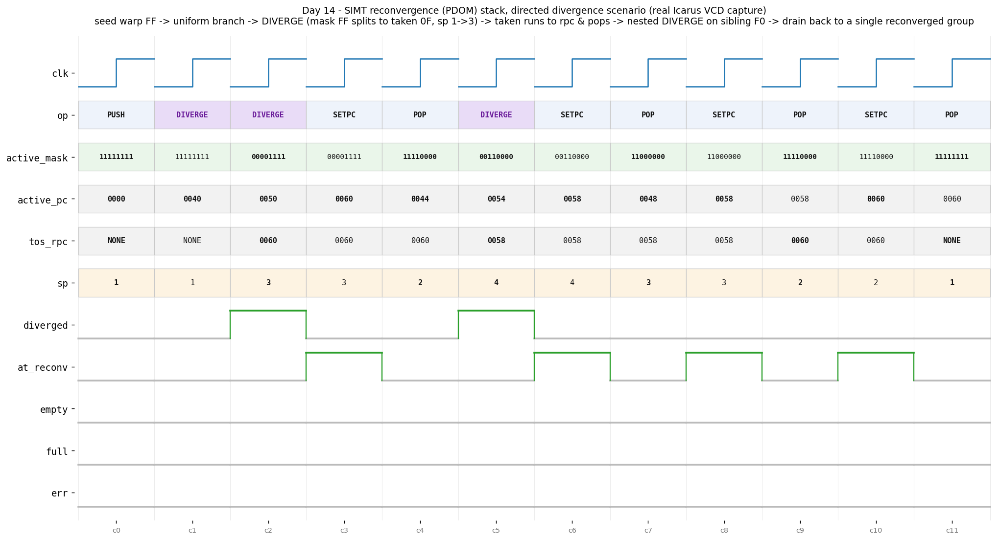

# Day 14 — SIMT Reconvergence (PDOM) Stack

The hardware structure a modern GPU uses to run a **warp** of lock-step threads
through **divergent** control flow — the *post-dominator (PDOM) reconvergence
stack*. This is the mechanism behind NVIDIA's SIMT execution model: how a single
program counter drives many threads, splits them cleanly at a data-dependent
branch, and — crucially — brings them **back together** at the earliest point
where both paths meet again.

## Overview

A GPU executes threads in fixed-width bundles called **warps** (NVIDIA: 32
threads; here a parameterizable `NLANES`). All lanes of a warp share **one**
instruction stream and one program counter — Single-Instruction, Multiple-Thread
(SIMT). That is wonderfully efficient right up until a branch whose condition is
*different per lane*: `if (threadIdx.x < 4) ... else ...`. Now some lanes want to
go one way and the rest the other, but there is still only one PC.

The SIMT solution is to **serialize** the two sides while tracking, per lane, who
is still "live", and to remember the single address where the two sides rejoin —
the branch's **immediate post-dominator** (the reconvergence PC, `RPC`). A small
hardware **stack** does exactly this. Each entry is a *thread group*:

```
entry = { mask,  pc,   rpc }
          │      │      └─ address where THIS group must reconverge (pop itself)
          │      └───────── next PC this group will fetch
          └──────────────── one active bit per lane in the group
```

The **top of stack (TOS)** is the group issued this cycle. On a divergent branch
the TOS is turned into a *join* entry (its `pc` is redirected to the `RPC`), and
the two divergent paths are pushed on top. Execution proceeds along the topmost
path; when a path's `pc` reaches its own `rpc` it is finished and popped,
exposing its sibling, and finally the join entry — at which point **all** the
original lanes run together again from the reconvergence point. Nested branches
simply recurse on the same stack.

## Why it matters

- **This *is* the SIMT model.** Warp divergence and reconvergence is the single
  most important control-flow concept in GPU microarchitecture. Interviewers for
  GPU/accelerator roles expect you to be able to draw this stack and walk a
  divergent `if/else` through it.
- **Performance intuition.** Because the two sides run serially, a fully
  divergent branch halves throughput (only part of the warp is active at a time).
  Understanding the stack explains *why* "avoid warp divergence" is the first
  rule of CUDA kernel optimization, and why the mask shrinks as you nest.
- **Precise, structured control.** The immediate-post-dominator discipline
  guarantees reconvergence at the *earliest* legal point, maximizing how quickly
  lanes rejoin — a real design tension in GPU front-ends (PDOM vs. thread
  frontiers vs. modern per-thread PC / independent thread scheduling on Volta+).
- **Companion to the array.** [Day 13](../day13-systolic_array/) built the systolic MAC grid
  (the datapath a Tensor Core streams through); this is the **control** side of
  the same machine — how the front-end keeps a warp coherent across branches
  before it ever reaches the math units.

## Features

- Parameterizable warp width `NLANES`, stack `DEPTH`, and PC width `PC_W`.
- Single-op-per-cycle command interface: `PUSH` (seed a warp), `SETPC` (uniform
  advance), `DIVERGE` (split), `POP` (reconverge).
- **Automatic uniform-branch detection**: if every active lane takes the same
  direction, `DIVERGE` degenerates to a plain retarget — *no* stack growth, no
  wasted depth (exactly what real hardware does for coherent branches).
- Correct **nested** divergence to arbitrary depth (bounded by `DEPTH`).
- Status outputs: `active_mask` / `active_pc` / `tos_rpc` for the issue stage,
  `sp` / `empty` / `full` for occupancy, a 1-cycle `diverged` pulse, an
  `at_reconv` flag (`active_pc == tos.rpc`) that tells the controller exactly
  when to `POP`, and a **sticky `err`** for overflow / underflow / bad opcode.
- Reset-safe, lint-clean (`-Wall`, no warnings), synthesizable. Stack storage is
  parallel `mask`/`pc`/`rpc` arrays indexed by a single count register — no
  variable bit-selects of packed vectors.

## Parameters

| Parameter | Default | Meaning |
|-----------|---------|---------|
| `NLANES`  | 8       | Threads per warp (SIMT width). One `mask` bit per lane. |
| `DEPTH`   | 16      | Stack depth. A single divergence uses 2 slots (+ the join); size for `2·maxNesting + 1`. |
| `PC_W`    | 16      | Program-counter / RPC width. |

## Ports

| Port | Dir | Width | Description |
|------|-----|-------|-------------|
| `clk` | in | 1 | Clock. |
| `rst_n` | in | 1 | Active-low synchronous reset (clears the stack). |
| `op` | in | 3 | Operation: `0`=NOP, `1`=PUSH, `2`=SETPC, `3`=DIVERGE, `4`=POP. |
| `in_mask` | in | `NLANES` | PUSH: initial active mask for the seeded warp. |
| `in_pc` | in | `PC_W` | PUSH / SETPC: PC value. |
| `div_taken` | in | `NLANES` | DIVERGE: per-lane "takes the branch" predicate. |
| `div_tpc` | in | `PC_W` | DIVERGE: taken-path target PC. |
| `div_fpc` | in | `PC_W` | DIVERGE: fall-through target PC. |
| `div_rpc` | in | `PC_W` | DIVERGE: reconvergence PC (immediate post-dominator). |
| `active_mask` | out | `NLANES` | TOS mask — the lanes to issue this cycle (`0` when empty). |
| `active_pc` | out | `PC_W` | TOS pc — the PC to fetch this cycle. |
| `tos_rpc` | out | `PC_W` | TOS reconvergence PC (`0xFFF…` = base warp, never reconverges). |
| `sp` | out | `clog2(DEPTH+1)` | Entry count (0…`DEPTH`). |
| `empty` / `full` | out | 1 | Occupancy flags. |
| `at_reconv` | out | 1 | `!empty && active_pc == tos.rpc` → controller should `POP`. |
| `diverged` | out | 1 | 1-cycle pulse: the last `DIVERGE` actually split. |
| `err` | out | 1 | Sticky: overflow, underflow, or undefined opcode. |

## Block / datapath diagram

```
                          op ─┬─ PUSH ─────────────┐
                              ├─ SETPC ───────┐     │
        div_taken ─┐          ├─ DIVERGE ─┐   │     │
        div_tpc  ──┤          └─ POP ──┐  │   │     │
        div_fpc  ──┤  ┌───────────────┼──┼───┼─────┼──────────┐
        div_rpc  ──┤  │  reconvergence stack (mask / pc / rpc arrays)      │
                   │  │                                                    │
   cur_mask ┌──────┴─▼──────┐        ┌───────── index = sp ───────────┐    │
   ─────────►  split logic  │        │  ┌──────────────────────────┐  │    │
             │ T = tk & M   │        │  │ [sp-1] TOS ─► active_*   │◄─┘    │
             │ NT= M & ~tk  │  push  │  │ [sp-2]                   │       │
             │ divergent =  │───────►│  │  ...                     │       │
             │  T≠0 && NT≠0 │  2 ent │  │ [0]  base warp           │       │
             └──────┬───────┘        │  └──────────────────────────┘       │
                    │ uniform: retarget TOS.pc only (no push)              │
                    └──────────────────────────────────────────────────────┘
                                    │        │        │        │
                              active_mask  active_pc  tos_rpc  sp/empty/full
                                    │        │
                                    ▼        ▼        at_reconv = (pc == rpc)
                              (to warp issue / fetch)
```

### Divergence, step by step

Active mask `M` at the TOS hits a divergent branch (taken set `T`, not-taken
`NT = M & ~T`, both non-empty), with reconvergence PC `RPC`:

```
 before:              after DIVERGE:
 ┌───────────────┐    ┌───────────────┐  ← new TOS: taken path (issued next)
 │ M, pcB, rpc0  │    │ T,  tpc, RPC  │
 └───────────────┘    ├───────────────┤  ← not-taken path (issued after taken pops)
        TOS           │ NT, fpc, RPC  │
                      ├───────────────┤  ← join: original entry, pc redirected to RPC
                      │ M,  RPC, rpc0 │
                      └───────────────┘
                      sp += 2
```

Each path runs until `active_pc == RPC` (`at_reconv` asserts); the controller
`POP`s it. After both paths pop, the join entry issues all `M` lanes together
from `RPC` — the warp has **reconverged**.

## Simulation timing



*Real waveform captured from the Icarus Verilog run (`simt_reconvergence_stack.vcd`),
rendered by `render_waveform.py`. This is an actual simulator trace, not a
hand-drawn diagram.* The testbench inserts a NOP hold between operations, so the
plot samples only the cycles where a real op is issued.

Reading the directed divergence scenario left to right:

- **c0 `PUSH`** — seed the full warp: `active_mask=11111111`, `pc=0000`, `sp=1`,
  `tos_rpc=NONE` (the base group never reconverges).
- **c1 `DIVERGE` (uniform)** — all lanes take the branch, so it degenerates to a
  retarget: `pc→0040`, `sp` stays `1`, `diverged` stays **low**. No wasted depth.
- **c2 `DIVERGE` (split)** — a genuine split: lanes `0–3` take, `4–7` fall.
  `active_mask 11111111→00001111`, `active_pc→0050`, `tos_rpc→0060`, `sp 1→3`,
  and `diverged` pulses high.
- **c3 `SETPC`** — the taken path runs to its reconvergence PC `0060`; because
  `active_pc == tos_rpc`, `at_reconv` asserts.
- **c4 `POP`** — reconverge the taken path; the sibling fall-through group is
  exposed: `active_mask→11110000`, `pc=0044`, `sp→2`.
- **c5 `DIVERGE` (nested)** — the fall-through group itself splits (`mask
  11110000→00110000`, `rpc→0058`, `sp 2→4`, `diverged` pulses).
- **c6–c9** — the two inner paths each run to `0058` (`at_reconv`) and pop
  (`00110000` then `11000000`), leaving the inner join group `11110000` at `0058`.
- **c10 `SETPC` / c11 `POP`** — the inner join runs on to the outer `rpc=0060`
  and pops, restoring the **fully reconverged** original warp `11111111` at
  `0060`, `sp=1`, `tos_rpc=NONE`. `empty`, `full`, and `err` stay low throughout.

## How it works

1. **Storage.** Three parallel arrays (`mask_mem`, `pc_mem`, `rpc_mem`) plus a
   single count register `sp`. `TOS = sp-1`. Combinational reads expose the TOS
   view; all writes are synchronous.
2. **Uniform vs. divergent.** `DIVERGE` masks `div_taken` by the current active
   mask, forms `T` and `NT`, and checks both are non-empty. If not, it is a
   coherent branch and only `TOS.pc` is retargeted.
3. **Split.** On a true divergence the TOS is rewritten as the join entry
   (`pc ← RPC`), and the not-taken then taken paths are pushed (`sp += 2`); the
   taken path becomes the new TOS. Needs two free slots or `err` (overflow) sets.
4. **Reconverge.** The controller watches `at_reconv` and issues `POP` when a
   path reaches its `rpc`. Popping the two divergent siblings leaves the join
   entry, which resumes all lanes from `RPC`. Nesting recurses on the same rules.
5. **Robustness.** `POP` on empty (underflow), `PUSH` on full (overflow), a
   `DIVERGE` without room, and undefined opcodes all latch the sticky `err`.

## What the testbench checks

`tb_simt_reconvergence_stack.sv` is **self-checking against an independent
software golden model** — a second, plainly-coded reimplementation of the stack
algorithm (fixed arrays + a counter). Every cycle it drives one operation into
*both* the DUT and the model, then compares the DUT's `active_mask`,
`active_pc`, `tos_rpc`, `sp`, `empty`/`full`/`at_reconv`, `diverged`, and `err`
against the model. Coverage:

- **Directed** — seed; a uniform (all-taken) branch that must *not* split;
  a divergent split with taken/fall masks; running a path to its RPC and
  popping; a **nested** divergence on the sibling path; the full drain back to
  one reconverged warp; and error cases (underflow via over-`POP`, overflow via
  over-`PUSH`).
- **Randomized** — 400 legal ops chosen against the model's live state (seed
  when empty, drain when nearly full, otherwise a random `SETPC`/`DIVERGE`/`POP`)
  with random masks and PCs, each checked against the golden model.

A watchdog aborts a hung run. On success the TB prints
`RESULT: *** PASS ***`. It also writes `simt_reconvergence_stack.vcd` for the
waveform image.

**Verified with Icarus Verilog** (`iverilog -g2012` / `vvp`) — this machine's
installed simulator — with `-Wall` clean (no warnings). The Makefile also
provides Verilator / VCS / Questa targets, but the result above was captured on
the Icarus run.

## Run it

```bash
make            # Icarus: compile + run the self-checking TB (default)
make waveform   # regenerate docs/simt_reconvergence_stack_waveform.png from the VCD
make verilator  # or: make vcs / make questa
make clean
```
