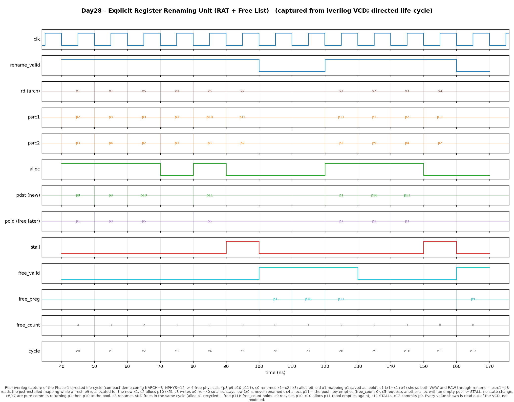

# Day 28 — Explicit Register Renaming Unit (RAT + Free List)

A synthesizable **explicit register renaming** front-end: the stage that turns a
stream of instructions naming a small set of *architectural* registers into a
stream naming a larger pool of *physical* registers, so that the false
(name-based) dependences disappear and an out-of-order scheduler can run true
dependences as early as their operands are ready.

This is the natural partner to the [Day 12](../day12-reorder_buffer/) Reorder Buffer: the ROB
gives **in-order retire / precise state**, and renaming gives the **dependency
freedom** the ROB's out-of-order completion relies on.

---

## Why register renaming matters

A compiled program reuses architectural register names constantly (`x1` is
written, read, then written again a few instructions later). Those reuses create
two *false* dependences that have nothing to do with the actual data flow:

| Hazard | Example | Why it is false |
|--------|---------|-----------------|
| **WAW** (write-after-write) | two instructions both write `x1` | they just happen to pick the same name |
| **WAR** (write-after-read)  | a later write to `x1` must wait for an earlier read of `x1` | only because they share the name |

If the machine had to honour these, it could barely reorder anything. **Register
renaming removes them by construction**: every architectural destination is
mapped to a *brand-new* physical register, so two writes to `x1` land in two
different physical registers and can proceed independently. After renaming, the
**only** dependence left between instructions is the true **RAW** (a consumer
reading a value a producer actually wrote) — exactly what a dataflow scheduler
(Tomasulo reservation stations, an issue queue) needs.

This is the *explicit* / *physical-register-file* style used by MIPS R10000,
the Alpha 21264, and every modern x86/ARM big core (as opposed to the older
"values live in the ROB" style).

---

## What this design does

Two structures, one rename per cycle:

* **Register Alias Table (RAT)** — `NARCH` entries. `RAT[a]` is the physical
  register that *currently* holds architectural register `a`. Reset to the
  identity map (`RAT[a] = a`), so the low `NARCH` physicals hold the initial
  architectural state.

* **Free List** — a circular FIFO of physical registers that are not part of any
  current architectural mapping. Reset to hold the upper `NPHYS − NARCH`
  physicals.

Per rename request:

```
psrc1 = RAT[rs1]                 # look up the physical sources
psrc2 = RAT[rs2]
if instruction writes a real rd (has_rd, rd != x0):
    pdst  = pop(free_list)       # a fresh physical for the destination
    pold  = RAT[rd]              # the PREVIOUS mapping of rd
    RAT[rd] = pdst               # install the new mapping
```

The displaced mapping `pold` **cannot be recycled immediately** — older
in-flight instructions may still read it. It is returned to the free list later,
through the independent **commit / free port** (`free_valid` / `free_preg`),
precisely when the redefining instruction commits. That is the same life-cycle a
real physical register goes through: *free → allocated → architectural → (next
writer commits) → free again*.

**Backpressure.** If a request needs an allocation but the free list is empty,
`stall` asserts and **no** state changes; the front-end must retry. (A real core
also stalls dispatch when it runs out of physical registers.)

**x0** is hardwired to zero: architectural register 0 is never renamed,
`RAT[0]` stays `== p0` for the life of the machine, and a write to `x0`
allocates nothing.

---

## Parameters

| Parameter | Default | Meaning |
|-----------|--------:|---------|
| `NARCH`   | 32 | number of architectural registers (`x0..x31`) |
| `NPHYS`   | 64 | number of physical registers |
| `ALOG`    | `$clog2(NARCH)` | architectural-register index width |
| `PLOG`    | `$clog2(NPHYS)` | physical-register index width |

The free-list pool holds `FREE_INIT = NPHYS − NARCH` registers. The ring buffer
uses an **explicit modulo-`NPHYS` wrap**, so `NPHYS` need not be a power of two.

> The self-checking testbench instantiates a **compact** `NARCH=8, NPHYS=12`
> (4 free physicals) so the directed waveform can show the *entire* life-cycle —
> allocate, stall, recycle — in a short window. The RTL scales to any size.

---

## Ports

| Port | Dir | Width | Description |
|------|-----|------:|-------------|
| `clk` | in | 1 | clock |
| `rst_n` | in | 1 | active-low synchronous-style reset (identity RAT, full free list) |
| `rename_valid` | in | 1 | a dispatch request is present this cycle |
| `rs1`, `rs2` | in | `ALOG` | source architectural registers |
| `rd` | in | `ALOG` | destination architectural register |
| `has_rd` | in | 1 | the instruction writes `rd` |
| `psrc1`, `psrc2` | out | `PLOG` | physical mappings of `rs1`, `rs2` (combinational) |
| `pdst` | out | `PLOG` | freshly allocated physical for `rd` (valid when `alloc`) |
| `pold` | out | `PLOG` | previous mapping of `rd`, to be freed at commit (valid when `alloc`) |
| `alloc` | out | 1 | a physical register was allocated this cycle |
| `stall` | out | 1 | allocation needed but the free list was empty |
| `free_valid` | in | 1 | return `free_preg` to the pool (commit port) |
| `free_preg` | in | `PLOG` | physical register to recycle |
| `dbg_free_count` | out | `PLOG+1` | number of free physical registers (observability) |

`psrc1/psrc2/pdst/pold/alloc/stall` are **combinational** functions of the
request and current state (they resolve in the fetch/dispatch cycle); the RAT and
free-list pointers update on the following rising edge.

---

## Block / datapath diagram

```
                            rename request (1 / cycle)
        rs1 ─────────────┐   rs2 ───────────┐    rd ──────┬─── has_rd
                         │                  │            │
                         ▼                  ▼            ▼
                 ┌───────────────────────────────────────────────┐
                 │            Register Alias Table (RAT)          │
                 │        RAT[a] = physical reg holding arch a    │
                 │  read rs1 ─► psrc1   read rs2 ─► psrc2         │
                 │  read rd  ─► pold (old mapping)               │
                 │  write RAT[rd] <= pdst   (on alloc)           │
                 └───────────────────────────────────────────────┘
                         ▲ pdst                       │ pold (later)
                         │ (allocate)                 ▼  (at commit)
                 ┌───────┴───────────────────────────────────────┐
       pop  ◄────┤          Free List  (circular FIFO)           │◄──── push
     (alloc)     │   head ─► [ p? p? p? ... ] ◄─ tail            │  (free_valid,
                 │   fl_count free physicals, empty ⇒ stall      │   free_preg)
                 └───────────────────────────────────────────────┘

   need_alloc = rename_valid & has_rd & (rd != x0)
   alloc      = need_alloc & ~empty          stall = need_alloc & empty
```

The dispatch (rename) port and the commit (free) port are **independent** — an
allocate and a free can happen in the same cycle (the free count then holds),
just as dispatch and commit proceed concurrently in a real pipeline.

---

## Simulation timing



*Real Icarus-Verilog VCD capture (not a hand-drawn diagram) of the Phase-1
directed life-cycle, sampled once per clock at the settled pre-edge instant.
Compact demo config `NARCH=8, NPHYS=12` → free physicals `{p8,p9,p10,p11}`.*

Reading the trace:

* **c0** `x1 = x2 + x3` → `psrc1=p2, psrc2=p3`, allocate **`pdst=p8`**, the old
  `x1` mapping **`pold=p1`** is remembered for later. `free_count` 4→3.
* **c1** `x1 = x1 + x4` → **WAW + RAW-through-rename**: `psrc1=p8` reads the
  mapping *just installed* at c0, while a fresh **`p9`** is allocated for the new
  `x1`. Two writes to the same name, two distinct physicals.
* **c2** `x5 = …` allocates `p10`.
* **c3** `x0 = …` → `rd = x0`, so **`alloc` stays low** — x0 is never renamed.
* **c4** allocates the last free physical `p11`; the **pool empties**
  (`free_count = 0`).
* **c5** another allocation is requested with an empty pool → **`stall`**, no
  state change.
* **c6 / c7** pure commits: `free_valid` returns **`p1`** then **`p10`** to the
  pool (`free_count` 0→1→2).
* **c8** rename **and** free in the *same* cycle: allocate the recycled **`p1`**
  while freeing **`p11`** → `free_count` holds at 2 (independent ports).
* **c9** recycles `p10`, **c10** allocates `p11` (pool empties again), **c11**
  `stall`s, **c12** commits `p9`.

---

## How it works (RTL notes)

* The RAT is a small register array indexed by the full architectural register
  name — no data-dependent variable bit-selects on any bus.
* The free list is a `NPHYS`-deep ring buffer with `head`/`tail`/`count`.
  `count` is the single source of truth for empty (`stall`) and is nudged `+1`
  on a push, `−1` on a pop, unchanged when both or neither occur.
* Pointer wrap is **explicit** (`== NPHYS-1 ? 0 : +1`) so the design is correct
  for any `NPHYS`, not just powers of two.
* Everything is reset-safe (identity RAT + full pool) and lint-clean under
  `iverilog -g2012 -Wall`.

---

## What the testbench checks

`tb_register_rename.sv` lock-steps the DUT against an **independent** behavioural
golden model — a mirror RAT plus a mirror circular free-list FIFO held entirely
in the testbench. Each cycle it drives one request (+ optional commit), samples
the DUT's combinational outputs at the settled pre-edge instant, and asserts
**all** of: `psrc1`, `psrc2`, `pdst`, `pold`, `alloc`, `stall`, and
`dbg_free_count` against the golden prediction, then advances both models
identically.

* **Phase 1 — directed life-cycle** (the waveform above): allocate, WAW +
  RAW-through-rename, x0-no-allocation, drain-to-empty, stall, physical-register
  recycle, and a simultaneous allocate+free.
* **Phase 2 — randomised** 5000 ops: random `rename_valid`/`rs1`/`rs2`/`rd`/
  `has_rd`, interleaved with random commits that free only a genuinely
  outstanding (still-unfreed) physical, so every recycled register is real and
  no physical is ever double-freed.

A global timeout guards against a hang. The run prints
`RESULT: *** PASS ***` only if every assertion held — **35 091 assertions,
0 errors** on the reference Icarus run.

---

## Run instructions

```bash
make            # Icarus Verilog (default): iverilog + vvp
make verilator  # Verilator
make vcs        # Synopsys VCS
make questa     # Siemens Questa / ModelSim
make waveform   # regenerate docs/register_rename_waveform.png from the VCD
make clean
```

Expected tail:

```
Phase 1 (directed life-cycle) done: 91 checks, 0 errors
Phase 2 (randomised) done: 35091 total checks, 0 errors
RESULT: *** PASS *** (35091 assertions)
```

The waveform PNG is regenerated from the captured `register_rename.vcd` by
`render_waveform.py` (a small VCD parser + matplotlib) — it is a genuine
simulator capture, not a hand-drawn figure.
