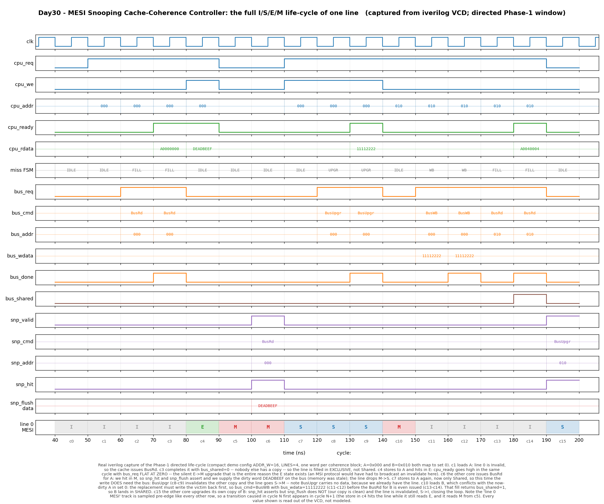

# Day 30 — MESI Snooping Cache-Coherence Controller

A synthesizable per-core write-back / write-allocate L1 data cache that keeps
itself **coherent** with the other caches on a shared snooping bus, using the
classic four-state **MESI** protocol (Papamarcos & Patel's *Illinois* protocol).

Every cache in this series so far has been a **private** cache — a purely local
memory-latency optimisation with exactly one client. That works right up to the
moment a second core exists. Then the same address lives in several places at
once, and the caches themselves become responsible for maintaining the illusion
that memory is a single shared array. That illusion is *coherence*, and this is
the hardware that implements it.

| Day | Cache | What it manages |
|-----|-------|-----------------|
| [Day 7](../day7-direct_mapped_cache/) | direct-mapped write-back | locality — one client, one copy |
| [Day 23](../day23-set_associative_cache/) | N-way + tree-PLRU | *placement* — which of WAYS copies to evict |
| **Day 30 (this)** | **direct-mapped + MESI snooping** | ***permission* — who is allowed to read or write a line, and when** |

---

## Why coherence matters

Give two cores private write-back caches and nothing else, and this program
breaks:

```
      core 0                    core 1
   sw  x1, (A)      # A: dirty in core 0's cache, memory still stale
                              lw  x2, (A)      # reads memory -> the OLD value
```

Core 1's load never sees core 0's store. Worse, if both cores have `A` cached
and both write it, each write-back overwrites the other and one store vanishes
entirely. Nothing about this is a memory-ordering subtlety — it is plain data
loss, and it happens on the very first line of shared state.

A **snooping** protocol fixes it by making the cache a participant in the bus
rather than just a client of it. Every cache watches ("snoops") every
transaction any other cache issues, and each line carries a **state** saying
what this cache is currently permitted to do with it. The protocol's job is to
maintain one global invariant:

> **Single writer, multiple readers.** At any instant a line is either held
> writable by *exactly one* cache, or held read-only by *any number* of caches —
> never both.

Everything else — the states, the bus commands, the flushes — falls out of
enforcing that one sentence.

### The four states

| State | Valid? | Dirty? | Others may hold it? | Meaning |
|-------|--------|--------|--------------------------|---------|
| **I** — Invalid | no | — | — | no copy here |
| **S** — Shared | yes | no | **yes** | clean, read-only, memory is up to date |
| **E** — Exclusive | yes | no | **no** | clean, read-only *but privately held*, memory is up to date |
| **M** — Modified | yes | **yes** | **no** | the only copy, writable, **memory is stale** |

`M` and `E` are the "single writer" half of the invariant; `S` is the "multiple
readers" half; `I` is the absence of permission.

### Why E exists at all — the whole point of MESI

Drop `E` and you have three-state **MSI**, which is already correct. So why do
real processors all implement `E`?

Because in MSI, a load miss can only ever bring a line in as *Shared*, and the
very next store to that line must therefore broadcast an invalidate on the bus —
**even when no other cache has ever touched it**. And most data in most programs
is private: stack frames, thread-local scratch, freshly `malloc`'d buffers,
single-threaded code entirely. MSI pays a bus transaction for every first store
to all of it.

`E` removes that cost. On a load miss the cache asks the *other caches* whether
anybody else has the line (that is exactly what the `bus_shared` wire reports),
and if nobody answers, the line is installed in `E` — clean, but privately
owned. A later store to an `E` line then needs **no bus traffic whatsoever**:
the core already knows it is the only holder, so it just flips `E → M` silently.

That single optimisation is visible in this design as a `cpu_ready` that goes
high in the access cycle while `bus_req` stays flat at zero — cycle `c4` of the
waveform below.

---

## Features

- Full four-state **MESI** protocol: all local (CPU) and remote (snoop)
  transitions, including the `E → M` silent upgrade.
- Four bus commands: **BusRd**, **BusRdX** (read-for-ownership), **BusUpgr**
  (invalidate-only, carries no data) and **BusWB** (dirty write-back).
- **Illinois-protocol `bus_shared` sampling** — a load fill lands in `E` when no
  other cache answered and in `S` when one did.
- **Cache-to-cache flush**: a snoop hitting an `M` line asserts `snp_flush` and
  supplies the dirty word on the bus, because memory is stale.
- **Write-back / write-allocate** with a proper dirty-victim write-back
  (`LOOKUP → WB → FILL`) on a conflicting replacement.
- **Split-transaction bus** — snoops keep arriving while our own request is
  outstanding, so a replacement invalidates its victim *before* the fill starts
  and never answers for a line it has already given up.
- Explicit **upgrade-lost race** handling: an invalidating snoop that hits the
  line of an in-flight `BusUpgr` voids the upgrade, which is then retried as a
  `BusRdX`.
- **Snoop-port priority**: the snoop port owns the tag/state/data arrays, and a
  CPU access to the same set is deferred one cycle.
- Independent combinational snoop-response path and single-cycle-hit CPU path.
- Reset-safe, lint-friendly, no data-dependent variable bit-selects.

Block size is **one word**, so the protocol rather than the burst plumbing is the
subject; [Day 7](../day7-direct_mapped_cache/) and [Day 23](../day23-set_associative_cache/) already cover multi-word line
fills and the two concerns are orthogonal.

---

## Parameters

| Parameter | Default | Meaning |
|-----------|---------|---------|
| `ADDR_W` | 32 | byte address width |
| `DATA_W` | 32 | word width = coherence block size |
| `LINES`  | 8 | number of direct-mapped lines (power of two) |
| `IDX_W`  | *derived* | `$clog2(LINES)` — set-index width |
| `TAG_W`  | *derived* | `ADDR_W - IDX_W - 2` — tag width |

`IDX_W` / `TAG_W` are derived and should not be overridden.

## Ports

### CPU side — one outstanding access, `cpu_req` held until `cpu_ready`

| Port | Dir | Width | Description |
|------|-----|-------|-------------|
| `clk`, `rst_n` | in | 1 | clock, active-low async reset |
| `cpu_req` | in | 1 | access valid; must be held until `cpu_ready` |
| `cpu_we` | in | 1 | 1 = store, 0 = load |
| `cpu_addr` | in | `ADDR_W` | byte address (word-aligned) |
| `cpu_wdata` | in | `DATA_W` | store data |
| `cpu_rdata` | out | `DATA_W` | value of the accessed word at completion |
| `cpu_ready` | out | 1 | high in the cycle the access completes |

### Bus master side — this cache requesting

| Port | Dir | Width | Description |
|------|-----|-------|-------------|
| `bus_req` | out | 1 | a transaction is outstanding |
| `bus_cmd` | out | 2 | `00`=BusRd `01`=BusRdX `10`=BusUpgr `11`=BusWB |
| `bus_addr` | out | `ADDR_W` | transaction address |
| `bus_wdata` | out | `DATA_W` | write-back data (BusWB only) |
| `bus_done` | in | 1 | the bus completes the transaction this cycle |
| `bus_rdata` | in | `DATA_W` | fill data (BusRd / BusRdX) |
| `bus_shared` | in | 1 | **another cache holds a copy** → take `S`, not `E` |

### Snoop side — other caches' transactions observed on the bus

| Port | Dir | Width | Description |
|------|-----|-------|-------------|
| `snp_valid` | in | 1 | a remote transaction is on the bus |
| `snp_cmd` | in | 2 | same encoding as `bus_cmd`; BusWB is ignored |
| `snp_addr` | in | `ADDR_W` | snooped address |
| `snp_hit` | out | 1 | I hold this line |
| `snp_shared` | out | 1 | answer to a BusRd: "somebody has it" → requester takes `S` |
| `snp_flush` | out | 1 | I am the dirty owner and am supplying the data |
| `snp_data` | out | `DATA_W` | flushed word |

### Observability (verification / waveform only)

| Port | Dir | Width | Description |
|------|-----|-------|-------------|
| `dbg_state` | out | `2*LINES` | packed MESI state per line |
| `dbg_tag` | out | `TAG_W*LINES` | packed tag per line |
| `dbg_data` | out | `DATA_W*LINES` | packed data per line |
| `dbg_fsm` | out | 2 | miss-handling FSM state |

---

## Block diagram

```
                        cpu_addr
                            |
              +-------------+--------------+
              |             |              |
            tag           index         (offset)
              |             |
              |             v
              |     +---------------+   +---------------+   +---------------+
              |     |  state array  |   |   tag array   |   |  data array   |
              |     |  2b x LINES   |   | TAG_W x LINES |   | DATA_W x LINES|
              |     |   I/S/E/M     |   |               |   |               |
              |     +-------+-------+   +-------+-------+   +-------+-------+
              |             |                   |                   |
              |             |         +---------+                   |
              |             |         |                             |
              +-------------|---->[ == ]--+                         |
                            |         (tag compare)                 |
                            v            |                          v
   cpu_req ------->  +------------------------------+        cpu_rdata / bus_wdata
   cpu_we  ------->  |   LOCAL PERMISSION CHECK     |               / snp_data
                     |                              |
                     |  load  + S/E/M  -> serve     |
                     |  store + M      -> serve     |
                     |  store + E      -> serve, E->M  (NO BUS TRAFFIC)
                     |  store + S      -> BusUpgr      <-- needs permission
                     |  any   + I/miss -> BusRd / BusRdX
                     |  dirty victim   -> BusWB first
                     +---------------+--------------+
                                     |
                                     v
                     +------------------------------+       bus_req / bus_cmd
                     |     miss-handling FSM        | ----> bus_addr / bus_wdata
                     |                              |
                     |   IDLE --miss(dirty)--> WB   | <---- bus_done
                     |     |                    |   |       bus_rdata
                     |     +--miss(clean)--> FILL <-+       bus_shared
                     |     |                    |   |
                     |     +--store hit S-> UPGR|   |
                     |                    (lost)+---+  ... retried as BusRdX
                     +------------------------------+
                                     ^
                                     | upgr_killed
   ==================================|=================================== BUS
                                     |
                     +------------------------------+
   snp_valid ------> |        SNOOP ENGINE          | ----> snp_hit
   snp_cmd   ------> |                              | ----> snp_shared
   snp_addr  ------> |  BusRd  : M->S (FLUSH), E->S |       (BusRd only)
                     |  BusRdX : M->I (FLUSH), ->I  | ----> snp_flush
                     |  BusUpgr: S/E -> I           | ----> snp_data
                     +---------------+--------------+
                                     |
                                     v
                   writes the state array (PRIORITY over the CPU path)
```

Two requesters, one array port. The snoop side wins.

---

## Simulation timing



**Real waveform captured from an Icarus Verilog run** — `make icarus` produces
`mesi_cache.vcd` and `render_waveform.py` parses that VCD and plots it. This is
not a hand-drawn diagram: every address, bus command, snoop response, flushed
value and MESI state in the image is read out of the simulator's own dump.

The window is the 16-cycle directed Phase-1 scenario in the compact demo config
(`ADDR_W=16`, `LINES=4`), where `A=0x000` and `B=0x010` deliberately collide in
set 0. Read the bottom `line 0 MESI` track and the story is the whole protocol:

| Cycle | What happens | Line 0 |
|-------|--------------|--------|
| `c1` | load `A` — Invalid, so issue **BusRd** | I |
| `c3` | BusRd completes with `bus_shared=0` → nobody else has it → fill **Exclusive** | I → **E** |
| `c4` | store `A` — hits in `E`, so `cpu_ready` asserts with **`bus_req` flat at zero**: the silent upgrade | E → **M** |
| `c6` | remote **BusRd** for `A` — we hit in `M`, so `snp_hit`+`snp_flush` assert and we supply `DEADBEEF` on the bus | M → **S** |
| `c7`–`c9` | store `A` again — now only `S`, so this time it *does* need the bus: **BusUpgr** (no data) invalidates the other copy | S → **M** |
| `c10`–`c12` | load `B` conflicts with the dirty `A`: **BusWB** writes `11112222` back to memory first | M → **I** |
| `c13`–`c14` | then the **BusRd** for `B`, which returns `bus_shared=1` → fill **Shared** | I → **S** |
| `c15` | remote **BusUpgr** for `B` — `snp_hit` asserts but `snp_flush` does **not** (our copy is clean) and we are invalidated | S → **I** |

Note the `line 0 MESI` track is sampled pre-edge like every other row, so a
transition caused in cycle *N* first appears in cycle *N+1*.

Two rows deserve a second look. **`bus_req` at `c4`** is the MESI payoff: a store
completing in one cycle with zero bus traffic. **`bus_wdata` at `c11`–`c12`** is
the write-back: the dirty value leaving the cache *before* the new line is even
requested, which is what makes `M` safe to hold in the first place.

---

## How it works

### The local permission check

A CPU access needs two separate things: the line must be **present**, and the
access must be **permitted**.

```
hit   = (state[idx] != I) && (tag[idx] == tag_of(addr))
needs_bus = !hit                      // no copy at all
          || (store && state == S)    // copy, but no write permission
```

Presence is the ordinary tag compare every cache does. Permission is the
coherence part, and it is only ever missing in one case: a **store to a Shared
line**. Loads are served from `S`, `E` and `M` alike; stores are served from `M`
and from `E` (upgrading silently). Only `S` forces a bus transaction, and that
transaction is a `BusUpgr` — it carries no data, because we already *have* the
data, we just are not allowed to write it yet.

### The miss FSM

```
        +--------- miss, victim clean ----------+
        |                                       v
IDLE ---+--- miss, victim dirty ---> WB ---> FILL ---> IDLE
        |                                       ^
        +--- store hit in S ------> UPGR -------+  (only if the upgrade was lost)
                                      |
                                      +---------> IDLE   (normal completion)
```

- **WB** issues `BusWB` with the victim's tag-reconstructed address and data. The
  victim is invalidated *on entry to miss handling*, not on completion — see
  below.
- **FILL** issues `BusRd` for a load or `BusRdX` for a store, and on `bus_done`
  installs the line: a store fill goes straight to `M`; a load fill goes to `S`
  if `bus_shared` was asserted and to `E` if it was not.
- **UPGR** issues `BusUpgr` and on `bus_done` writes the store data and moves the
  line to `M` — unless it lost the race.

### The snoop engine

The snoop response is purely combinational from the arrays, because a snooping
bus needs an answer in the snoop window itself:

```
snp_hit    = valid_coherent_snoop && line present
snp_shared = snp_hit && cmd == BusRd          // "somebody has it" -> requester takes S
snp_flush  = snp_hit && state == M && cmd != BusUpgr
snp_data   = data[snp_idx]
```

`snp_shared` is the wire that makes `E` possible at all — it is the answer to the
question *"am I the only one?"* that the requesting cache is asking. `snp_flush`
is asserted only from `M`, because that is the only state in which this cache
holds the sole up-to-date copy. A `BusUpgr` can never provoke a flush: its issuer
was in `S`, so by the single-writer invariant no cache can be in `M`.

The state transitions are the standard MESI snoop table:

| my state | remote BusRd | remote BusRdX | remote BusUpgr |
|----------|--------------|---------------|----------------|
| **S** | S | I | I |
| **E** | S | I | I |
| **M** | S *(flush)* | I *(flush)* | — *(impossible)* |

### Three ordering rules

Two independent requesters share one array port, on a bus where our own request
can still be outstanding. That creates exactly three races, and each is resolved
explicitly rather than left to chance.

**1. The snoop port owns the arrays.** A CPU access whose *set* is being snooped
this cycle is deferred: `cpu_ready` stays low and the core retries next cycle.

```
cpu_blocked = snp_line_hit && (snp_idx == cpu_idx)
```

This removes every array write conflict in `IDLE` in one stroke, and it gives the
bus transaction the earlier position in the coherence order — which is the
correct choice, since the bus transaction is globally visible and the local
access is not yet. Real L1s have exactly this contention; the snoop port wins
there too.

**2. A replacement invalidates its victim before the fill starts.** This is a
split-transaction bus, so snoops keep arriving while we are in `WB` or `FILL`. If
the victim's tag were left in place during the fill, we would happily answer
`snp_hit` — and even flush — for a line we had already written back and given up.
So the miss path sets `state[idx] = I` in the same cycle it captures the pending
request. During miss handling the set is genuinely Invalid, and the snoop engine
correctly says "not mine".

**3. An invalidating snoop voids an in-flight `BusUpgr`.** This is the one
genuinely racy corner of MESI. Two cores both hold a line in `S`; both decide to
store; both issue `BusUpgr`. One is ordered first on the bus and invalidates the
other — whose upgrade is now meaningless, because it no longer has the data it
was upgrading.

```
upgr_killed = snp_line_hit && (snp_cmd != BusRd) && (snp_idx == pend_idx)
```

The transaction is already on the bus and still completes there, but it is not
honoured locally: the sticky `upgr_lost_q` flag makes `bus_done` route to `FILL`
instead of to `IDLE`, so the store is **retried as a `BusRdX`** — which fetches
the winner's newer value first and only then applies the store. Silently
completing the upgrade instead would leave two caches in `M`, which is precisely
the invariant violation the whole protocol exists to prevent.

A remote *BusRd* against an in-flight upgrade is harmless by contrast: the reader
takes `S`, our `BusUpgr` is later in the bus order and invalidates it, and the
local completion deliberately overwrites the snoop's `M → S` downgrade in that
cycle (the snoop transition is written first in the `always_ff`, the local one
second).

---

## Running it

```bash
make            # Icarus Verilog (default)
```

```bash
make verilator  # Verilator
```

```bash
make vcs        # Synopsys VCS
```

```bash
make questa     # Siemens Questa / ModelSim
```

Any target writes `mesi_cache.vcd`. To redraw the waveform image from it:

```bash
make waveform
```

Verified with **Icarus Verilog** — `make icarus` passes:

```
Bus traffic       : BusRd=481  BusRdX=386  BusUpgr=45  BusWB=347
Load fills        : took E=267 (no sharer)   took S=214 (sharer)
Silent E->M stores: 31   (store hits that needed ZERO bus traffic)
Dirty flushes     : 112   Upgrades lost to a race: 3
Snoop-blocked CPU : 19 cycles
---------------------------------------------------------------------
Total cycles : 4102
Assertions   : 100212
Errors       : 0
RESULT: *** PASS ***
```

---

## What the testbench checks

`tb_mesi_cache.sv` plays three roles at once: the **CPU**, the **shared bus plus
the other core**, and an **independent golden model**.

The golden model is not a copy of the RTL. It expresses MESI as protocol
**transition tables** — `snoop_next_st(cmd, state)`, `local_needs_bus(we, hit,
state)`, `fill_next_st(we, shared)` — plus a small pending-request tracker, so
the RTL's `case`-statement controller is checked against a table-driven statement
of the same specification.

### Lockstep comparison, every cycle

`cpu_ready`, `cpu_rdata`, `bus_req`, `bus_cmd`, `bus_addr`, `bus_wdata`,
`snp_hit`, `snp_shared`, `snp_flush`, `snp_data`, the miss-FSM state, and the
**full per-line `{state, tag, data}` arrays**.

### Three protocol invariants

These are properties of coherence itself, not of this implementation — they would
catch a design that matched the golden model but still broke the protocol.

- **A — single writer.** If this cache holds a line in `E` or `M`, the shadow
  remote cache must **not** hold a copy of that address. Checked for every line
  every cycle.
- **B — flush only if dirty.** `snp_flush` may assert only from `M`, and never
  for a `BusUpgr`.
- **C — value coherence.** The testbench maintains `ref_mem`, the
  architecturally correct value of every word, updated by CPU stores and by
  remote writes. **Every load must return `ref_mem`.** And after Phase 3 sweeps
  all dirty lines out of the cache, **main memory must equal `ref_mem` word for
  word** — an end-to-end check of the write-back and cache-to-cache-flush data
  paths, since memory is only ever written by the DUT's own `BusWB` and
  `snp_flush` outputs.

### Stimulus

- **Phase 1** — the 16-cycle directed life-cycle rendered above: read miss to
  `E`, silent `E → M` store, remote `BusRd` flush and `M → S` downgrade, `S → M`
  via `BusUpgr`, dirty-victim write-back, shared fill to `S`, remote `BusUpgr`
  invalidate.
- **Phase 1b** — the **upgrade-lost race**, forced deterministically: a line is
  brought into `S`, a store starts a `BusUpgr`, and the remote core steals the
  line with a `BusRdX` while that upgrade is still on the bus. The upgrade must
  be abandoned, retried as `BusRdX`, fetch the remote's newer value, and only
  then land in `M`. The testbench asserts this path was actually exercised.
- **Phase 2** — 4000 randomised cycles: random loads/stores over a 16-word pool
  across 4 sets (so conflict misses, dirty evictions, sharing, upgrades and
  invalidations all happen densely), random remote `BusRd`/`BusRdX`/`BusUpgr`
  snoops, and random 0–2 cycle bus latency.
- **Phase 3** — drain sweep and the memory-vs-reference comparison.

The random snoop generator respects one environment constraint, which a real
snooping bus enforces with **conflict-address blocking**: a remote transaction is
not injected against an address this cache has an outstanding *fill* or
*write-back* for (our line is Invalid or memory is momentarily stale, so the
requester would read around us). Invalidating snoops against an outstanding
`BusUpgr` *are* injected — that is the upgrade-lost race, and the protocol is
supposed to handle it.

`RESULT: *** PASS ***` is printed only if all 100 212 assertions held.
