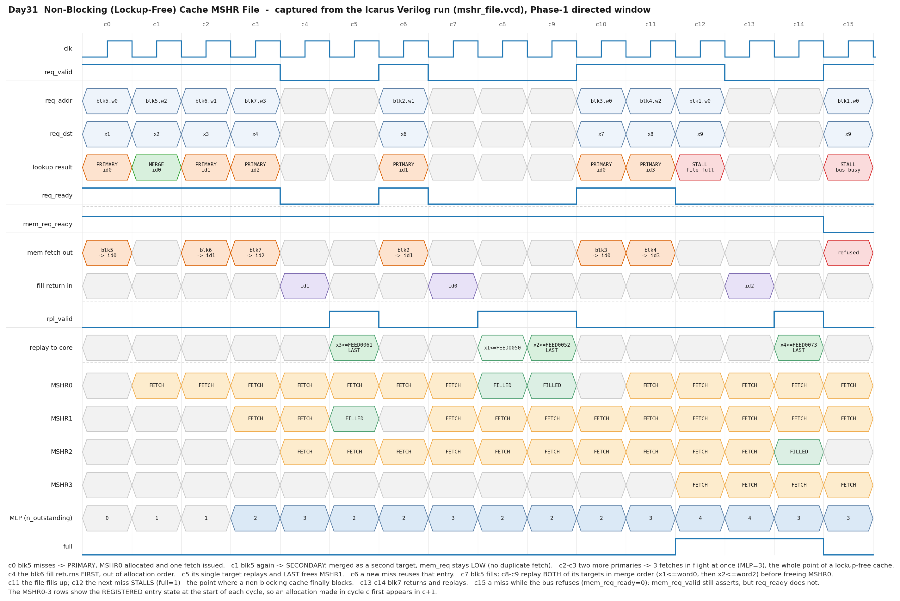

# Day 31 — Non-Blocking (Lockup-Free) Cache MSHR File

A synthesizable **Miss Status Holding Register file** — the structure that turns
a *blocking* cache into a *lockup-free* one (Kroft, ISCA 1981).

Every cache in this series so far has been **blocking**: on a miss the whole
pipeline freezes until the line comes back. That is a fine model of a cache and
a terrible model of a *processor*. This is the ~200-gate structure that removes
the freeze, and it is the single reason a modern out-of-order core can keep
running while memory is 200+ cycles away.

| Day | Cache | What it manages |
|-----|-------|-----------------|
| [Day 7](../day07-direct_mapped_cache/) | direct-mapped write-back | locality — one client, one copy |
| [Day 23](../day23-set_associative_cache/) | N-way + tree-PLRU | *placement* — which of WAYS copies to evict |
| [Day 30](../day30-mesi_cache_coherence/) | direct-mapped + MESI snooping | *permission* — who may read or write a line |
| **Day 31 (this)** | **MSHR file** | ***concurrency* — how many misses may be in flight, and who is waiting on each** |

---

## The architectural concept, and why it matters

A blocking cache serialises misses. Given a memory latency `L` and `N`
independent misses, it costs `N × L` cycles:

```
   blocking:   miss A |----- L -----| miss B |----- L -----| miss C |----- L -----|
                                                                   3L total
```

A lockup-free cache overlaps them. It costs roughly `L`:

```
   lockup-free:  A |----- L -----|
                 B  |----- L -----|
                 C   |----- L -----|
                                    ~L total
```

That overlap is **memory-level parallelism (MLP)**, and it is the dominant term
in the memory performance of every modern core. Everything upstream in this
series exists to *create* independent misses — [Day 28](../day28-register_renaming_unit/) renaming
removes false dependences, [Day 29](../day29-issue_queue/) issue lets independent loads
launch out of order, [Day 27](../day27-stride_prefetcher/) prefetching manufactures misses
early — and all of it is worthless if the cache can only have one miss
outstanding. The MSHR file is where that parallelism is actually *cashed in*.

### What an MSHR holds

On a miss the cache cannot stall, so it must write down everything it will need
later to finish the access, and then walk away. That note is an MSHR entry:

| Field | Purpose |
|-------|---------|
| `valid` | entry allocated |
| `blk` | the block address being fetched — also the **CAM key** for merging |
| `done` | the fill has returned; the entry is now replaying |
| `data[WORDS]` | the returned block |
| `targets[NTARGET]` | the **sub-entries**: `{dst, word offset}` for every access waiting on this block |
| `ntgt` / `nrpl` | targets recorded / targets already replayed |

The target list is the second big idea. A miss is not "one block fetch"; it is
"one block fetch plus a list of places the words have to go". Splitting those
apart gives **secondary-miss merging**: a second access to a block that is
already being fetched does not launch a second memory transaction — it appends
a target and rides the existing one.

| Outcome | Condition | Bus traffic |
|---------|-----------|-------------|
| **Primary miss** | CAM miss, a free MSHR exists, bus accepts | **one** fetch issued |
| **Secondary miss** | CAM hit on an entry still fetching, with room | **none** |
| **Stall** (`req_ready = 0`) | MSHR file full, target list full, bus busy, or entry mid-replay | none |

Getting merging wrong is the classic MSHR bug: two fetches for one block, two
fills into one cache line, and a silently stale word. Property **A** in the
testbench exists solely to catch it.

### Where a lockup-free cache still locks up

`req_ready` is the honest part of the interface. Four things make it drop:

* **MSHR file full** — `NMSHR` misses already outstanding. This is the real
  bound on MLP, and it is why MSHR count is a headline microarchitecture
  parameter (a couple in a small core, dozens in a big one).
* **Target list full** — `NTARGET` accesses already waiting on *one* block.
* **Bus busy** — the next level refused the fetch (`mem_req_ready = 0`).
* **Entry mid-replay** — a miss to a block whose fill has already landed. The
  entry has stopped accepting targets (see below), so the access waits.

---

## Block diagram

```
                                   MSHR FILE
 from cache tag stage                                            to core write-back
 ────────────────────                                            ──────────────────
  req_valid ──┐                                                    ┌── rpl_valid
  req_addr ───┼──► ┌───────────────┐                               │   rpl_dst
  req_dst  ───┤    │ split         │  blk / woff                   │   rpl_data
              │    │ addr          ├──────┐                        │   rpl_last
              │    └───────────────┘      │                        │
              │                           ▼                        │
              │            ┌───────────────────────────┐           │
              │            │  FULLY-ASSOCIATIVE CAM    │           │
              │            │  blk_q[i] == req_blk ?    │──► cam_hit / cam_idx
              │            └───────────────────────────┘           │
              │            ┌───────────────────────────┐           │
              │            │  free-entry pick (lowest  │──► free_any / free_idx
              │            │  !valid)                  │           │
              │            └───────────────────────────┘           │
              │                     │                              │
              ▼                     ▼                              │
       ┌──────────────────────────────────────────────────┐        │
       │   hit & !done & room  -> SECONDARY (merge target)│        │
       │   !hit & free & bus   -> PRIMARY  (alloc + fetch)│        │
       │   else                -> req_ready = 0           │        │
       └──────────────────────────────────────────────────┘        │
                              │                                    │
   ┌──────────────────────────┴───────────────────────────────┐    │
   │                    ENTRY ARRAY  (NMSHR)                  │    │
   │  ┌────────────────────────────────────────────────────┐  │    │
   │  │ 0 │ v │ blk │ done │ data[WORDS] │ tgt[0..NTARGET-1]│  │    │
   │  │ 1 │ v │ blk │ done │ data[WORDS] │ tgt[0..NTARGET-1]│  │    │
   │  │ 2 │ v │ blk │ done │ data[WORDS] │ tgt[0..NTARGET-1]│  │    │
   │  │ 3 │ v │ blk │ done │ data[WORDS] │ tgt[0..NTARGET-1]│  │    │
   │  └────────────────────────────────────────────────────┘  │    │
   └───┬───────────────────────────────────┬──────────────────┘    │
       │                                   │                       │
       ▼ mem_req_{valid,addr,id}           ▼ replay select          │
   ┌─────────────────┐            ┌──────────────────────────┐      │
   │  next level     │            │ lowest entry with        │      │
   │  (L2 / DRAM)    │            │ done & nrpl != ntgt      │──────┘
   └─────────────────┘            │  ▸ target = tgt[nrpl]    │
       │ fill_{valid,id,data}     │  ▸ word   = data[woff]   │
       └──────────────────────────┤  ▸ last   = nrpl+1==ntgt │
          tagged, OUT OF ORDER    └──────────────────────────┘
```

Three ports, one action each per cycle: **allocate/merge**, **fill**,
**replay**. They are deliberately independent — the whole design is a decoupling
buffer between a cache that must never stall and a memory that answers whenever
it feels like it.

---

## Parameters

| Parameter | Default | Meaning |
|-----------|---------|---------|
| `ADDR_W` | 32 | **word** address width (not byte) |
| `DATA_W` | 32 | word width |
| `WORDS` | 4 | words per cache block |
| `NMSHR` | 4 | outstanding misses supported — **the MLP ceiling** |
| `NTARGET` | 4 | sub-entries (waiting accesses) per block |
| `DST_W` | 5 | destination register / ROB tag width |

Derived: `WOFF_W = $clog2(WORDS)`, `ID_W = $clog2(NMSHR)`,
`BADDR_W = ADDR_W - WOFF_W`.

## Ports

### 1. Miss lookup / allocate (from the cache tag stage)

| Port | Dir | Width | Description |
|------|-----|-------|-------------|
| `req_valid` | in | 1 | a word access missed in the cache |
| `req_addr` | in | `ADDR_W` | the missing word address |
| `req_dst` | in | `DST_W` | where the word must eventually land |
| `req_ready` | out | 1 | **0 ⇒ the cache must stall this access** |
| `req_primary` | out | 1 | a new MSHR was allocated (a fetch goes out) |
| `req_secondary` | out | 1 | merged into an existing MSHR (no bus traffic) |
| `req_id` | out | `ID_W` | the MSHR the access went into |

### 2a. Fill request to the next level

| Port | Dir | Width | Description |
|------|-----|-------|-------------|
| `mem_req_valid` | out | 1 | fetch this block (does **not** depend on `mem_req_ready`) |
| `mem_req_addr` | out | `BADDR_W` | block address |
| `mem_req_id` | out | `ID_W` | the tag memory must return with the data |
| `mem_req_ready` | in | 1 | the next level accepts the fetch |

### 2b. Fill return — tagged, out of order

| Port | Dir | Width | Description |
|------|-----|-------|-------------|
| `fill_valid` | in | 1 | a block is coming back |
| `fill_id` | in | `ID_W` | which MSHR it belongs to |
| `fill_data` | in | `WORDS*DATA_W` | the block, word `w` at `[w*DATA_W +: DATA_W]` |

### 3. Replay to the core write-back port

| Port | Dir | Width | Description |
|------|-----|-------|-------------|
| `rpl_valid` | out | 1 | a waiting target is ready to write back |
| `rpl_dst` | out | `DST_W` | its destination |
| `rpl_data` | out | `DATA_W` | the selected word of the filled block |
| `rpl_id` | out | `ID_W` | the MSHR being drained |
| `rpl_last` | out | 1 | last target — the MSHR frees on this handshake |
| `rpl_ready` | in | 1 | the core accepts the write-back |

### Status

| Port | Dir | Width | Description |
|------|-----|-------|-------------|
| `full` | out | 1 | no free MSHR |
| `n_valid` | out | `ID_W+1` | entries in use |
| `n_outstanding` | out | `ID_W+1` | fills still in flight — **the live MLP** |
| `err_fill` | out | 1 | sticky: a fill arrived with no matching MSHR |

---

## Simulation timing



**This is a real captured waveform, not a drawing.** `make icarus` runs the
testbench and dumps `mshr_file.vcd`; `render_waveform.py` parses that VCD and
plots the Phase-1 directed window. Every address, MSHR id, fill tag, replayed
word and per-entry state in the image is read straight out of the simulator's
own trace. Signals are sampled once per cycle at the settled pre-edge instant —
the same point the self-checking testbench validates — exactly as a waveform
viewer shows one value per clock. The `MSHR0..3` rows show the *registered*
entry state at the start of each cycle, so an allocation made in cycle *c*
first appears in *c+1*.

What the window shows:

| Cycle | Event |
|-------|-------|
| c0 | `blk5` misses → **PRIMARY**, MSHR0 allocated, one fetch issued |
| c1 | `blk5` again → **SECONDARY**: merged as a second target, `mem_req_valid` stays **low** — no duplicate fetch |
| c2–c3 | two more primaries → **3 fetches in flight at once** (`n_outstanding = 3`) |
| c4 | the `blk6` fill returns **first**, out of allocation order |
| c5 | its single target replays, `rpl_last` frees MSHR1 |
| c6 | a new miss immediately **reuses** the freed entry |
| c7–c9 | `blk5` fills, then **both** of its targets replay in merge order (`x1 ⇐ word0`, then `x2 ⇐ word2`) before MSHR0 frees |
| c11–c12 | the file fills up; the next miss **stalls** with `full = 1` — where a non-blocking cache finally blocks |
| c13–c14 | `blk7` returns and replays |
| c15 | a miss while the bus refuses (`mem_req_ready = 0`): `mem_req_valid` still asserts, but `req_ready` does not |

---

## How it works

**Lookup** is a fully-associative compare of the request's block address against
every valid entry, in parallel, plus a priority pick of the lowest free entry.
Both are plain `for` loops with a `found` flag — one AND-OR level each. Because
a primary allocate only ever happens on a CAM *miss*, no two valid entries can
hold the same block, so the CAM match is inherently one-hot.

**Allocate vs. merge** falls out of the CAM result. `mem_req_valid` is asserted
on any CAM-missing request that has an entry to sit in; `mem_req_ready` only
decides whether the fetch is *taken*, so `valid` never depends on `ready` and
there is no combinational loop through the bus.

**Fill** is tagged. Memory returns `fill_id`, not an address, so the entry is
found in one indexed write with no second CAM — and returns may arrive in any
order. A fill for an entry that is not valid, or is already filled, is dropped
and latches `err_fill`.

**Replay** picks the lowest entry with `done && nrpl != ntgt`, reads target
`nrpl`, and selects that target's word out of the block. One target per cycle
matches the core's single write-back port. On the last target the entry frees.

### The two ordering subtleties

**An entry stops accepting targets once its fill lands.** The merge condition
requires `!done`. This keeps `ntgt` monotone while `nrpl` is advancing, so the
replay pointer can never be overtaken by a late append. A miss to a block that
is mid-replay therefore *stalls* rather than merging — a documented,
deliberately conservative choice that real designs also make.

**Except for the same-cycle late merge.** If the lookup sees `done == 0` while
the fill is landing on that very edge, the target is appended and `done` rises
together. The new target then replays out of the freshly written block — correct
by construction, since the data is already in `data_q` by the time the replay
pointer reaches it. The randomised phase hits this case ~80 times per run and
the golden model reproduces it exactly.

**Write-conflict freedom** is structural, not lucky: merge needs `!done` while a
last-replay needs `done`; a primary needs `!valid` while a last-replay needs
`valid`; a fill needs `!done` while a replay needs `done`. The only pair that
can touch one entry in one cycle is fill + merge, and they write disjoint
fields.

**Entry reuse latency.** The free-entry pick reads the *registered* valid bits,
so an entry freed by a replay in cycle *c* is reusable in *c+1*, not in *c*.
That costs at most one cycle and removes a combinational path from the replay
port back into the allocate port.

Style: reset-safe, lint-friendly, all state in one `always_ff`, no
data-dependent variable **bit**-selects (array element indexing only), target
and block-data arrays flattened to one dimension so every access is a plain
array select.

---

## Running it

```bash
make            # Icarus Verilog (default)
make verilator  # Verilator
make vcs        # Synopsys VCS
make questa     # Siemens Questa / ModelSim
make waveform   # regenerate docs/mshr_file_waveform.png from the VCD
make clean
```

Verified with **Icarus Verilog 13.0**:

```
Primary misses    : 1286   (one memory transaction each)
Secondary merges  : 369   (rode an existing fetch - ZERO extra traffic)
  of which same-cycle late merges : 80
Memory fills taken: 1286      Replays retired: 1655
Peak MLP observed : 4 of 4 MSHRs fetching at once
Stall cycles      : mshr-full=72  target-full=63  mid-replay=107  bus-busy=281
Traffic saved     : 22% of accepted misses needed NO memory transaction
Accesses accepted : 1642   replayed: 1642   (must be equal)
---------------------------------------------------------------------
Total cycles : 4044
Assertions   : 162482
Errors       : 0
RESULT: *** PASS ***
```

---

## What the testbench checks

`tb_mshr_file.sv` plays three roles at once:

1. **the cache / core** — issues missing accesses, holds each until
   `req_ready`, and randomly back-pressures the replay write-back port;
2. **the next-level memory** — accepts fetches with its own random `ready`
   back-pressure, holds each for a **random latency**, and returns them
   **out of order** tagged with the MSHR id. Each returned block is built from
   a deterministic `ref_word(blk, w)`, so every replayed word has a known
   architecturally-correct value;
3. **an independent golden model** — the MSHR file re-expressed as plain
   behavioural bookkeeping (per-entry target lists with explicit merge/drain
   counts), written from the port spec rather than copied from the RTL.

### Lockstep comparison, every cycle

Outputs: `req_ready`, `req_primary`, `req_secondary`, `req_id`,
`mem_req_valid`, `mem_req_addr`, `mem_req_id`, `rpl_valid`, `rpl_dst`,
`rpl_data`, `rpl_id`, `rpl_last`, `full`, `n_valid`, `n_outstanding`,
`err_fill`.

State: the full per-entry `{valid, done, blk, ntgt, nrpl}`, the whole target
list `{dst, woff}`, and every filled data word.

### Four end-to-end properties

These are statements about a lockup-free cache, not about this implementation,
and are checked by scoreboards that never look at the golden model:

* **A — no duplicate fetch.** At most one memory transaction may ever be in
  flight for a given block address. A secondary miss *must* ride the existing
  one. (The classic MSHR bug is two fills into one line.)
* **B — every accepted access replays exactly once.** A scoreboard of accepted
  `{dst, block, word}` tuples is drained by the replay port: nothing lost,
  duplicated or invented, and an entry must be exactly empty when `rpl_last`
  frees it.
* **C — value correctness.** Every replayed word equals
  `ref_word(block, offset)` — so a crossed-over block or a wrong word offset
  shows up immediately as a data mismatch.
* **D — per-block replay order.** The targets of one MSHR replay in the order
  they were merged.

### Coverage

| Phase | What it covers |
|-------|----------------|
| **1** | the directed 16-cycle window above (also the waveform): primary, secondary merge, 3-deep MLP, out-of-order fill, replay + free, entry reuse, file-full stall, bus back-pressure |
| **1b** | target-list-full stall (and that it issues **no** second fetch), the same-cycle **late merge**, a miss to a **mid-replay** block, and a stray fill tag latching `err_fill` |
| **2** | 4000 randomised cycles: random accesses over a small block pool (so merging happens constantly), random bus and write-back back-pressure, random fill latencies, out-of-order returns |

Closing checks after the drain: every entry free, nothing outstanding, no fill
errors, and `accesses accepted == accesses replayed`.

**162 482 assertions, 0 errors.**
