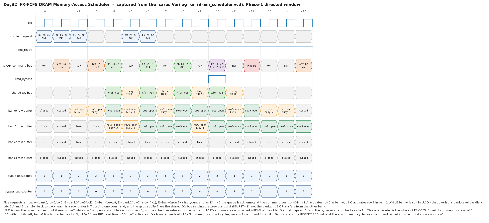

# Day 32 — FR-FCFS DRAM Memory-Access Scheduler

A synthesizable **memory-controller scheduler** — the block that decides, cycle
by cycle, which DRAM command to put on the command bus.

[Day 31](../day31-mshr_file/) removed the last reason a core has to stop at a cache miss,
so misses now leave the chip in parallel. This is what they arrive at. Below
the last-level cache there is no more "one access, one latency": DRAM is a
**stateful** device whose cost per access varies by a factor of three depending
on what the *previous* access did to the same bank. The scheduler is the only
place in the machine that can exploit that, and it does so by **reordering**.

| Day | Structure | What it manages |
|-----|-----------|-----------------|
| [Day 7](../day7-direct_mapped_cache/) / [Day 23](../day23-set_associative_cache/) | data cache | *locality* — keep the hot line close |
| [Day 27](../day27-stride_prefetcher/) | stride prefetcher | *anticipation* — start the miss early |
| [Day 30](../day30-mesi_cache_coherence/) | MESI controller | *permission* — who may read or write |
| [Day 31](../day31-mshr_file/) | MSHR file | *concurrency* — how many misses may be in flight |
| **Day 32 (this)** | **FR-FCFS scheduler** | ***order* — which of the outstanding requests DRAM should serve next** |

---

## The architectural concept, and why it matters

A DRAM bank is not random access. Its storage array can only be read through a
**row buffer** (a row of sense amplifiers), and getting data out takes up to
three separate commands:

```
   ACT  bank,row      copy a whole row (~1-8 KB) out of the array into the row buffer
   COL  bank,col      transfer one burst out of the row buffer   <- the actual data
   PRE  bank          write the row buffer back and close the row
```

So the cost of an access depends entirely on what the row buffer already holds:

| Case | Commands needed | Cost |
|------|-----------------|------|
| **row hit** — the wanted row is already open | `COL` | 1 command, no dead time |
| **row empty** — the bank is precharged | `ACT`, `COL` | + tRCD |
| **row conflict** — a *different* row is open | `PRE`, `ACT`, `COL` | + tRP + tRCD |

That is a 3× spread on the same "one memory access". A first-come-first-served
controller pays it blindly. **FR-FCFS** (Rixner et al., *Memory Access
Scheduling*, ISCA 2000) is the classic answer, and it is two rules:

1. **First-Ready** — prefer a request whose row is already open (a row hit).
2. **First-Come-First-Served** — among equals, prefer the oldest.

Rule 1 is a *reordering* rule: a younger request may be served before an older
one purely because it is cheaper right now. That is the whole trick, and in the
randomised run below it turns 1931 requests into 1931 column commands but only
609 activates — **68 % of requests needed no row activation at all**.

### Bank-level parallelism

The other half of the performance story is that the banks are independent state
machines. While bank 0 sits in its tRCD window doing nothing visible, bank 1 can
be activated, and a third bank can be precharged. Only two resources are shared:

* the **command bus** — one command per cycle, for the whole device; and
* the **data (DQ) bus** — a column access occupies it for `T_BURST` cycles,
  which is why back-to-back hits in the waveform are two cycles apart even
  though the *bank* was ready sooner.

Overlapping the per-bank dead time is exactly what makes the memory-level
parallelism of [Day 31](../day31-mshr_file/) pay off.

### Why FR-FCFS needs a fairness fix

Rule 1 has no bound on it. A stream of requests to an open row will keep
producing row hits forever, and an older request wanting a *different* row in
that bank will never be served — it can only proceed if somebody precharges,
and precharging is never the cheapest thing to do. Textbook FR-FCFS can starve.

This design fixes it with a **bypass cap**, the same idea as the FR-FCFS cap in
the batch/parallelism-aware scheduling literature (Mutlu & Moscibroda, PAR-BS):

* `cap_cnt` counts consecutive column commands issued to a **non-head** entry.
* When it reaches `ROWHIT_CAP`, the queue head is **priority-boosted**: it takes
  whatever command it needs — including a precharge that throws away a row other
  requests still want.
* The counter clears when the head itself departs.

Because the queue is age-ordered and arrivals only ever append at the tail, the
set of requests older than any given request only shrinks. With a finite cap the
head always makes progress, so **every request departs in bounded time**. The
testbench measures that residency and asserts the bound (measured worst case:
53 cycles).

### One more scheduling subtlety: don't close a row somebody wants

A precharge is also blocked while any queued request targets the row that is
currently open (`hit_pending`). Without that guard the controller happily closes
a row one cycle before a pending hit could have used it, converting a free
access into a full `PRE`+`ACT`+`COL` sequence. The guard is waived under the
fairness boost — which is precisely the trade the cap exists to make.

---

## Block diagram

```
                    req_valid/req_ready, req_we, req_addr={row,bank,col}, req_id
                                        |
                                        v
   +--------------------------------------------------------------------------+
   |                     TRANSACTION QUEUE  (age-ordered)                      |
   |                                                                           |
   |   idx 0 = OLDEST ............................................ QDEPTH-1     |
   |   +--------+--------+--------+--------+ ...                                |
   |   | bank   | bank   | bank   | bank   |     a departure COLLAPSES the      |
   |   | row    | row    | row    | row    |     array, so the index IS the     |
   |   | col    | col    | col    | col    |     age rank - no sequence         |
   |   | id/we  | id/we  | id/we  | id/we  |     numbers, no age matrix         |
   |   +--------+--------+--------+--------+                                    |
   +--------------------------------------------------------------------------+
          |                 |                 |
          |  per entry i:   |                 |
          |    ready = bank timer expired                                       
          |    hit   = bank_active[b] && bank_row[b] == row[i]                   
          |    col_ok = ready &&  hit && DQ bus free                             
          |    oth_ok = ready && !hit && (bank idle || no pending hit to it)     
          v                 v                 v
   +--------------------------------------------------------------------------+
   |                        PRIORITY SELECT (1 command / cycle)                |
   |                                                                           |
   |   1. boost?  cap_cnt == ROWHIT_CAP  ->  the HEAD wins outright            |
   |   2. first-ready:  lowest index with col_ok      -> COL   (a row hit)     |
   |   3. first-come :  lowest index with oth_ok      -> ACT / PRE             |
   |   4. otherwise                                   -> NOP                   |
   +--------------------------------------------------------------------------+
          |                                        |
          |                                        +--> cap_cnt (bypass counter)
          v
   +----------------------+     +---------------------------------------------+
   |  PER-BANK STATE      |     |  cmd_valid, cmd_op, cmd_bank,               |
   |  active / open row   |<--->|  cmd_row, cmd_col, cmd_we, cmd_id,          |
   |  timer (tRCD/tRP/    |     |  cmd_bypass          --> to the DRAM devices |
   |         tCCD)        |     +---------------------------------------------+
   +----------------------+                    ^
   +----------------------+                    |
   |  SHARED DQ BUS timer |--------------------+   (gates COL for ALL banks)
   |  (tBURST)            |
   +----------------------+
```

---

## Parameters

| Parameter | Default | Meaning |
|-----------|---------|---------|
| `ROWW` | 8 | row-address bits |
| `BANKW` | 2 | bank-address bits (`NBANKS = 2**BANKW`) |
| `COLW` | 4 | column-address bits |
| `IDW` | 4 | request tag width |
| `QDEPTH` | 8 | transaction-queue entries |
| `T_RCD` | 3 | `ACT` → `COL`, same bank |
| `T_RP` | 3 | `PRE` → `ACT`, same bank |
| `T_CCD` | 2 | `COL` → next command, same bank |
| `T_BURST` | 2 | `COL` → `COL`, **any** bank (shared data bus) |
| `ROWHIT_CAP` | 4 | column commands that may bypass the head before it is boosted |

The address is decoded as `{row, bank, col}` — bank bits in the middle, so
consecutive blocks stripe across banks (the interleaving that makes bank-level
parallelism available in the first place).

---

## Ports

### Request port (from the LLC / MSHR file)

| Signal | Dir | Meaning |
|--------|-----|---------|
| `req_valid` / `req_ready` | in / out | ready-valid handshake; `req_ready` is high when the queue has room **or** an entry is departing this cycle |
| `req_we` | in | 1 = write, 0 = read |
| `req_addr` | in | `{row, bank, col}` |
| `req_id` | in | tag returned with the column command |

### DRAM command bus (to the devices)

| Signal | Dir | Meaning |
|--------|-----|---------|
| `cmd_valid` | out | a command is being driven this cycle |
| `cmd_op` | out | `0 = PRE`, `1 = ACT`, `2 = COL` |
| `cmd_bank` | out | target bank |
| `cmd_row` | out | row address (meaningful for `ACT`) |
| `cmd_col` | out | column address (meaningful for `COL`) |
| `cmd_we` | out | read/write (meaningful for `COL`) |
| `cmd_id` | out | the request's tag (meaningful for `COL`) — this is the completion notification |
| `cmd_bypass` | out | this column command was issued out of program order |

The command bus has no back-pressure: a real DRAM command bus is unidirectional
and the controller is the only master, so it is the controller's job never to
issue a command the device cannot accept. That obligation is checked by an
independent device model in the testbench.

### Status

| Signal | Meaning |
|--------|---------|
| `q_count` / `q_full` / `q_empty` | queue occupancy |
| `bank_active` | one bit per bank: a row is open |
| `bank_open_row` | flattened `NBANKS × ROWW` — which row each bank holds |

---

## Simulation timing



*Captured from a real simulator run.* The image is rendered by
`render_waveform.py`, which parses `dram_scheduler.vcd` — the VCD that
`make icarus` produces — and draws the Phase-1 directed window. Every command,
address, tag, timer value and queue count in it was read out of the VCD, not
hand-drawn.

Five requests arrive: `A = bank0/row5/col0`, `B = bank0/row5/col1`,
`C = bank1/row9`, `D = bank0/row7` (a conflict), `E = bank0/row5` (a hit, and
younger than D). What the window shows:

* **c1 / c3 — bank-level parallelism.** `A` activates row 5 in bank 0; two
  cycles later `C` activates row 9 in bank 1 *while bank 0 is still inside
  tRCD*. Two banks are in flight; the command bus is not idle.
* **c4 / c6 — back-to-back row hits.** `A` and `B` each cost a single column
  command. The NOPs at c5 and c7 are the **shared DQ bus** finishing the
  previous burst (`T_BURST = 2`), not the banks — the "shared DQ bus" row shows
  exactly that.
* **c9 — the precharge that doesn't happen.** `D` is now the oldest request and
  is ready, but it needs row 7 while row 5 is open *and still has a customer*
  (`E`). The scheduler refuses to throw the row away.
* **c10 — the reorder.** `E`'s column access is issued **ahead of the older
  `D`**: `cmd_bypass` pulses and the bypass-cap counter ticks to 1. That single
  decision cost `E` one command instead of three. This is FR-FCFS.
* **c12–c18 — what a conflict actually costs.** With no hits left, bank 0
  precharges (c12), sits out tRP (c13–c14), activates row 7 (c15), sits out
  tRCD, and only transfers at c18: three commands and ~9 cycles, against one
  command for a hit.

---

## How it works

**The queue is the age order.** Entry 0 is always the oldest request. A
departure collapses the array down one slot and arrivals append at the tail, so
"oldest ready candidate" is just a lowest-set-bit priority encode over a
bit-vector — no sequence numbers, no age matrix ([Day 29](../day29-issue_queue/) needed one
because its entries could not move).

**Per cycle, three predicate vectors are computed in parallel** for all
`QDEPTH` entries:

```
ready[i] = valid[i] && bank_timer[bank[i]] == 0
hit[i]   = bank_active[bank[i]] && bank_row[bank[i]] == row[i]

col_ok[i] = ready[i] &&  hit[i] && dq_timer == 0
oth_ok[i] = ready[i] && !hit[i] && (!bank_active[b] || !hit_pending[b])
```

`hit_pending[b]` is an `O(QDEPTH)` compare per bank: does *any* queued request
want the row bank `b` currently holds? It is the precharge guard described
above.

**Selection is a strict three-tier priority**, resolved in one AND-OR level:

1. if `cap_cnt == ROWHIT_CAP`, the head takes whatever command it needs;
2. else the oldest `col_ok` entry issues its column command (and departs);
3. else the oldest `oth_ok` entry issues `ACT` (bank idle) or `PRE` (bank
   holding the wrong row).

**Only a column command retires a request.** `ACT` and `PRE` leave the entry in
the queue — an entry may sit through a precharge and an activate before finally
issuing its `COL`, which is why a conflicting request occupies the queue for
three separate command slots.

**Timing is enforced by countdown timers, not by an FSM.** Each bank has one
timer loaded to `T_RCD-1`, `T_RP-1` or `T_CCD-1` when a command is issued to it,
and a command may only be issued to a bank whose timer has expired. One extra
global timer models the shared data bus (`T_BURST`) and gates column commands
across *all* banks. Adding a real timing constraint (tRAS, tWTR, tFAW …) means
adding a counter and one term to `ready`, not restructuring the control.

### Why the head can never be starved

The boost gives the head absolute priority whenever it has a legal command, and
the head always *gets* a legal command within a bounded time:

* if its bank timer is non-zero it is counting down, and nothing reloads it —
  a reload requires issuing a command to that bank, which requires the timer to
  be zero, at which point the head itself would have won;
* if the head needs `ACT`/`PRE`, it is legal the moment its timer expires (the
  precharge guard is waived under boost);
* if the head needs `COL` and the DQ bus is busy, no column command can issue
  anywhere, and the DQ timer expires within `T_BURST`.

So the head departs in `O(ROWHIT_CAP · T_BURST + T_RP + T_RCD)` cycles, and any
request becomes the head after at most `QDEPTH-1` departures.

---

## Running it

```bash
make            # Icarus Verilog (default)
make vcs        # Synopsys VCS
make questa     # Siemens Questa / ModelSim
make verilator  # Verilator
make waveform   # re-render docs/ from the captured VCD
```

Verified with **Icarus Verilog 13.0**:

```
=====================================================================
 Day32 - FR-FCFS DRAM Memory-Access Scheduler
   4 banks, 8-entry queue, tRCD=3 tRP=3 tCCD=2 tBURST=2, cap=4
=====================================================================

--- Phase 1: directed 16-cycle window (this is the waveform) --------
--- Phase 2: bypass cap (the fairness mechanism) --------------------
    victim retired after 19 cycles (bound 300); cap saturated=1, boosted precharge=1
--- Phase 3: queue-full back-pressure -------------------------------
--- Phase 4: 4000 randomised cycles ---------------------------------

=====================================================================
 requests        : 1931
 commands        : 1931 COL, 609 ACT, 605 PRE  (3145 total)
 row-buffer hits : 1322 / 1931 = 68%  (a request needing no ACT)
 reordered (bypass) column commands : 854
 residency       : max 53 cycles, mean 16 (bound 300)
 ready-stall cycles : 1298
 assertions      : 258004
=====================================================================
RESULT: *** PASS *** (258004 checks, 0 mismatches)
```

`make waveform` needs Python 3 with matplotlib
(`python3 -m pip install --user matplotlib`).

---

## What the testbench checks

`tb_dram_scheduler.sv` plays the last-level cache on one side and the DRAM
devices on the other, and runs **four independent checkers** every cycle.

### 1. Lockstep golden model

A behavioural re-implementation of the whole policy — queue, per-bank row-buffer
state, both timer sets, the cap counter. Every cycle it predicts the command
*before* looking at the DUT, and the comparison covers:

* all ten outputs (`cmd_valid`, `cmd_op`, `cmd_bank`, `cmd_row`, `cmd_col`,
  `cmd_we`, `cmd_id`, `cmd_bypass`, `req_ready`, `q_count`/`q_full`/`q_empty`);
* the full internal state: every live queue entry's bank / row / column / tag /
  write-enable, `bank_active`, every open-row register, every bank timer, the
  DQ-bus timer and the bypass counter.

### 2. Independent DRAM device model

A checker written from the *device's* point of view, which knows nothing about
the queue. It maintains its own per-bank open/closed state and timers and flags
any illegal command:

* a column access to a precharged bank;
* an `ACT` on a bank that is already open;
* a `PRE` on an idle bank;
* any tRCD / tRP / tCCD violation (a command to a bank still inside a timing
  window);
* any tBURST violation (two column commands too close on the shared data bus).

### 3. Per-tag transaction tracker

Every accepted request is recorded by tag and must be retired by **exactly one**
column command whose bank, column and write-enable match — and, critically, that
column command must be issued while the *device* has that request's row open.
That last property is the end-to-end "the access read the right data" check: it
would catch a scheduler that issued a perfectly legal column command against the
wrong open row. Tags are recycled only after retirement, so a reused tag is
itself an error.

### 4. Starvation bound

Residency (accept → column command) is measured for every request and asserted
against a bound. This is the property plain FR-FCFS does *not* have; Phase 2
constructs the exact adversarial case — an endless stream of row hits behind one
older conflicting request — and additionally asserts that the cap counter
saturated and that a **boosted precharge** (one issued while hits were still
pending) actually fired.

### Coverage

| Phase | What it exercises |
|-------|-------------------|
| 1 | directed 16-cycle window: activate, bank parallelism, back-to-back hits, DQ-bus serialisation, the precharge guard, a bypass, a full conflict turnaround |
| 2 | the fairness mechanism: cap saturation, priority boost, boosted precharge, victim residency |
| 3 | queue-full back-pressure: `req_ready` deassertion under worst-case conflict traffic, nothing lost |
| 4 | 4000 randomised cycles of locality-biased read/write traffic across all four banks |

258 004 assertions, 0 mismatches — with 854 of the 1931 requests served out of
order, so the reordering path is genuinely exercised rather than merely present.
