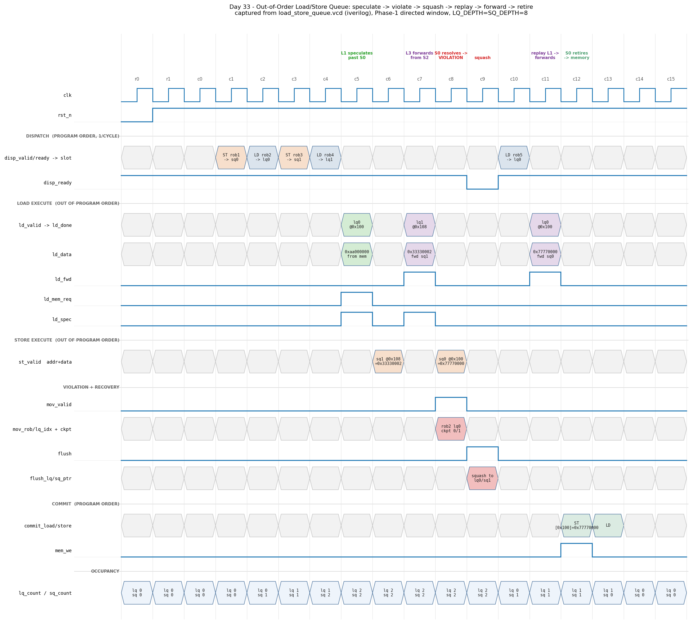

# Day 33 — Out-of-Order Load/Store Queue (speculative memory disambiguation)

A synthesizable **Load/Store Queue**: the structure that lets memory operations
execute out of program order without breaking the program. It does
**store-to-load forwarding**, **speculative disambiguation** past stores whose
addresses are not known yet, **memory-order-violation detection** when that
speculation turns out wrong, and **pointer-checkpoint recovery** to squash the
offending load and everything younger than it.

The whole design is driven by one idea: a load's dispatch-time snapshot of the
store-queue tail *is* the boundary between "stores older than me" and "stores
younger than me", and that single pointer is the only age information either
search needs.

Everything is reset-safe, lint-clean, free of data-dependent variable
bit-selects, and parameterised for any power-of-two queue depths ≥ 2.

---

## The architectural concept, and why it matters

The previous days built almost all of an out-of-order core.
[Day 28](../day28-register_renaming_unit/) (register renaming) removed false register dependencies.
[Day 29](../day29-issue_queue/) (issue queue) launches an instruction the moment its
*register* operands are ready. [Day 12](../day12-reorder_buffer/) (ROB) retires in order so the
architectural state stays precise. [Day 31](../day31-mshr_file/) (MSHR file) and
[Day 32](../day32-dram_scheduler/) (DRAM scheduler) let many misses be in flight at once.

**None of that machinery works for memory**, and the reason is worth stating
precisely:

> A register dependence is visible in the instruction encoding. A **memory**
> dependence is not — it depends on two addresses that are themselves computed
> by the very instructions being scheduled.

Rename can see that `add x5, x1, x2` feeds `sub x7, x5, x3`. Nothing at rename
can see whether

```
sw  x9, 0(x10)     # store to  ???
lw  x11, 0(x12)    # load from ???   <-- same address?  nobody knows yet
```

alias. `x10` and `x12` might not even be computed yet. So the scheduler faces a
choice no register-dependence mechanism has to make.

### The three options, and why only one is acceptable

| Policy | Correct? | Cost |
|---|---|---|
| Execute loads in program order | yes | throws away out-of-order execution for the single most latency-critical instruction class |
| Block a load until every older store has an address | yes | serialises the entire memory stream behind the oldest unresolved store — one slow address computation stalls everything |
| **Speculate**: execute the load, detect the mistake later, replay | yes, *with a recovery mechanism* | a mispredicted alias costs a squash; correct guesses cost nothing |

Real machines take the third option, because aliasing is rare and the pay-off is
large. But "detect the mistake later" is not free — it demands a structure that
**remembers every load that has executed and what it read**, so that a store
resolving its address can go back and ask *"did anybody already read this
location and get the wrong answer?"* That structure is the LSQ, and this is what
it does:

1. **Store-to-load forwarding.** A load searches the store queue for the
   **youngest store older than itself** that hits its address. If one exists,
   the value comes from the queue — *not* the cache. The store has not been
   written to memory yet and will not be until it retires, so memory holds a
   stale word. This is not an optimisation; without it the load is simply wrong.

2. **Speculative disambiguation.** If an older store has no address yet, the
   load cannot know whether it aliases. This design executes it anyway and
   raises `ld_spec` so the core can see the gamble was taken.

3. **Memory-order-violation detection.** When a store finally resolves its
   address, it searches the **load** queue for a *younger* load that already
   executed and hit the same address. That load read stale data. The LSQ reports
   the **oldest** such load's ROB tag plus the pointer checkpoint needed to
   squash it and everything younger.

The forwarding search and the violation search are *the same predicate read from
opposite ends* — which is exactly why one snapshot pointer per load suffices for
both.

### Why the youngest match, and why the oldest violator

Two asymmetric "extremes" show up, for two different reasons:

* **Forwarding picks the YOUNGEST matching older store.** Several older stores
  may target the same address; the last write before the load is the one the
  load must see. Every older one has been superseded.
* **A violation reports the OLDEST offending load.** Recovery is a rewind, and
  squashing the oldest violator necessarily squashes every younger load with it.
  Reporting anything else would leave an older wrong load in flight.

---

## Features

* **Two circular queues** (loads and stores), in-order dispatch, out-of-order
  execute, in-order retire.
* **Dispatch-time age snapshot** (`lq_sqb`): the store-queue tail frozen per
  load — the single pointer both searches compare against.
* **Store-to-load forwarding** of the youngest older matching store, with the
  supplying slot exposed on `ld_fwd_idx`.
* **Speculation flag** `ld_spec` when at least one older store's address is
  still unknown.
* **Memory-order-violation detection** reporting the oldest violator's ROB tag,
  slot, and full `(lq_ptr, sq_ptr)` recovery checkpoint.
* **"Covered forward" suppression** — a resolving store must *not* squash a load
  that forwarded from a store younger than itself (it was already superseded).
  This is the subtle case, and it is why forwarding records a wrap-extended
  **pointer** rather than a slot index (see *How it works*).
* **Same-cycle store-execute bypass** so a store resolving in the same cycle a
  load executes is visible to that load's search.
* **Single-cycle flush to a checkpoint**, invalidating everything at or beyond
  it while entries older than it survive untouched.
* **Stores write memory only at retirement** (`mem_we`), in program order.
* **Full/empty back-pressure** per queue, independently.
* Wrap-extended pointers throughout: **no sequence numbers, no age matrix**, and
  correct across arbitrary pointer wrap.
* No data-dependent variable bit-selects anywhere; all searches are structural
  `for` loops over constant indices.

---

## Parameters

| Parameter | Default | Description |
|---|---|---|
| `ADDRW` | 32 | Byte-address width (accesses are word-granular) |
| `DATAW` | 32 | Data width |
| `LQ_DEPTH` | 8 | Load-queue entries — power of two, ≥ 2 |
| `SQ_DEPTH` | 8 | Store-queue entries — power of two, ≥ 2 |
| `ROBW` | 6 | ROB tag width |

Derived: `LQIW = $clog2(LQ_DEPTH)` (slot index), `LQPW = LQIW + 1`
(wrap-extended pointer), likewise `SQIW` / `SQPW`.

---

## Ports

### Clock / reset

| Signal | Dir | Width | Description |
|---|---|---|---|
| `clk` | in | 1 | Rising-edge clock |
| `rst_n` | in | 1 | Asynchronous active-low reset |

### Dispatch — memory ops enter in **program order**, one per cycle

| Signal | Dir | Width | Description |
|---|---|---|---|
| `disp_valid` | in | 1 | A memory op is being dispatched |
| `disp_is_store` | in | 1 | 1 = store (uses SQ), 0 = load (uses LQ) |
| `disp_rob` | in | `ROBW` | ROB tag of the op |
| `disp_ready` | out | 1 | Target queue has room and no flush this cycle |
| `disp_lq_idx` | out | `LQIW` | LQ slot the op will occupy |
| `disp_sq_idx` | out | `SQIW` | SQ slot the op will occupy |

### Load execute — address ready, arrives **out of program order**

| Signal | Dir | Width | Description |
|---|---|---|---|
| `ld_valid` | in | 1 | Load address is ready |
| `ld_idx` | in | `LQIW` | Which LQ slot is executing |
| `ld_addr` | in | `ADDRW` | Computed load address |
| `ld_mem_data` | in | `DATAW` | D-cache read data, same cycle |
| `ld_done` | out | 1 | Load completed this cycle |
| `ld_data` | out | `DATAW` | Result — forwarded value or cache data |
| `ld_fwd` | out | 1 | Value came from the store queue |
| `ld_fwd_idx` | out | `SQIW` | Which store slot supplied it |
| `ld_mem_req` | out | 1 | No forward — the D-cache read is needed |
| `ld_spec` | out | 1 | An older store's address was still unknown |

### Store execute — address + data, **out of program order**

| Signal | Dir | Width | Description |
|---|---|---|---|
| `st_valid` | in | 1 | Store address + data ready |
| `st_idx` | in | `SQIW` | Which SQ slot is resolving |
| `st_addr` | in | `ADDRW` | Computed store address |
| `st_data` | in | `DATAW` | Store data |

### Memory-order violation — squash request to the ROB

| Signal | Dir | Width | Description |
|---|---|---|---|
| `mov_valid` | out | 1 | A younger executed load aliased this store |
| `mov_rob` | out | `ROBW` | ROB tag of the **oldest** offending load |
| `mov_lq_idx` | out | `LQIW` | Its LQ slot |
| `mov_lq_ptr` | out | `LQPW` | Recovery checkpoint — feed back as `flush_lq_ptr` |
| `mov_sq_ptr` | out | `SQPW` | Recovery checkpoint — feed back as `flush_sq_ptr` |

### Commit — in program order, driven by the ROB

| Signal | Dir | Width | Description |
|---|---|---|---|
| `commit_load` | in | 1 | Retire the head load |
| `commit_store` | in | 1 | Retire the head store |
| `lq_head_ready` | out | 1 | Head load is valid and has executed |
| `lq_head_rob` / `lq_head_addr` / `lq_head_data` | out | — | Head-load info |
| `sq_head_ready` | out | 1 | Head store is valid and has addr+data |
| `sq_head_rob` | out | `ROBW` | Head-store ROB tag |
| `mem_we` | out | 1 | Retiring store writes memory |
| `mem_addr` / `mem_data` | out | — | The memory write |

### Flush — branch mispredict or violation squash

| Signal | Dir | Width | Description |
|---|---|---|---|
| `flush` | in | 1 | Rewind both tails to the checkpoint |
| `flush_lq_ptr` | in | `LQPW` | Keep everything older than this |
| `flush_sq_ptr` | in | `SQPW` | Keep everything older than this |

### Status — the tail pointers **are** the branch checkpoint

| Signal | Dir | Width | Description |
|---|---|---|---|
| `lq_tail_ptr` / `sq_tail_ptr` | out | `LQPW` / `SQPW` | Snapshot these at a branch |
| `lq_count` / `sq_count` | out | `LQPW` / `SQPW` | Occupancy |
| `lq_full` / `sq_full` | out | 1 | No room |
| `lq_empty` / `sq_empty` | out | 1 | Empty |

---

## Block diagram

```
            dispatch (PROGRAM ORDER, 1/cycle)
       disp_valid/is_store/rob ──┬─────────────────────────┐
                                 │                         │
                     ┌───────────▼──────────┐  ┌───────────▼──────────┐
                     │     LOAD QUEUE       │  │    STORE QUEUE       │
                     │  (circular, LQ_DEPTH)│  │ (circular, SQ_DEPTH) │
                     ├──────────────────────┤  ├──────────────────────┤
                     │ valid exec addr data │  │ valid exec addr data │
                     │ rob                  │  │ rob                  │
                     │ sqb  ◄── snapshot ───┼──┤ sq_tail  (AGE BOUND) │
                     │ fwd_q fwdi fwdp      │  │                      │
                     └───┬──────────────┬───┘  └───┬──────────────┬───┘
        lq_head/lq_tail ─┘              │          └─ sq_head/sq_tail
                                        │             │
   ld_valid/ld_idx/ld_addr              │             │
        │                               │             │
        ▼                               │             ▼
  ┌───────────────────────────┐         │   ┌──────────────────────────┐
  │  FORWARDING SEARCH        │         │   │ same-cycle store bypass  │
  │  older  = rel < sqb-head  │◄────────┼───┤ (st_fire folded into the │
  │  match  = older & exec &  │  effective  │  effective SQ state)     │
  │           addr==ld_addr   │  SQ state   └──────────▲───────────────┘
  │  pick YOUNGEST (max rel)  │         │              │
  └────────┬──────────────────┘         │   st_valid/st_idx/st_addr/st_data
           │                            │              │
           ▼                            │              ▼
   ld_data  ld_fwd  ld_fwd_idx          │   ┌──────────────────────────┐
   ld_mem_req  ld_spec                  └───┤  VIOLATION SEARCH        │
       (fwd ? sq_data : ld_mem_data)        │  same predicate, other   │
                                            │  end: younger executed   │
                                            │  load, addr match, and   │
                                            │  NOT covered by a store  │
                                            │  younger than this one   │
                                            │  pick OLDEST (min rel)   │
                                            └──────────┬───────────────┘
                                                       ▼
                                      mov_valid/mov_rob/mov_lq_idx
                                      mov_lq_ptr, mov_sq_ptr ──┐
                                                               │ feed back
   commit (PROGRAM ORDER) ──► head-only retire                 │
        commit_load  ──► lq_head++                             ▼
        commit_store ──► sq_head++ , mem_we/mem_addr/mem_data   flush,
                         (the ONLY writer of memory)        flush_lq/sq_ptr
```

---

## Simulation timing



*Captured from a real simulator run.* The committed diagram was rendered by
parsing `load_store_queue.vcd` — the VCD that
`make icarus` produces — and plots the Phase-1 directed window. Every address,
data word, ROB tag, slot index, checkpoint pointer and occupancy count in it was
read straight out of the VCD, not hand-drawn. Non-clock signals are sampled once
per cycle at their settled pre-edge instant, exactly as a waveform viewer shows
one value per clock.

The window is the full life cycle of a wrong guess. Four ops dispatch in program
order — `S0` store `@0x100` (whose address stays unknown for a long time), `L1`
load `@0x100`, `S2` store `@0x108`, `L3` load `@0x108` — and then:

* **c5 — the gamble.** `L1` executes. `S0` is older and has *no address yet*, so
  `ld_spec` asserts: nothing here can tell whether they alias. No forward is
  possible, so `ld_mem_req` goes out to the D-cache and `L1` takes the stale
  memory word `0xaa000000`.
* **c7 — a forward that just works.** `L3` executes and finds `S2` — older,
  resolved, same address — so `ld_fwd` asserts and the value `0x33330002` comes
  from the **store queue**, not memory. `ld_mem_req` stays low; the cache access
  is not even made. (`ld_spec` is still set because `S0` remains unresolved.)
* **c8 — the guess loses.** `S0` finally resolves to `@0x100 = 0x77770000` and
  its search of the load queue finds `L1`: younger, already executed, same
  address, not covered. `mov_valid` fires with `mov_rob = rob2`,
  `mov_lq_idx = lq0`, and the checkpoint `(lq_ptr, sq_ptr) = (0, 1)`.
* **c9 — the squash.** That checkpoint is fed straight back as `flush_*`. In one
  cycle the load queue empties (`lq_count → 0`) while **`S0` survives**
  (`sq_count` stays 1) — it is older than the violator and is not the
  instruction that was wrong. `disp_ready` drops for exactly that cycle.
* **c11 — the replay.** `L1` is refetched (dispatched at c10 as `rob5`) and
  executes again. Now `S0` has an address, so it **forwards**: `ld_fwd` set,
  `ld_spec` clear, `ld_data = 0x77770000` — the architecturally correct value.
* **c12–c13 — retirement.** `S0` retires and is the only thing that ever writes
  memory (`mem_we`, `[0x100] = 0x77770000`), then `L1` retires behind it.

---

## How it works

### Age from wrap-extended pointers

Both queues are circular with a wrap-extended pointer (one bit wider than the
slot index), so `tail - head` is the exact occupancy and full is distinguishable
from empty. A slot's **age rank** is `rel = slot_index - head_index`: 0 is the
oldest resident entry, and larger is younger.

At dispatch each load freezes the current store-queue tail into `lq_sqb`. Then

```
ld_nolder = lq_sqb[load] - sq_head
```

is *exactly* how many stores older than this load are still in the queue — the
retired ones have already left through the head and are in memory. So

```
store i is older than the load   ⟺   rel(i) < ld_nolder
```

One subtraction and one compare, correct across arbitrary wrap, no sequence
numbers and no age matrix (contrast [Day 29](../day29-issue_queue/), where the scheduler
needed a full age matrix because entries have no positional ordering).

### The forwarding search

For each store slot in parallel: `older && exec && addr == ld_addr`. Among the
matches, keep the one with the **largest** `rel` — the youngest. The result mux
is then just `ld_data = fwd_hit ? fwd_data : ld_mem_data`, and `ld_spec` is
`|(older && !exec)`.

### The violation search — and the one genuinely subtle bug

The same predicate, evaluated from the store's side: for each load slot,
`valid && exec && st_older && addr == st_addr && !covered`, keeping the
**smallest** `rel` (the oldest). `st_older` reuses each load's own boundary:
`rel(store) < (lq_sqb[l] - sq_head)`.

`covered` is where the care is needed. If the load forwarded from a store that is
**younger than the resolving store**, then the resolving store was already
superseded and the load is fine — no violation. The obvious implementation ranks
both stores against `sq_head`… and is **wrong**:

> In the interesting case the covering store `F` is *older* than the resolving
> store `S`. Stores retire in program order and `S` has not retired — but `F`
> may well have, leaving the queue entirely. Once it does, `F_slot - sq_head`
> has **wrapped**, ranking a departed store as the *youngest* entry. That reads
> as "covered" and **silently drops a real violation** — which surfaces as a
> load committing a wrong architectural value.

The fix is to rank both stores against the load's **own frozen boundary**
instead. That boundary cannot move, and every store older than the load sits
within `SQ_DEPTH` below it, so `boundary - pointer` is a stable age distance
(bigger = older) that no head movement can disturb:

```
dist_s  = lq_sqb[l] - st_ptr          // age distance of the resolving store
dist_f  = lq_sqb[l] - lq_fwdp[l]      // age distance of the covering store
covered = lq_fwd_q[l] && (dist_f <= dist_s)
```

This is why each load records `lq_fwdp`, the **wrap-extended pointer** of its
supplier, and not just the slot index `lq_fwdi`: a slot index stops being
meaningful the moment that store leaves the queue, while the load is still
exposed to squashes.

### Same-cycle bypass

The load search reads *registered* store state, and the violation search reads
*registered* load state. A store and a load resolving in the same cycle would
therefore be invisible to each other, and the pair would slip through
undetected. The hole is closed from the cheaper side: the executing store is
bypassed into the effective store-queue state the load searches, so the load
simply forwards from a store that resolved this cycle.

### Recovery

`mov_lq_ptr = lq_head + vio_rel` rewinds the load queue to the offending load
itself (it is refetched), and `mov_sq_ptr = vio_sqb` restores the store queue to
the boundary that load recorded — which is precisely the set of stores older
than it. Feeding those back as `flush_*` invalidates every entry whose distance
from the head is at or beyond the kept count, in a single cycle. The flush
statement sits last in the sequential block so it overrides every other port,
and all ports are gated on `!flush`, which is what makes a flush racing an
in-flight execute harmless.

### Simplifications (documented honestly)

* Address and data resolve **together** for a store. A real machine splits
  STA/STD and must handle an address-known/data-unknown store, which *blocks*
  forwarding rather than permitting it.
* Accesses are **word-granular**; no partial-overlap or size-mismatch
  forwarding (a real LSQ must handle a 4-byte load partly covered by a 2-byte
  store, usually by refusing to forward and replaying).
* Loads keep their result in the queue for checking; a real core writes it to
  the physical register file instead.
* There is **no memory dependence predictor** (store-set / Alpha 21264 style) —
  every load speculates unconditionally. Adding one would gate `ld_spec`
  behaviour on a prediction rather than always gambling.

---

## Running it

Icarus Verilog is the default:

```bash
make
```

The other simulators:

```bash
make verilator
```

```bash
make vcs
```

```bash
make questa
```

Clean up:

```bash
make clean
```

A passing run ends with:

```
RESULT: *** PASS ***  (269502 assertions)
```

---

## What the testbench checks

`tb_load_store_queue.sv` plays the dispatch, execute, commit and squash ports of
an out-of-order core around the DUT, with **five independent checkers**.

### 1. Lockstep golden model

A behavioural re-implementation of the LSQ that defines age with **global
sequence numbers** instead of circular pointers. "Store S is older than load L"
is literally `s_seq < l_seq` in the model, versus
`rel(S) < L.sq_boundary - sq_head` in the DUT — the two formulations share
nothing but the answer. Every cycle **all 31 outputs** plus the **full per-entry
state of both queues** (valid, exec, addr, data, rob, the dispatch boundary
`lq_sqb`, the forward flag and the forwarding slot index) and both head pointers
are compared.

### 2. Value correctness — the end-to-end property

A reference memory is updated **only when a store retires**. Because ops retire
in program order, every store older than a retiring load has already landed
there and no younger store has — so at the instant a load commits,
`ref_mem[addr]` **is** its architectural value. Every committed load is checked
against it.

This is the checker that actually proves the disambiguation machinery works: a
missed violation or a bad forward shows up here as a wrong committed value, no
matter how plausible the intermediate signals looked. It is what caught the
`covered` pointer-wrap bug described above.

### 3. Recovery-checkpoint check

The testbench records the `(lq_ptr, sq_ptr)` checkpoint at **every** dispatch.
When the DUT reports a violation, `mov_lq_ptr` / `mov_sq_ptr` must equal the
checkpoint the testbench recorded when the offending load was dispatched —
checked against the testbench's own records, not the DUT's.

### 4. In-order drain

Stores may execute out of order but must reach memory **in program order**; the
sequence number of every `mem_we` is checked to be strictly increasing.

### 5. Forward progress

Replays rewind the program counter, so a livelock would appear as a program that
never advances. The number of committed ops is checked to reach the full program
length, and the replay count is reported.

### Coverage

* **Phase 1** — the directed 16-cycle window rendered in `docs/`:
  speculate → violate → squash → replay → forward → retire.
* **Phase 2** — directed corner cases: (a) queue-full back-pressure per queue
  independently, (b) forwarding from the **youngest** of several matching older
  stores, (c) the **covered-forward** case (an older store resolving later must
  not squash a load that forwarded from a younger one), (d) several violators →
  the **oldest** is reported, (e) same-cycle store-execute/load-execute bypass,
  (f) a flush cycle is dead for every port, (g) executing into a slot the
  previous cycle squashed, (h) simultaneous load + store retirement,
  (i) pointer wraparound over three laps of both queues.
* **Phase 3** — 4000 randomised cycles over a deliberately small, hot-biased
  address pool (so aliasing, forwarding and violations are frequent), with
  random out-of-order execution, random *unrelated* branch-mispredict flushes,
  and full violation-driven replay with program-counter rewind.

Measured on the default parameters (`LQ_DEPTH = SQ_DEPTH = 8`):

```
 cycles simulated : 4358
 assertions       : 269500
 store->load fwd  : 281
 speculative loads: 637
 violations       : 118
 squash / replays : 127
 memory ops retired: 2163  (program reached 2163)
 RESULT: *** PASS ***  (269502 assertions)
```

The DUT is parameterised for any power-of-two depths ≥ 2, and phases 1 and 3
follow the parameters. The phase-2 directed vectors do not: case (b) needs three
older stores resident at once to prove the youngest match wins, so the directed
phase assumes `LQ_DEPTH ≥ 4` and `SQ_DEPTH ≥ 4`. At depth 2 those two hardcoded
expectations fail while every lockstep golden-model comparison still passes.
