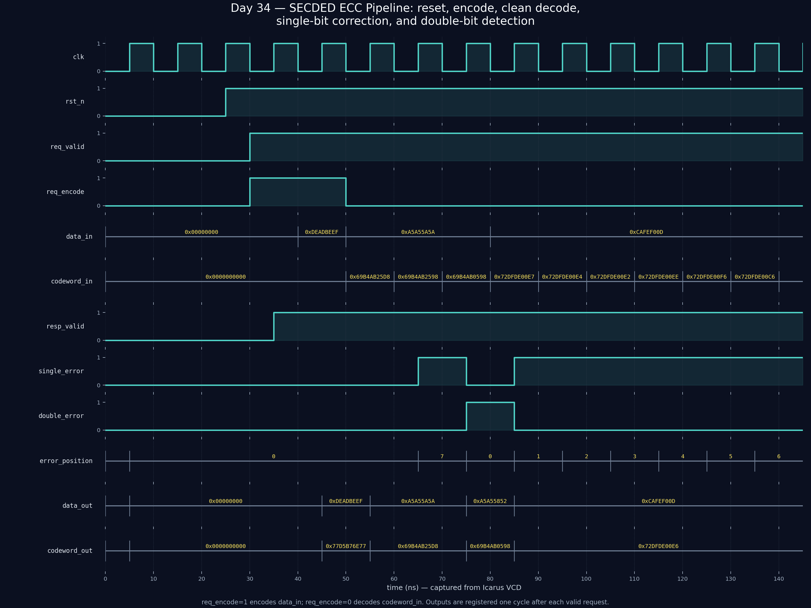

<!-- Author: Asresh Kuricheti -->
# Day 34 — Parameterized SECDED ECC Pipeline

Author: **Asresh Kuricheti**

A synthesizable, one-request-per-cycle extended-Hamming encoder/decoder that
protects architectural and memory data against bit flips. The block corrects
any single-bit error, detects any double-bit error, reports the corrected bit
position, and never silently "corrects" a recognized double error.

## Why this architectural concept matters

Caches, SRAMs, DRAM controllers, register files, and on-chip links all store or
transport state that can be corrupted by electrical noise, radiation, marginal
timing, or wear. SECDED (single-error correction, double-error detection) adds
positional Hamming parity plus one overall parity bit. For the default 32-bit
payload, six Hamming bits and one overall bit create a 39-bit protected word.

This project was chosen after reviewing current architecture/RTL roles. A
[Micron HBM digital-design role](https://careers.micron.com/careers/job/40623857)
specifically calls for parameterized SystemVerilog, pipelines/FSMs, memory
systems, and ECC/CRC. Current high-paying CPU/GPU roles similarly emphasize
verified, PPA-conscious microarchitecture: an
[Apple CPU microarchitecture role](https://jobs.apple.com/en-ie/details/200657881-3760/cpu-microarchitect-rtl-engineer-fetch-out-of-order)
lists a US base range up to $272,100, and an
[NVIDIA ASIC design role](https://nvidia.wd5.myworkdayjobs.com/en-US/NVIDIAExternalCareerSite/job/ASIC-Design-Engineer_JR2015189-1)
focuses on timing-clean, power/area-efficient RTL.

## Features

- Parameterized payload, parity, and codeword widths.
- One-cycle registered response with one request accepted every cycle.
- Encode and decode/correct modes on a shared request interface.
- Corrects errors in data, Hamming parity, or the overall parity bit.
- Distinguishes clean, correctable single-error, and uncorrectable double-error
  outcomes.
- Reset-safe registered outputs and elaboration-time parameter checks.
- Structural loops with constant bounds; no behavioral memories or delays in RTL.
- Self-checking directed and randomized testbench with a golden encoder.

## Parameters

| Parameter | Default | Description |
|---|---:|---|
| `DATA_WIDTH` | 32 | Unprotected payload width |
| `PARITY_BITS` | 6 | Positional Hamming parity count |
| `CODE_WIDTH` | 39 | `DATA_WIDTH + PARITY_BITS + 1` |

`PARITY_BITS` must satisfy `2^R >= DATA_WIDTH + R + 1`.

## Ports

| Signal | Dir | Width | Description |
|---|---|---:|---|
| `clk` | in | 1 | Rising-edge clock |
| `rst_n` | in | 1 | Asynchronous active-low reset |
| `req_valid` | in | 1 | Accept a request this cycle |
| `req_encode` | in | 1 | 1: encode `data_in`; 0: decode `codeword_in` |
| `data_in` | in | `DATA_WIDTH` | Payload to encode |
| `codeword_in` | in | `CODE_WIDTH` | Protected word to decode |
| `resp_valid` | out | 1 | Registered result is valid |
| `codeword_out` | out | `CODE_WIDTH` | Encoded or corrected protected word |
| `data_out` | out | `DATA_WIDTH` | Original or recovered payload |
| `single_error` | out | 1 | A single bit was corrected |
| `double_error` | out | 1 | A double error was detected, not corrected |
| `error_position` | out | `PARITY_BITS+1` | One-based corrected bit; zero otherwise |

## Datapath diagram

```text
                                req_encode
                                    |
 data_in --> [place data bits] --> [Hamming parity] --> [overall parity] --+
                                                                          |
 codeword_in --> [syndrome] --> [SECDED classifier] --> [one-bit correct] --+-->
                       |               |                    |                  output
                       |         single/double         corrected word          register
                       +-------------------------------------> [extract data] --+-->
                                                                      resp_valid

 Classification truth table
 syndrome   overall parity   result
    0             0          clean
    0             1          overall-parity-bit error: correct
   !=0            1          codeword single-bit error: correct syndrome bit
   !=0            0          double-bit error: detect, do not miscorrect
```

## Simulation timing



*Captured from a real Icarus Verilog simulation.* The plot is rendered from the
testbench-generated `secded_ecc.vcd`. It shows reset release, encode, clean
decode, a correctable single-bit error with its position, and a detected
double-bit error. Bus labels are sampled directly from the VCD.

## How it works

Hamming positions are numbered from one. Positions 1, 2, 4, 8, ... hold parity;
all remaining positions hold payload bits. Parity bit `p` covers every position
whose binary index has bit `p` set. Decoding XORs those same sets to produce a
syndrome: for a single-bit error, the syndrome is exactly its one-based position.

The extra parity bit covers the complete Hamming word. Its odd/even result tells
the classifier whether the syndrome came from an odd number of flips (correctable
under the SECDED model) or an even number (a detected double error). Double-error
data is flagged and passed through without speculative correction.

## Use-case examples

- **L1/L2 cache data and tag arrays:** correct a transient SRAM upset before it
  becomes architecturally visible; scrub the corrected codeword back to the array.
- **HBM/DDR controllers:** protect words as they cross the controller/PHY boundary
  and count corrected versus uncorrectable events for telemetry.
- **Register files and queues:** protect long-lived architectural or speculative
  state in high-reliability CPUs, GPUs, automotive SoCs, and space systems.
- **NoC and chiplet links:** append ECC before transport, then correct or request
  replay at the receiver.
- **Background memory scrubber:** periodically read, correct, and rewrite words to
  prevent single errors from accumulating into double errors.

## Run

```bash
make            # Icarus Verilog (default)
make verilator  # Verilator
make vcs        # Synopsys VCS
make questa     # Siemens Questa/ModelSim
make clean
```

The testbench dumps `secded_ecc.vcd` and prints `RESULT: *** PASS ***` only when
all checks succeed. It exhaustively flips every codeword bit for one payload,
checks directed double-error cases, runs 500 randomized clean/single/double-error
transactions, verifies correction positions and output codewords, checks reset
and response bubbles, and includes a hard timeout.
