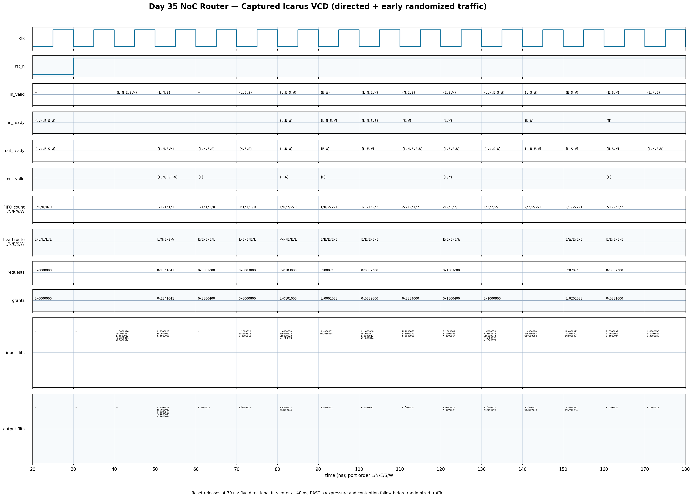

<!-- Author: Asresh Kuricheti -->
# Day 35: Five-Port Wormhole NoC Router

## Overview

This project implements the routing and flow-control heart of a 2-D mesh network-on-chip (NoC). Five ports—local, north, east, south, and west—accept flits through independent elastic FIFOs. The head flit carries destination coordinates; deterministic XY routing selects an output, and a round-robin arbiter resolves contention independently at each output.

The design reflects current architecture roles emphasizing coherent on-chip interconnects, memory-system performance, parameterized RTL, FIFOs, pipelines, and arbitration. It is suitable for CPU/GPU/AI accelerator fabrics where many requesters share cache slices, memory controllers, and I/O endpoints.

## Architectural concept and why it matters

An NoC replaces long, heavily loaded global buses with short point-to-point links and distributed routers. Wormhole flow control keeps buffering modest by moving a packet as flits, while backpressure prevents loss when a downstream link is blocked. XY routing first closes the X distance and then Y, giving a simple, deadlock-avoiding route for a conventional mesh with consistent virtual-channel assumptions.

## Features

- Five ready/valid ports for a 2-D mesh router.
- Parameterized coordinate, payload, and input-FIFO widths.
- Reset-safe FIFO pointers, occupancy, and arbitration state.
- Deterministic X-first, then Y routing.
- Work-conserving, per-output round-robin arbitration.
- Simultaneous enqueue/dequeue at a full FIFO for full throughput.
- Synthesizable SystemVerilog without test-only logic in the DUT.

## Parameters

| Parameter | Default | Meaning |
|---|---:|---|
| `X_COORD` | 1 | Router X coordinate |
| `Y_COORD` | 1 | Router Y coordinate |
| `COORD_W` | 2 | Bits in each destination coordinate |
| `PAYLOAD_W` | 24 | Payload bits below the route header |
| `FIFO_DEPTH` | 2 | Flits buffered per input port |
| `PORTS` | 5 | Local plus four compass ports; must remain 5 |

## Ports

| Port | Direction | Width | Meaning |
|---|---|---:|---|
| `clk` | input | 1 | Rising-edge clock |
| `rst_n` | input | 1 | Asynchronous active-low reset |
| `in_valid` | input | 5 | Upstream presents one flit per asserted bit |
| `in_ready` | output | 5 | Router can accept the corresponding flit |
| `in_flit` | input | 5 × `FLIT_W` | `{dest_x, dest_y, payload}` input flits |
| `out_valid` | output | 5 | Selected output flit is valid |
| `out_ready` | input | 5 | Downstream backpressure/acceptance |
| `out_flit` | output | 5 × `FLIT_W` | Arbitrated output flits |

Port numbers are `0=LOCAL`, `1=NORTH`, `2=EAST`, `3=SOUTH`, and `4=WEST`.

## Datapath and control diagram

```text
                  NORTH in/out
                       ↕
               +-------+-------+
 WEST in/out ↔ | input FIFOs   | ↔ EAST in/out
               |  + XY route   |
               |  + 5 RR arbs  |
               +-------+-------+
                       ↕
                  SOUTH in/out
                       |
                   LOCAL port

 in_flit → [per-input FIFO] → [head decode / XY route]
                                      ↓ requests
 out_flit ← [per-output mux] ← [round-robin arbitration]
                  ↑ out_ready drives dequeue/backpressure
```

## How it works

Each accepted flit is written to its input FIFO. Only the head of each FIFO participates in routing. If its destination X differs from the router's X, it requests east or west; only after X matches does it request north or south. A flit whose X and Y both match requests the local endpoint.

Every output scans input requests beginning at its rotating priority pointer. A successful ready/valid transfer dequeues the winning input and moves that output's priority behind the winner. Because one input requests exactly one output, no input can be granted twice. `in_ready` remains asserted on a full FIFO when its head is simultaneously leaving, sustaining one flit per cycle.

## Simulation timing



The diagram above is rendered from the VCD captured by an Icarus Verilog run. It highlights reset release, directional routing, east-output contention, downstream backpressure, FIFO occupancy, and rotating grants.

## Running

```sh
make icarus
make verilator
make vcs
make questa
```

Each target compiles the same design and self-checking testbench. The successful run ends with `RESULT: *** PASS ***` and writes `noc_router.vcd`.

## What the testbench checks

The independent queue-based golden model reproduces FIFO capacity, XY route selection, ready/valid transfers, and each output's round-robin pointer. Directed traffic checks all five destinations, three-way east contention, and output backpressure. Four hundred randomized cycles vary every input, destination, payload, and output readiness; the test then drains all queues, compares every presented flit cycle by cycle, verifies accounting, enforces a timeout, and reports pass only when no mismatch remains.

## Use-case examples

- Tile router between CPU cores and distributed last-level-cache slices.
- GPU or NPU fabric carrying requests from compute clusters to HBM controllers.
- Chiplet mesh endpoint for scalable accelerator and I/O integration.
- Teaching platform for studying contention, head-of-line blocking, fairness, and backpressure.
- Foundation for virtual channels, QoS classes, adaptive routing, or credit-based links.
