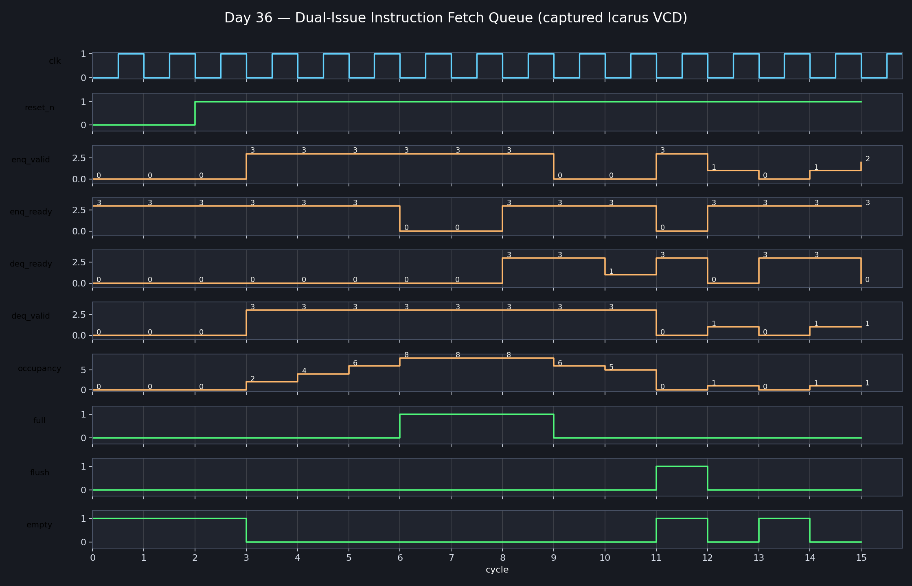

<!-- Author: Asresh Kuricheti -->
# Day 36: Dual-Issue Instruction Fetch Queue

## Overview

This project implements the elastic queue between a two-wide instruction-fetch front end and decode. It stores each instruction together with its PC and branch-prediction metadata, absorbs short decode stalls, supports simultaneous two-entry enqueue/dequeue, and atomically discards speculative work after a redirect.

The project is motivated by current CPU microarchitecture roles that emphasize fetch, out-of-order execution, power/performance/area trade-offs, clean RTL ownership, waveform debugging, and reference-model verification.

## Why this architectural concept matters

Fetch and decode rarely advance at exactly the same rate. Cache latency, prediction bubbles, and downstream hazards create bursty traffic. A fetch queue decouples those stages: fetch can run ahead when space exists, while decode can consume buffered instructions during a brief front-end bubble. The resulting elasticity improves utilization without changing architectural state. A misprediction or exception redirect must flush the queue so no wrong-path instruction reaches decode.

## Features

- Parameterized queue depth, PC width, and instruction width
- Two-wide enqueue and two-wide dequeue with in-order lane semantics
- Ready/valid backpressure and simultaneous push/pop at full occupancy
- PC, instruction, predicted-taken, and predicted-target metadata per entry
- Atomic redirect flush with priority over all traffic
- Arbitrary-depth circular pointers; no power-of-two depth assumption
- Reset-safe empty state and deterministic zero outputs for invalid lanes
- Self-checking directed and randomized verification against an independent reference queue

## Parameters

| Parameter | Default | Meaning |
|---|---:|---|
| `DEPTH` | 8 | Number of buffered instruction entries; must be at least 2 |
| `PC_WIDTH` | 32 | PC and predicted-target width |
| `INSTR_WIDTH` | 32 | Instruction width |

## Ports

| Port | Direction | Width | Meaning |
|---|---|---:|---|
| `clk` | Input | 1 | Rising-edge clock |
| `reset_n` | Input | 1 | Asynchronous active-low reset |
| `flush` | Input | 1 | Discard all queued speculative instructions |
| `enq_valid` | Input | 2 | Valid fetch lanes; lane 1 is accepted only with lane 0 |
| `enq_ready` | Output | 2 | Capacity for at least one/two entries after same-cycle dequeue |
| `enq_pc[0:1]` | Input | 2 × PC width | Fetched instruction PCs |
| `enq_instr[0:1]` | Input | 2 × instruction width | Fetched instructions |
| `enq_pred_taken` | Input | 2 | Direction predictions accompanying each instruction |
| `enq_pred_target[0:1]` | Input | 2 × PC width | Predicted targets |
| `deq_valid` | Output | 2 | Valid decode lanes |
| `deq_ready` | Input | 2 | Decode acceptance; lane 1 cannot advance without lane 0 |
| `deq_pc[0:1]` | Output | 2 × PC width | Oldest PCs in program order |
| `deq_instr[0:1]` | Output | 2 × instruction width | Oldest instructions in program order |
| `deq_pred_taken` | Output | 2 | Prediction metadata for decode |
| `deq_pred_target[0:1]` | Output | 2 × PC width | Predicted targets for decode |
| `occupancy` | Output | `clog2(DEPTH+1)` | Number of stored entries |
| `empty`, `full` | Output | 1 each | Queue status |

## Datapath diagram

```text
        two-wide fetch bundle
  PC + instruction + prediction metadata
                 │
                 ▼
       ┌──────────────────────┐
       │ capacity / push count│◄──────── decode pop count
       └──────────┬───────────┘
                  ▼
       ┌──────────────────────┐
       │ circular entry array │
       │ [PC | inst | pred]   │
       └───┬──────────────┬───┘
         tail            head
                            │ oldest two entries
                            ▼
                     two-wide decode

  branch/exception redirect ── flush ──► head=tail=count=0
```

## How it works

The head pointer identifies the oldest instruction and the tail pointer identifies the next free slot. Combinational logic first determines whether decode accepts zero, one, or two ordered entries. Enqueue readiness includes those same-cycle frees, allowing a full queue to sustain two instructions per cycle when decode also consumes two. At the rising edge, accepted bundles update the array, both pointers advance with explicit depth wrapping, and occupancy changes by pushes minus pops.

Lane ordering is intentional: lane 1 never enters or leaves independently of lane 0. This matches a contiguous fetch/decode bundle and prevents younger instructions from overtaking older ones. `flush` has priority over handshakes and resets all queue bookkeeping in one cycle.

## Simulation timing



The image above is rendered from a real Icarus Verilog VCD capture. It shows reset release, two-wide filling to full occupancy, backpressure, simultaneous dequeue/enqueue, ordered draining, and redirect flush recovery.

## Run

```sh
make icarus
make verilator
make vcs
make questa
```

Each simulator target builds the same synthesizable RTL and self-checking testbench. The Icarus run creates `instruction_fetch_queue.vcd` and prints `RESULT: *** PASS ***` on success.

## What the testbench checks

- Empty reset state and status outputs
- One- and two-entry enqueue/dequeue behavior
- FIFO ordering of every PC, instruction, and prediction field
- Full-queue backpressure
- Full-throughput simultaneous two-pop/two-push operation
- Circular-pointer wraparound
- Lane ordering when only one consumer lane is ready
- Flush priority and wrong-path entry removal
- 500 randomized cycles checked against an independent queue model
- A hard timeout to catch deadlock

## Use cases

- CPU front ends between an instruction cache/alignment unit and decode
- Out-of-order cores that need fetch elasticity during rename or issue stalls
- Superscalar pipelines carrying branch-prediction metadata toward resolution
- GPU or accelerator command front ends with ordered, flushable bundles
- Teaching ready/valid flow control, circular buffers, and speculative recovery

In the larger processor, this queue sits after instruction fetch and prediction but before decode/rename. It helps keep expensive downstream machinery fed while providing a precise point to discard wrong-path instructions.
