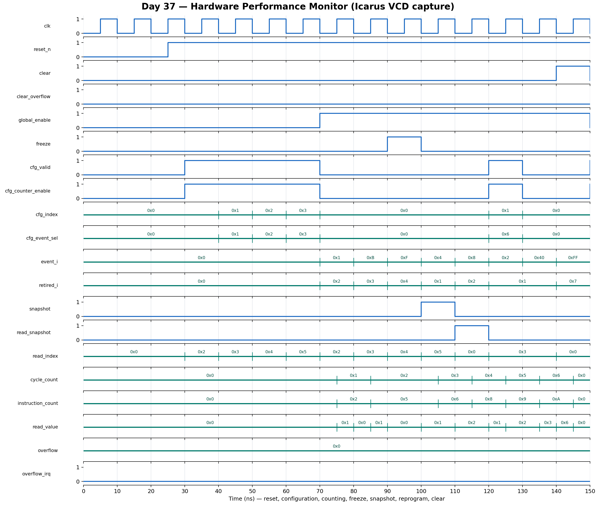

<!-- Author: Asresh Kuricheti -->
# Day 37: Programmable Hardware Performance Monitor

## Overview

This project implements a compact processor performance-monitoring unit (PMU): two fixed counters measure elapsed active cycles and retired instructions, while four programmable counters select from eight microarchitectural event lines. Software or debug logic can freeze measurement, atomically snapshot every counter, read live or captured values, clear state, and receive a sticky overflow interrupt.

The project is inspired by recent high-compensation computer-architecture and ASIC roles at NVIDIA. In particular, a current [Senior ASIC Design Engineer role](https://nvidia.wd5.myworkdayjobs.com/en-US/NVIDIAExternalCareerSite/job/US-TX-Austin/Senior-ASIC-Design-Engineer---Hardware_JR2008535) calls out system-level performance-monitoring IP, RTL checks, latency, and data-flow analysis; a [Senior Architect role](https://nvidia.wd5.myworkdayjobs.com/en-US/NVIDIAExternalCareerSite/job/Senior-Architect_JR2014277) emphasizes memory-system performance modeling and debugging. A PMU is the hardware bridge between those responsibilities and real workload behavior.

## Why this architectural concept matters

Simulation predicts performance, but shipped silicon still needs measurement. PMU counters expose cache misses, branch mispredictions, pipeline stalls, NoC congestion, memory-controller events, and other bottlenecks without changing program execution. Architects use those counts to calculate IPC, miss rates, stall fractions, and workload phase behavior; firmware uses them for profiling and adaptive control; validation teams correlate counter telemetry with waveform and model results.

Atomic snapshots matter because reading counters one at a time would otherwise mix different moments. Sticky overflow state matters because a narrow counter can wrap between software polls. Freeze and global enable provide repeatable measurement windows.

## Features

- Parameterized event count, programmable-counter count, counter width, and retire width
- Fixed active-cycle and retired-instruction counters
- Per-counter event selection and enable configuration
- One event occurrence counted per selected counter per active cycle
- Global measurement enable and non-destructive freeze control
- Atomic snapshot bank with selectable live/snapshot read port
- Sticky overflow bits for every fixed and programmable counter
- Aggregated overflow interrupt output
- Counter clear with preserved programming, plus independent overflow clear
- Reset-safe, synthesizable, lint-friendly RTL
- Directed and randomized self-checking testbench with an independent golden model

## Parameters

| Parameter | Default | Meaning |
|---|---:|---|
| `NUM_EVENTS` | 8 | Number of one-bit microarchitectural event sources |
| `NUM_COUNTERS` | 4 | Number of programmable event counters |
| `COUNTER_WIDTH` | 32 | Width of fixed, event, and snapshot counters |
| `RETIRE_WIDTH` | 3 | Width of the per-cycle retired-instruction count |
| `EVENT_SEL_WIDTH` | derived | Bits needed to select an event source |
| `CFG_INDEX_WIDTH` | derived | Bits needed to select a programmable counter |
| `READ_INDEX_WIDTH` | derived | Bits needed to read two fixed plus programmable counters |

## Ports

| Port | Direction | Width | Meaning |
|---|---|---:|---|
| `clk` | Input | 1 | Rising-edge clock |
| `reset_n` | Input | 1 | Asynchronous active-low reset |
| `clear` | Input | 1 | Clear live counters and overflow state; retain configuration and snapshots |
| `clear_overflow` | Input | 1 | Clear sticky overflow bits without clearing counts |
| `global_enable` | Input | 1 | Enable all fixed and programmable counting |
| `freeze` | Input | 1 | Temporarily stop counting without losing state |
| `event_i` | Input | `NUM_EVENTS` | One-hot or multi-hot microarchitectural event occurrences |
| `retired_i` | Input | `RETIRE_WIDTH` | Number of instructions retired this cycle |
| `cfg_valid` | Input | 1 | Write one programmable-counter configuration |
| `cfg_index` | Input | `CFG_INDEX_WIDTH` | Counter to configure |
| `cfg_event_sel` | Input | `EVENT_SEL_WIDTH` | Event source selected by that counter |
| `cfg_counter_enable` | Input | 1 | Enable bit written with the selection |
| `snapshot` | Input | 1 | Atomically copy all live counts into the snapshot bank |
| `read_snapshot` | Input | 1 | Choose snapshot (`1`) or live (`0`) read data |
| `read_index` | Input | `READ_INDEX_WIDTH` | `0`: cycles, `1`: instructions, `2+`: event counters |
| `read_value` | Output | `COUNTER_WIDTH` | Selected live or snapshot counter value |
| `cycle_count` | Output | `COUNTER_WIDTH` | Live active-cycle count |
| `instruction_count` | Output | `COUNTER_WIDTH` | Live retired-instruction count |
| `overflow` | Output | `NUM_COUNTERS+2` | Sticky event, cycle, and instruction overflow bits |
| `overflow_irq` | Output | 1 | OR reduction of all overflow bits |

## Block/datapath diagram

```text
 event_i[7:0]                         retired_i
      │                                   │
      ▼                                   ▼
┌───────────────┐   selected event   ┌──────────┐
│ selector bank ├──────────────┐      │ retired  │
│ sel + enable  │              │      │ counter  │
└───────────────┘              ▼      └────┬─────┘
                     ┌────────────────┐    │
 active clock ──────►│ cycle + 4 event│    │
 enable / freeze ───►│ counter bank   │◄───┘
                     └───────┬────────┘
                             │ snapshot (all counters together)
                             ▼
                     ┌────────────────┐
                     │ snapshot bank  │
                     └───────┬────────┘
              live/snapshot  │
 read_index ─────────────────►MUX──► read_value

 counter wrap ──► sticky overflow bits ──► overflow_irq
```

## How it works

Configuration writes store an event selector and enable bit for one programmable counter. The new mapping applies from the next rising edge; the event observed on the configuration edge follows the old mapping. When `global_enable` is asserted and `freeze` is clear, the cycle counter increments, the instruction counter adds `retired_i`, and each enabled programmable counter increments if its selected event bit is high.

The counters wrap modulo `2^COUNTER_WIDTH`. A carry or all-ones increment sets the corresponding sticky overflow bit, so software cannot miss a wrap. `clear_overflow` removes old status while preserving any new overflow generated on the same edge. `overflow_irq` is asserted whenever any sticky bit is set.

`snapshot` copies every live counter before that edge's increments, creating a coherent observation point. Reads are combinational: index zero selects cycles, index one selects retired instructions, and later indices select programmable counters. `read_snapshot` switches the entire read path between live and captured banks.

`clear` has priority over counting and clears live counts plus overflow status, while deliberately preserving event programming and the prior snapshot. This supports repeated profiling windows without reprogramming selectors and lets software inspect the previous window after starting a new one.

## Simulation timing



The image above is rendered from a real Icarus Verilog VCD capture. It shows reset release, event-selector programming, active cycle/instruction/event counting, freeze behavior, an atomic snapshot, and a subsequent live-versus-snapshot read.

## Run

```sh
make icarus
make verilator
make vcs
make questa
```

Each target builds the same synthesizable RTL and self-checking testbench. The Icarus run emits `hardware_performance_monitor.vcd` and prints `RESULT: *** PASS ***` only after all comparisons succeed.

## What the testbench checks

- Reset state for counts, configuration enables, snapshots, and overflow status
- Independent configuration and disabling of every programmable counter
- Event selection, simultaneous events, and next-cycle configuration semantics
- Active-cycle and multi-retire instruction accumulation
- Global enable and freeze gating
- Atomic pre-increment snapshot semantics and live/snapshot read selection
- Counter clear priority while retaining configuration
- Event, cycle, and instruction wraparound with sticky overflow IRQ behavior
- Independent overflow clearing and same-cycle reassertion rules
- 500 randomized cycles of configuration, events, retire counts, gating, reads, snapshots, and clears
- A hard timeout to catch deadlock or non-termination

## Use-case examples

- CPU profiling: derive IPC from retired instructions divided by active cycles and correlate it with branch or cache events
- GPU/accelerator telemetry: count scheduler stalls, memory backpressure, tensor-pipeline occupancy events, or NoC congestion
- Cache and memory tuning: compare demand misses, writebacks, row hits, and queue-full cycles across workloads
- Silicon bring-up: correlate firmware-visible counters with internal logic-analyzer traces and architectural models
- Dynamic control: feed utilization and stall measurements into DVFS, clock-gating, prefetch-throttling, or QoS policies
- Virtualization: save, restore, filter, or partition counters to profile guests and containers
- Verification: check that performance events fire exactly when their underlying microarchitectural conditions occur

In the larger SoC, this block sits beside the processor pipeline and memory hierarchy. Event wires originate in distributed units, configuration arrives through a CSR or debug bus adapter, and counter reads feed profiling software, firmware, or a telemetry fabric.
