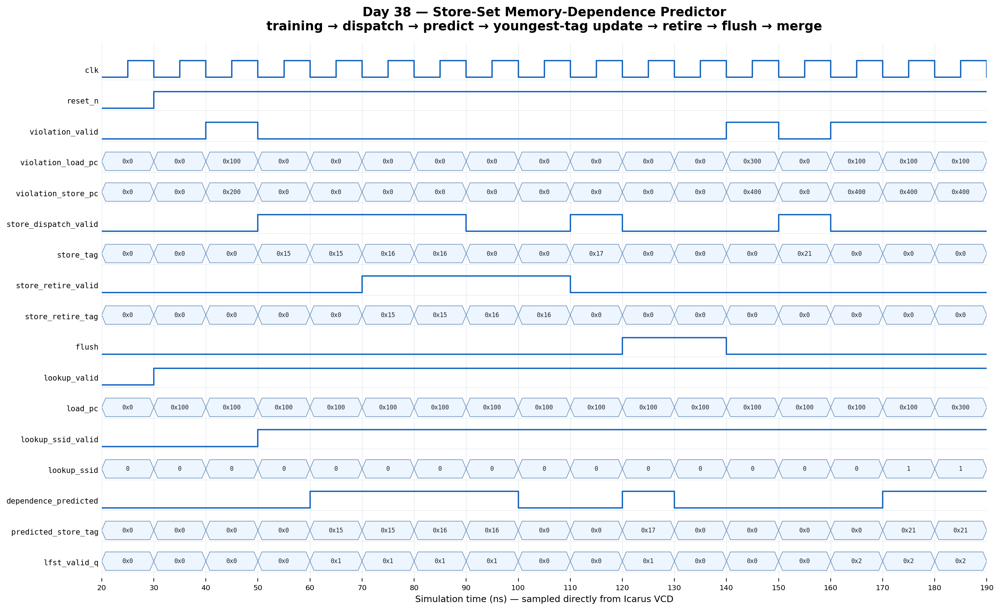

<!-- Author: Asresh Kuricheti -->
# Day 38: Store-Set Memory-Dependence Predictor

## Overview

This project implements the prediction structure that lets an out-of-order CPU issue loads before all older store addresses are known without blindly risking memory-order violations. It learns dependence pairs after a violation, groups related load/store PCs into store sets, tracks the youngest in-flight store in each set, and gives the scheduler a precise ROB tag to wait for.

The project is shaped by current, high-compensation CPU architecture roles. Apple's April 2026 [CPU Microarchitect/RTL Engineer — Execution, Load/Store](https://jobs.apple.com/en-us/details/200657634-0505/cpu-microarchitect-rtl-engineer-execution-load-store) role emphasizes load/store microarchitecture, RTL ownership, verification, and performance exploration. Its [Fetch, Out of Order](https://jobs.apple.com/en-us/details/200657881/cpu-microarchitect-rtl-engineer-fetch-out-of-order) role lists out-of-order execution, instruction scheduling, load/store execution, cache/memory expertise, and a base-pay range up to $277,600. This block turns those job requirements into a focused portfolio project.

## Why this architectural concept matters

A conservative scheduler can wait until every older store computes its address before issuing a load, but that serializes common independent memory operations. An aggressive scheduler can issue every load immediately, but a late-discovered alias forces an expensive pipeline replay. Store sets learn which static loads and stores have actually conflicted and delay only the risky loads behind the youngest relevant dynamic store.

The predictor has two classic structures: the Store Set ID Table (SSIT) maps hashed instruction PCs to dependence classes, while the Last Fetched Store Table (LFST) maps each class to the youngest in-flight store's reorder-buffer tag. A violation joins two PCs into one class; future instances can then be ordered before they replay.

## Features

- Parameterized PC width, SSIT entries, store-set count, and ROB tag width
- Folded PC hash for better use of low-cost direct-mapped SSIT storage
- Combinational load lookup with store-set visibility and dependency tag
- Violation-driven allocation when neither PC has prior history
- One-sided training when only the load or store is already classified
- Full set merge when separately trained classes later conflict
- Youngest-store LFST replacement at store dispatch
- Tag-qualified retirement that preserves a newer store in the same set
- Pipeline flush that clears speculative LFST state while retaining learned SSIT state
- Directed and randomized self-checking testbench with an independent golden model

## Parameters

| Parameter | Default | Meaning |
|---|---:|---|
| `PC_WIDTH` | 32 | Width of instruction PCs |
| `SSIT_ENTRIES` | 64 | Power-of-two number of PC-to-set mappings |
| `NUM_STORE_SETS` | 16 | Power-of-two number of dependence classes |
| `ROB_TAG_WIDTH` | 8 | Width of dynamic store/reorder-buffer tags |
| `SSIT_INDEX_WIDTH` | derived | Folded-PC SSIT index width |
| `SSID_WIDTH` | derived | Store-set identifier width |

## Ports

| Port | Direction | Width | Meaning |
|---|---|---:|---|
| `clk` | Input | 1 | Rising-edge clock |
| `reset_n` | Input | 1 | Asynchronous active-low reset |
| `flush` | Input | 1 | Clear all in-flight LFST entries, retaining learned classes |
| `lookup_valid` | Input | 1 | Qualifies the candidate load PC |
| `load_pc` | Input | `PC_WIDTH` | Static PC of the load being scheduled |
| `dependence_predicted` | Output | 1 | Load should wait for an in-flight store |
| `predicted_store_tag` | Output | `ROB_TAG_WIDTH` | Youngest dependent store's ROB tag |
| `lookup_ssid_valid` | Output | 1 | The load PC has a learned SSIT entry |
| `lookup_ssid` | Output | `SSID_WIDTH` | Learned store-set identifier |
| `store_dispatch_valid` | Input | 1 | A store has entered the out-of-order window |
| `store_pc` | Input | `PC_WIDTH` | Static PC of the dispatched store |
| `store_tag` | Input | `ROB_TAG_WIDTH` | Dynamic ROB tag of the dispatched store |
| `store_retire_valid` | Input | 1 | A store is leaving the tracked window |
| `store_retire_tag` | Input | `ROB_TAG_WIDTH` | Tag to remove only if it is still youngest |
| `violation_valid` | Input | 1 | A load/store ordering violation was detected |
| `violation_load_pc` | Input | `PC_WIDTH` | PC of the replayed load |
| `violation_store_pc` | Input | `PC_WIDTH` | PC of the older conflicting store |

## Block/datapath diagram

```text
                         violation feedback
                    load PC ─────┬───── store PC
                                 ▼
                        ┌──────────────────┐
 dispatch store PC ────►│ Store Set ID     │◄──── lookup load PC
                        │ Table (SSIT)      │
                        │ valid + SSID      │
                        └────────┬─────────┘
                                 │ store-set ID
                                 ▼
 store dispatch tag ───►┌──────────────────┐
 store retire tag ─────►│ Last Fetched     │───► dependence_predicted
 flush ─────────────────►│ Store Table      │───► predicted_store_tag
                        │ (LFST)           │
                        └──────────────────┘

 ordering violation: allocate / attach / merge SSIT classes
 pipeline recovery:   clear LFST speculative tags, keep SSIT learning
```

## How it works

The SSIT is indexed by XOR-folding two regions of the word-aligned PC. An untrained load returns no dependency. Once a violation identifies a load/store pair, the table gives both PCs the same store-set ID. If one side was already trained, the other joins that class. If both belong to different classes, every entry in the load's class is merged into the store's class so transitive relationships remain ordered.

When a trained store dispatches, its dynamic tag overwrites the LFST entry for its class, making it the youngest store that future loads must wait for. Retirement clears an LFST slot only when the retiring tag is still recorded, so retirement of an older store cannot erase a newer one. A recovery flush invalidates all dynamic LFST entries because their tags may refer to squashed work, but preserves SSIT history because the learned relationships remain useful.

Allocation wraps through the finite store-set namespace. Reuse and PC aliasing can create conservative false dependencies, which cost performance but preserve correctness. A production design can add confidence aging, periodic table clears, larger tags, or checkpointed LFST state.

## Simulation timing



The image is rendered from a real Icarus Verilog VCD capture. It shows reset release, violation-driven training, store dispatch, a predicted dependence, youngest-tag replacement, retirement, recovery flush, and retained SSIT learning.

## Run

```sh
make icarus
make verilator
make vcs
make questa
```

Every target builds the same synthesizable RTL and self-checking testbench. Icarus emits `store_set_predictor.vcd`; success is reported only as `RESULT: *** PASS ***` after all directed and randomized comparisons complete.

## What the testbench checks

- Reset state and untrained-load behavior
- New store-set allocation from a first memory-order violation
- Store dispatch and exact ROB-tag prediction
- Youngest-store replacement and safe retirement of an older tag
- Last-store retirement clearing the predicted dependence while retaining the SSIT class
- Flush removal of speculative LFST state without erasing learned relationships
- Creation of independent sets and full transitive set merging
- Hundreds of randomized lookups, violations, dispatches, retirements, merges, and flushes
- A hard timeout to detect non-termination

## Use-case examples

- Out-of-order CPU load/store queues: gate a speculative load on the youngest historically conflicting store
- Memory-disambiguation replay reduction: convert observed violations into selective future ordering
- Wide superscalar scheduling: avoid the throughput loss of waiting behind every unresolved older store
- Server CPUs: reduce effective load latency in pointer-heavy and mixed-memory workloads
- Mobile CPUs: capture much of aggressive speculation's performance without a large fully associative dependency table
- Architectural research: measure IPC/replay trade-offs as SSIT size, store-set count, and hash behavior change
- Verification environments: generate an expected dependency tag for scheduler and replay-path checking

In the larger processor, violation feedback comes from the load/store queue, dispatch tags come from rename/ROB allocation, retirement comes from commit, and the lookup result feeds the issue scheduler. The predictor is advisory: the LSQ still performs the authoritative address comparison and triggers replay if a dependency was missed.
