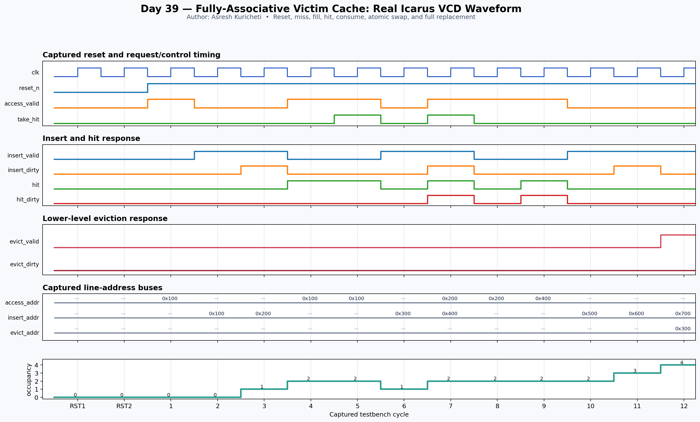

<!-- Author: Asresh Kuricheti -->
# Day 39: Fully-Associative Victim Cache

## Overview

This project implements a small fully-associative victim cache placed beside a direct-mapped or low-associativity L1 cache. Lines displaced from L1 enter the victim cache; a later L1 miss probes every victim entry in parallel and can atomically exchange the matching line with the new L1 victim. That swap converts recurring conflict misses into fast local hits without lengthening the L1's normal hit path.

The project is grounded in current high-compensation architecture work. Apple's April 2026 [ASIC Design Engineer — Cache Controller](https://jobs.apple.com/en-us/details/200657223/asic-design-engineer-cache-controller) posting lists a $184,700–$324,800 base-pay range and calls for cache microarchitecture, RTL, coherence, and PPA analysis. NVIDIA's recent [Lead Performance Modeling Architect — CPU Fabric and LLC](https://nvidia.wd5.myworkdayjobs.com/NVIDIAExternalCareerSite/job/US-CA-Santa-Clara/Lead-Performance-Modeling-Architect--CPU-Fabric-and-LLC_JR2017466) role emphasizes next-generation cache hierarchies, coherent fabrics, and performance bottlenecks. Micron's [MTS Digital Design Engineer, HBM](https://careers.micron.com/careers/job/40623857?domain=micron.com&src=JB-12600&urlHash=FBCJ) role highlights parameterized SystemVerilog, FIFOs, pipelines, arbitration, memory systems, and PPA tradeoffs. This project distills those memory-hierarchy skills into a portfolio-sized block.

## Why this architectural concept matters

Direct-mapped caches are fast and compact, but addresses mapping to the same set repeatedly evict one another even when the rest of the cache is empty. A victim cache retains a few recently displaced lines in a parallel-search buffer. Because it is off the primary L1 hit path, it can add effective associativity and reduce miss traffic with less latency and area than making the entire L1 more associative.

Dirty state must travel with each line. When the victim cache itself replaces a dirty entry, that line must be written to the next memory level; a clean line can simply be discarded. Atomic swap is the key operation: on a victim hit, the requested entry returns to L1 while the conflicting L1 line occupies exactly that entry, avoiding an unnecessary third eviction.

## Features

- Parameterized address width, line-data width, entry count, and pointer width
- Fully associative parallel lookup across every victim entry
- Hit data, dirty metadata, and matching-way reporting
- Consume-only operation for a victim hit with no replacement line
- Atomic victim-hit/L1-eviction swap with no lower-level traffic
- Invalid-entry-first allocation before round-robin replacement
- Clean and dirty eviction reporting to the next cache or memory level
- Live occupancy count for monitoring and assertions
- Asynchronous active-low reset with all valid/dirty state cleared
- Directed and randomized self-checking testbench using an independent golden model

## Parameters

| Parameter | Default | Meaning |
|---|---:|---|
| `ADDR_WIDTH` | 32 | Width of the line-aligned address/tag stored per entry |
| `DATA_WIDTH` | 64 | Width of one cached line in this educational model |
| `ENTRIES` | 4 | Power-of-two number of fully associative entries |
| `PTR_WIDTH` | derived | Width of a way or replacement-pointer index |

## Ports

| Port | Direction | Width | Meaning |
|---|---|---:|---|
| `clk` | Input | 1 | Rising-edge clock |
| `reset_n` | Input | 1 | Asynchronous active-low reset |
| `access_valid` | Input | 1 | Qualifies a victim-cache lookup |
| `access_addr` | Input | `ADDR_WIDTH` | Requested line address from an L1 miss |
| `hit` | Output | 1 | Requested line is resident |
| `hit_data` | Output | `DATA_WIDTH` | Data returned by the matching entry |
| `hit_dirty` | Output | 1 | Dirty state returned with the hit line |
| `hit_way` | Output | `PTR_WIDTH` | Matching victim-cache entry |
| `take_hit` | Input | 1 | Consume the matching entry at the clock edge |
| `insert_valid` | Input | 1 | Qualifies a line displaced from L1 |
| `insert_addr` | Input | `ADDR_WIDTH` | L1 victim line address |
| `insert_data` | Input | `DATA_WIDTH` | L1 victim line data |
| `insert_dirty` | Input | 1 | L1 victim line dirty state |
| `evict_valid` | Output | 1 | An occupied victim entry is being replaced |
| `evict_addr` | Output | `ADDR_WIDTH` | Replaced line address |
| `evict_data` | Output | `DATA_WIDTH` | Replaced line data |
| `evict_dirty` | Output | 1 | Replaced line requires a lower-level write if set |
| `occupancy` | Output | `PTR_WIDTH+1` | Number of valid victim entries |

## Block/datapath diagram

```text
                         L1 miss address
                               │
                  ┌────────────▼────────────┐
                  │ parallel tag comparators│
                  │ way0  way1  ...  wayN-1│
                  └────────────┬────────────┘
                               │ hit + selected way
                               ▼
 L1 fill ◄────────────── data/dirty mux
    │
    │ conflicting L1 line       take_hit + insert_valid
    └───────────────────────────┬──────────────────────┐
                                ▼                      │
                    ┌───────────────────────┐          │
                    │ victim data/tag/dirty │◄─────────┘ atomic swap
                    │ invalid-first insert  │
                    │ round-robin replace   │
                    └───────────┬───────────┘
                                │ full-buffer replacement
                                ▼
                       next cache / memory
                      (write only when dirty)
```

## How it works

Every valid entry compares its stored line address with `access_addr` in parallel. A match selects the corresponding data and dirty bit. If `take_hit` is asserted, the matching entry is consumed at the next rising edge. With `insert_valid` asserted in the same cycle, the incoming L1 victim replaces the matched entry directly: the common victim-cache swap operation.

An insertion without a consumed hit chooses the lowest-numbered invalid entry. Once all entries are valid, it chooses the round-robin pointer and exposes the displaced line on the eviction interface before overwriting it. The pointer advances only on a full-buffer replacement, keeping the policy deterministic. `evict_dirty` tells the downstream controller whether it must write the displaced line back or may discard it.

The interface models complete line addresses rather than byte offsets. In a larger cache controller, address decomposition happens before this block and the returned line is installed into the original L1 set.

## Simulation timing



The image is rendered from a real Icarus Verilog VCD capture. It shows reset, an initial miss, clean and dirty inserts, a victim hit, consume-only removal, invalid-slot reuse, an atomic swap, and full-buffer replacement with eviction metadata.

## Run

```sh
make icarus
make verilator
make vcs
make questa
```

Every target builds the same synthesizable RTL and self-checking testbench. Icarus emits `victim_cache.vcd`; success is printed only as `RESULT: *** PASS ***` after all directed and randomized comparisons finish.

## What the testbench checks

- Reset empties all entries and clears hit/eviction responses
- Lookup misses and exact hit data, dirty bit, and way selection
- Clean and dirty line insertion into invalid entries
- Consume-only hit removal and occupancy decrement
- Reuse of a newly invalidated entry
- Atomic victim-hit swap without a spurious lower-level eviction
- Full-buffer round-robin replacement and exact eviction payload
- Hundreds of randomized lookups, takes, inserts, swaps, and replacements
- Cycle-by-cycle equality with an independent entry-array/reference-pointer model
- A hard timeout to catch deadlock or non-termination

## Use-case examples

- Direct-mapped L1 data caches: retain alternating lines that map to the same set
- Instruction caches: protect hot loops whose code blocks conflict in a small L1I
- GPU and accelerator scratch caches: add effective associativity with a compact side buffer
- Embedded CPUs: reduce external-memory traffic while preserving a single-cycle primary-cache lookup
- Inclusive cache hierarchies: carry dirty state and forward displaced lines toward L2
- Architecture experiments: measure conflict-miss reduction versus entry count and replacement policy
- Post-silicon performance tuning: correlate victim hits, dirty evictions, and occupancy with PMU events

In the big picture, this block sits between the L1 controller and the next cache level. The L1 probes it after a primary miss, installs a returned hit, and simultaneously supplies the line it had to displace. The downstream controller acts only when `evict_valid` is asserted, and performs a writeback only when `evict_dirty` is also set.
