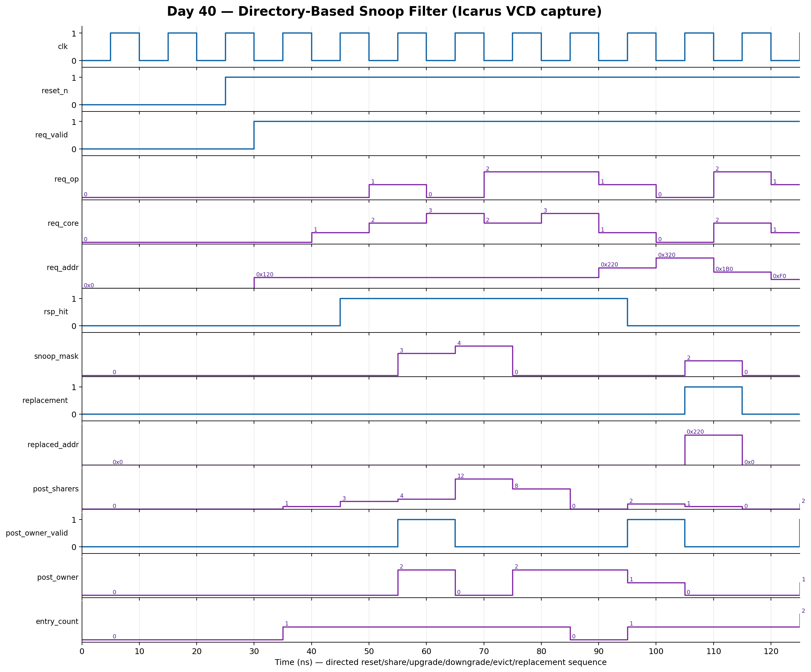

<!-- Author: Asresh Kuricheti -->
# Day 40: Directory-Based Snoop Filter

## Overview

This project implements a compact directory-based snoop filter for a four-core coherent fabric. Instead of broadcasting every coherence request to every private cache, the filter records which cores may hold each cache line and emits a precise snoop mask. Read-shared requests add sharers, read-unique requests invalidate competing copies and establish an owner, evictions remove sharers, and direct-mapped directory conflicts safely probe every recorded holder before replacement.

The project is based on current high-compensation computer-architecture work. NVIDIA's 2026 [Lead Performance Modeling Architect — CPU Fabric and LLC](https://nvidia.wd5.myworkdayjobs.com/en-US/NVIDIAExternalCareerSite/job/Lead-Performance-Modeling-Architect--CPU-Fabric-and-LLC_JR2017466) role lists base pay up to $356,500 and explicitly names CHI/MESI coherence, coherent fabrics, and cache hierarchies. Its [Senior Performance Modeling Architect — CPU Fabric and LLC](https://nvidia.wd5.myworkdayjobs.com/en-US/NVIDIAExternalCareerSite/job/Senior-Performance-Modeling-Architect--CPU-Fabric-and-LLC_JR2017467) description specifically calls out snooping filters. Apple's April 2026 [CPU Cache Microarchitect/RTL Engineer](https://jobs.apple.com/en-us/details/200657381/cpu-cache-microarchitect-rtl-engineer) role seeks multi-level cache RTL expertise in coherence, interconnects, queuing, scheduling, starvation, and deadlock avoidance. This project turns those system-level requirements into a portfolio-sized synthesizable block.

## Why this architectural concept matters

A broadcast snoop protocol scales poorly: every request consumes tag-lookup energy and fabric bandwidth at every core, even when most cores cannot hold the line. A snoop filter acts as a directory near the shared cache or home node. Its sharer vector identifies exactly which caches need a probe, reducing unnecessary traffic and power.

Accuracy is architectural, not merely an optimization. False positives cost bandwidth but remain safe; false negatives can violate coherence by leaving a stale copy unprobed. On a directory-set conflict, this implementation therefore reports `replacement` and snoops all holders of the displaced line before installing the new tag.

## Features

- Parameterized address width, line size, directory set count, and core count
- Direct-mapped tag directory with valid, sharer-vector, and owner metadata
- Read-shared allocation and owner-to-shared downgrade snoops
- Read-unique allocation/upgrade with targeted invalidation mask
- Clean last-sharer removal on private-cache eviction
- Safe conflicting-tag replacement with displaced-line address and snoop mask
- Registered response metadata and combinational live-entry count
- Asynchronous active-low reset that invalidates every directory entry
- Directed plus 700-cycle randomized self-checking verification

## Parameters

| Parameter | Default | Meaning |
|---|---:|---|
| `ADDR_WIDTH` | 32 | Physical byte-address width |
| `LINE_OFFSET` | 6 | Log2(bytes per cache line), 6 means 64-byte lines |
| `SETS` | 8 | Power-of-two direct-mapped directory entries |
| `CORES` | 4 | Number of coherent requesters/sharer bits |
| `INDEX_WIDTH` | derived | Directory index width |
| `CORE_WIDTH` | derived | Requester/owner identifier width |
| `COUNT_WIDTH` | derived | Live-entry counter width |

## Ports

| Port | Direction | Width | Meaning |
|---|---|---:|---|
| `clk` | Input | 1 | Rising-edge clock |
| `reset_n` | Input | 1 | Asynchronous active-low reset |
| `req_valid` | Input | 1 | Qualifies one directory request |
| `req_op` | Input | 2 | `00` read shared, `01` read unique, `10` evict |
| `req_core` | Input | `CORE_WIDTH` | Requesting private-cache ID |
| `req_addr` | Input | `ADDR_WIDTH` | Byte address of the requested line |
| `rsp_valid` | Output | 1 | Registered request completion |
| `rsp_hit` | Output | 1 | Requested tag matched the indexed entry |
| `snoop_mask` | Output | `CORES` | Private caches that must be probed |
| `replacement` | Output | 1 | Request displaced a different valid line |
| `replaced_addr` | Output | `ADDR_WIDTH` | Line address whose directory entry was displaced |
| `post_sharers` | Output | `CORES` | Sharer vector after the accepted operation |
| `post_owner_valid` | Output | 1 | Updated line has an exclusive owner |
| `post_owner` | Output | `CORE_WIDTH` | Exclusive owner ID when valid |
| `entry_count` | Output | `COUNT_WIDTH` | Number of valid directory entries |

## Block/datapath diagram

```text
 coherent request (address, core, ReadShared/ReadUnique/Evict)
                              │
                    ┌─────────▼─────────┐
                    │ index + tag match │
                    └─────────┬─────────┘
                              │
              ┌───────────────▼────────────────┐
              │ direct-mapped directory entry   │
              │ valid | tag | sharers | owner   │
              └───────┬──────────┬──────────────┘
                      │          │
       existing owner/sharers    └── metadata update
                      │              add/remove/upgrade
              ┌───────▼────────┐
              │ snoop-mask mux │───► targeted probes to L1 caches
              └───────┬────────┘
                      │ conflict
                      └────────────► replacement + displaced line
```

## How it works

The line address is split into offset, directory index, and tag. A valid tag match is a directory hit. On `READ_SHARED`, the requester joins the sharer vector. If another core was the exclusive owner, only that owner is snooped so it can downgrade, after which the line is shared.

On `READ_UNIQUE`, every other recorded sharer is selected in `snoop_mask`; the requester becomes the sole sharer and exclusive owner. On `EVICT`, the requester's bit is cleared, and the entry becomes invalid when the last sharer leaves. A tag miss allocates the indexed entry. If another tag already occupies it, `replacement` identifies the conservative conflict path: `snoop_mask` contains every holder of the old line and `replaced_addr` reconstructs its line address.

In a complete coherent home node, the response drives probe messages and the metadata write would be committed only after required acknowledgements return. This educational block models the directory lookup and state-transition core in one registered operation so the essential targeting rules stay visible.

## Simulation timing



The image is rendered from a real Icarus Verilog VCD capture. It covers reset, shared-line creation, a read-unique upgrade that snoops two sharers, owner downgrade, per-core evictions, and same-index replacement that snoops the displaced owner.

## Run

```sh
make icarus
make verilator
make vcs
make questa
```

Icarus writes `directory_snoop_filter.vcd`. The testbench prints `RESULT: *** PASS ***` only after all directed and randomized comparisons agree with the independent golden directory model.

## What the testbench checks

- Reset invalidates every directory entry and clears response state
- Cold read-shared allocation and accumulation of multiple sharers
- Read-unique upgrade generates exactly the competing-sharer snoop mask
- Read-shared access to an exclusive line snoops only its owner and downgrades it
- Eviction removes one sharer and invalidates the last-sharer entry
- Same-index tag replacement returns the exact displaced line and all its holders
- Read/write-like ownership traffic across randomized cores, tags, and indices
- Entry count and all response metadata against a cycle-accurate golden model
- A hard timeout catches non-termination

## Use-case examples

- Multicore CPU home nodes: target ACE/CHI probes only at L1/L2 caches that may hold a line
- GPU coherent clusters: reduce broadcast traffic among compute-cluster caches
- System-level caches: maintain inclusion metadata for private-cache copies
- Chiplet fabrics: avoid sending unnecessary coherence messages over die-to-die links
- Automotive SoCs: lower interconnect power while preserving coherent shared-memory behavior
- Performance models: explore broadcast reduction, directory aliasing, and snoop amplification
- Verification portfolios: exercise golden models, randomized coherence traffic, and waveform debug

In the big picture, this block sits beside a shared last-level cache or coherence home agent. Incoming requests consult it before probes are launched. The returned mask fans out through the NoC, acknowledgement collection gates the real metadata commit, and replacement information prevents an aliased directory entry from silently forgetting a cached copy.
