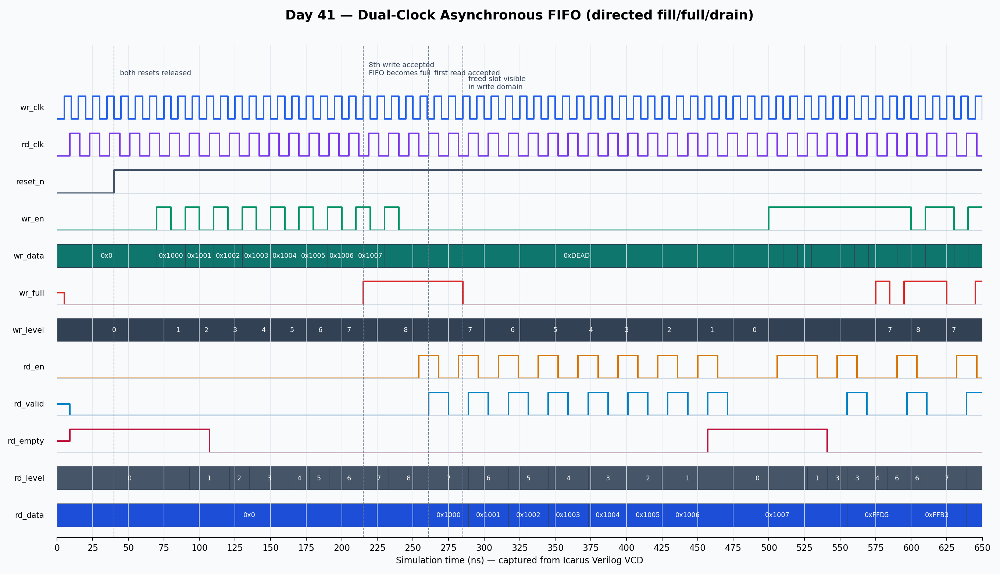

<!-- Author: Asresh Kuricheti -->
# Day 41: Dual-Clock Asynchronous FIFO

## Overview

This project implements a parameterized FIFO that safely moves a stream between unrelated clock domains. The write side and read side each keep a local binary pointer for RAM addressing, convert that pointer to Gray code, and pass it through a two-flop synchronizer. Full and empty are therefore decided locally without sampling a multi-bit binary counter that may be changing underneath the destination clock.

The project is grounded in current, well-paid computer-architecture work. NVIDIA's August 2026 [SoC Clocks RTL Design Engineer](https://nvidia.wd5.myworkdayjobs.com/en-US/NVIDIAExternalCareerSite/job/Israel-Tel-Aviv/SOC-Clocks-RTL-Design-Engineer_JR2022321) role specifically lists clock-domain-crossing infrastructure, reset synchronization, SystemVerilog RTL, CDC/RDC checks, synthesis, timing, and physical implementation. NVIDIA's [Senior ASIC Design Engineer — Hardware](https://nvidia.wd5.myworkdayjobs.com/en-US/NVIDIAExternalCareerSite/job/US-TX-Austin/Senior-ASIC-Design-Engineer---Hardware_JR2008535) also emphasizes CDC, multiple power domains, latency, data flow, and system-level IP. This FIFO turns those job requirements into a portfolio-sized architecture block.

## Why this architectural concept matters

A normal FIFO assumes its producer and consumer share one clock. When the clocks are unrelated, directly sampling a changing pointer can capture an impossible mix of old and new bits and cause overflow, underflow, or data corruption. Gray coding changes only one pointer bit per increment. A two-flop synchronizer then gives that one bit time to settle before the destination uses it.

The synchronized pointer is intentionally delayed. This makes `wr_full` and `rd_empty` conservative: a writer may see full for a couple of cycles after space is freed, and a reader may see empty briefly after data arrives. Throughput can pause, but safety is preserved.

## Features

- Independent write and read clocks with independent active-low resets
- Parameterized data width and power-of-two depth
- Dual-port memory inference: synchronous write and synchronous read
- Binary pointers for addressing and Gray pointers for safe CDC transfer
- Two-flop synchronizers marked with the common `ASYNC_REG` attribute
- Standard inverted-wrap-bit full detection and pointer-equality empty detection
- Registered `wr_full`, `rd_empty`, `rd_valid`, and read data
- Conservative per-domain occupancy estimates for monitoring and backpressure
- Directed fill/overflow/drain checks plus concurrent randomized traffic
- Hard simulation timeout and VCD dump

## Parameters

| Parameter | Default | Meaning |
|---|---:|---|
| `DATA_WIDTH` | 32 | Width of each queued word |
| `DEPTH` | 16 | FIFO entries; must be a power of two and at least 4 |
| `ADDR_WIDTH` | `$clog2(DEPTH)` | RAM address bits |
| `PTR_WIDTH` | `ADDR_WIDTH + 1` | Address plus wrap bit |

## Ports

| Port | Direction | Width | Meaning |
|---|---|---:|---|
| `wr_clk` | Input | 1 | Write-domain clock |
| `wr_reset_n` | Input | 1 | Asynchronous active-low write-domain reset |
| `wr_en` | Input | 1 | Requests a write |
| `wr_data` | Input | `DATA_WIDTH` | Word offered by the producer |
| `wr_full` | Output | 1 | Blocks writes when no safe slot remains |
| `wr_level` | Output | `PTR_WIDTH` | Conservative write-domain occupancy estimate |
| `rd_clk` | Input | 1 | Read-domain clock |
| `rd_reset_n` | Input | 1 | Asynchronous active-low read-domain reset |
| `rd_en` | Input | 1 | Requests a read |
| `rd_data` | Output | `DATA_WIDTH` | Registered word returned to the consumer |
| `rd_valid` | Output | 1 | Pulses after a successful read |
| `rd_empty` | Output | 1 | Blocks reads when no synchronized data is visible |
| `rd_level` | Output | `PTR_WIDTH` | Conservative read-domain occupancy estimate |

## Block/datapath diagram

```text
 producer (wr_clk)                                      consumer (rd_clk)
        │ wr_en/data                                           ▲ rd_valid/data
        ▼                                                      │
 ┌──────────────┐      ┌──────────────────────────┐      ┌──────────────┐
 │ write pointer├─────►│ dual-port FIFO memory    ├─────►│ read pointer │
 │ binary + Gray│      │ DEPTH × DATA_WIDTH       │      │ binary + Gray│
 └──────┬───────┘      └──────────────────────────┘      └──────┬───────┘
        │ Gray                                                   │ Gray
        │          ┌───────────────────────────────┐              │
        └─────────►│ two-flop synchronizer per bus │◄─────────────┘
                   └──────────────┬────────────────┘
                                  │
                    local compare │ local compare
                         rd_empty ◄┴► wr_full
```

## How it works

A write occurs only when `wr_en && !wr_full`. The write-domain binary pointer indexes memory; its next value becomes a Gray-coded pointer. The read side performs the symmetric operation on `rd_en && !rd_empty`, returning data one read-clock edge later with `rd_valid` asserted.

Each Gray pointer crosses into the opposite domain through two flip-flops. Empty is simple equality: the next read pointer equals the synchronized write pointer. Full uses the classic power-of-two ring-buffer test: the next write Gray pointer equals the synchronized read Gray pointer with its two most-significant bits inverted, meaning the addresses match one complete buffer lap apart.

The memory payload does not pass through bit synchronizers. Instead, the producer writes a slot before publishing its pointer, the synchronized pointer takes multiple clocks to become visible, and the consumer reads only published slots. In a physical flow, the pointer synchronizers still need CDC constraints and the Gray bus needs skew control so implementation preserves the one-bit-change assumption.

Both resets should be asserted together when clearing a live FIFO. Their deassertion may be synchronized independently in the surrounding reset controller. Resetting only one side while traffic remains in flight discards pointer agreement and is not a supported data-preserving operation.

## Simulation timing



This image is rendered from the real Icarus Verilog VCD capture. It shows asynchronous 10 ns/14 ns clocks, reset release, ordered writes, delayed pointer visibility, full backpressure, reads, synchronized space visibility, and the empty transition during the directed test.

## Run

```sh
make icarus
make verilator
make vcs
make questa
```

Icarus writes `async_fifo.vcd`. The self-checking testbench prints `RESULT: *** PASS ***` only if every accepted read matches the oldest accepted write. This project was validated with Icarus Verilog: 951 checks passed across 386 accepted writes and 386 ordered reads.

## What the testbench checks

- Reset starts the write side not-full and read side empty
- Exactly `DEPTH` ordered writes make the FIFO full
- A write held against full is rejected without changing the golden queue
- Directed reads return all words in original order
- Draining the final entry eventually asserts empty
- Concurrent pseudo-random writes and reads under unrelated clocks
- Every accepted transaction against an independent software-style scoreboard
- Occupancy estimates never exceed the configured depth
- Accepted-write and checked-read totals agree after the final drain
- A hard timeout catches deadlock or non-termination

## Use-case examples

- CPU clock islands: carry commands or completion records between independently gated cores
- Network-on-chip ports: decouple routers or chiplets running at different frequencies
- Memory controllers: bridge a CPU request clock to a DRAM PHY or controller clock
- GPU and AI accelerators: stream descriptors and tensor tiles between host and compute domains
- DMA engines: connect a peripheral bus clock to a faster system interconnect
- Clock-frequency changes: absorb temporary rate differences during DVFS transitions
- FPGA systems: cross data between recovered I/O clocks and fabric clocks
- Verification portfolios: demonstrate CDC structure, reset reasoning, backpressure, and asynchronous stimulus

In the big picture, this FIFO sits wherever a producer and consumer cannot share a timing relationship. It converts an unsafe direct signal crossing into a queued protocol: local ready/full control on one side, local valid/empty control on the other, and only carefully encoded control state crossing the boundary.
