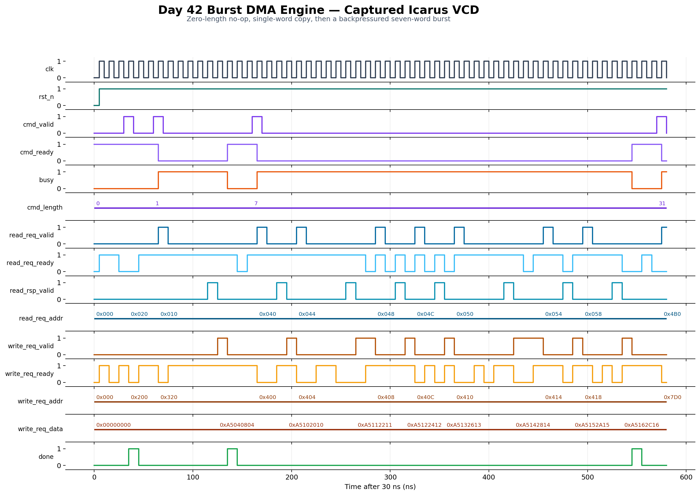

<!-- Author: Asresh Kuricheti -->
# Day 42 — Burst DMA Engine

## Overview

A direct-memory-access (DMA) engine copies a block of memory without asking the
CPU to execute one load and one store for every word. Software supplies a source
address, destination address, and transfer length; the engine then walks both
address streams and reports completion.

This project is intentionally compact but uses production-style ready/valid
backpressure, a buffered read response, parameterized widths, clean reset state,
and a self-checking memory reference model.

## Architectural concept and why it matters

DMA is the data-moving backbone behind storage, networking, GPUs, AI accelerators,
camera pipelines, and high-speed peripherals. It increases system throughput and
frees a CPU to do useful computation while a hardware state machine performs a
regular transfer. The same RTL skills—microarchitecture, FSM/datapath partitioning,
bus handshakes, buffering, and verification—appear prominently in current SoC and
memory-controller design roles.

## Features

- Parameterized address, data, and burst-length widths.
- Full-word, incrementing source and destination transfers.
- Independent backpressure on read and write request channels.
- Variable-latency read-response support with one safe outstanding request.
- Stable request address/data while a receiver stalls.
- Zero-length commands complete as legal no-ops.
- One-cycle `done` pulse and reset-safe idle behavior.

## Parameters

| Parameter | Default | Meaning |
|---|---:|---|
| `ADDR_WIDTH` | 16 | Byte-address width |
| `DATA_WIDTH` | 32 | Data-bus width; must be a multiple of 8 |
| `LEN_WIDTH` | 8 | Transfer length in full-width beats |

## Ports

| Port | Direction | Meaning |
|---|---|---|
| `clk`, `rst_n` | input | Clock and active-low asynchronous reset |
| `cmd_valid`, `cmd_ready` | input, output | Command handshake |
| `cmd_src_addr`, `cmd_dst_addr` | input | Byte-aligned start addresses |
| `cmd_length` | input | Number of data beats to copy |
| `busy`, `done` | output | Active-transfer level and completion pulse |
| `read_req_valid`, `read_req_ready` | output, input | Source-read request handshake |
| `read_req_addr` | output | Source byte address |
| `read_rsp_valid`, `read_rsp_data` | input | Returned source word |
| `write_req_valid`, `write_req_ready` | output, input | Destination-write handshake |
| `write_req_addr`, `write_req_data` | output | Destination address and buffered word |

## Datapath and control diagram

```text
 cmd_src_addr ---> [source address] ---> read_req_addr ---> Source memory
                         +step                                  |
                                                               v
 cmd_length -----> [beat counter]       [response buffer] < read_rsp_data
                         |                       |
                         v                       v
 cmd_valid ------> [control FSM] ------> write valid/data ---> Destination memory
                         |
 cmd_dst_addr ---> [destination addr] --> write_req_addr
                         +step

      IDLE -> ISSUE_READ -> WAIT_READ -> ISSUE_WRITE --last--> IDLE + done
                          ^                  |
                          +-----more---------+
```

The single-entry response buffer decouples read return timing from destination
backpressure. A future high-throughput version could add multiple outstanding
reads, transaction IDs, error responses, and a deeper data FIFO.

## Simulation timing



The image above is rendered from the real Icarus Verilog VCD produced by the
self-checking testbench. It shows reset release, command acceptance, read latency,
write backpressure, address progression, and the final completion pulse.

## How it works

1. In `IDLE`, `cmd_ready` is high. A nonzero command latches both addresses and
   the beat count; a zero-length command produces `done` without memory traffic.
2. `ISSUE_READ` holds the source address and `read_req_valid` stable until accepted.
3. `WAIT_READ` waits for memory to return a word, then captures it in `data_q`.
4. `ISSUE_WRITE` holds destination address and data stable through backpressure.
5. An accepted write decrements the count. More beats increment both addresses;
   the last beat returns to `IDLE` and pulses `done`.

## Running the simulation

```sh
make icarus
make verilator
make vcs
make questa
```

Each target builds the same RTL and testbench. A successful run ends with:

```text
RESULT: *** PASS ***
```

## What the testbench checks

- Directed zero-, one-, seven-, and 31-beat transfers.
- Sixty randomized transfers with randomized read/write backpressure and latency.
- Every destination word against an independent golden memory-copy model.
- No unintended modification of memory outside each destination range.
- Full-word address alignment and the one-outstanding-read invariant.
- Stable ready/valid payloads while stalled, correct busy/ready behavior, and timeout.

## Use-case examples

- Move packet buffers between a network interface and system memory.
- Feed tiles from DRAM into an AI accelerator or GPU scratchpad.
- Stream audio, camera, or sensor frames into processing buffers.
- Copy blocks between CPU memory and PCIe, NVMe, USB, or storage-controller queues.
- Offload boot-time memory initialization and embedded firmware buffer movement.

In a complete SoC, software-visible control/status registers would configure this
engine, an interconnect adapter would translate its channels to AXI/AHB, and an
interrupt controller would route `done` to the CPU.

## Career relevance

The [Apple Wireless SoC Design Engineer role](https://jobs.apple.com/en-ca/details/200643439-3956/wireless-soc-design-engineer)
lists a base-pay range of $147,400–$272,100 and specifically names DMA engines,
bus interfaces, memory subsystems, PPA-aware microarchitecture, lint, CDC/RDC,
synthesis, and validation. Micron's current [MTS Digital Design Engineer, HBM](https://careers.micron.com/careers/job/40623857)
role similarly emphasizes parameterized SystemVerilog, FSMs, datapaths, FIFOs,
pipelines, arbitration, reset strategy, and verification. This project is a
focused portfolio example of those transferable front-end design skills.
