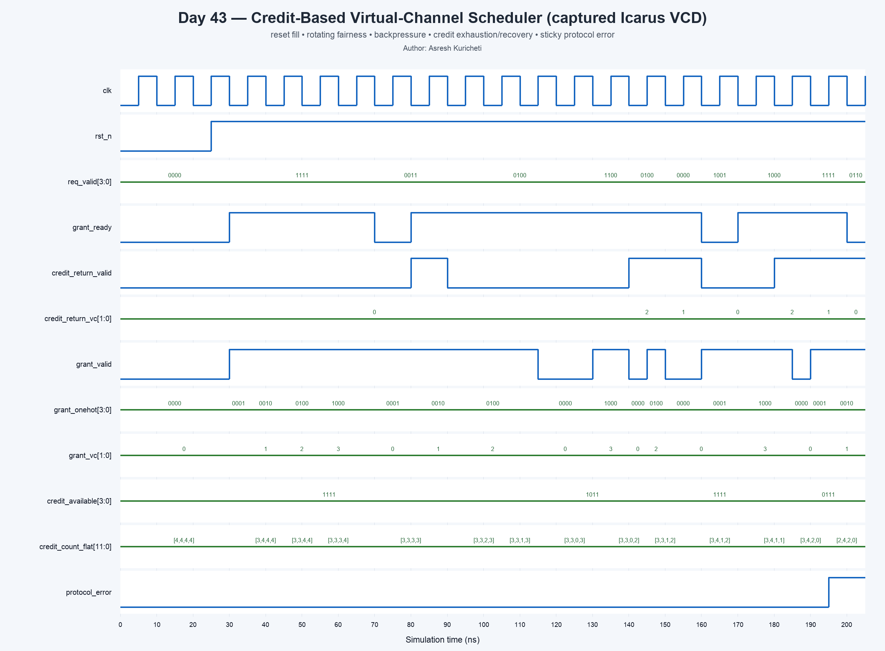

<!-- Author: Asresh Kuricheti -->
# Day 43: Credit-Based Virtual-Channel Scheduler

## Overview

This project implements the small but critical control block that decides which virtual channel may send the next flit across a shared interconnect link. It combines two rules: a virtual channel can transmit only when the receiver has advertised free buffer space through credits, and eligible channels share the link through rotating round-robin priority.

The design mirrors work highlighted in current high-compensation GPU and networking ASIC roles: NVIDIA specifically calls for virtual channels, shared buffers, interconnection routing, arbitration, and deadlock avoidance, while emphasizing synthesizable, timing-clean SystemVerilog microarchitecture.

## Why the architectural concept matters

A ready/valid signal can provide backpressure across a short local connection. Across a deeply pipelined network link, however, waiting for a combinational `ready` path is slow and timing-expensive. Credit flow control keeps a local count of free slots at the far end. Sending consumes a credit; the receiver returns a credit after it frees a slot. This prevents buffer overflow without a long reverse combinational path.

Virtual channels let several independent packet streams share one physical link. A blocked stream can stop using credits without necessarily blocking another stream, which improves utilization and is one ingredient in deadlock-safe network design.

## Features

- Parameterized virtual-channel count and downstream buffer depth.
- One credit counter per virtual channel, initialized safely on reset.
- Credit-gated round-robin arbitration with one-hot and encoded grants.
- Backpressure-aware credit consumption: a grant consumes credit only when accepted.
- Correct net-zero accounting for a send and credit return to the same VC in one cycle.
- Sticky protocol-error detection for an unexpected credit returned to a full VC.
- Flattened credit counts and per-VC availability signals for debug and performance monitoring.
- Synthesizable, latch-free RTL with no unbounded loops or simulation-only constructs.

## Parameters

| Parameter | Default | Meaning |
|---|---:|---|
| `NUM_VCS` | 4 | Number of virtual channels sharing the physical output link |
| `BUFFER_DEPTH` | 4 | Number of receiver buffer slots represented by each credit counter |
| `VC_BITS` | derived | Encoded virtual-channel index width |
| `CREDIT_BITS` | derived | Width needed to represent values from zero through `BUFFER_DEPTH` |

## Ports

| Port | Direction | Width | Meaning |
|---|---|---:|---|
| `clk` | input | 1 | Rising-edge clock |
| `rst_n` | input | 1 | Asynchronous active-low reset |
| `req_valid` | input | `NUM_VCS` | Per-VC request bits |
| `grant_ready` | input | 1 | Physical output accepts the selected transfer |
| `credit_return_valid` | input | 1 | A downstream slot has been released |
| `credit_return_vc` | input | `VC_BITS` | VC whose credit is being returned |
| `grant_valid` | output | 1 | At least one credit-eligible request was selected |
| `grant_onehot` | output | `NUM_VCS` | One-hot selected request |
| `grant_vc` | output | `VC_BITS` | Encoded selected VC |
| `credit_available` | output | `NUM_VCS` | Per-VC nonzero-credit indicators |
| `credit_count_flat` | output | `NUM_VCS*CREDIT_BITS` | Packed debug view of all credit counters |
| `protocol_error` | output | 1 | Sticky flag for an invalid/overflowing credit return |

## Datapath and control diagram

```text
 req_valid[NUM_VCS-1:0]
          |
          v
 +----------------------+       +-----------------------+
 | Credit eligibility   |------>| Rotating round-robin  |----> grant_valid
 | req[i] && count[i]>0  |       | priority from rr_ptr  |----> grant_vc/onehot
 +----------+-----------+       +-----------+-----------+
            |                               |
            |                      accepted grant
            |                               |
            v                               v
 +------------------------------------------------------+
 | Per-VC credit counters                              |
 | reset: DEPTH | accepted send: -1 | returned slot: +1 |
 | same-VC send + return: unchanged | overflow: error   |
 +--------------------------+---------------------------+
                            ^
                            |
              credit_return_valid / credit_return_vc
```

## How it works

Every counter starts at `BUFFER_DEPTH`, meaning the remote receiver is initially empty. Combinational logic masks requesters whose count is zero, searches the eligible vector beginning at the round-robin pointer, and emits at most one grant. If the output accepts that grant, the selected counter decrements and priority rotates to the following VC. A returned credit increments its selected counter. When those two events target the same VC in one cycle, their effects cancel, avoiding an unnecessary count toggle.

The arbiter deliberately advances only after a real transfer (`grant_valid && grant_ready`). Backpressure therefore cannot make a requester lose its turn. A return to an already full counter indicates broken system-level accounting and sets `protocol_error` until reset.

## Simulation timing



The waveform above is captured from the Icarus Verilog simulation VCD. It shows reset filling every VC with four credits, fair grants rotating from VC0 through VC3, output backpressure, same-cycle send/return accounting, VC2 draining to zero and being skipped, credit replenishment, and sticky error detection after an invalid credit return.

## Running the simulation

```sh
make icarus
make verilator
make vcs
make questa
make clean
```

Each target uses the same synthesizable design and self-checking testbench. A successful run ends with `RESULT: *** PASS ***` and writes `credit_based_vc_scheduler.vcd` when the simulator supports VCD output.

## What the testbench checks

The testbench maintains an independent integer credit model and round-robin pointer. Directed scenarios verify reset state, all-requester fairness, backpressure, a same-VC send and return, zero-credit suppression, returned-credit recovery, and error detection. Five hundred randomized cycles then mix request masks, downstream readiness, and independent credit returns. Every cycle checks the encoded grant, one-hot grant, all visible credit counts, availability bits, and sticky error flag. A separate timeout terminates a hung simulation.

## Use-case examples

- **GPU on-chip networks:** schedule traffic classes or virtual networks over links between shader clusters, L2 cache slices, and memory controllers.
- **NVLink and chiplet fabrics:** prevent receiver overflow while keeping high-speed die-to-die links busy without a long combinational backpressure path.
- **Network switch ASICs:** arbitrate multiple queues onto one egress lane while preserving fairness and buffer safety.
- **Cache-coherent NoCs:** isolate request, response, and snoop traffic into distinct virtual channels used by deadlock-avoidance rules.
- **AI accelerators:** share a physical interconnect among activation, weight, and partial-sum streams with independent buffering.
- **FPGA packet pipelines:** replace timing-critical global ready chains with registered credit-return paths.

## Big picture

This scheduler sits between per-VC input queues and a physical link transmitter. Routing logic first chooses an output direction; this block then chooses one eligible VC for that output. The link transports the flit, the far-end queue eventually removes it, and a small reverse message returns the credit. Replicated across router outputs, the same pattern becomes the flow-control backbone of a scalable mesh, ring, switch fabric, or chiplet interconnect.
