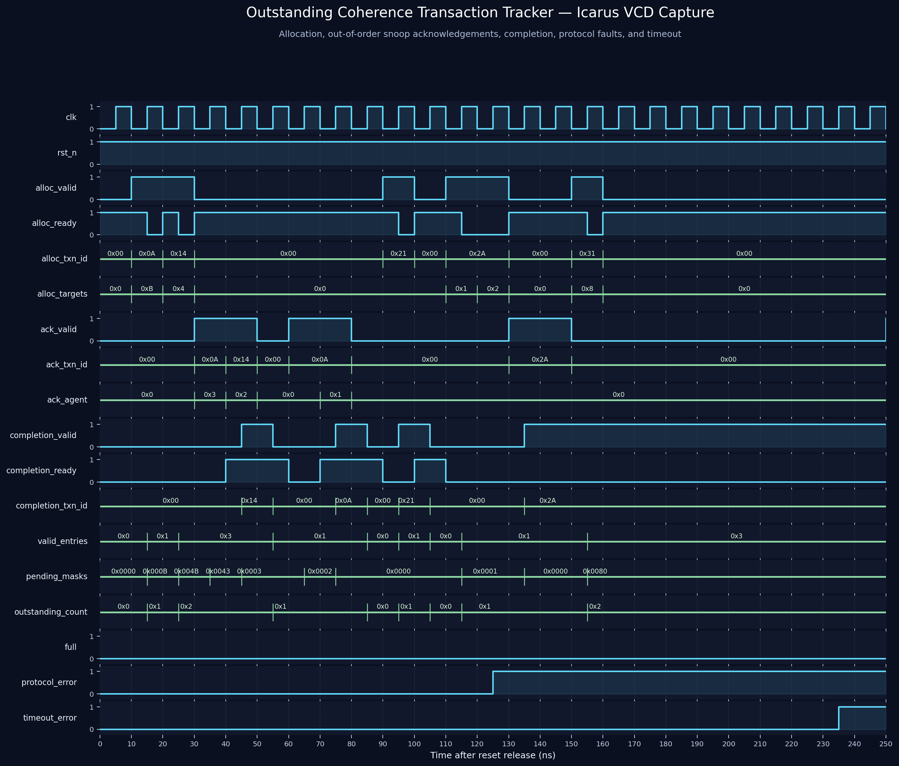

<!-- Author: Asresh Kuricheti -->
# Day 44: Outstanding Coherence Transaction Tracker

## Overview

A coherent multicore system often sends one request to several caches and then waits for every targeted cache to respond. Those responses can return in any order and many unrelated requests may be active at the same time. The **Outstanding Coherence Transaction Tracker** is the small control block that remembers this distributed work.

Each table entry holds a transaction ID and a bit mask of agents that still owe an acknowledgement. An incoming acknowledgement finds its transaction through an associative ID lookup and clears one bit. When the mask reaches zero, the tracker reports that transaction as complete. Independent transactions can therefore overlap without confusing their responses.

This project is deliberately protocol-neutral: it can sit behind a MESI directory, snoop filter, coherent interconnect, or any broadcast-and-collect engine.

## Why this architectural concept matters

Coherence is distributed. A directory may need to invalidate three private caches before granting one requester exclusive ownership of a cache line. Cache 2 might answer first, cache 0 last, and an unrelated line may be doing the same operation simultaneously. A controller that waits in a single FSM wastes concurrency; a tagged transaction table provides memory-level parallelism while keeping responses associated with the correct request.

The tracker also turns silent system failures into visible faults. It detects duplicate transaction IDs, acknowledgements for unknown or already-cleared agents, and transactions that wait too long. These checks are useful during verification and can feed reliability telemetry in silicon.

## Features

- Parameterized table depth, agent count, transaction-ID width, and timeout.
- Multiple outstanding coherence operations with associative transaction-ID matching.
- Per-entry pending-agent masks; acknowledgements may arrive in any order.
- Ready/valid allocation and completion interfaces with backpressure.
- Immediate completion for an allocation with an empty target mask.
- Deterministic lowest-entry completion selection when several entries finish together.
- Sticky protocol-error detection for duplicate IDs, unknown acknowledgements, invalid agents, and duplicate acknowledgements.
- Sticky timeout reporting with saturating per-entry age counters.
- Flattened entry-valid and pending-mask outputs for debug, assertions, and waveform visibility.
- Asynchronous active-low reset that clears all architectural state.

## Parameters

| Parameter | Default | Meaning |
|---|---:|---|
| `ENTRIES` | 4 | Maximum number of in-flight coherence transactions. |
| `NUM_AGENTS` | 4 | Number of caches or coherent agents that may acknowledge. |
| `TXN_ID_WIDTH` | 8 | Width of the unique transaction tag. |
| `TIMEOUT_CYCLES` | 16 | Number of waiting cycles before timeout becomes sticky. |
| `AGENT_WIDTH` | derived | Bits required to identify one agent. |
| `COUNT_WIDTH` | derived | Bits required for the outstanding-entry count. |
| `AGE_WIDTH` | derived | Bits required by each saturating timeout counter. |

## Ports

| Port | Direction | Width | Description |
|---|---|---:|---|
| `clk` | input | 1 | Rising-edge clock. |
| `rst_n` | input | 1 | Asynchronous active-low reset. |
| `alloc_valid` | input | 1 | A new transaction ID and target mask are valid. |
| `alloc_ready` | output | 1 | A free entry exists and the offered ID is not already active. |
| `alloc_txn_id` | input | `TXN_ID_WIDTH` | Tag of the new coherence operation. |
| `alloc_targets` | input | `NUM_AGENTS` | One bit per agent expected to acknowledge. |
| `ack_valid` | input | 1 | An acknowledgement is present. |
| `ack_txn_id` | input | `TXN_ID_WIDTH` | Transaction being acknowledged. |
| `ack_agent` | input | `AGENT_WIDTH` | Agent sending the acknowledgement. |
| `completion_valid` | output | 1 | At least one active transaction has no pending agents. |
| `completion_ready` | input | 1 | Consumer accepts and retires the reported completion. |
| `completion_txn_id` | output | `TXN_ID_WIDTH` | ID of the selected completed transaction. |
| `full` | output | 1 | Every table entry is occupied. |
| `outstanding_count` | output | `COUNT_WIDTH` | Number of active entries. |
| `valid_entries` | output | `ENTRIES` | Valid bit for every physical entry. |
| `pending_masks_flat` | output | `ENTRIES*NUM_AGENTS` | Concatenated pending-agent masks for debug. |
| `protocol_error` | output | 1 | Sticky illegal-operation indicator. |
| `timeout_error` | output | 1 | Sticky excessive-wait indicator. |

## Block and datapath diagram

```text
 alloc_valid/id/targets
          |
          v
  +----------------+        +---------------------------------------+
  | free-entry and |------->| Entry 0: valid | txn_id | pending | age|
  | duplicate-ID   |        | Entry 1: valid | txn_id | pending | age|
  | checks         |        | Entry 2: valid | txn_id | pending | age|
  +----------------+        | Entry 3: valid | txn_id | pending | age|
          |                 +-------------------+-------------------+
          | alloc_ready                         |
          |                                     | parallel ID compare
          |                                     v
 ack_valid/id/agent ----------------> +---------------------+
                                     | clear matching      |
                                     | pending-agent bit   |
                                     +----------+----------+
                                                |
                         pending == 0            v
 completion_ready <---- [lowest complete entry mux] ----> completion_txn_id
                                                |
                     +--------------------------+-------------------+
                     v                                              v
          protocol_error (sticky)                       timeout_error (sticky)
```

## How it works

### 1. Allocate a transaction

The allocation path searches for the first free physical entry and simultaneously compares the proposed ID with every valid entry. `alloc_ready` is high only when space exists and the ID is unique. On a handshake, the ID and target mask are stored and the age counter starts at zero.

For example, `alloc_targets = 4'b1011` means agents 3, 1, and 0 must respond. Agent 2 is not involved in that transaction.

### 2. Collect acknowledgements

Each acknowledgement carries both its transaction ID and agent number. The table performs a parallel ID match, then clears that agent's bit in the matching pending mask. The order does not matter: `3, 0, 1` and `0, 1, 3` produce the same completed mask.

An unknown ID, out-of-range agent, or already-cleared bit sets `protocol_error`. The flag is sticky so a one-cycle fault cannot disappear before system software or a debug monitor observes it.

### 3. Complete and retire

An entry becomes complete when its pending mask is zero. The completion mux reports the lowest numbered complete entry. State is held while `completion_ready` is low, so downstream backpressure cannot lose a completion. The entry becomes reusable only after the completion handshake.

### 4. Detect a stalled operation

Each active entry with pending acknowledgements increments a saturating age counter. If it remains incomplete for `TIMEOUT_CYCLES`, `timeout_error` is asserted and stays asserted until reset. The entry is deliberately not discarded: automatic deletion could hide a real coherence failure and violate memory consistency.

## Simulation timing



*Real waveform rendered from the Icarus Verilog VCD produced by the self-checking testbench. The capture begins at reset release and shows two overlapping allocations, acknowledgements returning out of order, completion backpressure, a zero-target request, a rejected duplicate ID, sticky protocol-error reporting, and timeout detection using the testbench's intentionally short timeout.*

## Running the project

The default target uses Icarus Verilog:

```bash
make
```

Other supported simulators:

```bash
make verilator
make vcs
make questa
make clean
```

A successful run ends with:

```text
RESULT: *** PASS ***
```

## What the testbench checks

The testbench maintains an independent cycle-accurate reference table and compares every public status/control output against it before each active clock edge. It includes:

- Reset and empty-table behavior.
- Overlapping allocations with independent transaction IDs.
- Out-of-order acknowledgements from multiple agents.
- Completion selection, backpressure, retirement, and entry reuse.
- Zero-target immediate completion.
- Duplicate allocations and duplicate acknowledgements.
- Timeout detection with a short verification-only threshold.
- 500 cycles of randomized allocation, acknowledgement, and completion traffic.
- A simulation timeout and VCD dump.

## Use-case examples and the bigger picture

- **Directory-based cache coherence:** wait for every targeted private cache to invalidate or downgrade a line before granting exclusive ownership.
- **Snoop filters and coherent fabrics:** associate unordered snoop responses with several concurrent CHI, CXL, or proprietary fabric requests.
- **GPU/CPU shared-memory systems:** track responses while many cache lines and requester IDs are active at once.
- **TLB shootdown hardware:** collect translation-invalidation acknowledgements from cores before page-table memory is safely reused.
- **Distributed barriers:** represent participating hardware engines as a pending bit mask and complete when every engine arrives.
- **Verification and post-silicon debug:** expose stuck responders, duplicate messages, and ID-management bugs early.

In a complete coherent SoC, this block usually sits between the directory/snoop controller and the interconnect response channel. The directory decides *who* must respond; the transaction tracker remembers *who is still missing*; the coherence controller changes line ownership only after completion.

## Career relevance

This project was selected from recent high-compensation computer-architecture postings. NVIDIA's ASIC memory-subsystem role calls out coherent interconnects, hardware-managed coherency, system-level caches, RTL, synthesis, and timing. Its senior CPU verification roles emphasize cache/memory microarchitecture, scalable SystemVerilog stimulus, scoreboards, and waveform debug. Apple's CPU Microarchitect/RTL role highlights out-of-order execution, cache/memory subsystems, performance/power/area tradeoffs, and RTL verification. The tracker exercises a focused intersection of those skills: protocol microarchitecture, associative state, flow control, timeout/error design, synthesizable SystemVerilog, and reference-model verification.

- [NVIDIA ASIC Design Engineer — Memory Subsystem](https://nvidia.wd5.myworkdayjobs.com/en-US/NVIDIAExternalCareerSite/job/ASIC-Design-Engineer---New-College-Grad-2026_JR2017581)
- [NVIDIA Senior Verification Engineer — CPU](https://nvidia.wd5.myworkdayjobs.com/en-US/NVIDIAExternalCareerSite/job/Senior-Verification-Engineer_JR2013784)
- [Apple CPU Microarchitect/RTL Engineer — Fetch, Out of Order](https://jobs.apple.com/en-ie/details/200657881-3760/cpu-microarchitect-rtl-engineer-fetch-out-of-order?team=HRDWR)
