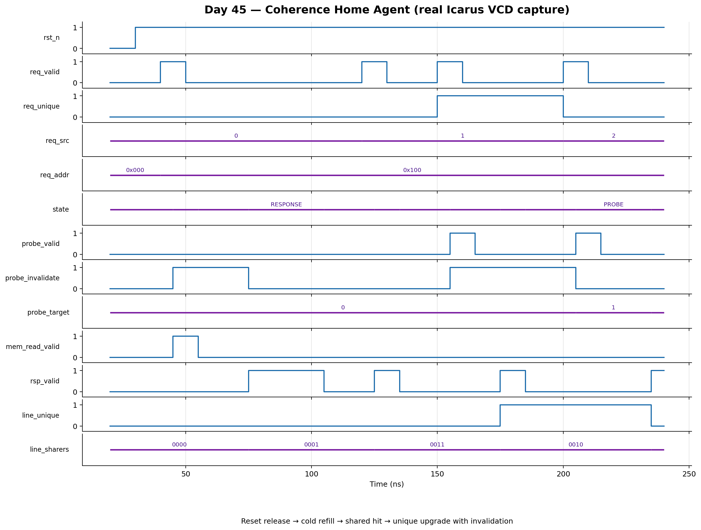

<!-- Author: Asresh Kuricheti -->
# Day 45: Directory-Based Coherence Home Agent

## Overview

A cache-coherent system needs one authority—the **home agent**—to decide who may hold each cache line. This project implements a compact, synthesizable home agent for one directory entry. It accepts shared or unique read requests, consults the line's sharer metadata, sends downgrade or invalidate probes when ownership must change, fetches a new line from memory on a miss, and returns the correctly tagged response.

The design deliberately models one directory entry so the protocol is easy to see. A production last-level cache repeats the same controller per bank and stores many directory records in SRAM.

## Why this architectural concept matters

Private CPU and GPU caches are fast only when they agree about ownership. Before a core writes, every other cached copy must be invalidated; before a second reader receives a line held uniquely, the owner must downgrade. The home agent orders those transitions and prevents two agents from believing they both have write permission.

This block connects the ideas from directory lookup, snoop routing, memory refill, ready/valid flow control, and tagged responses into one realistic control path. These are central skills for coherent CPU/GPU fabrics, shared last-level caches, and chiplet interconnects.

## Features

- Parameterized agent count, address/data widths, and transaction-ID width.
- Shared-read and unique-read request types.
- Directory hit detection with sharer and unique-owner state.
- Sequential downgrade/invalidate probes with acknowledgement checking.
- Safe line replacement: all old sharers are invalidated before a new memory fetch.
- Decoupled ready/valid request, probe, memory-request, and response channels.
- Response stability under backpressure.
- Sticky protocol-error detection for stray/wrong probe acknowledgements and unexpected memory data.
- Reset-safe state and debug-visible directory/FSM outputs.

## Parameters

| Parameter | Default | Meaning |
|---|---:|---|
| `NUM_AGENTS` | 4 | Number of coherent requesters. |
| `ADDR_WIDTH` | 32 | Cache-line address width. |
| `DATA_WIDTH` | 64 | Refill/response data width. |
| `TXN_ID_WIDTH` | 8 | Request/response transaction tag width. |
| `AGENT_WIDTH` | derived | Bits needed to identify one agent. |

## Ports

| Group | Ports | Purpose |
|---|---|---|
| Clock/reset | `clk`, `rst_n` | Rising-edge clock and active-low asynchronous reset. |
| Request | `req_valid/ready`, `req_src`, `req_txn_id`, `req_addr`, `req_unique` | Shared (`0`) or unique (`1`) line request. |
| Probe | `probe_valid/ready`, `probe_target`, `probe_addr`, `probe_invalidate` | Downgrade or invalidate command to one cached copy. |
| Probe ack | `probe_ack_valid`, `probe_ack_src` | Completion acknowledgement from the selected agent. |
| Memory | `mem_read_valid/ready`, `mem_read_addr`, `mem_data_valid`, `mem_read_data` | Variable-latency backing-memory refill channel. |
| Response | `rsp_valid/ready`, `rsp_dst`, `rsp_txn_id`, `rsp_data`, `rsp_grant_unique` | Tagged line response and granted permission. |
| Debug/status | `busy`, `line_valid`, `line_addr`, `line_sharers`, `line_unique`, `state_debug`, `protocol_error` | Architectural state for waveform/debug visibility. |

## Block and protocol diagram

```text
 request (src, ID, address, shared/unique)
                       |
                       v
              +-----------------+
              | directory lookup|<---- line address, sharers, unique bit
              +--------+--------+
                       |
        +--------------+----------------+
        | hit                           | miss/replacement
        v                               v
 [permission check]            [invalidate old sharers]
        |                               |
        +----------> [probe FSM] <------+----> private caches
                           |
                    all acks received
                           |
                 +---------+---------+
                 |                   |
            hit: reuse data     miss: memory refill
                 |                   |
                 +--------+----------+
                          v
              [update directory metadata]
                          |
                          v
             response (ID, data, permission)
```

## How it works

1. **Accept and classify.** In `IDLE`, the agent captures one request. Matching addresses are hits; another address is a replacement miss.
2. **Reconcile ownership.** A shared request to a unique line downgrades the current owner. A unique request invalidates every other sharer. A replacement invalidates every sharer of the old line.
3. **Collect probe acknowledgements.** The controller selects one pending agent at a time and holds the probe until accepted. It waits for the matching acknowledgement before advancing, making backpressure and variable probe latency safe.
4. **Refill when required.** After old copies are gone, a miss issues one memory read and waits for returned data.
5. **Install and respond.** The line address, sharer vector, and permission bit are updated. The response retains the original requester and transaction ID and remains stable until accepted.

## Simulation timing



*Real waveform rendered from the Icarus Verilog VCD generated by the self-checking testbench. The focused capture shows reset release, a cold memory miss/refill, a second shared reader, an exclusive upgrade with invalidation, and response backpressure. The full VCD produced by `make` also covers owner downgrade and line replacement.*

## Running the project

```bash
make            # Icarus Verilog (default)
make verilator  # Verilator
make vcs        # Synopsys VCS
make questa     # Siemens Questa
make clean
```

A successful run ends with `RESULT: *** PASS ***`.

## What the testbench checks

The self-checking testbench maintains an independent transaction-level golden directory and deterministic backing-memory model. It checks every probe target, probe type, probe address, memory access, tagged response, data value, permission grant, and final directory state.

Directed tests cover a cold miss, shared hit, shared-to-unique upgrade, unique-to-shared downgrade, replacement, and same-owner reuse. Another 200 randomized transactions vary requester, permission, address locality, probe readiness, acknowledgement delay, memory latency, and response backpressure. A global timeout catches deadlock, and the run writes a VCD for waveform inspection.

## Use-case examples and the bigger picture

- **Shared last-level cache:** one controller per bank coordinates private L1/L2 copies before serving data.
- **CPU–GPU coherent SoC:** the home node orders ownership transitions between heterogeneous agents.
- **Chiplet fabrics:** a die-to-die coherent bridge can use the same directory/probe/refill sequence for remote caches.
- **CXL/accelerator attachment:** host and device caches need an authority to downgrade or invalidate copies before writes.
- **Architecture education and verification:** the visible FSM makes coherence races, backpressure, and permission changes concrete.

In a larger system, an address hash selects an LLC/home-agent bank, a directory SRAM supplies many entries, and an outstanding-transaction table allows multiple instances of this flow to overlap. The NoC transports requests, probes, acknowledgements, refills, and responses between the blocks.

## Career relevance

This project was chosen from recent high-compensation architecture openings. NVIDIA's Senior Cache Coherency Architect role lists a base range up to $287,500 and emphasizes coherent interconnects, cache protocols, NoC integration, PPA, modeling, RTL, and verification. NVIDIA's Senior Performance Modeling Architect for CPU Fabric and LLC similarly centers on shared caches, coherent fabrics, memory consistency, and cycle-accurate models. Micron's HBM digital-design role calls for parameterized SystemVerilog, FSMs, pipelines, buffering, arbitration, memory systems, ECC, and clear microarchitecture documentation. This home agent exercises that shared core: protocol state, RTL control, backpressure, memory hierarchy, and a reference-model testbench.

- [NVIDIA Senior Cache Coherency Architect](https://nvidia.wd5.myworkdayjobs.com/en-US/NVIDIAExternalCareerSite/job/Senior-Cache-Coherency-Architect_JR2016633)
- [NVIDIA Senior Performance Modeling Architect — CPU Fabric and LLC](https://nvidia.wd5.myworkdayjobs.com/en-US/NVIDIAExternalCareerSite/job/US-CA-Santa-Clara/Senior-Performance-Modeling-Architect--CPU-Fabric-and-LLC_JR2017467)
- [Micron MTS Digital Design Engineer — HBM](https://careers.micron.com/careers/job/40623857)
